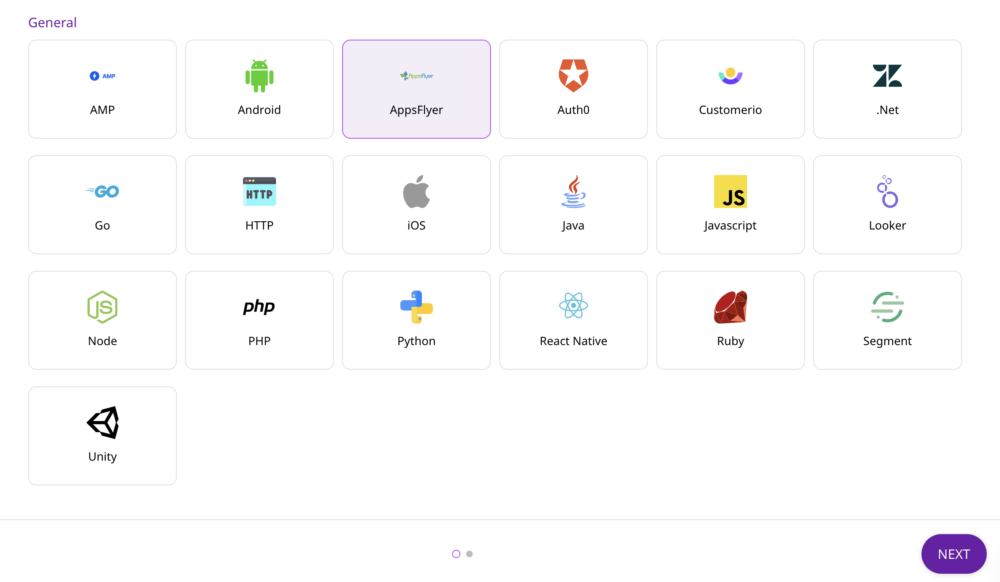
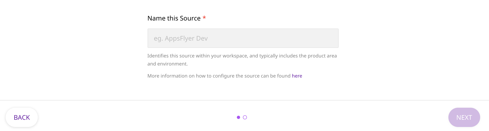

# AppsFlyer

[AppsFlyer](https://www.appsflyer.com/) is an industry-leading mobile attribution and marketing analytics platform, provided as a Software-as-a-Service \(SaaS\). It offers exciting features to understand your customers better, through intuitive dashboards, real-time data reports, and a unique deep linking technology.

This document guides you in setting up AppsFlyer as a source in RudderStack. By adding an endpoint in AppsFlyer's Push API Section under API Access under Integration in AppsFlyer dashboard, you can send events to RudderStack. The endpoint should point to Rudderstack. Events such as Re-engagememt, Re-attribution, Install in-app events and etc. are captured and sent to RudderStack.

## Getting Started

In order to add AppsFlyer as a source in RudderStack, please follow these steps:

* From your [RudderStack dashboard](https://app.rudderlabs.com/), click on **Add Source**. From the list of sources, select **AppsFlyer**, as shown:



* Enter the name of your source.



* Once you have entered the name of your source, click on **Next** and save the source.

* Head over to your AppsFlyer account and navigate to the **API Access** section under **Integration** from the sidebar. Look for the **Push API**, as shown:


* Under the **Endpoint Configuration** add an endpoint URL pointing to the URL in the following format:`<your_dataplane_url>/v1/webhook?writeKey=<your_AppsFlyer_source_write_key>`

An example URL would like the following:

```http
https://hosted.rudderlabs.com/v1/webhook?writeKey=1bCenS7ynqHh8ETX8s5Crjh22J
```


Make sure to add the `writeKey` as query parameter to the URL. This is required to prevent the webhook from failing for the lack of a valid write key.


You can validate the endpoint using the **Send Test** button.


* Finally, save the endpoint.

## RudderStack Event Transformation

The Push events from AppsFlyer are ingested into RudderStack after converting it into the format of a RudderStack event. For example, the `customer_user_id` set by AppsFlyer is set as `userId` . 

Also, we populate following properties from AppsFlyer event payload to the RudderStack event:

| AppsFlyer Property | RudderStack Property |
| :--- | :--- |
| `customer_user_id` | `userId`, `context.traits.userId` |
| `event_name` | `event` |
| `event_time` | `timestamp`, `originalTimestamp` |
| `ip` | `context.ip` |
| `selected_timezone` | `context.timezone` |
| `user_agent` | `context.userAgent` |
| `bundle_id` | `context.app.namespace` |
| `app_version` | `context.app.version` |
| `app_name` | `context.app.name` |
| `device_type` | `context.device.model` |
| `wifi` | `context.network.wifi` |
| `carrier` | `context.network.carrier` |
| `platform` | `platform`, `context.os.name` |
| `idfa` | `context.device.advertisingId` for iOS |
| `android_id` | `context.device.advertisingId` for android |
| `appsflyer_id` | `context.externalId[0].value` |
| `os_version` | `context.os.version` |
| `city` | `traits.address.city`, `context.traits.address.city` |
| `postal_code` | `traits.address.zip`, `context.traits.address.zip` |
| `country_code` | `traits.address.country`, `context.traits.address.country`


## Contact Us

If you come across any issues while configuring AppsFlyer as a source with RudderStack, please feel free to [contact us](mailto:%20docs@rudderstack.com). You can also start a conversation on our [Slack](https://resources.rudderstack.com/join-rudderstack-slack) channel - we will be happy to talk to you!

