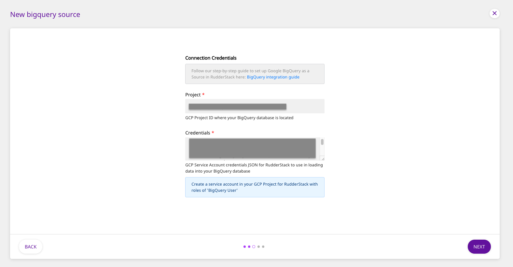
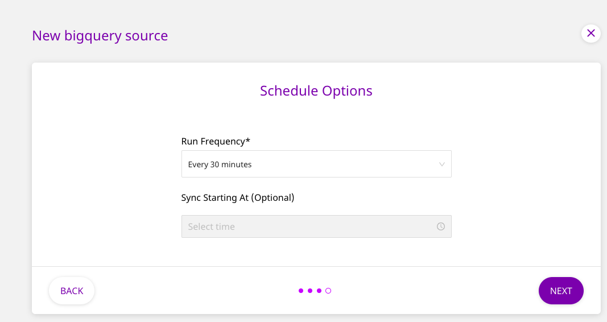

# Google BigQuery

[Google BigQuery](https://cloud.google.com/bigquery) ****is an industry-leading, fully-managed cloud data warehouse that allows you to store and analyze petabytes of data in no time.

RudderStack allows you to configure Google BigQuery as a source from which you can route data to your desired destinations, through RudderStack.

## Getting Started

To set up Google BigQuery as a source in RudderStack, follow these steps:

* Log into your [RudderStack dashboard](https://app.rudderlabs.com/signup?type=freetrial).
* From the left panel, select **Sources**. Then, click on **Add Source**, as shown:

* Scroll down to the **Warehouse Sources** and select **BigQuery**. Then, click on **Next**.

### Setting Up the Connection

* Assign a name to your source, and click on **Create Credentials from Scratch**. Then, click on **Next**.


If you've already configured BigQuery as a source before, the existing credentials will automatically appear in the above window.


* Next, enter the **GCP project ID** and the **Credentials** JSON which RudderStack will use to import the data from your BigQuery instance.

### Specifying the Data to Import

* Next, select the **Schema** and the **Table** from which you want RudderStack to import the data.


Your table must include one of the following columns - `email`, `user_id`, or `anonymous_id`.


* Once you specify the table containing the required columns, you will be able to preview a snippet of your data, as shown below:

* Here, you can select all or only a few specific columns of your choice, search the columns by a keyword, and also edit the **JSON Trait Key**, as shown below. You can also preview the resultant JSON on the right. Once you've select the required table columns to import the data from, click on **Next**.

### Setting the Data Update Schedule

* Next, you will be required to set the **Run Frequency** to schedule the data import from your PostgreSQL database to RudderStack. You can also specify the time when you want this synchronization to start, by choosing the time under the **Sync Starting At** option. Then, click on **Next**.

That's it! BigQuery is now successfully configured as a source on your RudderStack dashboard. 

RudderStack will start importing data from your BigQuery instance as per the specified frequency. You can further connect this source to your preferred destinations by clicking on **Connect Destinations** or **Add Destinations**, as shown:

## Contact Us

If you come across any issues while configuring Google BigQuery as a source on the RudderStack dashboard, please feel free to [contact us](mailto:%20docs@rudderstack.com). You can also start a conversation on our [Slack](https://resources.rudderstack.com/join-rudderstack-slack) channel; we will be happy to talk to you!

