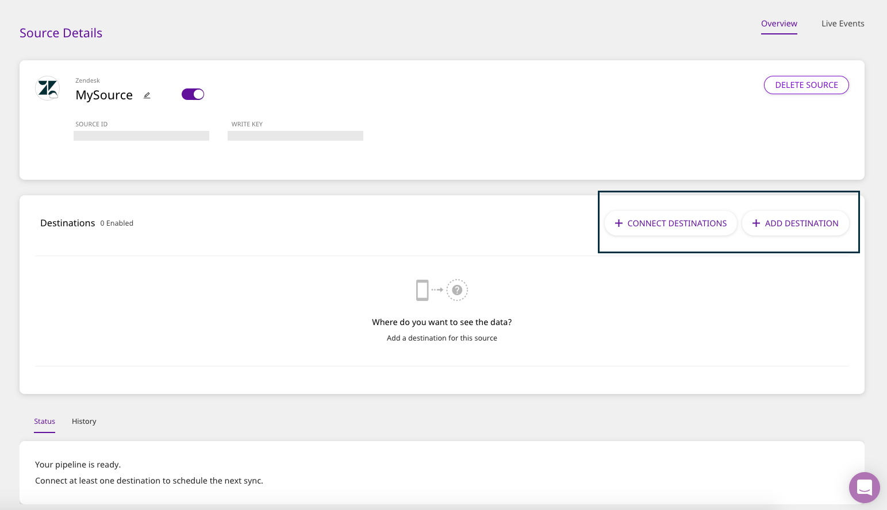

# Zendesk

[Zendesk](https://www.zendesk.com/) is a popular customer support, sales and service platform that lets you serve and engage with your customers effectively. Zendesk offers integrated customer support, a modern sales CRM, as well as a smart, self-serve knowledge base. In addition, its analytics and reporting capabilities lets you understand your customers better. In addition, you can also engage with them more effectively through Zendesk's personalized live chats and messaging service.

This document guides you in setting up Zendesk as a source in RudderStack. Once configured, RudderStack automatically ingests your specified Zendesk data, which can then be routed to your data warehouse or any other third-party destination supported by RudderStack.

## Getting Started

To set up Zendesk as a source on the RudderStack dashboard, follow these steps:

* Log into your [RudderStack dashboard](https://app.rudderlabs.com/signup?type=freetrial).
* From the left panel, select **Sources**. Then, click on **Add Source**, as shown:

* Next, select **Zendesk** from the list of **Cloud Sources**, and click on **Next**.

* Assign a name to your source, and click on **Next**.

### Specifying Connection Credentials

* Next, enter your Zendesk credentials. This includes your Zendesk **Subdomain**, your **Zendesk username**, and the API **Token**.


To create a Zendesk API token, log into your Zendesk dashboard, and navigate to **Admin** - **Channels** - **API** in the Zendesk admin interface, and click the **Add New Token** link.



If you've already configured Zendesk as a source before, you can choose the account visible under the **Use existing credentials** tab.


### Setting the Data Update Schedule

* Next, you will be required to set the **Run Frequency** to schedule the data import from your Zendesk account to RudderStack. You can also specify the time when you want this synchronization to start, by choosing the time under the **Sync Starting At** option.

### Selecting the Data to Import

* Finally, choose the Zendesk data that you wish to ingest via RudderStack. You can either select all the data, or choose specific Zendesk data attributes, as per your requirement.

That's it! Zendesk is now successfully configured as a source on your RudderStack dashboard. 

RudderStack will start ingesting data from Zendesk as per the specified frequency. You can further connect this source to your data warehouse or other third-party destinations by clicking on **Connect Destinations** or **Add Destinations**, as shown: 

## Contact Us

If you come across any issues while configuring Zendesk as a source on the RudderStack dashboard, please feel free to [contact us](mailto:%20docs@rudderstack.com). You can also start a conversation on our [Slack](https://resources.rudderstack.com/join-rudderstack-slack) channel; we will be happy to talk to you!

