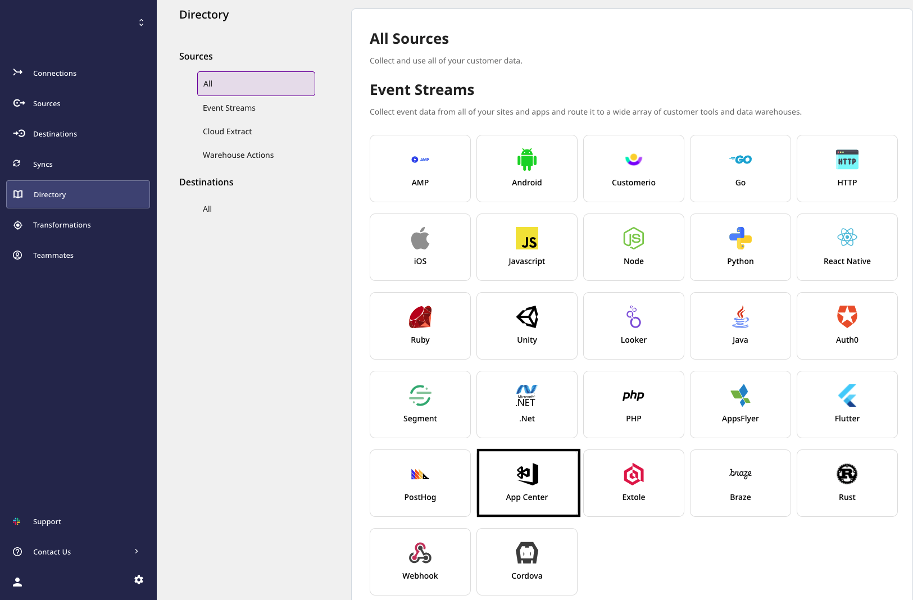
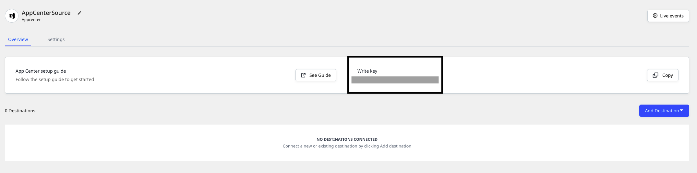
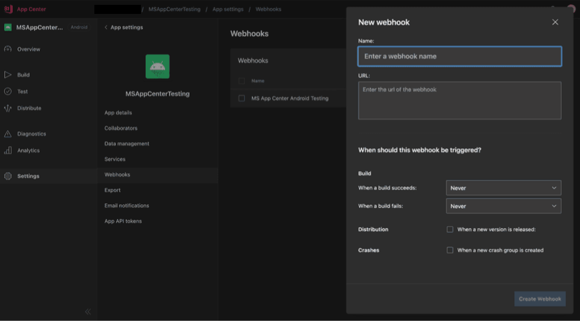
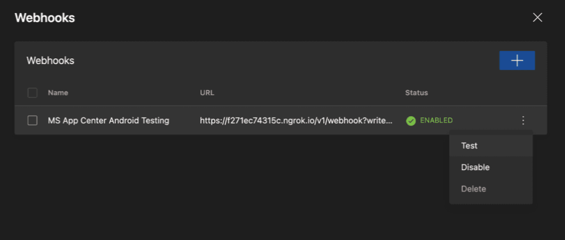

# App Center

[**App Center**](https://appcenter.ms/) is Microsoft's cross-platform build automation and management platform that lets you manage your app's lifecycle seamlessly. With App Center, you can automate your builds, test your apps in the cloud effectively, and monitor their real-time usage with the help of crash data and analytics.

You can send your App Center events to RudderStack by adding a webhook that points to RudderStack. These events include activities related to a build success or failure, release of new version of an app, or an app crash. You can also configure what events to send as per your requirement on their dashboard.

This guide will help you set up App Center as a source in RudderStack.

## Getting started

This section details the steps involved in setting up an App Center source in the RudderStack dashboard.  Follow these steps:

- Go to your [**RudderStack dashboard**](https://app.rudderstack.com/) and click on **Add Source**. From the list of **Event Stream** sources, select **App Center**, as shown:



- Assign a name to your source and click on **Next**.

- Your App Center source is now configured. Note the source **Write key** - this will be required to configure the webhook URL in the following steps.



- Then, head over to your App Center account and select the application you want to configure. Here, navigate to the **Webhooks** section under **Settings** from the sidebar, and then create a new webhook, as shown:



- In the **URL** text box, add a URL pointing to RudderStack in the following format: 

`<DATA_PLANE_URL>/v1/webhook?writeKey=<WRITE_KEY>`

<div class="infoBlock">

For more information on the data plane URL, refer to <a href="https://rudderstack.com/docs/get-started/installing-and-setting-up-rudderstack/#what-is-a-data-plane-url-where-do-i-get-it">this</a> section.
</div>

<div class="warningBlock">

Make sure you add the source write key as a query parameter to the URL. This is required to prevent the webhook from failing for the lack of a valid write key. 
</div>

A sample URL is as shown:

```http
https://hosted.rudderlabs.com/v1/webhook?writeKey=1bCenS7ynqHh8ETX8s5Crjh22J
```

<div class="infoBlock">

We highly recommend validating the endpoint using the **Send Test** button.
</div>



- Finally, save the endpoint.

## Event transformation

The App Center events are ingested into a RudderStack `track` call with the designated name and properties as the entire event received from App Center. For example, the `app_name` set by App Center is set as `context.app.name`.

The following table highlights the mapping of various App Center events from App to RudderStack's `track` calls:

| App Center Event              | RudderStack Track Event Name |
| :---------------------------- | :--------------------------- |
| `On Success of a Build`       | `Build Succeeded`            |
| `On Failure of a Build`       | `Build Failed`               |
| `On Release of a new version` | `Released Version <X.YY>`    |
| `On an App Crash`             | `App Crashed`                |

Also, RudderStack populates the following properties from the App Center event payload to the RudderStack event:

| App Center Property            | RudderStack Property                     |
| :----------------------------- | :--------------------------------------- |
| `app_name`, `app_display_name` | `context.app.name`                       |
| `build_id`                     | `context.app.build`                      |
| `os`, `platform`               | `context.device.type`, `context.os.name` |
| `start_time`                   | `originalTimeStamp`                      |
| `sent_at`                      | `sentAt`                                 |
| `short_version`, `app_version` | `context.app.version`                    |
| `bundle_identifier`            | `context.app.namespace`                  |

## Contact us

For queries on any of the sections covered in this guide, you can [**contact us**](mailto:%20docs@rudderstack.com) or start a conversation on our [**Slack**](https://rudderstack.com/join-rudderstack-slack-community) channel.
