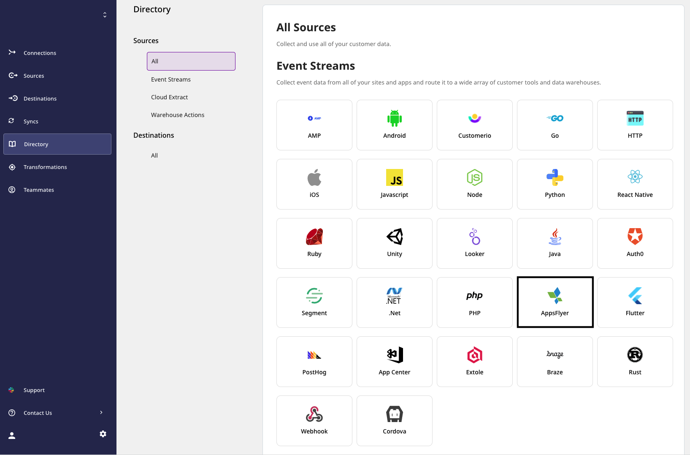
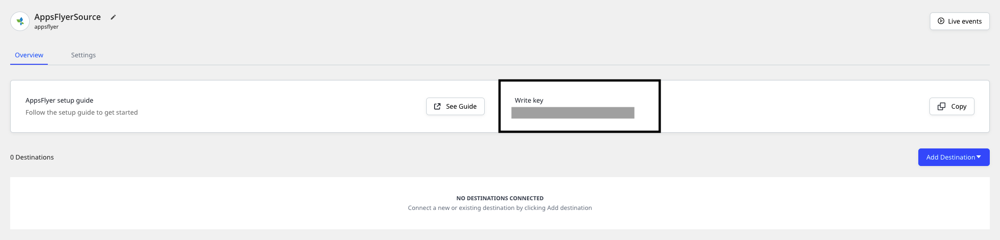
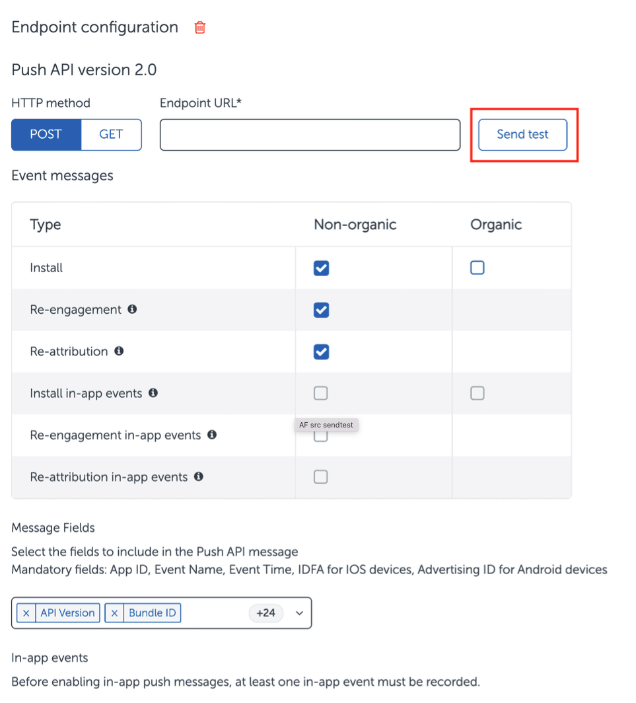

# AppsFlyer

[**AppsFlyer**](https://www.appsflyer.com/) is an industry-leading mobile attribution and marketing analytics platform, provided as a Software-as-a-Service \(SaaS\). It offers exciting features to understand your customers better through intuitive dashboards, real-time data reports, and a unique deep linking technology.

You can send your AppsFlyer events to RudderStack by adding an endpoint that points to RudderStack, with AppsFlyer's **Push API** option. This way, you can capture all the relevant AppsFlyer events related to re-engagement, reattribution, in-app install events, etc. and send them to RudderStack.

This guide will help you set up AppsFlyer as a source in RudderStack. 

## Getting started

This section details the steps involved in setting up AppsFlyer as a source in the RudderStack dashboard.  Follow these steps:

- Go to your [**RudderStack dashboard**](https://app.rudderstack.com/) and click on **Add Source**. From the list of **Event Stream** sources, select **AppsFlyer**, as shown:



- Assign a name to your source and click on **Next**.

- Your AppsFlyer source is now configured. Note the source **Write key** - this will be required to configure the Endpoint URL in the following steps.



- Head over to your AppsFlyer account and navigate to the **API Access** section under **Integration** from the sidebar. Look for the **Push API** section, as shown:


- Add the **Endpoint URL** pointing to RudderStack in the following format:

`<DATA_PLANE_URL>/v1/webhook?writeKey=<WRITE_KEY>`

<div class="infoBlock">

For more information on the data plane URL, refer to <a href="https://rudderstack.com/docs/get-started/installing-and-setting-up-rudderstack/#what-is-a-data-plane-url-where-do-i-get-it">this</a> section.
</div>

<div class="warningBlock">

Make sure you add the source write key as query parameter to the URL. This is required to prevent the webhook from failing because of an invalid write key.
</div>

A sample endpoint URL is shown below:

```http
https://hosted.rudderlabs.com/v1/webhook?writeKey=1bCenS7ynqHh8ETX8s5Crjh22J
```

<div class="infoBlock">

We highly recommend validating the endpoint using the **Send Test** button.
</div>



- Finally, save the endpoint.

## Event transformation

The AppsFlyer Push events are ingested into RudderStack after converting them into the RudderStack event format. For example, RudderStack converts the `customer_user_id` property set by AppsFlyer into `userId`.

RudderStack populates the following properties from AppsFlyer event payload into the RudderStack event:

| AppsFlyer Property  | RudderStack Property                                       |
| :------------------ | :--------------------------------------------------------- |
| `customer_user_id`  | `userId`, `context.traits.userId`                          |
| `event_name`        | `event`                                                    |
| `event_time`        | `timestamp`, `originalTimestamp`                           |
| `ip`                | `context.ip`                                               |
| `selected_timezone` | `context.timezone`                                         |
| `user_agent`        | `context.userAgent`                                        |
| `bundle_id`         | `context.app.namespace`                                    |
| `app_version`       | `context.app.version`                                      |
| `app_name`          | `context.app.name`                                         |
| `device_type`       | `context.device.model`                                     |
| `wifi`              | `context.network.wifi`                                     |
| `carrier`           | `context.network.carrier`                                  |
| `platform`          | `platform`, `context.os.name`                              |
| `idfa`              | `context.device.advertisingId` (for iOS)                     |
| `android_id`        | `context.device.advertisingId` (for Android)                 |
| `appsflyer_id`      | `context.externalId[0].value`                              |
| `os_version`        | `context.os.version`                                       |
| `city`              | `traits.address.city`, `context.traits.address.city`       |
| `postal_code`       | `traits.address.zip`, `context.traits.address.zip`         |
| `country_code`      | `traits.address.country`, `context.traits.address.country` |

## Contact us

For queries on any of the sections covered in this guide, you can [**contact us**](mailto:%20docs@rudderstack.com) or start a conversation on our [**Slack**](https://rudderstack.com/join-rudderstack-slack-community) channel.
