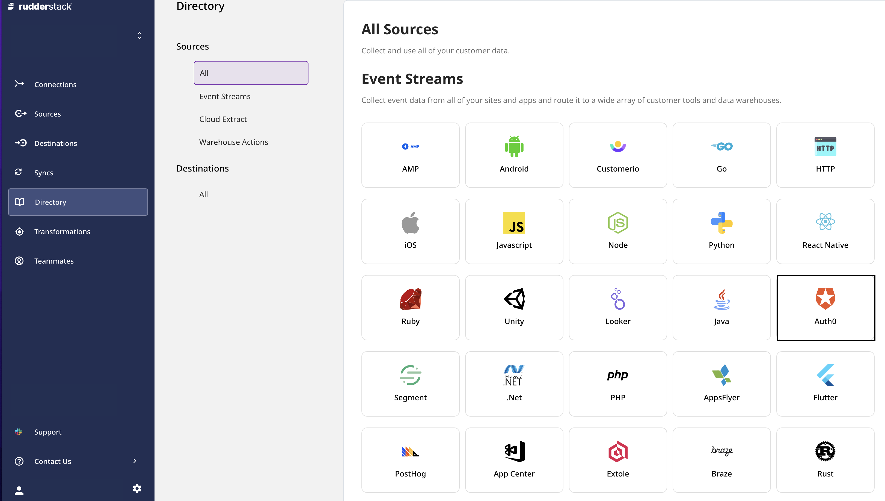
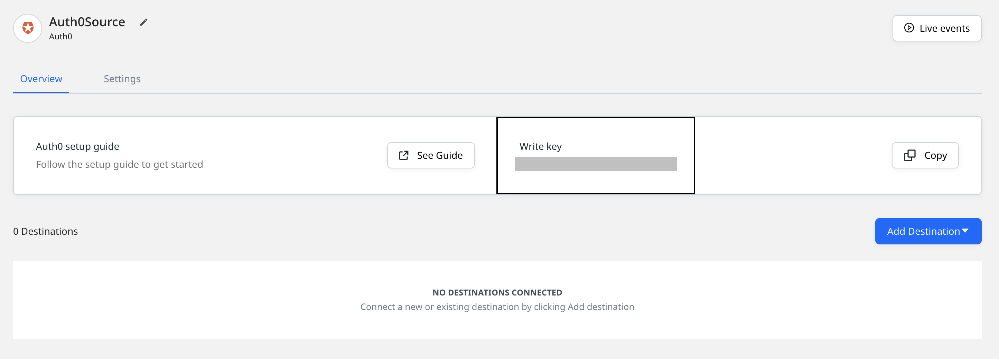
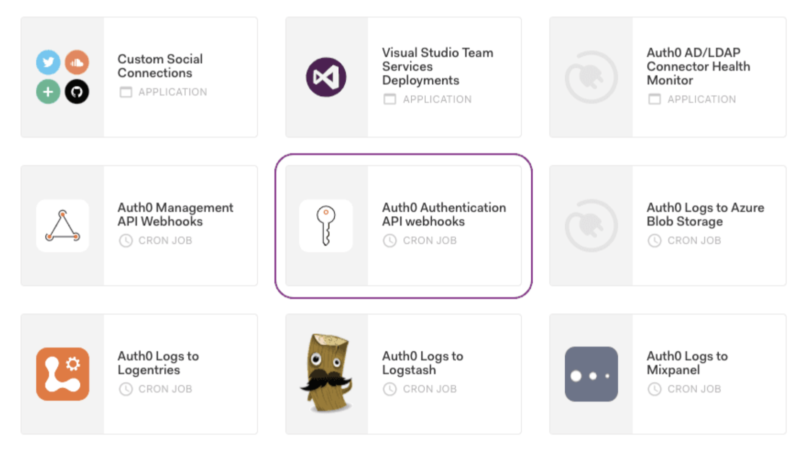
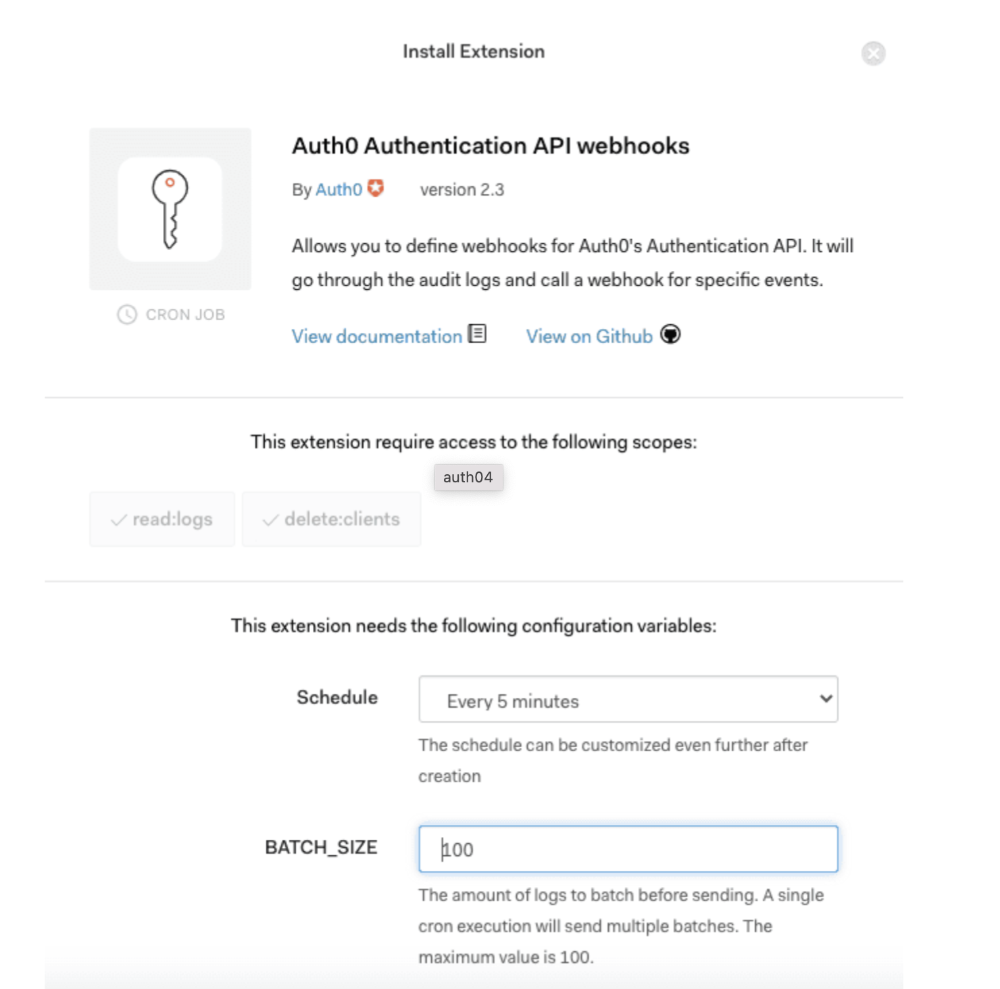
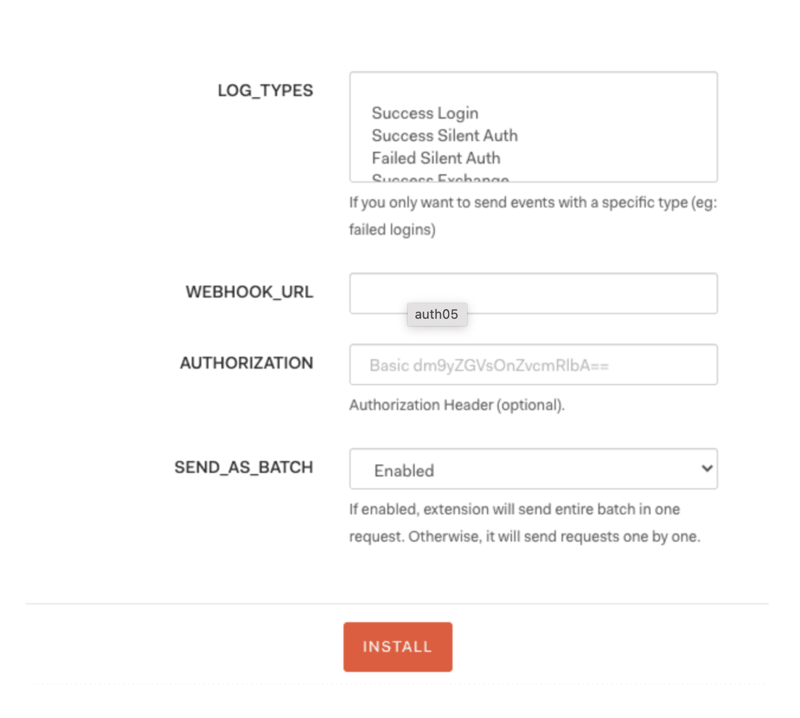
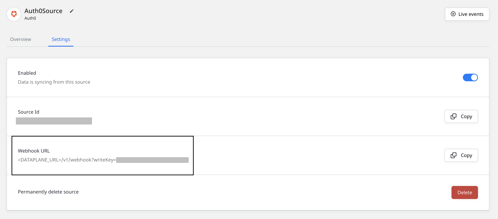

# Auth0

[**Auth0**](https://auth0.com/) is a popular solution used by many companies to add authentication and authorization services to their applications. You can connect Auth0 to your application with just a few lines of code and also define the identity providers, i.e., how you want the users to log in.

You can now send login and signup-related events to RudderStack whenever Auth0 generates an authentication log by adding an [**Auth0 Authentication API webhook**](https://auth0.com/docs/extensions/auth0-authentication-api-webhooks) extension that points to RudderStack.

This guide will help you set up Auth0 as a source in RudderStack.

## Getting started

Follow these steps to set up your Auth0 source in the RudderStack dashboard:

- Go to your [**RudderStack dashboard**](https://app.rudderstack.com/) and click on **Add Source**. Then, select **Auth0** from the list of **Event Stream** sources, as shown:



- Assign a name to your source and click on **Next**.

- Your Auth0 source is now configured. Note the source **Write key** - this will be required to configure the endpoint URL in the following steps.



- Head over to your [**Auth0**](https://auth0.com/) account and navigate to the **Extensions** page from the sidebar.

- Look for the extension **Auth0 Authentication API webhooks**, as shown:



- After selecting this option, you should be able to see the extension installation page, as shown:



- At the bottom, select the **LOG_TYPES** option for which you want to forward the events to RudderStack.



- Add the **WEBHOOK_URL** as shown on the source settings page in your RudderStack dashboard.



The webhook URL is of the following format:

```
<DATA_PLANE_URL>/v1/webhook?writeKey=<WRITE_KEY>
```

A sample webhook URL is shown below:

```
https://hosted.rudderlabs.com/v1/webhook?writeKey=1bCenS7ynqHh8ETX8s5Crjh22J
```

<div class="infoBlock">

For more information on the data plane URL, refer to <a href="https://rudderstack.com/docs/rudderstack-open-source/installing-and-setting-up-rudderstack/#what-is-a-data-plane-url-where-do-i-get-it">this</a> section.
</div>

<div class="warningBlock">

Make sure you add the source write key as query parameter to the URL. This is required to prevent the webhook from failing because of an invalid write key.
</div>

Then, continue with the rest of the steps as listed below:

- Keep the authorization section as blank.

- You can disable the **SEND_AS_BATCH** setting to receive the events in separate requests. However, we recommend setting it to **Enabled**.

- Finally click on **INSTALL** to install the webhook on your Auth0 dashboard.

## Event transformation

The Auth0 webhook events are ingested into RudderStack after converting them in a RudderStack event format. The `user_id` set by Auth0 is converted to `userId`.

The following table lists the properties populated from the Auth0 event payload directly to the RudderStack event:

| **Auth0 Property**        | **RudderStack Property**                                                                    |
| :------------------------ | :------------------------------------------------------------------------------------------ |
| `client_id`               | `properties.client_id`                                                                      |
| `client_name`             | `properties.client_name`                                                                    |
| `details`                 | `properties.details` **NOTE**: These are the unmodified details sent by Auth0. |
| `auth0_client`            | `properties.auth0_client`                                                                   |
| `log_id`                  | `properties.log_id`                                                                         |
| `isMobile`                | `properties.is_mobile`                                                                      |
| `description`             | `properties.description`                                                                    |
| `ip`                      | `context.request_ip`                                                                        |
| `details.auth.user.email` | `context.traits.email`                                                                      |
| `details.auth.user.name`  | `context.traits.name`                                                                       |
| `user_name`               | `context.traits.user_name`                                                                  |
| `user_agent`              | `context.userAgent`                                                                         |

## Debugging

If you're unable to see any events flowing from the Auth0 API webhooks to RudderStack, you can troubleshoot the issue by viewing the API webhooks logs. To do so, go to your Auth0 dashboard and navigate to **Monitoring** - **Logs**.

<div class="infoBlock">

Refer to the <a href="https://auth0.com/docs/extensions/auth0-authentication-api-webhooks#troubleshoot-webhooks">Auth0 documentation</a> for more information on troubleshooting your webhook.
</div>

## Contact us

For queries on any of the sections covered in this guide, you can [**contact us**](mailto:%20docs@rudderstack.com) or start a conversation in our [**Slack**](https://rudderstack.com/join-rudderstack-slack-community) community.
