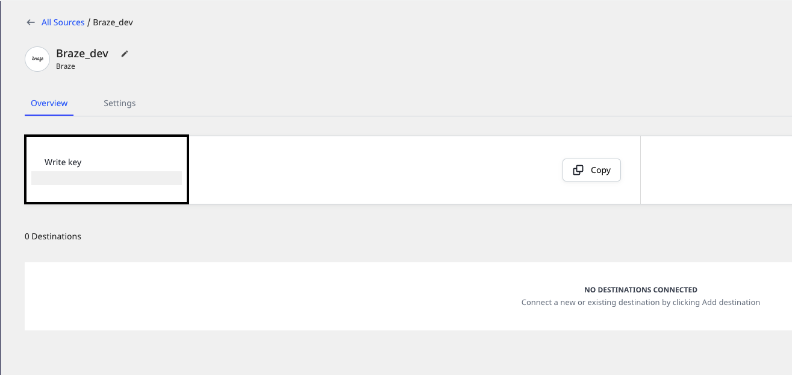

# Braze

[**Braze**](https://www.braze.com/) is an industry-leading customer engagement platform. It provides a cross-channel, data-driven platform to help you better understand your customers' in-app behavior, use the insights to improve your users' app experience, and increase engagement with them.

You can send your Braze events to RudderStack by leveraging [**Braze Currents**](https://www.braze.com/docs/user_guide/data_and_analytics/braze_currents/).

This guide will help you set up Braze as a source in RudderStack.

## Getting started

Follow these steps to set up your Braze source in the RudderStack dashboard:

- Go to your [**RudderStack dashboard**](https://app.rudderstack.com/) and click on **Add Source**. Then, select **Braze** from the list of **Event Stream** sources, as shown:

- Assign a name to your source and click on **Next**.

- Your Braze source is now configured. Note the source **Write key** as it will be required in the later steps.

- To complete the setup, contact Braze's support team to activate Currents in your Braze account.

Braze Currents is available in select Braze packages and can be configured only with the Braze team's assistance. For support, you can contact the Braze Customer Success team <a href="https://www.braze.com/docs/support_contact/">here</a>.

## Supported events and properties

Braze uses RudderStack's [**Event Stream**] functionality to send events to RudderStack. These events can then be transformed and routed to your preferred destinations, including your data warehouse.

The following table lists all the Braze events supported by RudderStack:

| **Event Name** | **Event Description** |
| :-----------------| :----------------|
| Application Uninstalled | When the user uninstalls the application. |
| Campaign Converted | When the user performs the primary conversion events for a Campaign within its conversion window. |
| Canvas Converted | When the user performs the primary conversion event for a Canvas within its conversion window. | 
| Canvas Entered | When the user is entered into a Canvas. |
| Campaign Control Group Entered | When the user enrolls in a Campaign control group. |
| Email Sent | When an email is successfully sent to the user. | 
| Email Delivered | When an email is successfully delivered to the user. |
| Email Opened | When the user opens an email. |
| Email Link Clicked | When the user clicks a link within an email. Note that the email click tracking feature must be enabled. |
| Email Bounced | Triggered when Braze attempts to send an email but the receipients email server does not accept it. |
| Email Soft Bounced | When Braze attempts to send an email but the recepient's email server bounces it temporarily because of reasons such as full inbox, email server down, etc. |
| Email Marked As Spam | When the user marks an email as spam. |
| Email Unsubscribed | When the user clicks on the unsubscribe link within an email. | 
| Subscription Group State Changed | When the user's subscription group status changes to `Subscribed` or `Unsubscribed`. |
| Push Notification Sent | When a push notification is successfully sent to the user. | 
| Push Notification Tapped | When a user taps on a push notification. | 
| iOS Foreground Push Opened | When the user receives an iOS push notificaiton while the app is open. | 
| In-App Message Viewed | When the user views an in-app message. | 
| News Feed Viewed | When the user views the Braze News Feed. |
| News Feed Card Viewed | When the user views a Card within the Braze News Feed. | 
| News Feed Card Clicked | When the user taps or clicks on Braze News Feed Card. | 
| Webhook Sent | When a webhook message is sent. |

The following table lists the properties included in the events mentioned above:

| **Property Name** | **Property Type** | **Description** |
| :-----------------| :----------------|| :-----------------|
| `app_id` | String | Refers to the API identifier of the app on which the user receives a message/notification or performs some action. |
| `send_id` | String | Refers to the message ID if specified for a particular campaign, if applicable. |
| `campaign_id` | String | Refers to the API identifier of the campaign associated with the event, if applicable. |
| `canvas_id` | String | Refers to the API identifier of the Canvas associated with the event, if applicable. |
| `canvas_variation_id` | String | Refers to the API identifier of the Canvas Variation associated with the event, if applicable. |
| `canvas_step_id` | String | Refers to the API identifier of the Canvas Step associated with the event, if applicable. |
| `context.traits.email` | String | Refers to the email address that the email was sent to, in case of the Email events. |
| `button_id` | String | Refers to the ID of the button that the user clicked, in case of the In-App Message Clicked events. |
| `card_id` | String | Refers to the API identifier of the News Feed Card, in case of the News Feed Card Viewed and News Feed Card Clicked events. |

## Contact us

For queries on any of the sections covered in this guide, you can [**contact us**](mailto:%20docs@rudderstack.com) or start a conversation on our [**Slack**](https://rudderstack.com/join-rudderstack-slack-community) channel.
