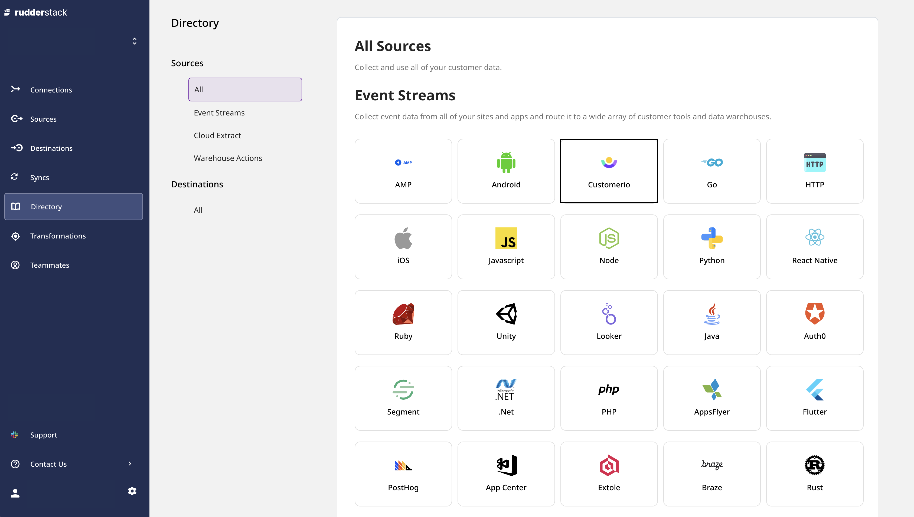
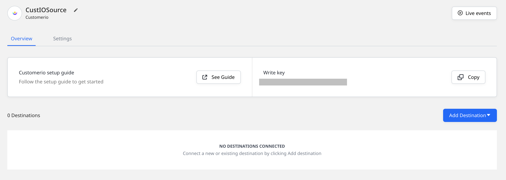
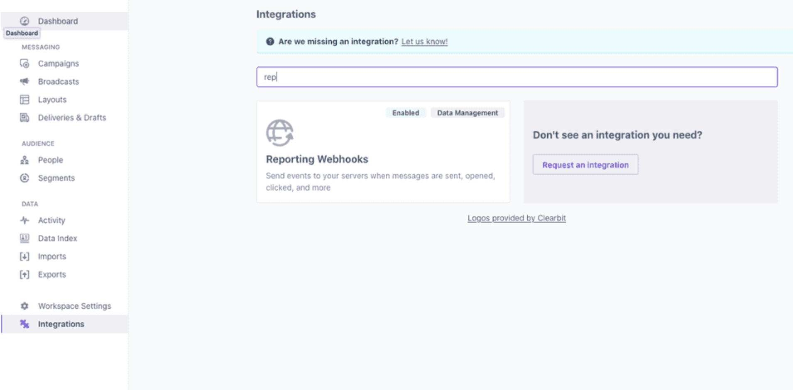
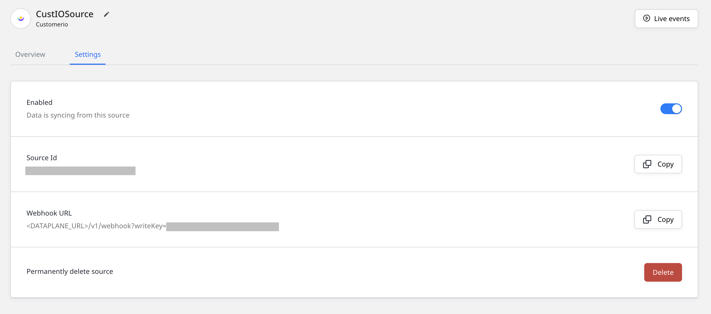
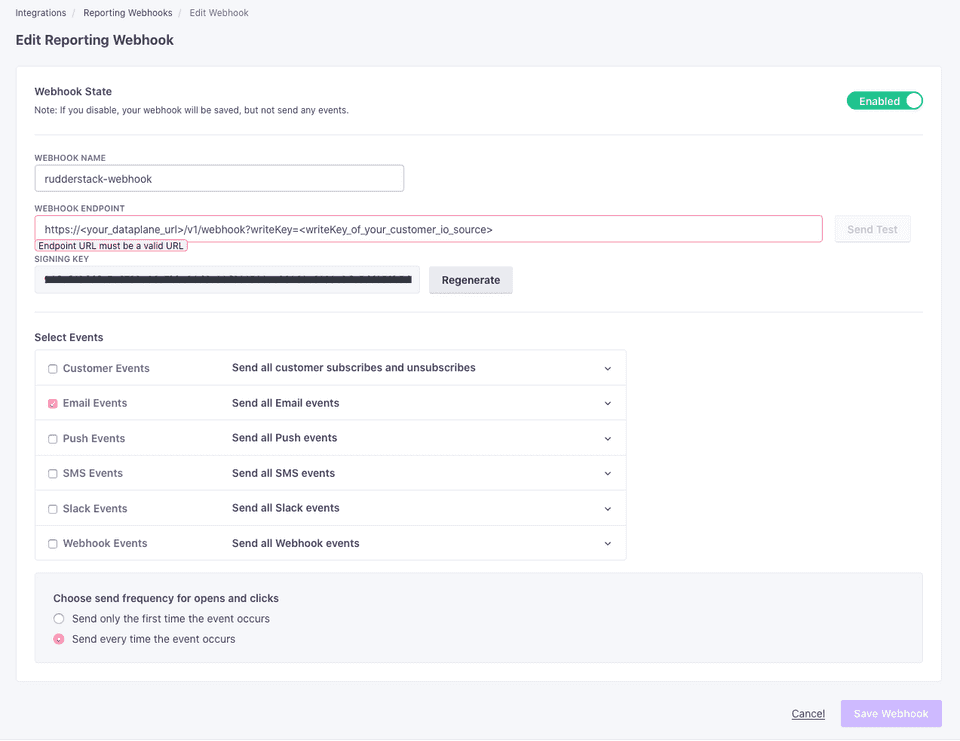

# Customer.io

[**Customer.io**](https://customer.io/) is a popular marketing platform for sending targeted emails and push and SMS notifications to improve customer engagement and thereby the overall conversion rate. It leverages real-time behavioral data and advanced segmentation techniques across the web and mobile platforms to improve your customers' overall experience.

By adding a reporting webhook in Customer.io, you can send your Customer.io email events to RudderStack. These include events such as email delivered, opened, bounced, and more.

This guide will help you set up Customer.io as a source in RudderStack.

## Getting started

This section details the steps involved in setting up Customer.io as a source in the RudderStack dashboard.  Follow these steps:

- Go to your [**RudderStack dashboard**](https://app.rudderstack.com/) and click on **Add Source**. Then, select **CustomerIO** from the list of **Event Stream** sources, as shown:



- Assign a source name and click on **Next**.

<div class="warningBlock">

To connect this source to a RudderStack warehouse destination, the source name should match the name of your warehouse schema.
</div>

- Your Customer.io source is now configured. Note the source **Write key** - this will be required to configure the endpoint URL in the following steps.



- Head over to your Customer.io account and navigate to the **Integrations** page from the sidebar. Then, look for the integration **Reporting Webhooks**, as shown:



- Click on **Add Webhook** and add the webhook URL as shown on the source settings page in your RudderStack dashboard.



The webhook URL is of the format:

```
<DATA_PLANE_URL>/v1/webhook?writeKey=<WRITE_KEY>
```


A sample webhook URL is shown below:

```
https://hosted.rudderlabs.com/v1/webhook?writeKey=1bCenS7ynqHh8ETX8s5Crjh22J
```

<div class="infoBlock">

For more information on the data plane URL, refer to <a href="https://rudderstack.com/docs/get-started/installing-and-setting-up-rudderstack/#what-is-a-data-plane-url-where-do-i-get-it">this</a> section.
</div>

<div class="warningBlock">

Make sure you add the source write key as query parameter to the URL. This is required to prevent the webhook from failing because of an invalid write key.
</div>

### Supported events

RudderStack currently supports only the Customer.io Email Events listed in the table below:

| **Email Event** | **Description**                                                                           |
| :-------------- | :---------------------------------------------------------------------------------------- |
| `Delivered`     | The delivery provider's report that the email was delivered to the inbox of the recipient. |
| `Opened`        | An email was opened by the recipient.                                                      |
| `Clicked`       | A tracked link in an email was clicked by the recipient / customer.                        |
| `Bounced`       | The delivery provider's report that it was unable to deliver the email to the recipient.   |
| `Spammed`       | An email was marked as spam by the recipient.                                             |
| `Unsubscribed`  | The customer unsubscribed via a particular email.                                          |

The following image highlights the whole setup in the Customer.io dashboard:



- Finally, save the webhook.

## Event transformation

The Customer.io webhook events are ingested into RudderStack after converting them into the RudderStack event format. The `customer_id` set by Customer.io is set as `userId`. In cases where Customer.io does not send the `customer_id`, the email address of the user is set as `anonymousId`.

## Contact us

For queries on any of the sections covered in this guide, you can [**contact us**](mailto:%20docs@rudderstack.com) or start a conversation on our [**Slack**](https://rudderstack.com/join-rudderstack-slack-community) channel.
