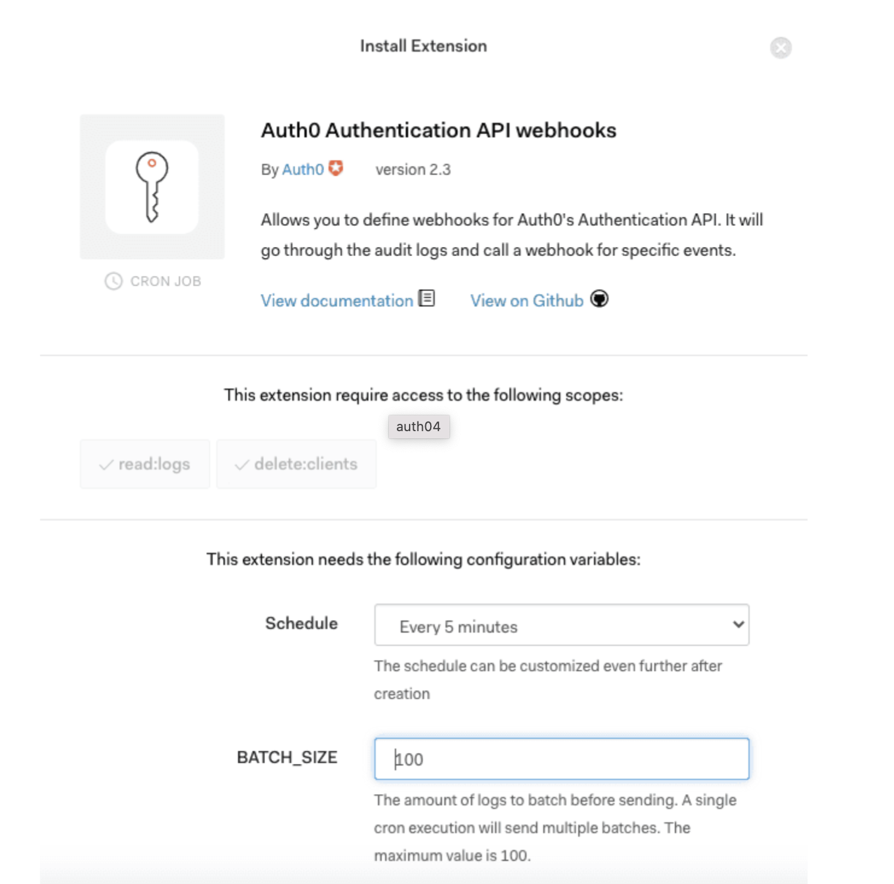

# Extole

[**Extole**](https://www.extole.com/) is a popular referral marketing tool that lets you offer an integrated, optimized, and effective customer experience for your audience. It allows you to create personalized marketing campaigns aimed at boosting your customer acquisition and conversion rates.

You can now send your Extole events to RudderStack by simply adding a webhook that points to RudderStack. These events include the reward-specific events such as `reward_earned`,`reward_fulfilled`,`reward_sent`, etc. along with other custom events from Extole.

This guide helps you in setting up Extole as a source in RudderStack.

## Getting started

This section details the steps involved in setting up Extole as a source in the RudderStack dashboard.  Follow these steps:

- Go to your [**RudderStack dashboard**](https://app.rudderstack.com/) and click on **Add Source**. Then, select **Extole** from the list of **Event Stream** sources, as shown:


- Assign a name to your source and click on **Next**.

- Your Extole source is now configured. Note the source **Write key** - this will be required to configure the endpoint URL in the later steps.


- Next, head over to your Extole account and select the **program** you want to use for RudderStack to ingest your data. 

- Then, navigate to the **Tech Center** section from the sidebar and then select [**Rewards WebHooks**](https://my.extole.com/tech-center/rewards-webhooks). 

- Then, click on the **New Reward Webhook** option as seen in the following image:


- In the **URL** text box, add the webhook URL as shown on the source settings page in your RudderStack dashboard:



The webhook URL is of the following format:

```
<DATA_PLANE_URL>/v1/webhook?writeKey=<WRITE_KEY>
```

A sample webhook URL is shown below:

```
https://hosted.rudderlabs.com/v1/webhook?writeKey=1bCenS7ynqHh8ETX8s5Crjh22J
```

<div class="infoBlock">

For more information on the data plane URL, refer to <a href="https://rudderstack.com/docs/get-started/installing-and-setting-up-rudderstack/#what-is-a-data-plane-url-where-do-i-get-it">this</a> section.
</div>

<div class="warningBlock">

Make sure you add the source write key as query parameter to the URL. This is required to prevent the webhook from failing because of an invalid write key.
</div>

- Finally, save the endpoint.

## Event transformation

RudderStack ingests the Extole events after converting them into the RudderStack event format. For example, Extole's `event_id` is converted and set to `properties.eventId`. 

<div class="infoBlock">

The Extole events are converted into a RudderStack <code class="inline-code">track</code> call with the designated event name and associated properties received from Extole.
</div>

<div class="infoBlock">

RudderStack retains the Extole event name during the mapping.
</div>

RudderStack populates the following properties from the Extole event payload to the RudderStack event:

| **Extole Property**              | **RudderStack Property**                                          |
| :--------------------------- | :------------------------------------------------------------ |
| `event_id`,                  | `properties.eventId`                                          |
| `event_time`                 | `originalTimestamp`                                           |
| `reward_id`                  | `properties.rewardId`                                         |
| `reward_supplier_name`       | `properties.rewardSupplierName`                               |
| `reward_supplier_id`         | `properties.rewardSupplierId`                                 |
| `partner_reward_supplier_id` | `properties.partnerRewardSupplierId`                          |
| `reward_supplier_type`       | `properties.partnerRewardSupplierType`                        |
| `person_id`                  | `properties.personId`                                         |
| `partner_user_id`            | `properties.partnerUserId`, `userId`, `context.traits.userId` |
| `face_value`                 | `properties.faceValue`                                        |
| `face_value_type`            | `properties.faceValueType`                                    |
| `message`                    | `properties.message`                                          |
| `partner_reward_id`          | `properties.partnerRewardId`                                  |
| `email`                      | `properties.email`                                            |
| `data`                       | `properties.data`                                             |
| `schema_version`             | `properties.schemaVersion`                                    |

<div class="warningBlock">

All the Extole event properties other than <code class="inline-code">reward_earned</code>, <code class="inline-code">reward_fulfilled</code>, and <code class="inline-code">reward_sent</code> sent to Rudderstack will be directly mapped to the Rudderstack event properties.
</div>

## Contact us

For queries on any of the sections covered in this guide, you can [**contact us**](mailto:%20docs@rudderstack.com) or start a conversation on our [**Slack**](https://rudderstack.com/join-rudderstack-slack-community) channel.
