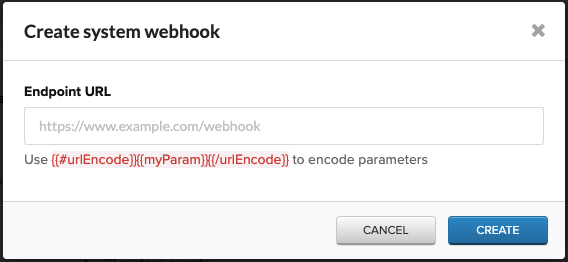

# Iterable

[Iterable](https://iterable.com/) is a cross-channel growth marketing platform that provides unified customer experiences. It also empowers the marketers to create, optimize and measure every interaction taking place throughout the customer journey by using email, push and in-app notifications, SMS and other sources.

This guide will help you set up Iterable as a source in RudderStack.

## Getting started

Follow these steps to set up Iterable source in the RudderStack dashboard:

1. Go to your [RudderStack dashboard](https://app.rudderstack.com/) and click on **Add Source**. Then, select **Iterable** from the list of **Event Stream** sources, as shown:


2. Assign a name to your source and click on **Next**.

3. The Iterable source is now configured. Note the **Webhook URL** in the **Settings** tab.


4. Go to your Iterable account and navigate to **Integrations** > **System Webhooks**. 

5. Click on **Create Webhook** and enter the **Webhook URL** in **Endpoint URL**, as shown:



6. Finally, click on **Create**. 

## Event transformation

The Iterable events are ingested into RudderStack after being converted into the RudderStack event format. 

RudderStack populates the following properties from Iterable event payload into the RudderStack event:

| Iterable property  | RudderStack property|
| :------------------ | :------------- |
| `email`  | `context.traits.email`    |
| `userId`        | `userId`        |
| `dataFields`    | `properties`  |
| `eventName`     | `event`   |

<div class="infoBlock">

The `userId` is a unique identifier in the output payload. If not provided, Rudderstack creates a unique `userId` using `email`.
</div>

The below is the list of events that Iterable supports:
- Blast Send
- Email Bounce
- Email Click
- Email Complaint
- Email Open
- Email Send Skip
- Email Subscribe
- Email Unsubscribe
- Hosted Unsubscribe Click
- In-App Click
- In-App Open
- In-App Send
- In-App Send Skip
- Push Bounce
- Push Open
- Push Send
- Push Send Skip
- Push Uninstall
- SMS Bounce
- SMS Clic
- SMS Send
- SMS Received
- SMS Send Skip
- Triggered Send
- Web Push Send
- Web Push Send Skip

## Payload creation

This section details how RudderStack receives the data from the Iterable source platform and creates the resulting payload.

A sample payload sent by Iterable is, as shown:

```json
{
  "email": "docs@iterable.com",
  "userId": "1",
  "eventName": "hostedUnsubscribeClick",
  "dataFields": {
    "country": "United States",
    "city": "San Jose",
    "campaignId": 1074721,
    "ip": "192.168.0.1",
    "userAgentDevice": "Mac",
    "messageId": "ceb3d4d929fc406ca93b28a0ef1efff1",
    "emailId": "c1074721:t1506266:docs@iterable.com",
    "userAgent": "Mozilla/5.0 (Macintosh; Intel Mac OS X 10_14_6) AppleWebKit/537.36 (KHTML, like Gecko) Chrome/80.0.3987.149 Safari/537.36",
    "workflowName": "My workflow",
    "locale": null,
    "templateId": 1506266,
    "emailSubject": "My email subject",
    "url": "https://iterable.com",
    "labels": [],
    "createdAt": "2020-03-21 00:24:08 +00:00",
    "templateName": "My email template",
    "messageTypeId": 13406,
    "experimentId": null,
    "region": "CA",
    "campaignName": "My email campaign",
    "workflowId": 60102,
    "email": "docs@iterable.com",
    "channelId": 12466
  }
}
```

The transformed payload is shown below:

```json
{
  "userId": "1",
  "context": {
    "integration": {
      "name": "Iterable",
      "version": "1.0.0"
    },
    "library": {
      "name": "unknown",
      "version": "unknown"
    },
    "traits": {
      "email": "docs@iterable.com"
    }
  },
  "event": "hostedUnsubscribeClick",
  "integrations": {
    "Iterable": false
  },
  "properties": {
    "country": "United States",
    "city": "San Jose",
    "campaignId": 1074721,
    "ip": "192.168.0.1",
    "userAgentDevice": "Mac",
    "messageId": "ceb3d4d929fc406ca93b28a0ef1efff1",
    "emailId": "c1074721:t1506266:docs@iterable.com",
    "userAgent": "Mozilla/5.0 (Macintosh; Intel Mac OS X 10_14_6) AppleWebKit/537.36 (KHTML, like Gecko) Chrome/80.0.3987.149 Safari/537.36",
    "workflowName": "My workflow",
    "locale": null,
    "templateId": 1506266,
    "emailSubject": "My email subject",
    "url": "https://iterable.com",
    "labels": [],
    "createdAt": "2020-03-21 00:24:08 +00:00",
    "templateName": "My email template",
    "messageTypeId": 13406,
    "experimentId": null,
    "region": "CA",
    "campaignName": "My email campaign",
    "workflowId": 60102,
    "channelId": 12466
  },
  "receivedAt": "2020-03-21T00:24:08.000Z",
  "timestamp": "2020-03-21T00:24:08.000Z",
  "type": "track"
}
```

## Contact us

For queries on any of the sections covered in this guide, you can [contact us](mailto:%20docs@rudderstack.com) or start a conversation in our [Slack](https://rudderstack.com/join-rudderstack-slack-community) community.
