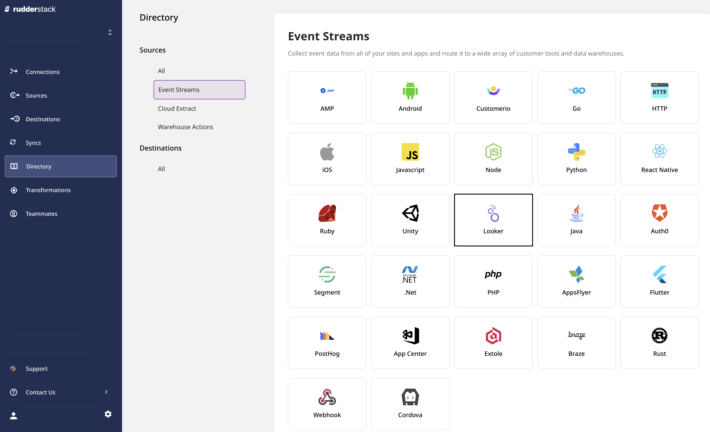
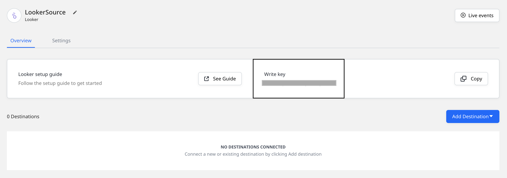
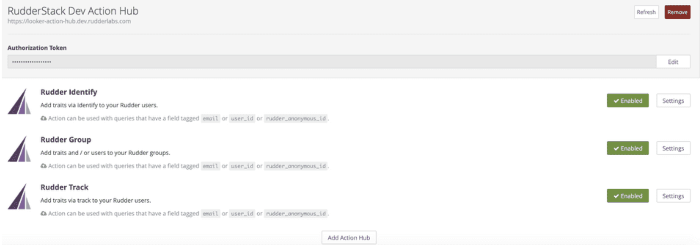
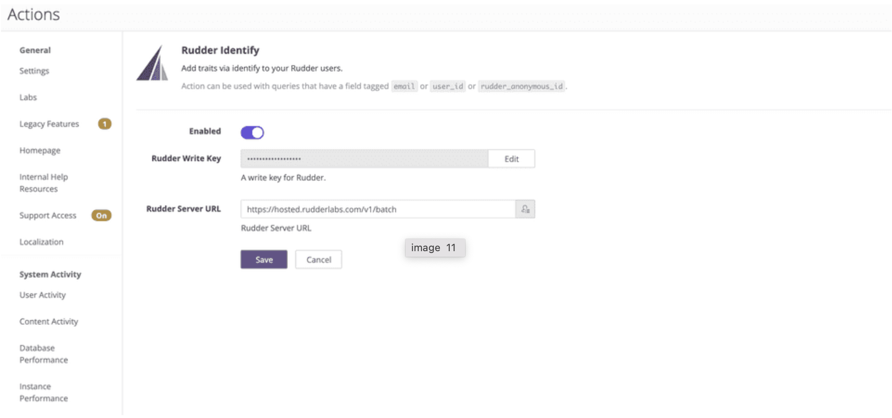

# Looker

[**Looker**](https://looker.com/) is a popular Business Intelligence and data analytics platform that allows you to explore your data for actionable, business-oriented insights.

You can now use Looker as a data source where it can be used to send enriched user activities and their associated properties over a period of time to RudderStack. RudderStack then forwards this data to your specified destinations for real-time syncing of the newly created properties and actions.

This guide will help you in setting up Looker as a source in RudderStack.

## Setting up the Looker actions

After creating your views in Looker, you need to set-up the necessary [**Looker actions**](https://docs.looker.com/admin-options/platform/actions). Go to your Looker actions dashboard to do this.

<div class="warningBlock">

While RudderStack supports teams and individual workspaces in its <a href="https://rudderstack.com/pricing/">Enterprise edition</a>, Looker does not allow individual Action Hub configurations for different members of the same organization.
</div>

<div class="infoBlock">

If you want to send the output of different looks to various RudderStack sources, you will need to host custom instances of Looker Action Hub. Refer to this <a href="https://docs.looker.com/sharing-and-publishing/action-hub#setting_up_a_local_action_hub_server">Looker documentation</a> for more information.
</div>

## Configuring a Looker source in RudderStack

Follow these steps to set up your Looker source in the RudderStack dashboard:

- Go to your [**RudderStack dashboard**](https://app.rudderstack.com/) and click on **Add Source**. Then, select **Looker** from the list of **Event Stream** sources, as shown:



- Assign a name to your source and click on **Next**.

- Your Looker source is now configured. Note the source **Write key** - this will be required later steps to enable your RudderStack actions for Looker.



## Adding the RudderStack Action Hub Server

This section describes the steps required to enable the [**RudderStack actions**](https://github.com/rudderlabs/actions) in Looker:

RudderStack hosts a Looker [**Action Hub Server**](https://docs.looker.com/sharing-and-publishing/action-hub#writing_an_action) that communicates with your Looker instance.

<div class="infoBlock">

The RudderStack Action Hub Server can be found at <a href="https://looker-action-hub.rudderstack.com">https://looker-action-hub.rudderstack.com</a>
</div>

You will require an **Authorization Token** to access the Action Hub. The token to be used is as follows:

```text
75805209b45a55494d0c27d4eb91fbf6bc7fb1a63dfcd9260fe65daee584737b/ea4e074e71c1af9c07bf71f69c1addf7b9a30d458bd7aea4b4e60d6a6a122277b59210186edb7cf21a5ff53a29c68fb89ff5aaf5019570c8a5131484a11e2e3e
```

Once you connect the Action Hub Server to your Looker instance by clicking on the **Add Action Hub** button present at the bottom of Looker actions dashboard, you can start viewing the following three RudderStack actions:

- `Identify`: Adds the traits to your RudderStack users via the `identify` event.
- `Group`: Adds the traits or users to your RudderStack groups via the `group` event.
- `Track`: Adds the traits to your RudderStack users via the `track` event.



### Configuring the actions

- To enable any of the above actions, click on the **Settings** button. 

- Here, you need to enter the **Write key** obtained after setting the Looker source in RudderStack.


- In addition, you also need to specify the **Rudder Server URL** to which the actions will forward the user looks data. The URL is `https://hosted.rudderlabs.com/v1/batch`.



Once the connection is successful, you should start seeing the RudderStack actions.

## RudderStack actions overview

Once configured, RudderStack actions will start sending the query results to RudderStack.

When defining the columns for the Looker models attached to the user looks that you want to send to RudderStack, it's important to tag the user identifier column as `email` **or** `user_id` **or** `rudder_anonymous_id`. 

Additionally, to use the **RudderStack Group** action, you need to tag your group identifier column as `rudder_group_id`.

<div class="infoBlock">

In <strong>some</strong> specific cases, e.g. Redis - the <code class="inline-code">user_id</code> field always needs to be present even if <code class="inline-code">email</code> is already present.
</div>

<div class="infoBlock">

The other user and activity columns are sent as traits or properties along with the payload sent to RudderStack.
</div>

A sample `track` payload from the look's row data sent by the **RudderStack Track** action is as shown:

```javascript
{
  "userId": "test@rcomp.es",
  "anonymousId": null,
  "properties": {
    "tracks_flow.event_2": "Destination_Clicked",
    "tracks_flow.event_3": [

    ],
    "tracks_flow.event_4": [

    ],
    "tracks_flow.event_5": [

    ],
    "tracks_flow.event": "User_Logged_In"
  },
  "event": "single",
  "context": {
    "library": {
      "name": "analytics-node",
      "version": "0.0.3"
    },
    "app": {
      "name": "looker/actions",
      "version": "dev"
    }
  },
  "timestamp": "2020-06-18T08:21:01.644Z",
  "type": "track",
  "_metadata": {
    "nodeVersion": "12.13.0"
  },
  "originalTimestamp": "2020-06-18T08:21:03.049Z",
  "messageId": "node-c33eb51666f6470bf4aa415c7431aba4-ffd5e198-05a1-477a-9c2c-85be30749b8b",
  "sentAt": "2020-06-18T08:21:03.050Z"
}
```

<div class="infoBlock">

The column names in your looks are transformed as <code class="inline-code">view name.column name</code> in the payload sent to RudderStack. If you want to change the names as per your end-destination, you can do so using RudderStack's <a href="https://rudderstack.com/docs/transformations/">Transformations</a> feature.
</div>

## Contact us

For queries on any of the sections covered in this guide, you can [**contact us**](mailto:%20docs@rudderstack.com) or start a conversation on our [**Slack**](https://rudderstack.com/join-rudderstack-slack-community) channel.