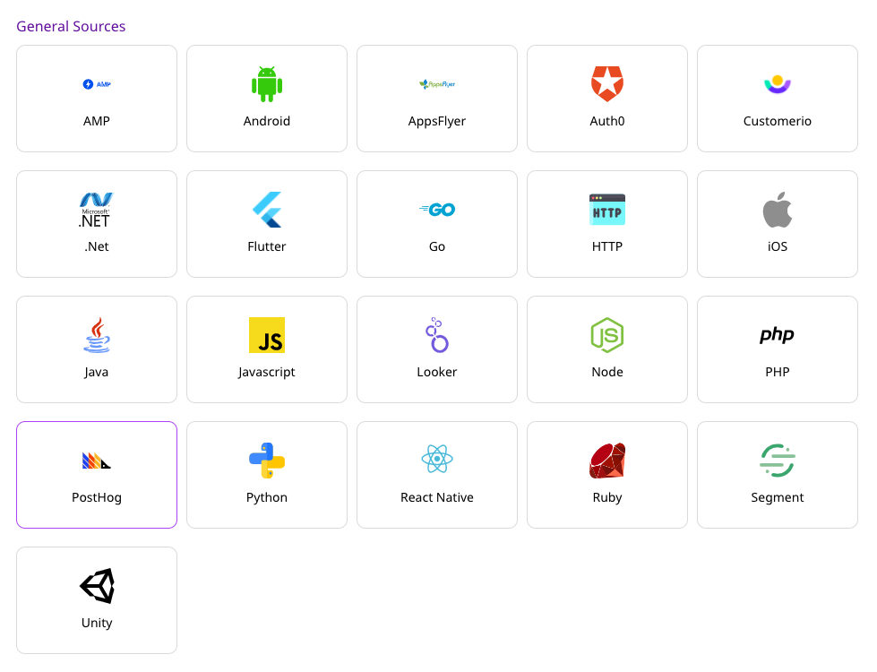
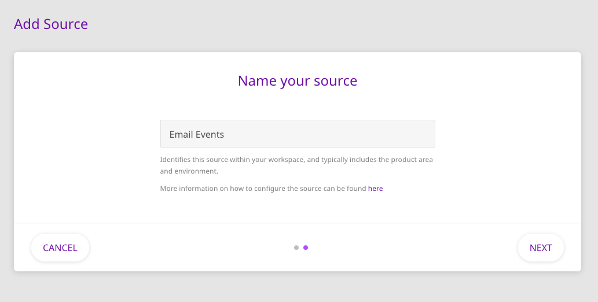
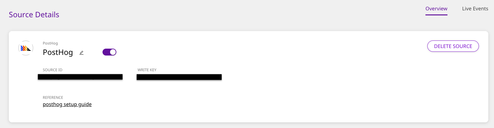
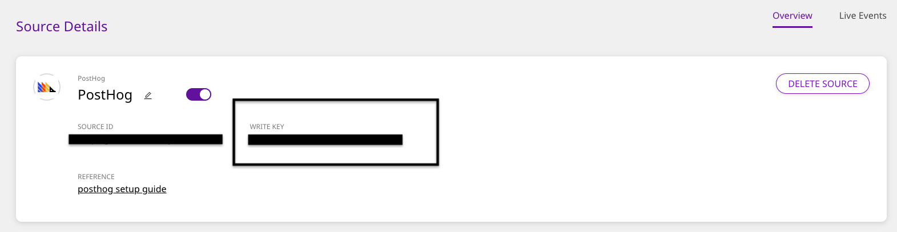
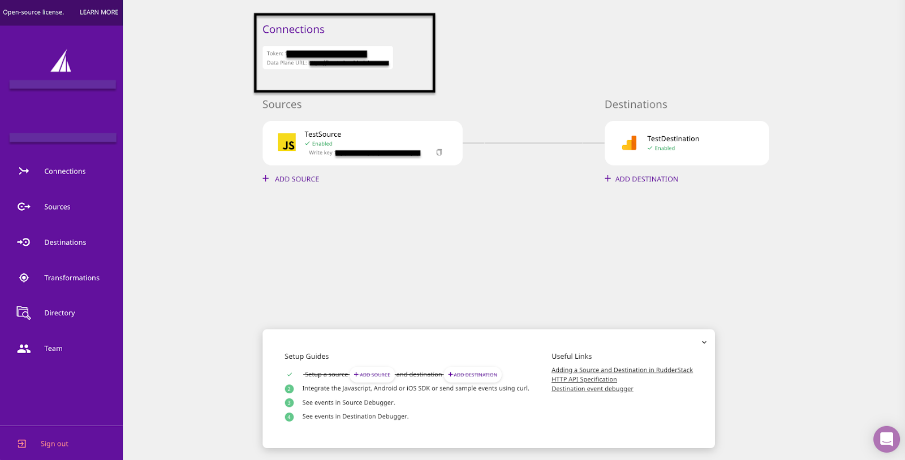
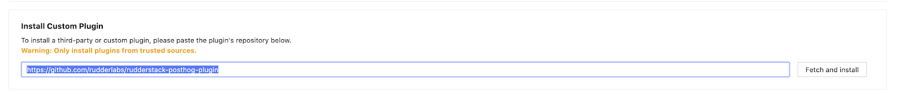
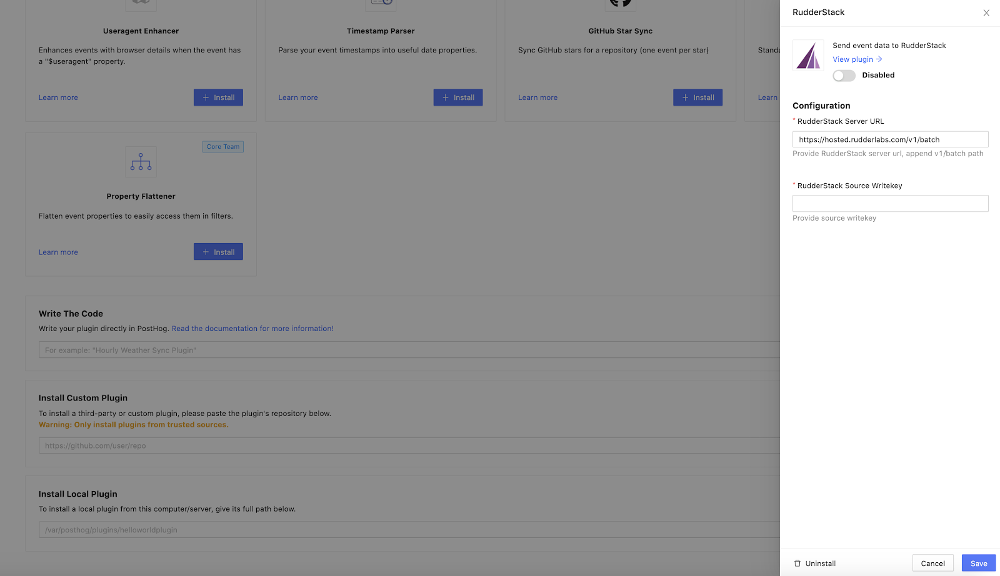

# PostHog

[PostHog](https://posthog.com/) is a complete product analytics stack that you can seamlessly deploy on your infrastructure. Built for both data analysts and managers, PostHog gives you easy access to product analytics which you can perform at scale. It also gives you full control over all your user data.

RudderStack now supports PostHog as an Event Streams source. We've built a[ RudderStack PostHog plugin](https://github.com/rudderlabs/rudderstack-posthog-plugin) that lets you send events from your PostHog instance to RudderStack.

## ‌Getting Started

In order to add PostHog as a source in RudderStack, please follow these steps:

- Log into your [RudderStack dashboard](https://app.rudderlabs.com/signup?type=freetrial).
- From the left panel, select Sources. Then, click on **Add Source**, as shown:

<!---->

- From the list of sources, select **PostHog**.

- Enter the name of your source, and click on **Next**.

- In the **Connection Settings** screen, enter your PostHog credentials and complete the source configuration. Once you've successfully set up the source, you should see the following screen:

## Setting up the RudderStack PostHog plugin

Once you've successfully set up PostHog as a source on the RudderStack dashboard, follow these steps to configure and set up the [RudderStack PostHog plugin](https://github.com/rudderlabs/rudderstack-posthog-plugin) which allows you to ingest PostHog data into RudderStack:

- Get your PostHog source **Write Key** and your RudderStack server URL \(also called as **Data Plane URL**\).

- Copy the [RudderStack-PostHog Plugin repository URL](https://github.com/rudderlabs/rudderstack-posthog-plugin).
- Go to your PostHog dashboard, and add a custom plugin using this URL, as shown:

- Once added successfully, configure this plugin using the source write key and RudderStack server URL that you copied above. The default RudderStack server URL is configured to[ https://hosted.rudderlabs.com/v1/batch](https://hosted.rudderlabs.com/v1/batch). Append **`v1/batch`** to this URL, as shown:

- Finally, enable this plugin. You should now start to see the events sent to your PostHog instance flowing to this RudderStack source.

## License

The RudderStack PostHog Plugin is released under the [MIT License](https://opensource.org/licenses/MIT).

## Contact Us

If you come across any issues while configuring PostHog as an Event Stream source with RudderStack, please feel free to contact us. You can also start a conversation on our [Slack](https://rudderstack.com/join-rudderstack-slack-community) channel - we will be happy to talk to you!
