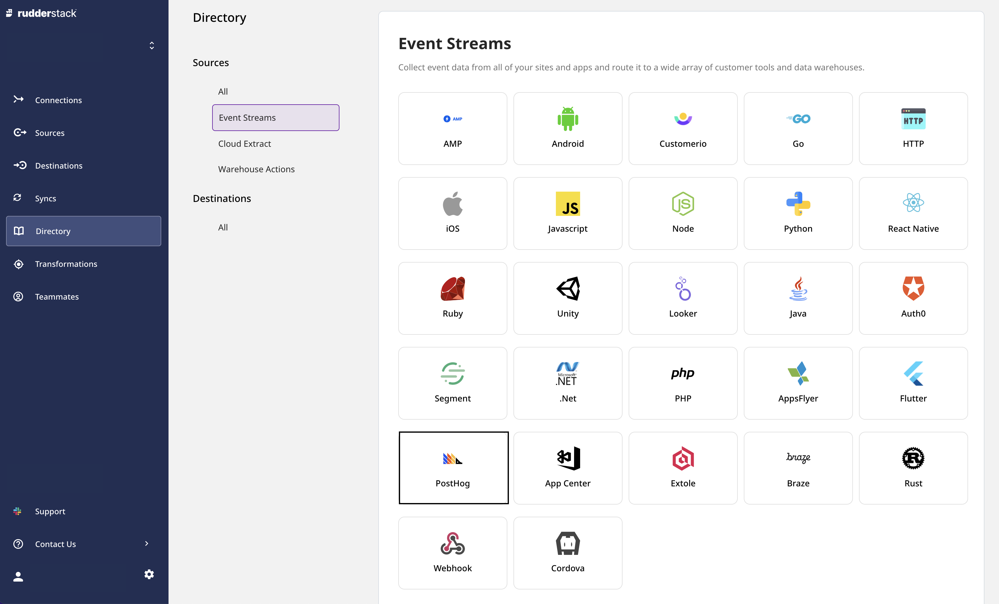
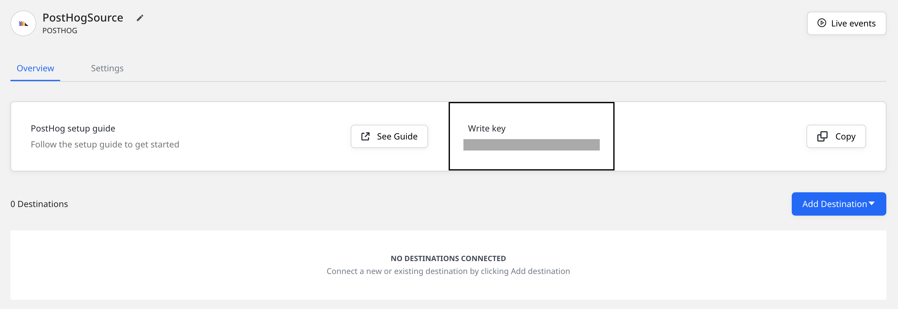
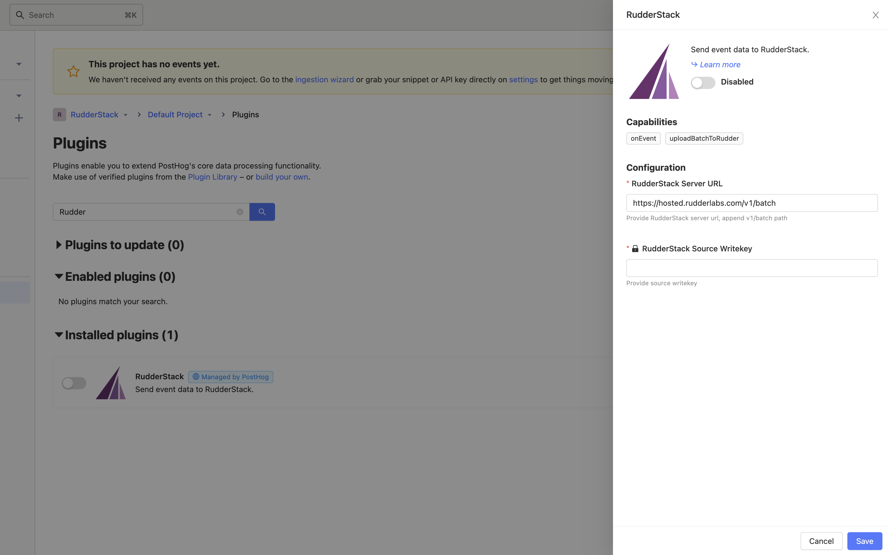

# PostHog

[**PostHog**](https://posthog.com/) is a complete product analytics stack that you can seamlessly deploy on your infrastructure. Built for both data analysts and managers, PostHog simplifies scalable product analytics, while giving you full control over all your user data.

RudderStack now supports PostHog as an Event Streams source. You can send your PostHog events to RudderStack by using the [ **RudderStack PostHog plugin**](https://github.com/rudderlabs/rudderstack-posthog-plugin).

## ‌Getting started

This section details the steps involved in setting up PostHog as a source in the RudderStack dashboard.

- Go to your [**RudderStack dashboard**](https://app.rudderstack.com/) and click on **Add Source**. Then, select **Extole** from the list of **Event Stream** sources, as shown:

- Assign a name to your source and click on **Next**.

- Your PostHog source is now configured. Note the source **Write key** - this will be required in the later steps.

## Setting up the RudderStack-PostHog plugin

Once you've successfully set up PostHog as a source on the RudderStack dashboard, follow these steps to configure and set up the PostHog-managed RudderStack plugin.

- Copy your PostHog source **Write key** from the RudderStack dashboard and your data plane URL.

For more information on the data plane URL and how to get it, refer to <a href="https://rudderstack.com/docs/get-started/installing-and-setting-up-rudderstack/#what-is-a-data-plane-url-where-do-i-get-it">this</a> section.

- Then, go to your PostHog dashboard and go to **Plugins**. In the search bar, type **RudderStack**.

- Configure this plugin using the write key and the data plane URL that you copied above. Append `v1/batch` to this URL so that it is of the format `https://<DATA_PLANE_URL>/v1/batch`.

If you are using RudderStack Cloud, the default RudderStack Server URL will be <code class="inline-code">https://hosted.rudderlabs.com/v1/batch</code>

- Finally, enable this plugin. Any events generated in your PostHog instance will now be automatically sent to RudderStack. You can then route these events to your specified destinations.

## License

The RudderStack PostHog Plugin is released under the [**MIT License**](https://opensource.org/licenses/MIT).

## Contact us

For queries on any of the sections covered in this guide, you can [**contact us**](mailto:%20docs@rudderstack.com) or start a conversation on our [**Slack**](https://rudderstack.com/join-rudderstack-slack-community) channel.