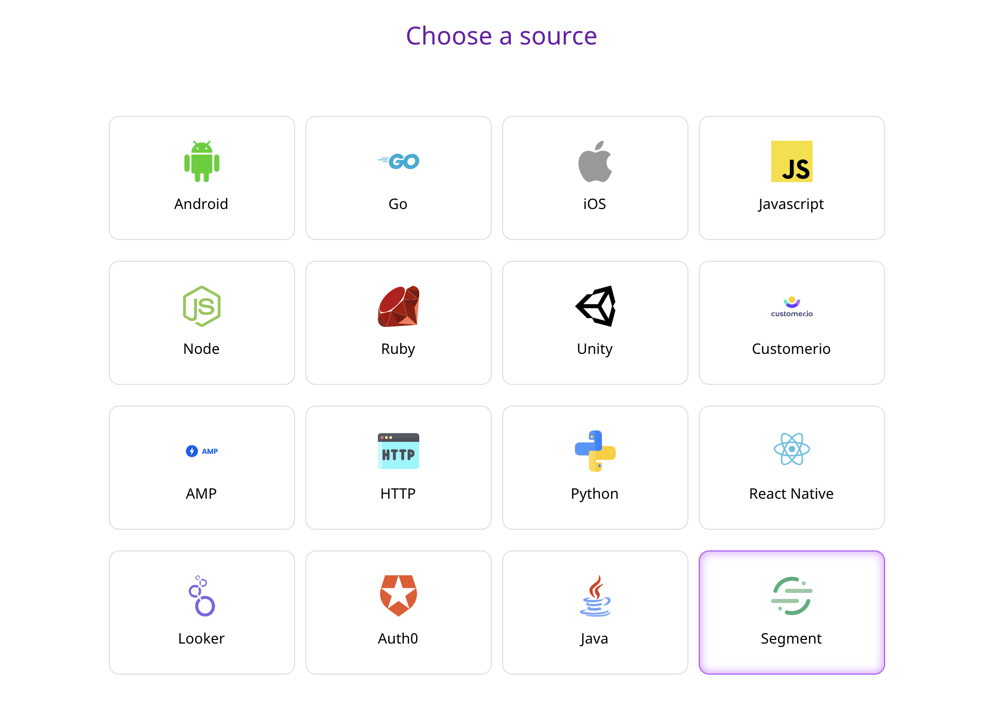
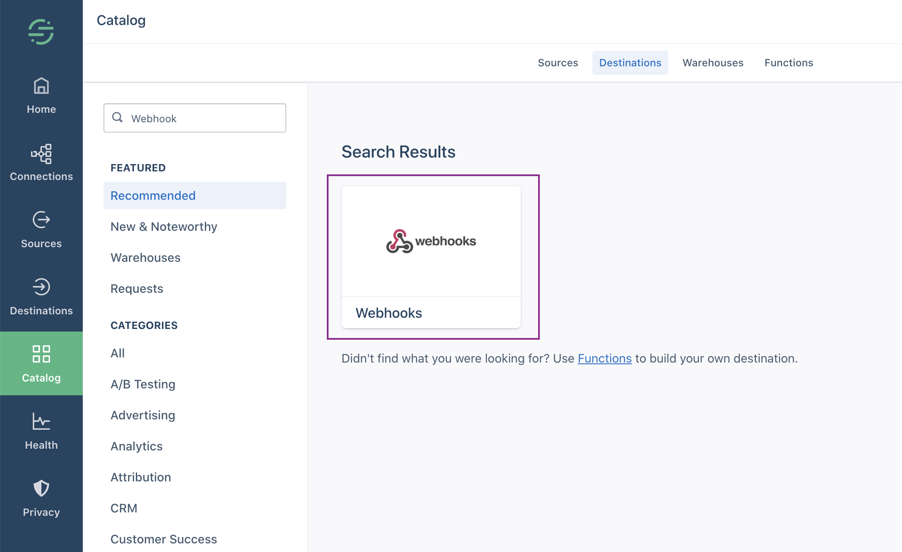
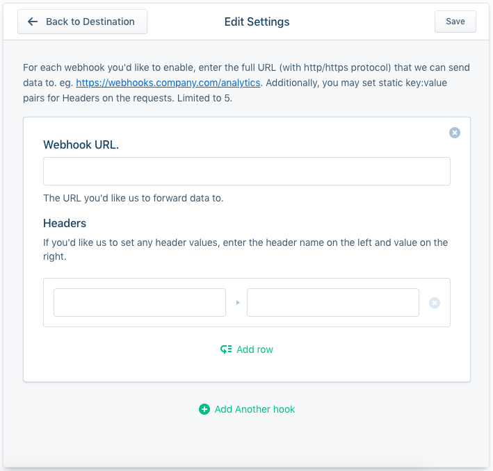

# Segment

[Segment](https://segment.com) is a Customer Data Platform \(CDP\) that allows you to collect your customer data, while giving you complete control over how you use it. It is a popular tool that is used by many businesses to collect and send event data to various platforms, including but not limited to -  Zendesk, Optimizely, and Google Analytics. Segment is a good option for companies that are sending data to several databases, and integrating with lots of different marketing tools.

This guide is aimed at setting up Segment as a source in RudderStack in the easiest possible way. You can simply add a webhook destination in your Segment dashboard that points to RudderStack. This way, you can send events to RudderStack whenever Segment gets an event.

## Getting Started

In order to add Segment as a source in RudderStack, please follow these steps:

* From your [RudderStack dashboard](https://app.rudderstack.com), click on **Add Source**. From the list of sources, select **Segment**, as shown:



* Enter the name you want to assign to this source.
* Once you have entered the name of your source, click on **Next** and save the source.
* Head over to your [Segment Dashboard](https://app.segment.com/workspaces) and navigate to the **Destinations** page from the sidebar. Click on **Add Destination**  and on the destination catalog page search for the destination **Webhooks**, as shown in the screenshot below:



* Now configure the destination and connect it to your desired source. On the destination settings screen, enter the RudderStack webhook. The following screenshot shows where to put the **Webhook URL:**



An example webhook URL is as follows:

```bash
https://hosted.rudderlabs.com/v1/webhook?writeKey=1bCenS7ynqHh8ETX8s5Crjh22J
```


Make sure you add the `writeKey` as a query parameter to the URL. This is required to prevent the webhook from failing for the lack of a valid write key.


## RudderStack Event Transformation

Being Segment API compatible, RudderStack does not perform any modifications on the data sent by Segment.

## Contact Us

If you come across any issues while configuring Segment as a source with RudderStack, please feel free to [contact us](mailto:%20docs@rudderstack.com). You can also start a conversation on our [Slack](https://resources.rudderstack.com/join-rudderstack-slack) channel; we will be happy to talk to you!

