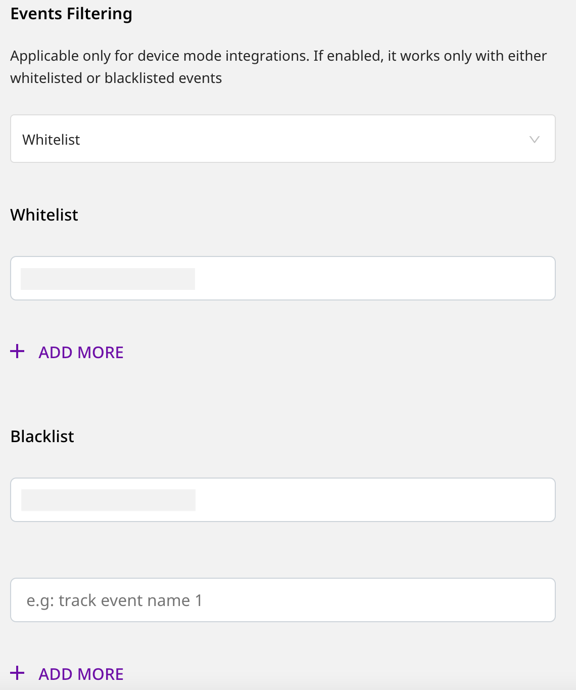

# Client-side Event Filtering

RudderStack's client-side event filtering feature lets you specify which events should be discarded or allowed to flow through by whitelisting or blacklisting them.

You can use this feature for all the RudderStack destinations that support sending events via the <a href="https://rudderstack.com/docs/connections/rudderstack-connection-modes/#device-mode">device mode</a>.

Client-side event filtering is applicable only for <code class="inline-code">track</code> calls. In case of mobile SDKs, it also applies to the following application lifecycle events:
  <ul>
    <li>Application Installed</li>
    <li>Application Opened</li>
    <li>Application Backgrounded</li>
    <li>Application Updated</li>
  </ul>

## Supported SDKs

The following source SDKs support this feature:

- [**Android**](https://rudderstack.com/docs/stream-sources/rudderstack-sdk-integration-guides/rudderstack-android-sdk/)
- [**iOS**](https://rudderstack.com/docs/stream-sources/rudderstack-sdk-integration-guides/rudderstack-ios-sdk/)
- [**React Native**](https://rudderstack.com/docs/stream-sources/rudderstack-sdk-integration-guides/rudderstack-react-native-sdk/)
- [**Flutter**](https://rudderstack.com/docs/stream-sources/rudderstack-sdk-integration-guides/rudderstack-flutter-sdk/)
- [**Cordova**](https://rudderstack.com/docs/stream-sources/rudderstack-sdk-integration-guides/rudderstack-cordova-sdk/)

## Event filtering options

RudderStack gives you the ability to configure your event filtering options while setting up your device mode destination in the dashboard, as shown:

You will see the following dropdown options under **Event Filtering**, in the **Connection Settings** page:

### Disable

Event filtering will be disabled if you select this option from the dropdown. In this case, RudderStack will not filter any events and allow all events to flow through.

### Whitelist

Upon selecting the **Whitelist** option from the dropdown, you can specify the names of the events that you want RudderStack to **allow** or flow through to the destination. 

If you choose the <strong>Whitelist</strong> option for event filtering, any events specified in the <strong>Blacklist</strong> field will be ignored.

You can add as many events as you want to the whitelist by clicking on the **Add More** option.

RudderStack will discard any event that is not specified in the whitelist. If you do not specify any events in the whitelist, <strong>all</strong> the calls will be discarded.

### Blacklist

Upon selecting the **Blacklist** option from the dropdown, you can specify the names of the events that you want RudderStack to **discard**. These events will not be sent to the destination.

If you choose the <strong>Blacklist</strong> option for event filtering, any events specified in the <strong>Whitelist</strong> field will be ignored.

You can add as many events as you want to the blacklist by clicking on the **Add More** option.

RudderStack will only discard the events explicitly specified in the blacklist. If you do not specify any events in the blacklist, then <strong>all</strong> the calls will be allowed to go through.

## Contact us

For queries on any of the sections covered in this guide, you can [**contact us**](mailto:%20docs@rudderstack.com) or start a conversation in our [**Slack**](https://rudderstack.com/join-rudderstack-slack-community) community.
