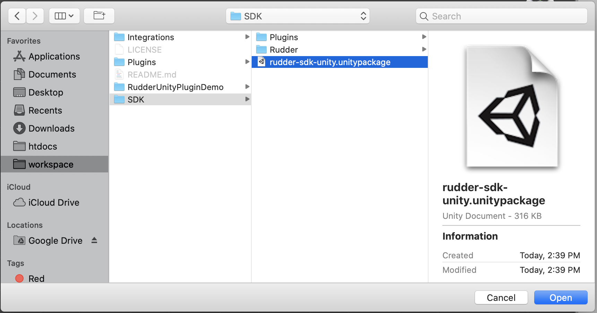
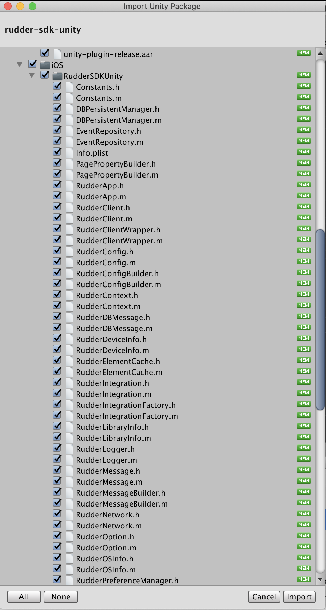

# Unity

## What is the RudderStack Unity SDK?

The RudderStack Unity SDK is a wrapper for the RudderStack [**Android SDK**](https://rudderstack.com/docs/stream-sources/rudderstack-sdk-integration-guides/rudderstack-android-sdk/) and [**iOS SDK**](https://rudderstack.com/docs/stream-sources/rudderstack-sdk-integration-guides/rudderstack-ios-sdk/) used for tracking game event data.

After integrating this SDK with your game, you will be able to track and send the game event data to any analytics destination of your choice.

<div class="successBlock">

  Check the <a href="https://github.com/rudderlabs/rudder-sdk-unity">Unity SDK codebase on GitHub</a> to get a more hands-on understanding of how it works.
</div>

## SDK Setup Requirements

To configure the Unity SDK, you will need the following:

- You will need to set up a [RudderStack account](https://app.rudderstack.com).
- Once signed up, set up a Unity source in the dashboard. For more information, follow [this guide](https://rudderstack.com/docs/connections/adding-source-and-destination-rudderstack/).  You should then see a **Write Key** for this source, as shown below:


- You will also need a data plane URL. Follow [this section](https://rudderstack.com/docs/get-started/installing-and-setting-up-rudderstack/#what-is-a-data-plane-url-where-do-i-get-it) for more information on the data plane URL and where to get it.

- Finally, you will need the [**Unity development kit**](https://store.unity.com/download).

## Adding Unity SDK to Your Project

- Download `rudder-sdk-unity.unitypackage` from our [**GitHub repository**](https://github.com/rudderlabs/rudder-sdk-unity/raw/master/SDK/rudder-sdk-unity.unitypackage).
- Import the downloaded package to your project. From the **Assets** menu, go to **Import Package** - **Custom Package...** as shown:


<span class="imageTitle">Importing the downloaded package</span>

- Select `rudder-sdk-unity.unitypackage` from the location where you have downloaded it and click on **Open**:



- Click on `Import` in the import popup as shown:



## Initializing RudderStack Client

To initialize the RudderStack client, follow these steps:

- Add the `import` to all the files where you wish to use `RudderClient` .

```csharp
using RudderStack;
```

- Then, add the following code in the `Awake` method of your main `GameObject` Script:

```csharp
// Critical for iOS Applications where multiple components are using SQLite
// This has no effect for Android, but can be added as a safety check
RudderClient.SerializeSqlite();

// Build your config
RudderConfigBuilder configBuilder = new RudderConfigBuilder()
    .WithDataPlaneUrl(DATA_PLANE_URL);

// get instance for RudderClient
RudderClient rudderClient = RudderClient.GetInstance(
    WRITE_KEY,
    configBuilder.Build()
);
```

<div class="warningBlock">

If you are building an iOS project, <code class="inline-code">RudderClient.SerializeSqlite()</code> is important to handle races with SQLite.

</div>

## Track

You can record the users' in-game activity through the `track` method. Every action performed by the user is called an event.

An example of a `track` event is as shown:

```csharp
// create event properties
Dictionary<string, object> eventProperties = new Dictionary<string, object>();
eventProperties.Add("test_key_1", "test_value_1");
eventProperties.Add("test_key_2", "test_value_2");

// create user properties
Dictionary<string, object> userProperties = new Dictionary<string, object>();
userProperties.Add("test_u_key_1", "test_u_value_1");
userProperties.Add("test_u_key_2", "test_u_value_2");

// create message to track
RudderMessageBuilder builder = new RudderMessageBuilder();
builder.WithEventName("test_event_name");
builder.WithUserId("test_user_id");
builder.WithEventProperties(eventProperties);
builder.WithUserProperties(userProperties);

rudderClient.Track(builder.Build());
```

```csharp
// create message to track
RudderMessageBuilder builder = new RudderMessageBuilder();
builder.WithEventName("test_event_name");
builder.WithUserId("test_user_id");
builder.WithEventProperty("foo", "bar");
builder.WithUserProperty("foo1", "bar1");

rudderClient.Track(builder.Build());
```

## Identify

The Unity SDK captures the `deviceId` and uses that as the `anonymousId` for identifying the user. It lets you track the users across the application installation.

To attach more information to the user, you can use the `identify` method. Once you set the `identify` information to the user, it will be passed to the successive `track` calls. To reset the user identification, use the `reset` method.

An example `identify` event is as shown:

```csharp
RudderMessage identifyMessage = new RudderMessageBuilder().Build();
RudderTraits traits = new RudderTraits().PutEmail("some@example.com");
rudderClient.Identify("some_user_id", traits, identifyMessage);
```

## Reset

The `reset` method clears all the persisted traits of the previously identified user.

```csharp
rudderClient.Reset();
```

## Upgrading the SDK

To upgrade the SDK, remove all the files related to the SDK from the `Plugins` folder. Also, remove the `Rudder` folder completely before importing a newer version of the SDK.

You can find the following files in the **Plugins** folder for the SDK:

- `Plugins/Android/unity-plugin-release.aar`
- `Plugins/iOS/RudderSDKUnity`

## Contact us

If you come across any issues while using the Unity SDK, you can [**contact us**](mailto:%20docs@rudderstack.com) or start a conversation on our [**Slack**](https://rudderstack.com/join-rudderstack-slack-community) channel. You can also open an issue on our [**GitHub**](https://github.com/rudderlabs/rudder-sdk-unity).
