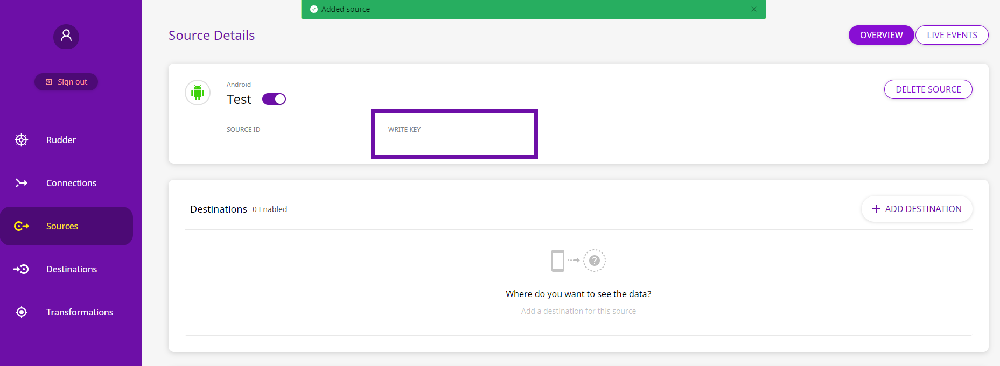

# Android

## What is the RudderStack Android SDK?

The RudderStack Android SDK allows you to track event data from your app. It can be easily integrated into your Android application. After integrating this SDK, you will also be able to send the event data to your preferred analytics destination/s such as Google Analytics, Amplitude, and more.

You can check the [GitHub codebase](https://github.com/rudderlabs/rudder-sdk-android) if you want to get more hands-on or keen to know the SDK architecture.

[  ](https://bintray.com/rudderstack/rudderstack/core/_latestVersion)

## SDK Setup Requirements

To set up the RudderStack Android SDK, there are a few prerequisites as mentioned below:

* You will need to set up a [RudderStack Account](https://app.rudderlabs.com).
* Once signed up, your `Android` source `writeKey` will appear in the Dashboard, as shown:



* You will also need your Data Plane URL. Simply put, the Data Plane URL is used to connect to the RudderStack backend for processing and routing your events.


To get the **Data Plane URL**:

* If you're using the **open-source** version of RudderStack, you are required to set up your own data plane by [installing and setting up RudderStack](https://docs.rudderstack.com/installing-and-setting-up-rudderstack) in your preferred dev environment.
* If you're using the **enterprise** version of RudderStack, please contact us for the data plane URL with the email ID used to sign up for RudderStack.


* You will also need to install [Android Studio](https://developer.android.com/studio) on your system.

## Installing the SDK


**As Bintray has a sunset from 1st may, we're moving our SDK to Maven Central". All the versions, 1.0.10 onwards are available in Maven Central only.**


We distribute our Android SDK through [Maven Central](https://search.maven.org). The recommended and easiest way to add the SDK to your project is through the Android Gradle build system.

Follow these steps:

* Open your project level `build.gradle` file, and add the following lines of code:

```groovy
buildscript {
    repositories {
        mavenCentral()
    }
}
allprojects {
    repositories {
        mavenCentral()
    }
}
```

* Then open your `app/build.gradle` and add the dependency under `dependencies` as shown below:

```groovy
implementation 'com.rudderstack.android.sdk:core:1+'
// add the following line if you don't have Gson included already
implementation 'com.google.code.gson:gson:2+'
```


It is recommended to use the Core Android SDK without any `device-mode` destination SDKs as you will have a better view on the captured data from the SDK.


## Setting Android Permission

Add this line to your `AndroidManifest.xml` file of your application for `internet` permission:

```markup
<uses-permission android:name="android.permission.INTERNET"/>
```

We also declare `android.permission.BLUETOOTH` and `android.permission.ACCESS_WIFI_STATE` as optional by mentioning `required="false"` . If we get these permissions, we'll capture the Bluetooth status and the WiFi status of the device and pass it under `context.network`.

## Initializing the RudderStack Client

Import the library on the classes you desire to use `RudderClient` library

```java
import com.rudderstack.android.sdk.core.*;
```

Add the following code to the `onCreate` method in your `Application` class:


Don't have an `Application` class? Follow our guide on [Adding an Application Class to Your Android Application](https://docs.rudderstack.com/rudderstack-sdk-integration-guides/rudderstack-android-sdk/add-an-application-class-to-you-android-application) to add one.




```kotlin
val rudderClient = RudderClient.getInstance(
    this,
    WRITE_KEY,
    RudderConfig.Builder()
        .withDataPlaneUrl(DATA_PLANE_URL)
        .withTrackLifecycleEvents(true)
        .withRecordScreenViews(true)
        .build()
)
```



```java
RudderClient rudderClient = RudderClient.getInstance(
        this,
        WRITE_KEY,
        new RudderConfig.Builder()
                .withDataPlaneUrl(DATA_PLANE_URL)
                .withTrackLifecycleEvents(true)
                .withRecordScreenViews(true)
                .build()
);
```




We automatically track the following optional events:

1. `Application Installed`
2. `Application Updated`
3. `Application Opened`
4. `Application Backgrounded`

You can disable these events using the `withTrackLifecycleEvents` method and passing `false`. But it is highly recommended to keep them enabled.


## Track

You can record the users' activity through the `track` method. Every action performed by the user is called an event.

An example of the `track` event is as shown:



```kotlin
rudderClient.track(
    "Product Added",
    RudderProperty()
        .putValue("product_id", "product_001")
)
```



```java
rudderClient.track(
        "Product Added",
        new RudderProperty()
                .putValue("product_id", "product_001")
);
```



Follow the method signature as below:

| Name | Data Type | Required | Description |
| :--- | :--- | :--- | :--- |
| `name` | `String` | Yes | Name of the event you want to track |
| `property` | `RudderProperty` or `Map<String, Object>` | No | Extra data properties you want to send along with the event |
| `options` | `RudderOption` | No | Extra event options |

## Identify

We capture `deviceId` and use that as `anonymousId` for identifying the user. It helps to track the users across the application installation. To attach more information to the user, you can use the `identify` method. Once you set the `identify` information to the user, those will be passed to the successive `track` or `screen` calls. To reset the user identification, you can use the `reset` method.


On the Android devices, the `deviceId` is assigned during the first boot. It remains consistent across the applications and installs. It changes only after factory reset.


An example `identify` event is as shown:



```kotlin
val traits = RudderTraits()
traits.putBirthday(Date())
traits.putEmail("abc@123.com")
traits.putFirstName("First")
traits.putLastName("Last")
traits.putGender("m")
traits.putPhone("5555555555")

val address = RudderTraits.Address()
address.putCity("City")
address.putCountry("USA")
traits.putAddress(address)

traits.put("boolean", Boolean.TRUE)
traits.put("integer", 50)
traits.put("float", 120.4f)
traits.put("long", 1234L)
traits.put("string", "hello")
traits.put("date", Date(System.currentTimeMillis()))

rudderClient.identify("test_user_id", traits, null)
```



```java
RudderTraits traits = new RudderTraits();
traits.putBirthday(new Date());
traits.putEmail("abc@123.com");
traits.putFirstName("First");
traits.putLastName("Last");
traits.putGender("m");
traits.putPhone("5555555555");

RudderTraits.Address address = new RudderTraits.Address();
address.putCity("City");
address.putCountry("USA");
traits.putAddress(address);

traits.put("boolean", Boolean.TRUE);
traits.put("integer", 50);
traits.put("float", 120.4f);
traits.put("long", 1234L);
traits.put("string", "hello");
traits.put("date", new Date(System.currentTimeMillis()));

rudderClient.identify("test_user_id", traits, null;
```



Follow the method signatures below:

| Name | Data Type | Required | Description |
| :--- | :--- | :--- | :--- |
| `traits` | `RudderTraits` | Yes | Traits information for the user |
| `options` | `RudderOption` | No | Extra options for the `identify` event |

**OR**

| Name | Data Type | Required | Description |
| :--- | :--- | :--- | :--- |
| `userId` | `String` | Yes | Developer identity for the user |
| `traits` | `RudderTraits` | No | Traits information for user |
| `option` | `RudderOption` | No | Extra options for the `identify` event |

## Screen

You can use the `screen` call to record whenever the user sees a screen on the mobile device. You can also send some extra properties along with this event.

An example of the `screen` event is as shown:



```kotlin
rudderClient.screen(
    "MainActivity",
    "HomeScreen",
    RudderProperty().putValue("foo", "bar"),
    null
)
```



```java
rudderClient.screen(
    "MainActivity",
    "HomeScreen",
    new RudderProperty().putValue("foo", "bar"),
    null
);
```



Follow the method signature below:

| Name | Data Type | Required | Description |
| :--- | :--- | :--- | :--- |
| `screenName` | `String` | Yes | Name of the screen viewed. |
| `category` | `String` | No | Category of the screen visited, such as `HomeScreen`, `LoginScreen`. Useful for tracking multiple `Fragment` views under a single `Activity`. |
| `property` | `RudderProperty` | No | Extra property object that you want to pass along with the `screen` call. |
| `option` | `RudderOption` | No | Extra options to be passed along with `screen` event. |

## Group

The `group` call associates a user to a specific organization. A sample `group` call for the API is below:



```kotlin
rudderClient.group(
    "sample_group_id",
    RudderTraits().putAge("24")
        .putName("Test Group Name")
        .putPhone("1234567891")
)
```



```java
rudderClient.group(
    "sample_group_id",
    new RudderTraits().putAge("24")
        .putName("Test Group Name")
        .putPhone("1234567891")
);
```



Follow the method signatures below:

| Name | Data Type | Required | Description |
| :--- | :--- | :--- | :--- |
| `groupId` | `String` | Yes | An ID of the organization with which you want to associate your user |
| `traits` | `RudderTraits` | No | Any other property of the organization you want to pass along with the call |
| `options` | `RudderOption` | No | Event level options |

We don't persist the traits for the group across the sessions

## Alias

The `alias` call associates the user with a new identification. A sample `alias` call for the API is below:



```kotlin
rudderClient.alias("test_new_id")
```



```java
rudderClient.alias("test_new_id");
```



Alternatively, you can use the following method signature

| Name | Data Type | Required | Description |
| :--- | :--- | :--- | :--- |
| `newId` | `String` | Yes | The new `userId` you want to assign to the user |
| `options` | `RudderOption` | No | Event level option |

We replace the old `userId` with the `newUserId` and we persist that identification across the sessions.

## Reset

You can use the `reset` method to clear the persisted `traits` for the `identify` call. This is required for `Logout` operations.



```kotlin
rudderClient.reset()
```



```java
rudderClient.reset();
```



## Configuring your RudderStack Client

You can configure your client based on the following parameters using `RudderConfig.Builder`:

| Parameter | Type | Description | Default Value |
| :--- | :--- | :--- | :--- |
| `logLevel` | `int` | Controls how much of the log you want to see from the SDK. | `RudderLogger.RudderLogLevel.NONE` |
| `dataPlaneUrl` | `string` | URL of your `data-plane`. Please refer above to see how to fetch the data plane URL. | [https://api.rudderlabs.com](https://api.rudderlabs.com) |
| `flushQueueSize` | `int` | Number of events in a batch request to the server. | `30` |
| `dbThresholdCount` | `int` | Number of events to be saved in the `SQLite` database. Once the limit is reached, older events are deleted from the DB. | `10000` |
| `sleepTimeout` | `int` | Minimum waiting time to flush the events to the server. | `10 seconds` |
| `configRefreshInterval` | `int` | It will fetch the config from `dashboard` after this many hours. | `2` |
| `trackLifecycleEvents` | `boolean` | Whether SDK will capture application life cycle events automatically. | `true` |
| `recordScreenViews` | `boolean` | Whether SDK will capture screen view events automatically. | `false` |
| `controlPlaneUrl` | `string` | This parameter should be changed **only if** you are self-hosting the Control Plane. Check the section **Self-Hosted Control Plane** below for more information. The SDK will add `/sourceConfig` along with this URL to fetch the configuration. | [https://api.rudderlabs.com](https://api.rudderlabs.com) |

### Self-Hosted Control Plane

If you are using a device mode destination like Adjust, Firebase, etc., the Android SDK needs to fetch the required configuration from the Control Plane. If you are using the RudderStack Config Generator to host your own Control Plane, then follow [this guide](https://docs.rudderstack.com/how-to-guides/rudderstack-config-generator#what-is-the-control-plane-url) and specify `controlPlaneUrl` in your`RudderConfig.Builder` that points to your hosted source configuration file.


You shouldn't pass the `controlPlaneUrl` parameter during SDK initialization if you are using the dashboard from [https://app.rudderstack.com](https://app.rudderstack.com). This parameter is supported only if you are using our open-source [RudderStack Config Generator](https://docs.rudderstack.com/how-to-guides/rudderstack-config-generator).


## Setting Android Device Token

You can set your `device-token` for push notification to be sent to the destinations that support Push Notification. We set the `token` under `context.device.token`.

Follow the code snippets below:



```bash
rudderClient.putDeviceToken("your_device_token")
```



```bash
rudderClient.putDeviceToken("your_device_token");
```



## Advertisement ID

We collect the `advertisementId` if it is enabled by the user and the App has the Google Play services Ads SDK embedded in the application. We set the `gaid` under `context.device.advertisementId`.

Apart from it, if you want to set the `advertisingId` by yourself, you can do so using the `updateWithAdvertisingId` method and passing the `advertisingId`.


You need to call `updateWithAdvertisingId` method before calling `getInstance`


An example of setting the `advertisingId` is as below

```java
RudderClient.updateWithAdvertisingId(<ADVERTISING_ID>);
```

## Anonymous ID

We use the `deviceId` as `anonymousId` by default. You can use the following method to override and use your own `anonymousId` with the SDK.


You need to call `setAnonymousId` method before calling `getInstance`


An example of setting the `anonymousId` is as below

```java
RudderClient.setAnonymousId(<ANONYMOUS_ID>);
```

To retrieve the `anonymousId` you can use the following method:

```java
RudderClient.getAnonymousId();
```


The method `getAnonymousId` is available from v1.0.11 onwards.


## Enabling / Disabling Events for Specific Destinations

The RudderStack Android SDK allows you to enable or disable event flow to a specific destination or all the destinations to which the source is connected. You can specify these destinations by creating a `RudderOption` object as shown:



```kotlin
val option = RudderOption()
//default value for `All` is true
option.putIntegration("All", false) 
// specifying destination by its display name
option.putIntegration("Google Analytics", true)
option.putIntegration(<DESTINATION DISPLAY NAME>, <boolean>)
// specifying destination by its Factory object
option.putIntegration(AppcenterIntegrationFactory.FACTORY,true);
option.putIntegration(<RudderIntegration.FACTORY>,<boolean>);
```



```java
RudderOption option = new RudderOption();
// default value for `All` is true
option.putIntegration("All", false); 
// specifying destination by its display name
option.putIntegration("Google Analytics", true);
option.putIntegration(<DESTINATION DISPLAY NAME>, <boolean>);
// specifying destination by its Factory object
option.putIntegration(AppcenterIntegrationFactory.FACTORY,true);
option.putIntegration(<RudderIntegration.FACTORY>,<boolean>);
```




The keyword `All` in the above snippet represents all the destinations the source is connected to. Its value is set to `true` by default.



Make sure the `destination display name` that you pass while specifying the destinations should exactly match the destination name as shown [here](https://app.rudderstack.com/directory).


You can pass the destination\(s\) specified in the above snippet to the SDK in two ways:

### 1. Passing the destinations while initializing the SDK:

This is helpful when you want to enable/disable sending the events across all the event calls made using the SDK to the specified destination\(s\).



```kotlin
var rudderClient = RudderClient.getInstance(
            this,
            <WRITE_KEY>,
            RudderConfig.Builder()
                .withDataPlaneUrl(<DATA_PLANE_URL>)
                .withLogLevel(RudderLogger.RudderLogLevel.DEBUG)
                .withTrackLifecycleEvents(false)
                .withRecordScreenViews(false)
                .build(), 
            option // passing the rudderoption object containing the list of destination(s) you specified
        )
```



```java
RudderClient client = RudderClient.getInstance(
                this,
                <WRITE_KEY>,
                new RudderConfig.Builder()
                        .withEndPointUri(<END_POINT_URL>)
                        .build(),
                option // passing the rudderoption object containing the list of destination(s) you specified
        );
```



### 2. Passing the destinations while making any event call:

This approach is helpful when you want to enable/disable sending only a particular event to the specified destination\(s\) or if you want to override the specified destinations passed with the SDK initialization for a particular event.



```kotlin
rudderClient.track(
                    "Product Added",
                    RudderProperty()
                            .putValue("product_id", "product_001"),
                    option // passing the rudderoption object containing the list of destination you specified
            )
```



```java
rudderClient.track(
                "Product Added",
                new RudderProperty()
                        .putValue("product_id", "product_001"), 
                option // passing the rudderoption object containing the list of destination(s) you specified
        );
```




If you specify the destinations both while initializing the SDK as well as while making an event call, then the destinations specified at the event level only will be considered.


## External ID

You can pass your custom `userId` along with standard `userId` in your `identify` calls. We add those values under `context.externalId`. The following code snippet shows a way to add `externalId` to your `identify` request.

```bash
rudderClient.identify(
    "sampleUserId",
    RudderTraits().putFirstName("First Name"),
    RudderOption()
        .putExternalId("brazeExternalId", "some_external_id")
)
```

## Debugging

If you run into any issues regarding the RudderStack Android SDK, you can turn on the `VERBOSE` or `DEBUG` logging to find out what the issue is. To turn on the logging, change your `RudderClient` initialization to the following:



```kotlin
val rudderClient: RudderClient = RudderClient.getInstance(
    this,
    YOUR_WRITE_KEY,
    RudderConfig.Builder()
        .withDataPlaneUrl(DATA_PLANE_URL)
        .withLogLevel(RudderLogger.RudderLogLevel.DEBUG)
        .build()
)
```



```java
RudderClient rudderClient = RudderClient.getInstance(
    this,
    YOUR_WRITE_KEY,
    new RudderConfig.Builder()
        .withDataPlaneUrl(DATA_PLANE_URL)
        .withLogLevel(RudderLogger.RudderLogLevel.DEBUG)
        .build()
);
```



## FAQs

### Do I need to add anything to my progaurd-rules?

If you are facing any issue regarding even delivery in production environment, add the following line in your progaurd rule.

```java
-keep class com.rudderstack.android.** { *; }
```

### **What is the Android version required to set up the RudderStack Android SDK?**

We currently support `API 14: Android 4.0 (IceCreamSandwich)` or higher.

### I don't have an `Application` class to initialize my RudderStack client. What do I do?

Please follow our guide on [How to Add an Application Class to Your Android App](https://docs.rudderstack.com/rudderstack-sdk-integration-guides/rudderstack-android-sdk/add-an-application-class-to-you-android-application) to add an `Application` class.

### How do I set the Android permissions?

Please refer to the [Setting the Android Permission](https://docs.rudderstack.com/rudderstack-sdk-integration-guides/rudderstack-android-sdk#setting-the-android-permission) section above to do this.

### Can I use the library with Maven?

Yes, you can use the library with `maven`.

```markup
<dependency>
  <groupId>com.rudderstack.android.sdk</groupId>
  <artifactId>core</artifactId>
  <version>latest_version</version>
  <type>pom</type>
</dependency>
```

### How do I check whether a specific event is getting fired or not?

You can try searching in the Logcat using the following command once you set the `logLevel` to `VERBOSE`

```bash
adb logcat -s RudderSDK:V \
    -v tag -e "EventRepository: dump: message:"
```

## Contact Us

In case of any queries, you can always [contact us](mailto:%20docs@rudderstack.com), or open an issue [on our GitHub Issues page](https://github.com/rudderlabs/rudder-sdk-android/issues) in case of any discrepancy.

