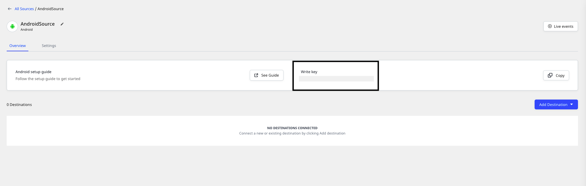

# Android

The **RudderStack Android SDK** lets you track event data from your Android applications and send it to your specified destinations via RudderStack.

You can check the [**GitHub codebase**](https://github.com/rudderlabs/rudder-sdk-android) to get more a hands-on understanding of the SDK and its architecture.


## SDK setup requirements

To set up the RudderStack Android SDK, the following prerequisites must be met:

- You will need to set up a [**RudderStack account**](https://app.rudderstack.com).
- Once signed up, set up an Android source in the dashboard. For more information, follow [**this guide**](https://rudderstack.com/docs/connections/adding-source-and-destination-rudderstack/).  You should then see a **Write Key** for this source, as shown below:



- You will also need a data plane URL. Follow [**this section**](https://rudderstack.com/docs/get-started/installing-and-setting-up-rudderstack/#what-is-a-data-plane-url-where-do-i-get-it) for more information on the data plane URL and where to get it.

- Finally, you will also need to install [**Android Studio**](https://developer.android.com/studio) on your system.

## Installing the SDK

<div class="infoBlock">

<strong>As Bintray has sunset from 1st May, we're moving the Android SDK to Maven Central. All the versions from 1.0.10 are available in Maven Central only.</strong>
</div>

We distribute the Android SDK through [**Maven Central**](https://search.maven.org). The recommended and easiest way to add the SDK to your project is through the Android Gradle build system.

Follow these steps:

- Open your project level `build.gradle` file, and add the following lines of code:

```groovy
buildscript {
    repositories {
        mavenCentral()
    }
}
allprojects {
    repositories {
        mavenCentral()
    }
}
```

- Then open your `app/build.gradle` and add the dependency under `dependencies` as shown below:

```groovy
implementation 'com.rudderstack.android.sdk:core:1+'
// add the following line if you don't have Gson included already
implementation 'com.google.code.gson:gson:2+'
```

<div class="infoBlock">

It is recommended to use the Core Android SDK without any <code class="inline-code">device-mode</code> destination SDKs as you will have a better view on the captured data from the SDK.

</div>

## Using the Android SDK on applications with `minSDKVersion` less than `20`

By default, the Android SDK does not support applications with `minSDKVersion` less than `20`. You can add this support by following the steps below:

- Add the following dependency to the `build.gradle` file of your application:

```groovy
implementation 'com.google.android.gms:play-services-base:17.6.0'
```

- Add the function `tlsBackport()` in your `MainActivity` as shown:

```kotlin
private fun tlsBackport() {
        try {
            ProviderInstaller.installIfNeeded(this)
            Log.e("Rudder", "Play present")
            val sslContext: SSLContext = SSLContext.getInstance("TLSv1.2")
            sslContext.init(null, null, null)
            sslContext.createSSLEngine()
        } catch (e: GooglePlayServicesRepairableException) {
            // Prompt the user to install/update/enable Google Play services.
            GoogleApiAvailability.getInstance()
                .showErrorNotification(this, e.connectionStatusCode)
            Log.e("Rudder", "Play install")
        } catch (e: GooglePlayServicesNotAvailableException) {
            // Indicates a non-recoverable error: let the user know.
            Log.e("SecurityException", "Google Play Services not available.");
            e.printStackTrace()
        }
    }
```

- Finally, call the `tlsBackport()` function at the very beginning of your `onCreate()` method in `MainActivity`.

```kotlin
override fun onCreate(savedInstanceState: Bundle?) {
        super.onCreate(savedInstanceState)
        setContentView(R.layout.activity_main)
        if (Build.VERSION.SDK_INT <= Build.VERSION_CODES.KITKAT) {
            tlsBackport()
        }
    }
```

<div class="infoBlock">
  
  For more details, refer to this <a href="https://developer.android.com/reference/javax/net/ssl/SSLSocket.html#protocols">Android documentation</a>.
</div>

## Setting Android Permission

Add this line to your `AndroidManifest.xml` file of your application for `internet` permission:

```markup
<uses-permission android:name="android.permission.INTERNET"/>
```

We also declare `android.permission.BLUETOOTH` and `android.permission.ACCESS_WIFI_STATE` as optional by mentioning `required="false"` . If we get these permissions, we'll capture the Bluetooth status and the WiFi status of the device and pass it under `context.network`.

## Initializing the RudderStack client

Import the library on the classes you desire to use `RudderClient` library

```java
import com.rudderstack.android.sdk.core.*;
```

Add the following code to the `onCreate` method in your `Application` class:

<div class="infoBlock">

Follow our guide on <a href="https://rudderstack.com/docs/stream-sources/rudderstack-sdk-integration-guides/rudderstack-android-sdk/add-an-application-class-to-you-android-application">Adding an Application Class to Your Android Application</a> for more information.
</div>

<Tabs>
  <TabList>
    <Tab>Kotlin</Tab>
    <Tab>JAVA</Tab>
  </TabList>
    <TabPanels>
      <TabPanel>
<span>

```kotlin
val rudderClient = RudderClient.getInstance(
    this,
    WRITE_KEY,
    RudderConfig.Builder()
        .withDataPlaneUrl(DATA_PLANE_URL)
        .withTrackLifecycleEvents(true)
        .withRecordScreenViews(true)
        .build()
)
```
</span>
      </TabPanel>
      <TabPanel>
<span>

```java
RudderClient rudderClient = RudderClient.getInstance(
        this,
        WRITE_KEY,
        new RudderConfig.Builder()
                .withDataPlaneUrl(DATA_PLANE_URL)
                .withTrackLifecycleEvents(true)
                .withRecordScreenViews(true)
                .build()
);
```
</span>
      </TabPanel>
    </TabPanels>
</Tabs>

<div class="infoBlock">

We automatically track the following optional events:
<ol>
<li><code class="inline-code">Application Installed</code></li>
<li><code class="inline-code">Application Updated</code></li>
<li><code class="inline-code">Application Opened</code></li>
<li><code class="inline-code">Application Backgrounded</code></li>
</ol>
You can disable these events using the <code class="inline-code">withTrackLifecycleEvents</code> method and passing <code class="inline-code">false</code>. But it is highly recommended to keep them enabled.

</div>

## Enabling/disabling user tracking via the optOut API \(GDPR Support\)

RudderStack gives the users \(e.g., an EU user\) the ability to opt out of tracking any user activity until the user gives their consent. You can do this by leveraging RudderStack's `optOut` API.

The `optOut` API takes `true` or `false` as a Boolean value to enable or disable tracking user activities. This flag persists across device reboots.

The following snippet highlights the use of the `optOut` API to disable user tracking:

<Tabs>
  <TabList>
    <Tab>Kotlin</Tab>
    <Tab>JAVA</Tab>
  </TabList>
    <TabPanels>
      <TabPanel>
<span>

```kotlin
rudderClient.optOut(true)
```
</span>
      </TabPanel>
      <TabPanel>
<span>

```java
rudderClient.optOut(true);
```
</span>
      </TabPanel>
    </TabPanels>
</Tabs>

Once the user grants their consent, you can enable user tracking once again by using the `optOut` API with `false` as a parameter sent to it, as shown:

<Tabs>
  <TabList>
    <Tab>Kotlin</Tab>
    <Tab>JAVA</Tab>
  </TabList>
    <TabPanels>
      <TabPanel>
<span>

```kotlin
rudderClient.optOut(false)
```
</span>
      </TabPanel>
      <TabPanel>
<span>

```java
rudderClient.optOut(false);
```
</span>
      </TabPanel>
    </TabPanels>
</Tabs>

<div class="infoBlock">

The `optOut` API is available in the RudderStack Android SDK from version `1.0.21`.
</div>

## Chromecast

[**Google Chromecast**](https://store.google.com/in/product/chromecast?hl=en-GB) is a device that plugs into your TV or monitor with an HDMI port, and can be used to stream content from your phone or computer.

<div class="successBlock">

RudderStack supports integrating the Android SDK with your Cast app. Follow <a href="https://developers.google.com/cast/docs/android_sender">these instructions</a> to build your Android sender app. Then, add the Android SDK to it.
</div>

<div class="infoBlock">

  Follow the <a href="https://developers.google.com/cast/docs/developers">Google Cast developer guide</a> for more details.
</div>

## Track

You can record the users' activity through the `track` method. Every user action is called an **event**.

A sample `track` event is as shown below:

<Tabs>
  <TabList>
    <Tab>Kotlin</Tab>
    <Tab>JAVA</Tab>
  </TabList>
    <TabPanels>
      <TabPanel>
<span>

```kotlin
rudderClient.track(
    "Product Added",
    RudderProperty()
        .putValue("product_id", "product_001")
)
```
</span>
      </TabPanel>
      <TabPanel>
<span>

```java
rudderClient.track(
        "Product Added",
        new RudderProperty()
                .putValue("product_id", "product_001")
);
```
</span>
      </TabPanel>
    </TabPanels>
</Tabs>

Follow the method signature as below:

| Name       | Data Type                                 | Required | Description                                                 |
| :--------- | :---------------------------------------- | :------- | :---------------------------------------------------------- |
| `name`     | `String`                                  | Yes      | Name of the event you want to track                         |
| `property` | `RudderProperty` or `Map<String, Object>` | No       | Extra data properties you want to send along with the event |
| `options`  | `RudderOption`                            | No       | Extra event options                                         |

## Identify

We capture `deviceId` and use that as `anonymousId` for identifying the user. It helps to track the users across the application installation. To attach more information to the user, you can use the `identify` method. Once you set the `identify` information to the user, those will be passed to the successive `track` or `screen` calls. To reset the user identification, you can use the `reset` method.

<div class="infoBlock">

On the Android devices, the <code class="inline-code">deviceId</code> is assigned during the first boot. It remains consistent across the applications and installs. It changes only after factory reset.
</div>

An sample `identify` event is as shown:

<Tabs>
  <TabList>
    <Tab>Kotlin</Tab>
    <Tab>JAVA</Tab>
  </TabList>
    <TabPanels>
      <TabPanel>
<span>

```kotlin
val traits = RudderTraits()
traits.putBirthday(Date())
traits.putEmail("abc@123.com")
traits.putFirstName("First")
traits.putLastName("Last")
traits.putGender("m")
traits.putPhone("5555555555")
val address = RudderTraits.Address()
address.putCity("City")
address.putCountry("USA")
traits.putAddress(address)
traits.put("boolean", Boolean.TRUE)
traits.put("integer", 50)
traits.put("float", 120.4f)
traits.put("long", 1234L)
traits.put("string", "hello")
traits.put("date", Date(System.currentTimeMillis()))
rudderClient.identify("test_user_id", traits, null)
```
</span>
      </TabPanel>
      <TabPanel>
<span>

```java
RudderTraits traits = new RudderTraits();
traits.putBirthday(new Date());
traits.putEmail("abc@123.com");
traits.putFirstName("First");
traits.putLastName("Last");
traits.putGender("m");
traits.putPhone("5555555555");
RudderTraits.Address address = new RudderTraits.Address();
address.putCity("City");
address.putCountry("USA");
traits.putAddress(address);
traits.put("boolean", Boolean.TRUE);
traits.put("integer", 50);
traits.put("float", 120.4f);
traits.put("long", 1234L);
traits.put("string", "hello");
traits.put("date", new Date(System.currentTimeMillis()));
rudderClient.identify("test_user_id", traits, null);
```
</span>
      </TabPanel>
    </TabPanels>
</Tabs>

Follow the method signatures below:

| Name      | Data Type      | Required | Description                            |
| :-------- | :------------- | :------- | :------------------------------------- |
| `traits`  | `RudderTraits` | Yes      | Traits information for the user        |
| `options` | `RudderOption` | No       | Extra options for the `identify` event |

**OR**

| Name     | Data Type      | Required | Description                            |
| :------- | :------------- | :------- | :------------------------------------- |
| `userId` | `String`       | Yes      | Developer identity for the user        |
| `traits` | `RudderTraits` | No       | Traits information for user            |
| `option` | `RudderOption` | No       | Extra options for the `identify` event |

## Screen

You can use the `screen` call to record whenever the user sees a screen on the mobile device. You can also send some extra properties along with this event.

An example of the `screen` event is as shown:

<Tabs>
  <TabList>
    <Tab>Kotlin</Tab>
    <Tab>JAVA</Tab>
  </TabList>
    <TabPanels>
      <TabPanel>
<span>

```kotlin
rudderClient.screen(
    "MainActivity",
    "HomeScreen",
    RudderProperty().putValue("foo", "bar"),
    null
)
```
</span>
      </TabPanel>
      <TabPanel>
<span>

```java
rudderClient.screen(
    "MainActivity",
    "HomeScreen",
    new RudderProperty().putValue("foo", "bar"),
    null
);
```
</span>
      </TabPanel>
    </TabPanels>
</Tabs>

Follow the method signature below:

| Name         | Data Type        | Required | Description                                                                                                                                   |
| :----------- | :--------------- | :------- | :-------------------------------------------------------------------------------------------------------------------------------------------- |
| `screenName` | `String`         | Yes      | Name of the screen viewed.                                                                                                                    |
| `category`   | `String`         | No       | Category of the screen visited, such as `HomeScreen`, `LoginScreen`. Useful for tracking multiple `Fragment` views under a single `Activity`. |
| `property`   | `RudderProperty` | No       | Extra property object that you want to pass along with the `screen` call.                                                                     |
| `option`     | `RudderOption`   | No       | Extra options to be passed along with `screen` event.                                                                                         |

## Group

The `group` call associates a user to a specific organization. A sample `group` call for the API is below:

<Tabs>
  <TabList>
    <Tab>Kotlin</Tab>
    <Tab>JAVA</Tab>
  </TabList>
    <TabPanels>
      <TabPanel>
<span>

```kotlin
rudderClient.group(
    "sample_group_id",
    RudderTraits().putAge("24")
        .putName("Test Group Name")
        .putPhone("1234567891")
)
```
</span>
      </TabPanel>
      <TabPanel>
<span>

```java
    rudderClient.group(
        "sample_group_id",
        new RudderTraits().putAge("24")
            .putName("Test Group Name")
            .putPhone("1234567891")
    );
```
</span>
      </TabPanel>
    </TabPanels>
</Tabs>


Follow the method signatures below:

| Name      | Data Type      | Required | Description                                                                 |
| :-------- | :------------- | :------- | :-------------------------------------------------------------------------- |
| `groupId` | `String`       | Yes      | An ID of the organization with which you want to associate your user        |
| `traits`  | `RudderTraits` | No       | Any other property of the organization you want to pass along with the call |
| `options` | `RudderOption` | No       | Event level options                                                         |

<div class="infoBlock">

RudderStack doesn't persist the traits for the group across the sessions.
</div>

## Alias

The `alias` call associates the user with a new identification. A sample `alias` call for the API is below:

<Tabs>
  <TabList>
    <Tab>Kotlin</Tab>
    <Tab>JAVA</Tab>
  </TabList>
    <TabPanels>
      <TabPanel>
<span>

```kotlin
rudderClient.alias("test_new_id")
```
</span>
      </TabPanel>
      <TabPanel>
<span>

```java
rudderClient.alias("test_new_id");
```
</span>
      </TabPanel>
    </TabPanels>
</Tabs>

Alternatively, you can use the following method signature

| Name      | Data Type      | Required | Description                                     |
| :-------- | :------------- | :------- | :---------------------------------------------- |
| `newId`   | `String`       | Yes      | The new `userId` you want to assign to the user |
| `options` | `RudderOption` | No       | Event level option                              |

We replace the old `userId` with the `newUserId` and we persist that identification across the sessions.

## Reset

You can use the `reset` method to clear the persisted `traits` for the `identify` call. This is required for `Logout` operations.

<Tabs>
  <TabList>
    <Tab>Kotlin</Tab>
    <Tab>JAVA</Tab>
  </TabList>
    <TabPanels>
      <TabPanel>
<span>

```kotlin
rudderClient.reset()
```
</span>
      </TabPanel>
      <TabPanel>
<span>

```java
rudderClient.reset();
```
</span>
      </TabPanel>
    </TabPanels>
</Tabs>

## Configuring your RudderStack client

You can configure your client based on the following parameters using `RudderConfig.Builder`:

| Parameter               | Type      | Description                | Default value                                            |
| :---------------------- | :-------- | :--------------------- | :------------------------------- |
| `logLevel`              | Integer     | Controls how much of the log you want to see from the SDK.           | `RudderLogger.RudderLogLevel.NONE`                       |
| `dataPlaneUrl`          | String  | Your data plane URL.                                                             | `https://hosted.rudderlabs.com` |
| `flushQueueSize`        | Integer     | Number of events in a batch request to the RudderStack server.              | `30`                                                     |
| `dbThresholdCount`      | Integer     | Number of events to be saved in the `SQLite` database. Once the limit is reached, older events are deleted from the database.                          | `10000`                                                  |
| `sleepcount`          | Integer     | Minimum waiting time to flush the events to the RudderStack server. The minimum value can be set to `1 second`.      | `10 seconds`                                             |
| `configRefreshInterval` | Integer     | The SDK will fetch the config from `dashboard` after the specified time          | `2 hours`       |
| `trackLifecycleEvents`  | Boolean | Determines if the SDK will automatically capture the application lifecycle events.                     | `true`                                                   |
| `recordScreenViews`     | Boolean | Determines if the SDK will automatically capture the screen view events.                   | `false`            |
| `autoCollectAdvertId`  | Boolean | Determines if the SDK will collect the advertisement ID.  | `false` |
| `controlPlaneUrl`       | String  | Change this parameter **only if** you are self-hosting the control plane. Check the [Self-hosted control plane](#self-hosted-control-plane) section below for more information. The SDK will add `/sourceConfig` along with this URL to fetch the source configuration. | [https://api.rudderlabs.com](https://api.rudderlabs.com) |

A sample code snippet to configure your client using `RudderConfig.Builder` is shown below:

```kotlin
rudderClient = RudderClient.getInstance(
  this,
  <WRITE_KEY>,
  RudderConfig.Builder()
  .withDataPlaneUrl(<DATA_PLANE_URL>)
  .withSleepCount(1)
  .withLogLevel(RudderLogger.RudderLogLevel.VERBOSE)
  .build()
)
```

### Self-hosted control plane

If you are using a device mode destination like Adjust, Firebase, etc., the Android SDK needs to fetch the required configuration from the Control Plane. If you are using the <a href="https://rudderstack.com/docs/user-guides/how-to-guides/rudderstack-control-plane-lite/">Control Plane Lite</a> utility to host your own Control Plane, then follow [this guide](https://rudderstack.com/docs/user-guides/how-to-guides/rudderstack-control-plane-lite/#what-is-the-control-plane-url) and specify `controlPlaneUrl` in your`RudderConfig.Builder` that points to your hosted source configuration file.

<div class="warningBlock">
You shouldn't pass the <code class="inline-code">controlPlaneUrl</code> parameter during SDK initialization if you are using the dashboard from <a href="https://app.rudderstack.com">RudderStack Cloud Dashboard</a>. This parameter is supported only if you are using our open-source <a href="https://rudderstack.com/docs/get-started/control-plane-lite/">Control Plane Lite</a> to self-host your Control Plane.

</div>

## Setting the Android device token

You can set your `device-token` for push notification to be sent to the destinations that support Push Notification. We set the `token` under `context.device.token`.

Follow the code snippets below:

<Tabs>
  <TabList>
    <Tab>Kotlin</Tab>
    <Tab>JAVA</Tab>
  </TabList>
    <TabPanels>
      <TabPanel>
<span>

```bash
RudderClient.putDeviceToken("your_device_token")
```
</span>
      </TabPanel>
      <TabPanel>
<span>

```bash
RudderClient.putDeviceToken("your_device_token");
```
</span>
      </TabPanel>
    </TabPanels>
</Tabs>

## Setting the advertisement ID using `putAdvertisingId`

By default, RudderStack collects the advertisement ID **only** if the following three conditions are met:

- `withAutoCollectAdvertId` is set to `true` during the [SDK initialization](#initializing-the-rudderstack-client), as shown:

```kotlin
val rudderClient = RudderClient.getInstance(
    this,
    WRITE_KEY,
    RudderConfig.Builder()
        .withDataPlaneUrl(DATA_PLANE_URL)
        .withTrackLifecycleEvents(true)
        .withRecordScreenViews(true)
        .withAutoCollectAdvertId(true)
        .build()
)
```
- `com.google.android.gms.ads.identifier.AdvertisingIdClient` is present in your application's class path.
- `limitAdTracking`is not enabled for your device.

To set your own advertisement ID, you can use the `putAdvertisingId` method, as shown:

```java
RudderClient.putAdvertisingId(<ADVERTISING_ID>);
```

RudderStack sets `gaid` under `context.device.advertisementId`.

## Anonymous ID

We use the `deviceId` as `anonymousId` by default. You can use the following method to override and use your own `anonymousId` with the SDK.

An example of setting the `anonymousId` is shown below:

```java
RudderClient.putAnonymousId(<ANONYMOUS_ID>);
```

To retrieve the `anonymousId`, you can use the following method:

```java
RudderClient.getAnonymousId();
```

<div class="infoBlock">

The method <code class="inline-code">getAnonymousId</code> is available from v1.0.11 onwards.

</div>

## Filtering events

When sending events to a destination via the [**device mode**](https://rudderstack.com/docs/connections/rudderstack-connection-modes/#device-mode), you can explicitly specify which events should be discarded or allowed to flow through - by whitelisting or blacklisting them.

<div class="infoBlock">

Refer to the <a href="https://rudderstack.com/docs/stream-sources/rudderstack-sdk-integration-guides/event-filtering/">Client-side Event Filtering</a> guide for more information on this feature.
</div>

## Enabling/disabling events for specific destinations

The RudderStack Android SDK allows you to enable or disable event flow to a specific destination or all the destinations to which the source is connected. You can specify these destinations by creating a `RudderOption` object as shown:

<Tabs>
  <TabList>
    <Tab>Kotlin</Tab>
    <Tab>Java</Tab>
  </TabList>
    <TabPanels>
      <TabPanel>
<span>

```kotlin
val option = RudderOption()
//default value for `All` is true
option.putIntegration("All", false)
// specifying destination by its display name
option.putIntegration("Google Analytics", true)
option.putIntegration(<DESTINATION DISPLAY NAME>, <boolean>)
// specifying destination by its Factory object
option.putIntegration(AppcenterIntegrationFactory.FACTORY,true);
option.putIntegration(<RudderIntegration.FACTORY>,<boolean>);
```
</span>
      </TabPanel>
      <TabPanel>
<span>

```java
RudderOption option = new RudderOption();
// default value for `All` is true
option.putIntegration("All", false);
// specifying destination by its display name
option.putIntegration("Google Analytics", true);
option.putIntegration(<DESTINATION DISPLAY NAME>, <boolean>);
// specifying destination by its Factory object
option.putIntegration(AppcenterIntegrationFactory.FACTORY,true);
option.putIntegration(<RudderIntegration.FACTORY>,<boolean>);
```
</span>
      </TabPanel>
    </TabPanels>
</Tabs>

<div class="infoBlock">

The keyword <code class="inline-code">All</code> in the above snippet represents all the destinations the source is connected to. Its value is set to <code class="inline-code">true</code> by default.

</div>

<div class="infoBlock">

Make sure the <code class="inline-code">destination display name</code> that you pass while specifying the destinations should exactly match the destination name as shown <a href="https://app.rudderstack.com/directory">here</a>.

</div>

You can pass the destination\(s\) specified in the above snippet to the SDK in two ways:

### 1. Passing destinations while initializing the SDK

This is helpful when you want to enable/disable sending the events across all the event calls made using the SDK to the specified destination\(s\).

<Tabs>
  <TabList>
    <Tab>Kotlin</Tab>
    <Tab>Java</Tab>
  </TabList>
    <TabPanels>
      <TabPanel>
<span>

```kotlin
var rudderClient = RudderClient.getInstance(
            this,
            <WRITE_KEY>,
            RudderConfig.Builder()
                .withDataPlaneUrl(<DATA_PLANE_URL>)
                .withLogLevel(RudderLogger.RudderLogLevel.DEBUG)
                .withTrackLifecycleEvents(false)
                .withRecordScreenViews(false)
                .build(),
            option // passing the rudderoption object containing the list of destination(s) you specified
        )
```
</span>
      </TabPanel>
      <TabPanel>
<span>

```java
RudderClient client = RudderClient.getInstance(
                this,
                <WRITE_KEY>,
                new RudderConfig.Builder()
                        .withEndPointUri(<END_POINT_URL>)
                        .build(),
                option // passing the rudderoption object containing the list of destination(s) you specified
        );
```
</span>
      </TabPanel>
    </TabPanels>
</Tabs>

### 2. Passing destinations while making event calls

This approach is helpful when you want to enable/disable sending only a particular event to the specified destination\(s\) or if you want to override the specified destinations passed with the SDK initialization for a particular event.

<Tabs>
  <TabList>
    <Tab>Kotlin</Tab>
    <Tab>Java</Tab>
  </TabList>
    <TabPanels>
      <TabPanel>
<span>

```kotlin
rudderClient.track(
                    "Product Added",
                    RudderProperty()
                            .putValue("product_id", "product_001"),
                    option // passing the rudderoption object containing the list of destination you specified
            )
```
</span>
      </TabPanel>
      <TabPanel>
<span>

```java
rudderClient.track(
                "Product Added",
                new RudderProperty()
                        .putValue("product_id", "product_001"),
                option // passing the rudderoption object containing the list of destination(s) you specified
        );
```
</span>
      </TabPanel>
    </TabPanels>
</Tabs>

<div class="infoBlock">

If you specify the destinations both while initializing the SDK as well as while making an event call, then the destinations specified at the event level only will be considered.

</div>

## External ID

You can pass your custom `userId` along with standard `userId` in your `identify` calls. We add those values under `context.externalId`. The following code snippet shows a way to add `externalId` to your `identify` request.

```bash
rudderClient.identify(
    "sampleUserId",
    RudderTraits().putFirstName("First Name"),
    RudderOption()
        .putExternalId("brazeExternalId", "some_external_id")
)
```

## Debugging

If you run into any issues regarding the RudderStack Android SDK, you can turn on the `VERBOSE` or `DEBUG` logging to find out what the issue is. To turn on the logging, change your `RudderClient` initialization to the following:

<Tabs>
  <TabList>
    <Tab>Kotlin</Tab>
    <Tab>Java</Tab>
  </TabList>
    <TabPanels>
      <TabPanel>
<span>

```kotlin
val rudderClient: RudderClient = RudderClient.getInstance(
this,
YOUR_WRITE_KEY,
RudderConfig.Builder()
.withDataPlaneUrl(DATA_PLANE_URL)
.withLogLevel(RudderLogger.RudderLogLevel.DEBUG)
.build()
)
```
</span>
      </TabPanel>
      <TabPanel>
<span>

```java
RudderClient rudderClient = RudderClient.getInstance(
    this,
    YOUR_WRITE_KEY,
    new RudderConfig.Builder()
        .withDataPlaneUrl(DATA_PLANE_URL)
        .withLogLevel(RudderLogger.RudderLogLevel.DEBUG)
        .build()
);
```
</span>
      </TabPanel>
    </TabPanels>
</Tabs>

## Developing a device mode destination

You can easily develop a device mode destination in case RudderStack doesn't support it already, by following the steps listed in this section.

<div class="infoBlock">

More information on the RudderStack device mode can be found in the <a href="https://rudderstack.com/docs/connections/rudderstack-connection-modes//">RudderStack Connection Modes</a> guide.
</div>

- Create a `CustomFactory` class by extending [`RudderIntegration.java`](https://github.com/rudderlabs/rudder-sdk-android/blob/master/core/src/main/java/com/rudderstack/android/sdk/core/RudderIntegration.java) , as shown:

```java
import androidx.annotation.NonNull;
import androidx.annotation.Nullable;

import com.rudderstack.android.sdk.core.RudderClient;
import com.rudderstack.android.sdk.core.RudderConfig;
import com.rudderstack.android.sdk.core.RudderIntegration;
import com.rudderstack.android.sdk.core.RudderLogger;
import com.rudderstack.android.sdk.core.RudderMessage;

public class CustomFactory extends RudderIntegration<CustomFactory> {
    private static final String FACTORY_KEY = "Custom Factory";

    public static Factory FACTORY = new Factory() {
        @Override
        public RudderIntegration<?> create(Object settings, RudderClient client, RudderConfig rudderConfig) {
            return new CustomFactory(client,rudderConfig);
        }

        @Override
        public String key() {
            return FACTORY_KEY;
        }
    };

    private CustomFactory(@NonNull RudderClient client, RudderConfig config) {

    }

    private void processRudderEvent(RudderMessage element) {
        System.out.println("Processing RudderEvent of type "+element.getType());

    }

    @Override
    public void reset() {
        System.out.println("Reset is called");
    }

    @Override
    public void flush() {
        System.out.println("Flush is called");
    }

    @Override
    public void dump(@Nullable RudderMessage element) {
        try {
            if (element != null) {
                processRudderEvent(element);
            }
        } catch (Exception e) {
            RudderLogger.logError(e);
        }
    }

    @Override
    public CustomFactory getUnderlyingInstance() {
        return this;
    }
}
```

Some pointers to keep in mind:

- You can use the constructor of the `CustomFactory` class to initialize the native SDK of the Device Mode destination you are working on.
- RudderStack's Android SDK dumps every event it receives to the `dump()` method of the `CustomFactory` class. From here, you can process the event and hand it over to the native SDK of the Device Mode destination.
- The SDK also triggers the `reset()` method of the `CustomFactory` class on every `reset()` call made via the SDK. You can use this to handle the destination-specific reset.
- RudderStack's Android SDK also triggers the `flush()` method of the `CustomFactory` class on every `flush()` call made via the SDK which you can use to handle the destination-specific reset logic. You can make a `flush` call using the SDK as shown below:

<Tabs>
  <TabList>
    <Tab>Kotlin</Tab>
    <Tab>JAVA</Tab>
  </TabList>
    <TabPanels>
      <TabPanel>
<span>

```kotlin
rudderClient.flush()
```
</span>
      </TabPanel>
      <TabPanel>
<span>

```java
rudderClient.flush();
```
</span>
      </TabPanel>
    </TabPanels>
</Tabs>


- Make sure you return a valid value from `getUnderlyingInstance()` as it is used by the Android SDK to validate `CustomFactory`.
- Make sure you do not duplicate the value of `FACTORY_KEY` across multiple `CustomFactory` that you develop.
- Register `CustomFactory` with the RudderStack Android SDK during its initialization, as shown:

```java
var rudderClient = RudderClient.getInstance(
            this,
            WRITE_KEY,
            RudderConfig.Builder()
                .withDataPlaneUrl(DATA_PLANE_URL)
                .withTrackLifecycleEvents(false)
                .withRecordScreenViews(false)
                .withCustomFactory(CustomFactory.FACTORY)
                .build()
)
```

That's it! Your Device Mode destination is good to go.

## FAQs

### Do I need to add anything to my proguard-rules?

If you are facing any issues regarding event delivery in a production environment, add the following line in your proguard rule:

```java
-keep class com.rudderstack.android.** { *; }
```

### What is the Android version required to set up the RudderStack Android SDK?

We currently support `API 14: Android 4.0 (IceCreamSandwich)` or higher.

### I don't have an `Application` class to initialize my RudderStack client. What do I do?

Follow our guide on [How to Add an Application Class to Your Android App](https://rudderstack.com/docs/stream-sources/rudderstack-sdk-integration-guides/rudderstack-android-sdk/add-an-application-class-to-you-android-application/) to add an `Application` class.

### How do I set the Android permissions?

Please refer to the [Setting the Android Permission](#setting-android-permission) section above to do this.

### Can I use the library with Maven?

Yes, you can use the library with `maven`.

```markup
<dependency>
  <groupId>com.rudderstack.android.sdk</groupId>
  <artifactId>core</artifactId>
  <version>latest_version</version>
  <type>pom</type>
</dependency>
```

### How do I check whether a specific event is getting fired or not?

Using the following command in the Logcat tool once you set the `logLevel` to `VERBOSE`.

```bash
adb logcat -s RudderSDK:V \
    -v tag -e "EventRepository: dump: message:"
```

### How do I get the user `traits` after making the `identify` call?

You can get the user traits after making an `identify` call as shown in the following snippet:

<Tabs>
  <TabList>
    <Tab>Kotlin</Tab>
    <Tab>JAVA</Tab>
  </TabList>
    <TabPanels>
      <TabPanel>
<span>

```kotlin
    val traits = rudderClient!!.getRudderContext().getTraits()
```
</span>
      </TabPanel>
      <TabPanel>
<span>

```java
    Map<String , Object> traitsObj = rudderClient.getRudderContext().getTraits();
```
</span>
      </TabPanel>
    </TabPanels>
</Tabs>

### Can I disable event tracking until the user gives their consent?
Yes, you can.
RudderStack gives you the ability to disable tracking any user activity until the user gives their consent, by leveraging the `optOut` API. This is required in cases where your app is audience-dependent \(e.g. minors\) or where you're using the app to track the user events \(e.g. EU users\) to meet the data protection and privacy regulations.
The `optOut` API takes `true` or `false` as a Boolean value to enable or disable tracking user activities. So, to disable user tracking, you can use the `optOut` API as shown:
```kotlin
rudderClient.optOut(true)
```
Once the user gives their consent, you can enable user tracking again, as shown:
```kotlin
rudderClient.optOut(false)
```

<div class="infoBlock">

For more information on the `optOut` API, refer to the [**Enabling/Disabling User Tracking via optOut API**](https://rudderstack.com/docs/stream-sources/rudderstack-sdk-integration-guides/rudderstack-android-sdk/#enabling-disabling-user-tracking-via-the-optout-api-gdpr-support) section above.
</div>

<div class="successBlock">

You only need to call the `optOut` API with the required parameter once, as the information persists within the device even if you reboot it.
</div>

### How does the SDK handle different client/server errors?

In case of client-side errors, e.g. if the source write key passed to the SDK is incorrect, RudderStack gives you a **400 Bad Request** response and aborts the operation immediately.

For other types of network errors \(e.g. Invalid Data Plane URL\), the SDK tries to flush the events to RudderStack in an incremental manner \(every 1 second, 2 seconds, 3 seconds, and so on\).

## Contact us

For queries on any of the sections covered in this guide, you can [**contact us**](mailto:%20docs@rudderstack.com) or start a conversation in our [**Slack**](https://rudderstack.com/join-rudderstack-slack-community) community.

If you come across any issues while using the Android SDK, you can open a new issue on our [**GitHub Issues page**](https://github.com/rudderlabs/rudder-sdk-android/issues).
