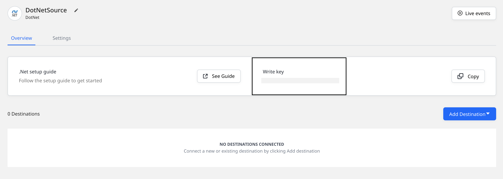

# .NET

The **RudderStack .NET SDK** lets you track your customer event data from your .NET applications and send it to your specified destinations via RudderStack.

Check the [**GitHub codebase**](https://github.com/rudderlabs/rudder-sdk-.net) to get a more hands-on understanding of the SDK.

<a href="https://www.nuget.org/packages/RudderAnalytics/" target="_blank" align="left">

</a>

## SDK setup requirements

To set up the RudderStack .NET SDK, the following prerequisites must be met:

- You will need to set up a [**RudderStack account**](https://app.rudderstack.com).
- Once signed up, set up a .NET source in the dashboard. For more information, follow [**this guide**](https://rudderstack.com/docs/connections/adding-source-and-destination-rudderstack/).  You should then see a **Write Key** for this source, as shown below:



- You will also need a data plane URL. Follow [**this section**](https://rudderstack.com/docs/get-started/installing-and-setting-up-rudderstack/#what-is-a-data-plane-url-where-do-i-get-it) for more information on the data plane URL and where to get it.

## Installing the .NET SDK

You can use [**NuGet**](https://docs.microsoft.com/en-us/nuget/consume-packages/install-use-packages-powershell) to install the .NET SDK into your project.

```csharp
Install-Package RudderAnalytics -Version <version>
```

<div class="infoBlock">

Our library depends on <a href="https://www.newtonsoft.com/json">Newton.JSON</a> library for JSON processing.
</div>

## Initializing the RudderStack client

To initialize the RudderStack client, run the following code snippet:

```csharp
using RudderStack;

RudderAnalytics.Initialize(
    WRITE_KEY,
    new RudderConfig(dataPlaneUrl: DATA_PLANE_URL)
);
```

## Sending events from RudderStack

Once the RudderStack client is initialized, you can then use it to send relevant customer events.

A sample `track` call is as shown:

```csharp
RudderAnalytics.Client.Track(
    "userId",
    "CTA Clicked",
    new Dictionary<string, object> { {"plan", "premium"}, }
);
```

## Identify

The `identify` call lets you associate a user to their actions as well as captures the relevant traits or properties related to that user.

A sample `identify` call is shown below:

```csharp
RudderAnalytics.Client.Identify(
    "userId",
    new Dictionary<string, object> { {"subscription", "inactive"}, }
);
```

The `identify` method parameters are as described below:

| **Field**      | **Type** | **Presence**                              | **Description**                                                                                                            |
| :------------- | :------- | :---------------------------------------- | :------------------------------------------------------------------------------------------------------------------------- |
| `userId`       | String   | Required, unless `anonymousId` is set | Unique identifier for a particular user in your database.                                                                  |
| `traits`       | Object   | Optional                                  | Dictionary of the traits associated with the user, such as `name`or `email` .                                               |
| `options`   | Object   | Optional   | Object containing `anonymousId`, `integrations`, `timestamp`, and `context`. |

<div class="infoBlock">

Refer to <a href="https://rudderstack.com/docs/stream-sources/rudderstack-sdk-integration-guides/rudderstack-dotnet-sdk/#the-options-parameter">The options parameter</a> section below for more information on the <code class="inline-code">options</code> object and its fields.
</div>

## Track

The `track` call lets you record the user actions along with their associated properties. Each user action is called an **event**.

A sample `track` call is shown below:

```csharp
RudderAnalytics.Client.Track(
    "userId",
    "CTA Clicked",
    new Dictionary<string, object> {  {"plan", "premium"}, }
);
```

The `track` method parameters are:

| Name           | Type   | Presence | Description                                                                                                                |
| :------------- | :----- | :------- | :------------------------------------------------------------------------------------------------------------------------- |
| `userId` | String | Required, unless `anonymousId` is set | The developer identification for your user. |
| `eventName` | String | Required | Name of the event being performed by the user. |
| `properties` | Object | Optional | Dictionary of the properties associated with a particular event. |
| `options` | Object | Optional | Object containing `anonymousId`, `integrations`, `timestamp`, and `context`. |

<div class="infoBlock">

Refer to <a href="https://rudderstack.com/docs/stream-sources/rudderstack-sdk-integration-guides/rudderstack-dotnet-sdk/#the-options-parameter">The options parameter</a> section below for more information on the <code class="inline-code">options</code> object and its fields.
</div>

## Page

The `page` call allows you to record the page views on your website along with the other relevant information about the viewed page.

A sample `page` call is as shown:

```csharp
RudderAnalytics.Client.Page(
    "userId",
    "Sign Up",
    new Dictionary<string, object> { {"url", "https://wwww.example.com/sign-up"}, }
);
```

The `page` method parameters are as described below:

| **Field** | **Type** | **Presence** | **Description** |
| :--- | :--- | :--- | :--- |
| `userId` | String | Required, unless `anonymousId` is set | Unique identifier for a particular user in your database. |
| `name` | String | Required | Name of the page being viewed. |
| `category` | String | Optional | The category of the page. |
| `properties` | Object | Optional | Dictionary of the properties associated with the page being viewed, such as `url` and `referrer`. |
| `options` | Object | Optional | Object containing `anonymousId`, `integrations`, `timestamp`, and `context`. |

<div class="infoBlock">

Refer to <a href="https://rudderstack.com/docs/stream-sources/rudderstack-sdk-integration-guides/rudderstack-dotnet-sdk/#the-options-parameter">The options parameter</a> section below for more information on the <code class="inline-code">options</code> object and its fields.
</div>

## Screen

The `screen` call is the mobile equivalent of the `page` call. It allows you to record the screen views on your mobile app along with the other relevant information about the app screen.

A sample `screen` call is as shown:

```csharp
RudderAnalytics.Client.Screen(
    "userId",
    "Dashboard",
    new Dictionary<string, object> { {"name", "Paid Dashboard"}, }
);
```

The `screen` method parameters are as described below:

| **Field** | **Type** | **Presence** | **Description** |
| :--- | :--- | :--- | :--- |
| `userId` | String | Required, unless `anonymousId` is set | Unique identifier for a particular user in your database. |
| `name` | String | Required | Name of the screen being viewed. |
| `category` | String | Optional | The category of the screen. |
| `properties` | Object | Optional | Dictionary of the properties associated with the page being viewed, such as `url` and `referrer`. |
| `options` | Object | Optional | Object containing `anonymousId`, `integrations`, `timestamp`, and `context`. |

<div class="infoBlock">

Refer to <a href="https://rudderstack.com/docs/stream-sources/rudderstack-sdk-integration-guides/rudderstack-dotnet-sdk/#the-options-parameter">The options parameter</a> section below for more information on the <code class="inline-code">options</code> object and its fields.
</div>

## Group

The `group` call lets you associate an identified user to a group - either a company, project, or a team, and record any custom traits or properties associated with that group.

A sample `group` call is as shown:

```csharp
RudderAnalytics.Client.Group(
    "userId",
    "accountId",
    new Dictionary<string, object> { {"role", "Owner"}, }
);
```

The `group` method parameters are as follows:

| **Field** | **Type** | **Presence** | **Description** |
| :--- | :--- | :--- | :--- |
| `userId` | String | Required, unless `anonymousId` is set | Unique identifier for a particular user in your database. |
| `groupId` | String | Required | Unique identifier of the group, as present in your database. |
| `traits` | Object | Optional | Dictionary of the properties or traits associated with the group, such as `email` or `name`. |
| `options` | Object | Optional | Object containing `anonymousId`, `integrations`, `timestamp`, and `context`. |

<div class="infoBlock">

Refer to <a href="https://rudderstack.com/docs/stream-sources/rudderstack-sdk-integration-guides/rudderstack-dotnet-sdk/#the-options-parameter">The options parameter</a> section below for more information on the <code class="inline-code">options</code> object and its fields.
</div>

## Alias

The `alias` call allows you to associate one identity with another.

<div class="infoBlock">

<code class="inline-code">alias</code> is an advanced method that lets you change the tracked user's ID explicitly. This method is useful when managing identities for some of the downstream destinations.
</div>

<div class="infoBlock">

For a detailed explanation of the <code class="inline-code">alias</code> call, refer to the <a href="https://rudderstack.com/docs/rudderstack-api/api-specification/rudderstack-spec/alias/">RudderStack API Specification</a> guide.
</div>

A sample `alias` call is as shown:

```csharp
RudderAnalytics.Client.Alias("anonUserId", "userId");
```

The `alias` method parameters are as mentioned below:

| **Field** | **Type** | **Presence** | **Description** |
| :--- | :--- | :--- | :--- |
| `previousId` | String | Required | The previous unique identifier of the user. |
| `userId` | String | Required, unless `anonymousId` is set | Unique identifier for a particular user in your database. |
| `options` | Object | Optional | Object containing `anonymousId`, `integrations`, `timestamp`, and `context`. |

<div class="infoBlock">

Refer to <a href="https://rudderstack.com/docs/stream-sources/rudderstack-sdk-integration-guides/rudderstack-dotnet-sdk/#the-options-parameter">The options parameter</a> section below for more information on the <code class="inline-code">options</code> object and its fields.
</div>

## The `options` parameter

The `options` object contains the following fields:

| **Field** | **Type** | **Presence** | **Description** |
| :--- | :--- | :--- | :--- |
| `anonymousId` | String | Optional | Sets the user ID for cases where there is no unique identifier for the user. Either `userId` or `anonymousId` is required. |
| `integrations` | Object | Optional | A dictionary containing the destinations to be either enabled or disabled. |
| `timestamp` | Date | Optional | The timestamp of the message's arrival. |
| `context` | Object | Optional | Dictionary of information that provides context about a message. However, it is not directly related to the API call. |

## Flushing events

To make sure no events are left in the queue, you can flush the events explicitly by using the SDK's `flush()` method, as shown:

```csharp

RudderAnalytics.Client.Flush();
```

<div class="warningBlock">

  Calling <code class="inline-code">flush()</code> again is blocked until all the messages are flushed from the queue.
</div>

## Logging

The RudderStack .NET SDK supports detailed logging. You can enable this feature as shown:

```csharp
using RudderStack;

Logger.Handlers += LoggingHandler;

static void LoggingHandler(Logger.Level level, string message, IDictionary<string, object> args)
{
    if (args != null)
    {
        foreach (string key in args.Keys)
        {
            message += String.Format(" {0}: {1},", "" + key, "" + args[key]);
        }
    }
    Console.WriteLine(String.Format("[RudderAnalytics] [{0}] {1}", level, message));
}
```

<div class="infoBlock">

The logger must be on a minimum version of .NET Core 2.1.
</div>

## Contact us

For queries on any of the sections covered in this guide, you can [**contact us**](mailto:%20docs@rudderstack.com) or start a conversation in our [**Slack**](https://rudderstack.com/join-rudderstack-slack-community) community.

If you come across any issues while using the .NET SDK, you can open a new issue on our [**GitHub Issues page**](https://github.com/rudderlabs/rudder-sdk-.net/issues/new).
