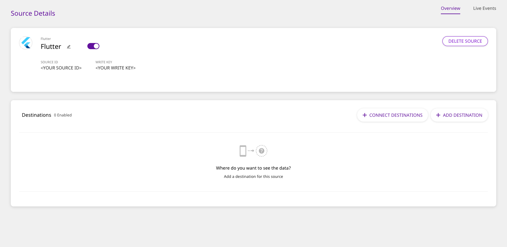

# Flutter

## What is the RudderStack Flutter SDK?

The RudderStack Flutter SDK allows you to track event data from your Flutter app. After integrating this SDK with your app, you will also be able to send the event data to your preferred destination platforms supported by RudderStack.

You can check the SDK's [GitHub codebase](https://github.com/rudderlabs/rudder-sdk-flutter) to get a more hands-on understanding of the SDK's architecture and working.

## SDK Setup Requirements

To set up the RudderStack Flutter SDK, there are a few prerequisites as mentioned below:

* You will need to set up a [RudderStack Account](https://app.rudderstack.com).
* Once signed up, your `Flutter` source `writeKey` will appear in the Dashboard, as shown:



* You will also need your `Data-Plane URL`. The following screenshot shows the data plane URL for the managed hosting mode:


* It would also help if you have the [Flutter Development Environment](https://flutter.dev/docs/get-started/install) set up on your system.


**We have migrated RudderStack Flutter SDK to Null Safety starting from version 1.0.2**


## Installing the RudderStack Flutter SDK

The recommended way to install the Flutter SDK is through [`pub`](https://pub.dev/packages/rudder_sdk_flutter).

To add the SDK as a dependency, perform the following steps:

* Open `pubspec.yaml`  and add `rudder_sdk_flutter` under `dependencies` section:

```groovy
dependencies:
  rudder_sdk_flutter: ^1.0.2
```

* Navigate to your Application's root folder and install all the required dependencies with:

```bash
flutter pub get
```

## Initializing the RudderStack Client

After adding the SDK as a dependency, you need to set up the SDK.

* Make sure to import the SDK wherever you use it with:

```dart
import 'package:rudder_sdk_flutter/RudderClient.dart';
import 'package:rudder_sdk_flutter/RudderConfig.dart';
import 'package:rudder_sdk_flutter/RudderLogger.dart';
```

* Add the following code somewhere in your application.

```dart
RudderLogger.init(RudderLogger.VERBOSE);
RudderConfigBuilder builder = RudderConfigBuilder();
builder.withDataPlaneUrl(DATA_PLANE_URL);
builder.withTrackLifecycleEvents(true);
RudderClient.getInstance(WRITE_KEY,config: builder.build());
```

The `setup` method has the following signature:

| Name | Data Type | Required | Description |
| :--- | :--- | :--- | :--- |
| `writeKey` | `String` | Yes | Your Flutter `writeKey` |
| `config` | `RudderConfig` | No | Contains the RudderStack Client configuration |

Check the [Configuring your RudderStack Client](https://docs.rudderstack.com/rudderstack-sdk-integration-guides/rudderstack-flutter-sdk#configuring-your-rudderstack-client) section below for a full list of configurable parameters.

## Track

You can record the users' activity through the `track` method. Every action performed by the user is called an event.

An example of the `track` event is as shown:

```dart
RudderProperty property = RudderProperty();
property.put("test_key_1", "test_key_1");
RudderProperty childProperty = RudderProperty();
childProperty.put("test_child_key_1", "test_child_value_1");
property.put("test_key_2",childProperty);
RudderClient.track("test_track_event", properties: property);
```

The `track` method has the following signature:

| Name | Data Type | Required | Description |
| :--- | :--- | :--- | :--- |
| `name` | `String` | Yes | Contains the name of the event you want to track |
| `properties` | `RudderProperty` | No | Contains the extra data properties you want to send along with the event |
| `options` | `RudderOption` | No | Contains the extra event options |


We automatically track the following optional events:

1. `Application Installed`
2. `Application Updated`
3. `Application Opened`
4. `Application Backgrounded`

You can disable these events by calling `withTrackLifeCycleEvents(false)` on `RudderConfigBuilder` object while initializing the `RudderClient`. However, it is highly recommended to keep them enabled.


## Identify

We capture `deviceId` and use that as the `anonymousId` for identifying the user. It helps to track the users across the application installation. To attach more information to the user, you can use the `identify` method.

Once you set the `identify` information to the user, it will also be passed to the successive `track` or `screen` calls. To reset the user identification, you can use the `reset` method.


On the Android devices, the `deviceId` is assigned during the first boot. It remains consistent across the applications and installs. It changes only after factory reset.



On the iOS devices, According to the Apple [documentation](https://developer.apple.com/documentation/uikit/uidevice/1620059-identifierforvendor), if the device has multiple apps from the same vendors, all those apps will be assigned the same `deviceId`. If all the applications from a vendor are uninstalled, then on next install the app will be assigned a new `deviceId`.


An example `identify` event is as shown:

```dart
RudderTraits traits = RudderTraits();
traits.putBirthdayDate(new DateTime.now());
traits.putEmail("abc@123.com");
traits.putFirstName("First");
traits.putLastName("Last");
traits.putGender("m");
traits.putPhone("5555555555");

Address address = Address();
address.putCity("City");
address.putCountry("USA");
traits.putAddress(address);

traits.put("boolean", true);
traits.put("integer", 50);
traits.put("float", 120.4);
traits.put("long", 1234);
traits.put("string", "hello");
traits.put("date", new DateTime.now().millisecondsSinceEpoch);

RudderClient.identify("test_user_id", traits: traits, options: null);
```

The `identify` method has the following signature:

| Name | Data Type | Required | Description |
| :--- | :--- | :--- | :--- |
| `userId` | `String` | Yes | Includes the developer identity for the user |
| `traits` | `RudderTraits` | No | Contains information related to the user traits |
| `options` | `RudderOption` | No | Extra options for the `identify` event |

## Screen

You can use the `screen` call to record whenever the user sees a screen on the mobile device. You can also send some extra properties along with this event.

An example of the `screen` event is as shown:

```dart
RudderProperty screenProperty = new RudderProperty();
screenProperty.put("foo", "bar");
RudderClient.screen("Main Activity",
    properties: screenProperty, options: null);
```

The `screen` method has the following signature:

| Name | Data Type | Required | Description |
| :--- | :--- | :--- | :--- |
| `screenName` | `String` | Yes | Name of the screen viewed. |
| `properties` | `RudderProperty` | No | Extra property object that you want to pass along with the `screen` call. |
| `options` | `RudderOption` | No | Extra options to be passed along with `screen` event. |

## Group

The `group` call associates a user to a specific organization.

An example of `group` event is as shown:

```dart
RudderTraits groupTraits = RudderTraits();
groupTraits.put("foo", "bar");
groupTraits.put("foo1", "bar1");
RudderClient.group("sample_group_id",
    groupTraits: groupTraits, options: null);
```

The `group` method has the following signature:

| Name | Data Type | Required | Description |
| :--- | :--- | :--- | :--- |
| `groupId` | `String` | Yes | An ID of the organization with which you want to associate your user |
| `groupTraits` | `RudderTraits` | No | Any other traits of the organization you want to pass along with the `group` call. |
| `options` | `RudderOption` | No | Extra options to be passed along with `group` event. |


RudderStack doesn't persist the traits for the group across the sessions.


## Alias

The `alias` call associates the user with a new identification.

An example of `alias` event is as shown:

```dart
RudderClient.alias("new_user_id", options: null);
```

The `alias` method has the following signature:

| Name | Data Type | Required | Description |
| :--- | :--- | :--- | :--- |
| `newId` | `String` | Yes | The new `userId` you want to assign to the user |
| `options` | `RudderOption` | No | Extra options to be passed along with `alias` event. |

We replace the old `userId` with the `newUserId` and we persist that identification across the sessions.

## Reset

You can use the `reset` method to clear the persisted `traits` for the `identify` call. This is required for `Logout` operations.

```dart
RudderClient.reset();
```

## Enabling / Disabling Events for Specific Destinations

The Flutter SDK lets you enable or disable sending events to a specific destination or all the destinations to which the source is connected. You can specify these destinations by creating an object as shown:

```dart
RudderOption options = new RudderOption();
// default value for `All` is true
options.putIntegration("All", false);
// specifying destination by its display name
options.putIntegration("Mixpanel", false);
// specifying destination by its Factory object
options.putIntegrationWithFactory(Appcenter(), true);
```


The keyword `All` in the above snippet represents all the destinations to which the source is connected. Its value is set to `true` by default.



Make sure the destination names that you pass while specifying the destinations should exactly match the names as listed [here](https://app.rudderstack.com/directory).


You can pass the destination\(s\) specified in the above snippet to the SDK in two ways:

### 1. Passing the destinations while initializing the SDK:

This is helpful when you want to enable/disable sending the events across all the event calls made using the SDK to the specified destination\(s\).

```dart
RudderClient.getInstance(WRITE_KEY,
                    config: builder.build(),options: options);
```

### 2. Passing the destinations while making any event call:

This approach is helpful when you want to enable/disable sending only a particular event to the specified destination\(s\) or if you want to override the specified destinations passed with the SDK initialization for a particular event.

```dart
RudderProperty property = RudderProperty();
property.put("test_key_1", "test_key_1");
RudderClient.track("test_track_event", properties: property, options: options);
```


If you specify the destinations both while initializing the SDK as well as while making an event call, then the destinations specified at the event level only will be considered.


## External ID

You can pass your custom `userId` along with standard `userId` in your `identify` calls. We add those values under `context.externalId`. The following code snippet shows a way to add `externalId` to your `identify` request.

```dart
RudderOption option = RudderOption();
option.putExternalId("externalId", "some_external_id_1");
RudderClient.identify("testUserId", options: option);
```

## Anonymous ID

We use the `deviceId` as `anonymousId` by default. You can use the following method to override and use your own `anonymousId` with the SDK.


You need to call `setAnonymousId` method before calling `getInstance`


An example of setting the `anonymousId` is as below

```dart
RudderClient.setAnonymousId(<ANONYMOUS_ID>);
```

## Advertising ID

You can use the `setAdvertisingId` method to pass your Android and iOS AAID and IDFA respectively. The `setAdvertisingId` method accepts a `string` argument :

* `id` : Your Android `advertisingId` \(AAID\) \(or\) Your iOS `advertisingId` \(IDFA\)


On `Android` device you need to call `setAdvertisingId` method before calling `getInstance`


An example of how to use `setAdvertisingId` is as shown:

```dart
RudderClient.setAdvertisingId(<ADVERTISING_ID>);
```


The `id` parameter you pass to the above method is assigned as `AAID` if you are on `android` device and as `IDFA` if you are on a `iOS` device.


## Setting Device Token

You can pass your `device-token` for push notifications to be passed to the destinations which support the Push Notification feature. We set the `token` under `context.device.token`.

An example of setting the `device-token` is as below:

```dart
RudderClient.putDeviceToken(<DEVICE_TOKEN>);
```

## Configuring your RudderStack Client

You can configure your client based on the following parameters by passing them in the `RudderConfigBuilder` object of your `RudderClient.getInstance()` call.

| Parameter | Type | Description | Default Value |
| :--- | :--- | :--- | :--- |
| `logLevel` | `int` | Controls how much of the log you want to see from the Flutter SDK. | `RudderLogger.RudderLogLevel.NONE` |
| `endPointUri` | `string` | URL of your `data-plane`. Please refer above to see how to fetch the data plane URL. | [https://api.rudderlabs.com](https://api.rudderlabs.com) |
| `flushQueueSize` | `int` | Number of events in a batch request to the server. | `30` |
| `dbThresholdCount` | `int` | Number of events to be saved in the `SQLite` database. Once the limit is reached, older events are deleted from the DB. | `10000` |
| `sleepTimeout` | `int` | Minimum waiting time to flush the events to the server. | `10 seconds` |
| `configRefreshInterval` | `int` | It will fetch the config from `dashboard` after this many hours. | `2` |
| `trackLifecycleEvents` | `boolean` | Whether SDK will capture application life cycle events automatically. | `true` |
| `controlPlaneUrl` | `string` | This parameter should be changed **only if** you are self-hosting the Control Plane. Check the section **Self-Hosted Control Plane** below for more information. The SDK will add `/sourceConfig` along with this URL to fetch the configuration. | [https://api.rudderlabs.com](https://api.rudderlabs.com) |

### Self-Hosted Control Plane

If you are using a device mode destination like Adjust, Firebase, etc., the Flutter SDK needs to fetch the required configuration from the Control Plane. If you are using the RudderStack Config Generator to host your own Control Plane, then follow [this guide](https://docs.rudderstack.com/how-to-guides/rudderstack-config-generator#what-is-the-control-plane-url) and specify `controlPlaneUrl` in your`RudderConfig.Builder` that points to your hosted source configuration file.


You shouldn't pass the `controlPlaneUrl` parameter during SDK initialization if you are using the dashboard from [https://app.rudderstack.com](https://app.rudderstack.com). This parameter is supported only if you are using our open-source [RudderStack Config Generator](https://docs.rudderstack.com/how-to-guides/rudderstack-config-generator).


## Debugging

If you run into any issues regarding the RudderStack Flutter SDK, you can turn on the `VERBOSE` or `DEBUG` logging to find out what the issue is.

First, make sure you import `RudderLogger` with the below command:

```dart
import 'package:rudder_sdk_flutter/RudderLogger.dart';
```

Then to turn on the logging, change your `RudderClient` initialization to the following:

```dart
RudderConfigBuilder builder = RudderConfigBuilder();
builder.withDataPlaneUrl(DATA_PLANE_URL);
builder.withLogLevel(RudderLogger.VERBOSE);
RudderClient.getInstance(WRITE_KEY,
                          config: builder.build());
```

You can set the log level to one of the following values:

1. `NONE`
2. `ERROR`
3. `WARN`
4. `INFO`
5. `DEBUG`
6. `VERBOSE`

## FAQs

### How do I get the user `traits` after making an `identify` call?

You can get the user traits after making an `identify` call in the following way:

```dart
Map context = await RudderClient.getRudderContext();
print(context["traits"]);
```

## Contact Us

In case of any queries, you can always [contact us](mailto:%20docs@rudderstack.com), or feel free to open an issue [on our GitHub Issues page](https://github.com/rudderlabs/rudder-sdk-flutter/issues) in case of any discrepancy. You can also start a conversation on our [Slack](https://resources.rudderstack.com/join-rudderstack-slack) channel; we will be happy to talk to you!

