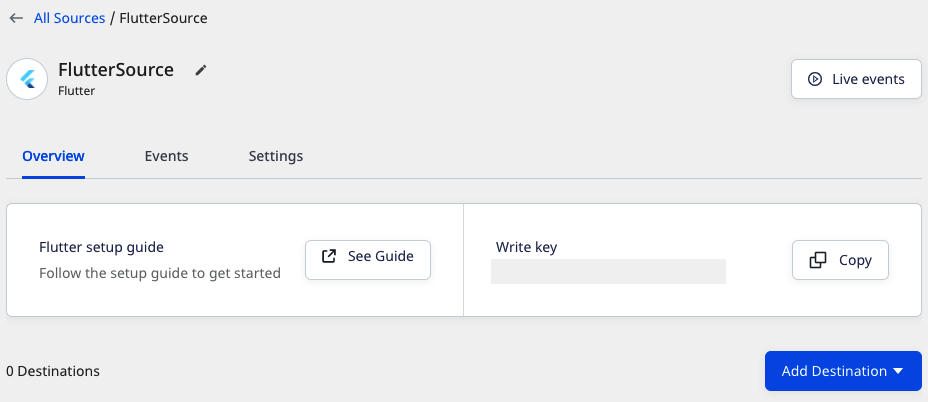

# Flutter SDK v1

| **IMPORTANT**: This version of the Flutter SDK will soon be deprecated. We highly recommend upgrading to the latest SDK version by going to our [**GitHub repository**](https://github.com/rudderlabs/rudder-sdk-flutter). For the latest documentation, refer to [**this**](https://rudderstack.com/docs/stream-sources/rudderstack-sdk-integration-guides/rudderstack-flutter-sdk/) guide.   |
| :------------------------------------------------- |

<a href="https://pub.dev/packages/rudder_sdk_flutter/versions/1.1.0" target ="_blank">

</a>

## SDK setup requirements

To set up the RudderStack Flutter SDK, the prerequisites are as mentioned below:

- You will need to set up a [**RudderStack Account**](https://app.rudderstack.com).
- Once signed up, set up a Flutter source in the dashboard. For more information, follow [**this guide**](https://rudderstack.com/docs/connections/adding-source-and-destination-rudderstack/).  You should then see a **Write Key** for this source, as shown:



- You will also need a data plane URL. Follow [**this section**](https://rudderstack.com/docs/get-started/installing-and-setting-up-rudderstack/#what-is-a-data-plane-url-where-do-i-get-it) for more information on the data plane URL and where to get it.

- We also recommend setting up the [**Flutter development environment**](https://flutter.dev/docs/get-started/install) on your system.

<div class="infoBlock">

<strong>We have migrated the RudderStack Flutter SDK to Null Safety starting from version 1.0.2.</strong>
</div>

## Installing the Flutter SDK

The recommended way to install the Flutter SDK is through [`pub`](https://pub.dev/packages/rudder_sdk_flutter).

To add the SDK as a dependency, perform the following steps:

- Open `pubspec.yaml` and add `rudder_sdk_flutter` under `dependencies` section:

```groovy
dependencies:
  rudder_sdk_flutter: ^1.0.5
```

- Navigate to your Application's root folder and install all the required dependencies with:

```bash
flutter pub get
```

## Initializing the RudderStack client

After adding the SDK as a dependency, you need to set up the SDK.

- To import the SDK, refer to the following snippet:

```dart
import 'package:rudder_sdk_flutter/RudderClient.dart';
import 'package:rudder_sdk_flutter/RudderConfig.dart';
import 'package:rudder_sdk_flutter/RudderLogger.dart';
```

- Add the following code somewhere in your application.

```dart
RudderLogger.init(RudderLogger.VERBOSE);
RudderConfigBuilder builder = RudderConfigBuilder();
builder.withDataPlaneUrl(DATA_PLANE_URL);
builder.withTrackLifecycleEvents(true);
RudderClient.getInstance(WRITE_KEY,config: builder.build());
```

The `setup` method has the following signature:

| Name       | Data Type      | Required | Description                                   |
| :--------- | :------------- | :------- | :-------------------------------------------- |
| `writeKey` | `String`       | Yes      | Your Flutter source `writeKey`                       |
| `config`   | `RudderConfig` | No       | Contains the RudderStack Client configuration |

Check the [**Configuring your RudderStack client**](https://rudderstack.com/docs/stream-sources/rudderstack-sdk-integration-guides/rudderstack-flutter-sdk/#configuring-your-rudderstack-client) section below for a full list of the configurable parameters.

## Track

You can record the users' activity through the `track` method. Every action performed by the user is called an event.

A sample `track` event is shown below:

```dart
RudderProperty property = RudderProperty();
property.put("test_key_1", "test_key_1");
RudderProperty childProperty = RudderProperty();
childProperty.put("test_child_key_1", "test_child_value_1");
property.put("test_key_2",childProperty);
RudderClient.track("test_track_event", properties: property);
```

The `track` method has the following signature:

| Name         | Data Type        | Required | Description                                                              |
| :----------- | :--------------- | :------- | :----------------------------------------------------------------------- |
| `name`       | `String`         | Yes      | Contains the name of the event you want to track                         |
| `properties` | `RudderProperty` | No       | Contains the extra data properties you want to send along with the event |
| `options`    | `RudderOption`   | No       | Contains the extra event options                                         |

<div class="infoBlock">

We automatically track the following optional events:
<ol>
<li><code class="inline-code">Application Installed</code></li>
<li><code class="inline-code">Application Updated</code></li>
<li><code class="inline-code">Application Opened</code></li>
<li><code class="inline-code">Application Backgrounded</code></li>
</ol>

You can disable these events by calling <code class="inline-code">withTrackLifeCycleEvents(false)</code> on <code class="inline-code">RudderConfigBuilder</code> object while initializing the <code class="inline-code">RudderClient</code>. However, it is highly recommended to keep them enabled.
</div>

## Identify

We capture the `deviceId` and use that as the `anonymousId` for identifying the user. This helps to track the users across the application installation. To attach more information to the user, you can use the `identify` method. Once a user is identified, the SDK persists all the user information and passes it to the successive  `track` or `screen` calls. To reset the user identification, you can use the `reset` method.

<div class="infoBlock">

On the Android devices, the <code class="inline-code">deviceId</code> is assigned during the first boot. It remains consistent across the applications and installs. This can be changed only after a factory reset of the device.
</div>

<div class="infoBlock">
According to the Apple <a href="https://developer.apple.com/documentation/uikit/uidevice/1620059-identifierforvendor">documentation</a>, if the iOS device has multiple apps from the same vendor, all the apps will be assigned the same <code class="inline-code">deviceId</code>. If all the applications from a vendor are uninstalled and then reinstalled, then they will be assigned a new <code class="inline-code">deviceId</code>.
</div>

A sample `identify` event is as shown:

```dart
RudderTraits traits = RudderTraits();
traits.putBirthdayDate(new DateTime.now());
traits.putEmail("abc@123.com");
traits.putFirstName("First");
traits.putLastName("Last");
traits.putGender("m");
traits.putPhone("5555555555");

Address address = Address();
address.putCity("City");
address.putCountry("USA");
traits.putAddress(address);

traits.put("boolean", true);
traits.put("integer", 50);
traits.put("float", 120.4);
traits.put("long", 1234);
traits.put("string", "hello");
traits.put("date", new DateTime.now().millisecondsSinceEpoch);

RudderClient.identify("test_user_id", traits: traits, options: null);
```

The `identify` method has the following signature:

| Name      | Data Type      | Required | Description                                     |
| :-------- | :------------- | :------- | :---------------------------------------------- |
| `userId`  | `String`       | Yes      | Includes the developer identity for the user    |
| `traits`  | `RudderTraits` | No       | Contains information related to the user traits |
| `options` | `RudderOption` | No       | Extra options for the `identify` event          |

## Screen

You can use the `screen` call to record whenever the user sees a screen on the mobile device. You can also send some extra properties along with this event.

An example of the `screen` event is as shown:

```dart
RudderProperty screenProperty = new RudderProperty();
screenProperty.put("foo", "bar");
RudderClient.screen("Main Activity",
    properties: screenProperty, options: null);
```

The `screen` method has the following signature:

| Name         | Data Type        | Required | Description                                                               |
| :----------- | :--------------- | :------- | :------------------------------------------------------------------------ |
| `screenName` | `String`         | Yes      | Name of the screen viewed.                                                |
| `properties` | `RudderProperty` | No       | Extra property object that you want to pass along with the `screen` call. |
| `options`    | `RudderOption`   | No       | Extra options to be passed along with `screen` event.                     |

## Group

The `group` call associates a user to a specific organization.

An example of `group` event is as shown:

```dart
RudderTraits groupTraits = RudderTraits();
groupTraits.put("foo", "bar");
groupTraits.put("foo1", "bar1");
RudderClient.group("sample_group_id",
    groupTraits: groupTraits, options: null);
```

The `group` method has the following signature:

| Name          | Data Type      | Required | Description                                                                        |
| :------------ | :------------- | :------- | :--------------------------------------------------------------------------------- |
| `groupId`     | `String`       | Yes      | An ID of the organization with which you want to associate your user               |
| `groupTraits` | `RudderTraits` | No       | Any other traits of the organization you want to pass along with the `group` call. |
| `options`     | `RudderOption` | No       | Extra options to be passed along with `group` event.                               |

<div class="infoBlock">

RudderStack does not persist the traits for the group across the sessions.

</div>

## Alias

The `alias` call lets you merge different identities of a known user.

<div class="infoBlock">

<code class="inline-code">alias</code> is an advanced method that lets you change the tracked user's ID explicitly. This method is useful when managing identities for some of the downstream destinations.
</div>

<div class="infoBlock">

For detailed explanation of the <code class="inline-code">alias</code> call, refer to the <a href="https://rudderstack.com/docs/rudderstack-api/api-specification/rudderstack-spec/alias/">RudderStack API Specification</a> guide.
</div>

A sample `alias` call is as shown:

```dart
RudderClient.alias("new_user_id", options: null);
```

The `alias` method has the following signature:

| Name      | Data Type      | Required | Description                                          |
| :-------- | :------------- | :------- | :--------------------------------------------------- |
| `newId`   | `String`       | Yes      | The new `userId` you want to assign to the user      |
| `options` | `RudderOption` | No       | Extra options to be passed along with `alias` event. |

RudderStack replaces the old `userId` with the `newUserId` and persists that identification across the sessions.

## Reset

You can use the `reset` method to clear the persisted `traits` for the `identify` call. This is required for `Logout` operations.

```dart
RudderClient.reset();
```

## Enabling/disabling user tracking via the optOut API \(GDPR Support\)

RudderStack gives the users \(e.g., an EU user\) the ability to opt out of tracking any user activity until the user gives their consent. You can do this by leveraging RudderStack's `optOut` API.

The `optOut` API takes `true` or `false` as a Boolean value to enable or disable tracking user activities. This flag persists across device reboots.

The following snippet highlights the use of the `optOut` API to disable user tracking:

```dart
RudderClient.optOut(true);
```

Once the user grants their consent, you can enable user tracking once again by using the `optOut` API with `false` as a parameter sent to it, as shown:

```dart
RudderClient.optOut(false);
```

<div class="infoBlock">

The `optOut` API is available in the Flutter SDK starting from version `1.0.6`.
</div>


## Enabling/disabling events for specific destinations

The Flutter SDK lets you enable or disable sending events to a specific destination or all the destinations connected to a source. You can specify these destinations by creating an object as shown in the following snippet:

```dart
RudderOption options = new RudderOption();
// default value for `All` is true
options.putIntegration("All", false);
// specifying destination by its display name
options.putIntegration("Mixpanel", false);
// specifying destination by its Factory object
options.putIntegrationWithFactory(Appcenter(), true);
```

<div class="infoBlock">

The keyword <code class="inline-code">All</code> in the above snippet represents all the destinations connected to a source. Its value is set to <code class="inline-code">true</code> by default.
</div>

<div class="infoBlock">
Make sure the destination names that you pass while specifying the destinations should exactly match the names as listed <a href="https://app.rudderstack.com/directory">here</a>.

</div>

You can pass the destination\(s\) specified in the above snippet to the SDK in two ways:

### 1. Passing destinations while initializing the SDK

This is helpful when you want to enable/disable sending the events across all the event calls made using the SDK to the specified destination\(s\).

```dart
RudderClient.getInstance(WRITE_KEY,
                    config: builder.build(),options: options);
```

### 2. Passing destinations while making event calls

This approach is helpful when you want to enable/disable sending only a particular event to the specified destination\(s\) or if you want to override the specified destinations passed with the SDK initialization for a particular event.

```dart
RudderProperty property = RudderProperty();
property.put("test_key_1", "test_key_1");
RudderClient.track("test_track_event", properties: property, options: options);
```

<div class="infoBlock">

If you specify the destinations both while initializing the SDK as well as while making an event call, then the destinations specified at the event level only will be considered.

</div>

## External ID

You can pass your custom `userId` along with standard `userId` in your `identify` calls. We add those values under `context.externalId`. The following code snippet shows a way to add `externalId` to your `identify` request.

```dart
RudderOption option = RudderOption();
option.putExternalId("externalId", "some_external_id_1");
RudderClient.identify("testUserId", options: option);
```

## Anonymous ID

We use the `deviceId` as `anonymousId` by default. You can use the following method to override and use your own `anonymousId` with the SDK.

An example of setting the `anonymousId` is as below

```dart
RudderClient.putAnonymousId(<ANONYMOUS_ID>);
```

## Advertising ID

You can use the `putAdvertisingId` method to pass your Android and iOS AAID and IDFA respectively. The `putAdvertisingId` method accepts a `string` argument :

- `id` : Your Android `advertisingId` \(AAID\)  or your iOS `advertisingId` \(IDFA\).

An example of how to use `putAdvertisingId` is as shown:

```dart
RudderClient.putAdvertisingId(<ADVERTISING_ID>);
```

<div class="infoBlock">
  
  The <code class="inline-code">id</code> parameter that you pass in the <code class="inline-code">putAdvertisingId</code> method is assigned as the AAID if you are on an Android device, and as the IDFA if you are on an iOS device.
</div>

## Setting the device token

You can pass your `device-token` for push notifications to be passed to the destinations which support the Push Notification feature. We set the `token` under `context.device.token`.

An example of setting the `device-token` is as below:

```dart
RudderClient.putDeviceToken(<DEVICE_TOKEN>);
```

## Configuring your RudderStack client

You can configure your client based on the following parameters by passing them in the `RudderConfigBuilder` object of your `RudderClient.getInstance()` call.

| Parameter               | Type      | Description                                                                                                                                                                                                                                       | Default Value                                            |
| :---------------------- | :-------- | :------------------------------------------------------------------------------------------------------------------------------------------------------------------------------------------------------------------------------------------------ | :------------------------------------------------------- |
| `logLevel`              | `int`     | Controls how much of the log you want to see from the Flutter SDK.                                                                                                                                                                                | `RudderLogger.RudderLogLevel.NONE`                       |
| `endPointUri`           | `string`  | Your data plane URL.                                                                                                                                                              | `https://hosted.rudderlabs.com` |
| `flushQueueSize`        | `int`     | Number of events in a batch request to the server.                                                                                                                                                                                                | `30`                                                     |
| `dbThresholdCount`      | `int`     | Number of events to be saved in the `SQLite` database. Once the limit is reached, older events are deleted from the DB.                                                                                                                           | `10000`                                                  |
| `sleepTimeout`          | `int`     | Minimum waiting time to flush the events to the server.                                                                                                                                                                                           | `10 seconds`                                             |
| `configRefreshInterval` | `int`     | Fetches the config from the dashboard after this specified time.                                                                                                                                                                                 | `2 hours`                                                      |
| `trackLifecycleEvents`  | `boolean` | Whether SDK will capture application life cycle events automatically.                                                                                                                                                                             | `true`                                                   |
| `controlPlaneUrl`       | `string`  | This parameter should be changed **only if** you are self-hosting the control plane. Check the section [**Self-hosted control plane**](https://rudderstack.com/docs/stream-sources/rudderstack-sdk-integration-guides/rudderstack-flutter-sdk/flutter-v1/#self-hosted-control-plane) below for more information. The SDK will add `/sourceConfig` along with this URL to fetch the configuration. | `https://api.rudderlabs.com` |

### Self-hosted control plane

If you are using a device mode destination like Adjust, Firebase, etc., the Flutter SDK needs to fetch the required configuration from the control plane. If you are using the <a href="https://rudderstack.com/docs/user-guides/how-to-guides/rudderstack-control-plane-lite/">Control Plane Lite</a> utility to host your own control plane, then follow [this guide](https://rudderstack.com/docs/user-guides/how-to-guides/rudderstack-control-plane-lite/#what-is-the-control-plane-url) and specify `controlPlaneUrl` in your `RudderConfig.Builder` that points to your hosted source configuration file.

<div class="warningBlock">

You shouldn't pass the <code class="inline-code">controlPlaneUrl</code> parameter during SDK initialization if you are using the <a href="https://app.rudderstack.com">RudderStack dashboard</a> from <a href="https://app.rudderstack.com">https://app.rudderstack.com</a>. This parameter is supported only if you are using our open-source <a href="https://rudderstack.com/docs/user-guides/how-to-guides/rudderstack-control-plane-lite/">Control Plane Lite</a> utility to set up your own control plane.
</div>

## Debugging

If you run into any issues regarding the RudderStack Flutter SDK, you can turn on the `VERBOSE` or `DEBUG` logging to find out what the issue is.

First, make sure you import `RudderLogger` with the below command:

```dart
import 'package:rudder_sdk_flutter/RudderLogger.dart';
```

Then to turn on the logging, change your `RudderClient` initialization to the following:

```dart
RudderConfigBuilder builder = RudderConfigBuilder();
builder.withDataPlaneUrl(DATA_PLANE_URL);
builder.withLogLevel(RudderLogger.VERBOSE);
RudderClient.getInstance(WRITE_KEY,
                          config: builder.build());
```

You can set the log level to one of the following values:

1. `NONE`
2. `ERROR`
3. `WARN`
4. `INFO`
5. `DEBUG`
6. `VERBOSE`

## FAQs

### How do I get the user `traits` after making an `identify` call?

You can get the user traits after making an `identify` call in the following way:

```dart
Map context = await RudderClient.getRudderContext();
print(context["traits"]);
```

## Contact us

For queries on any of the sections covered in this guide, you can [**contact us**](mailto:%20docs@rudderstack.com) or start a conversation in our [**Slack**](https://rudderstack.com/join-rudderstack-slack-community) community.

If you come across any issues while using the Flutter SDK, you can also open an issue on our [**GitHub Issues page**](https://github.com/rudderlabs/rudder-sdk-flutter/issues).
