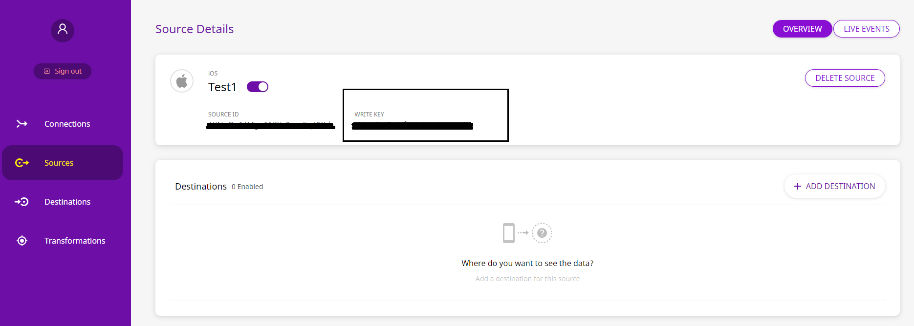

# iOS

## What is the RudderStack iOS SDK?

The RudderStack iOS SDK allows you to integrate RudderStack to your iOS application in order to track event data from your app. After integrating this SDK, you will also be able to send this data to your preferred analytics destination/s such as Google Analytics, Amplitude, and more.


You can check the [codebase on GitHub](https://github.com/rudderlabs/rudder-sdk-ios) if you want to get more hands-on information or are keen to know the SDK architecture.


[](https://cocoapods.org/pods/Rudder)

## SDK Setup Requirements

To set up the RudderStack iOS SDK, there are a few prerequisites as mentioned below:

* You will need to set up a [RudderStack Account](https://app.rudderlabs.com).
* Once signed up, your `iOS` source `writeKey` will appear in the dashboard, as shown:



* You will also need your Data Plane URL.  Simply put, the Data Plane URL is used to connect to the RudderStack backend for processing and routing your events.


To get the **Data Plane URL**:

* If you're using the **open-source** version of RudderStack, you are required to set up your own data plane by [installing and setting up RudderStack](https://docs.rudderstack.com/installing-and-setting-up-rudderstack) in your preferred dev environment.
* If you're using the **enterprise** version of RudderStack, please contact us for the data plane URL with the email ID used to sign up for RudderStack.


* You will also need a Mac with the latest version of [Xcode](https://developer.apple.com/xcode/).

## Installing the RudderStack iOS SDK

We distribute our iOS SDK through [Cocoapods](https://cocoapods.org) and [Carthage](https://github.com/Carthage/Carthage). The recommended and easiest way to add the SDK to your project is through `Podfile`. Follow these steps:



1. Add the RudderStack SDK to your `Podfile`, as shown:

```ruby
pod 'Rudder'
```

1. Then, run the following command:

```bash
pod install
```



1. Add the RudderStack SDK to your `Podfile`, as shown:

   ```ruby
   github "rudderlabs/rudder-sdk-ios"
   ```

2. Then, run the following command:

   ```bash
   carthage update
   ```

   If you're facing an issue with Carthage and XCode 12, you can follow the [steps from Carthage team](https://github.com/Carthage/Carthage/blob/master/Documentation/Xcode12Workaround.md).






**Important**: Remember to include the following code in all `.m` and `.h` files or your `.swift` files where you want to refer to or use RudderStack SDK classes.




```objectivec
#import <Rudder/Rudder.h>
```



```swift
import Rudder
```




We use SQLite to save the events to local database before sending it to RudderStack data-plane. Making calls like `SQLite.shutdown()` which is not thread-safe might lead to unexpected crash.


## Initializing the RudderStack Client

Put this code in your `AppDelegate.m` file under the method `didFinishLaunchingWithOptions` :



```objectivec
RSConfigBuilder *builder = [[RSConfigBuilder alloc] init];
[builder withDataPlaneUrl:DATA_PLANE_URL];
[RSClient getInstance:WRITE_KEY config:[builder build]];
```

A shared instance of `RSClient` is accessible after the initialization by `[RSClient sharedInstance]`.



```swift
let builder: RSConfigBuilder = RSConfigBuilder()
    .withDataPlaneUrl(DATA_PLANE_URL)
RSClient.getInstance(WRITE_KEY, config: builder.build())
```

A shared instance of `RSClient` is accesible after the initialization by `RSClient.sharedInstance()`




We automatically track the following optional events:

1. `Application Installed`
2. `Application Updated`
3. `Application Opened`
4. `Application Backgrounded`

You can disable these events using the`withTrackLifecycleEvents` method of `RSConfigBuilder` and passing `false`. However, it is highly recommended to keep them enabled.


RudderStack supports all the major API calls across all iOS devices via the SDK. These include the `track`, `identify`, and `screen` calls.

## Track

You can record the users' activity through the `track` method. Every action performed by the user is called an `event`.

An example `track` event is as shown:



```objectivec
[[RSClient sharedInstance] track:@"simple_track_with_props" properties:@{
    @"key_1" : @"value_1",
    @"key_2" : @"value_2"
}];
```



```swift
RSClient.sharedInstance()?.track("test_user_id", properties: [
    "key_1": "value_1",
    "key_2": "value_2"
])
```



The `track` method accepts the following parameters:

| Name | Data Type | Required | Description |
| :--- | :--- | :--- | :--- |
| `eventName` | `NSString` | Yes | Name of the event you want to track |
| `properties` | `NSDictionary` | No | Extra data properties you want to send along with the event |
| `options` | `RudderOption` | No | Extra event options |

## Identify

We capture `deviceId` and use that as `anonymousId` for identifying the user. To attach more information to the user, you can use the `identify` method. Once you set the `identify` information to the user, those will be passed to the successive `track` or `screen` calls. To reset the user identification, you can use the `reset` method.


According to the Apple [documentation](https://developer.apple.com/documentation/uikit/uidevice/1620059-identifierforvendor), if the device has multiple apps from the same vendors, all those apps will be assigned the same `deviceId`. If all the applications from a vendor are uninstalled, then on next install the app will be assigned a new `deviceId`.


An example `identify` event is as shown:



```objectivec
[[RSClient sharedInstance] identify:@"test_user_id"
                             traits:@{@"foo": @"bar",
                                      @"foo1": @"bar1",
                                      @"email": @"test@gmail.com",
                                      @"key_1" : @"value_1",
                                      @"key_2" : @"value_2"
                             }
];
```



```swift
RSClient.sharedInstance()?.identify("test_user_id", traits: [
    "key_1": "value_1",
    "key_2": "value_2",
    "email": "test@gmail.com"
])
```



The `identify` method accepts the follwing parameters:

| Name | Data Type | Required | Description |
| :--- | :--- | :--- | :--- |
| `userId` | `NSString` | Yes | Developer identity for the user. |
| `traits` | `NSDictionary` | No | Traits information for user. Use `dict` method of `RudderTraits` to convert to `NSDictionary` easily |
| `options` | `RudderOption` | No | Extra options for the `identify` event. |

## Screen

You can use the `screen` call to record whenever the user sees a screen on the mobile device. You can also send some extra properties along with this event.

An example of the `screen` event is as shown:



```objectivec
[[RSClient sharedInstance] screen:@"ViewController"];
```



```swift
RSClient.sharedInstance()?.screen("ViewController")
```



The `screen` method accepts the following parameters:

| Name | Data Type | Required | Description |
| :--- | :--- | :--- | :--- |
| `screenName` | `NSString` | Yes | Name of the screen viewed |
| `properties` | `NSDictionary` | No | Extra property object that you want to pass along with the `screen` call |
| `options` | `RudderOption` | No | Extra options to be passed along with the `screen` event |

## Group

The `group` call associates a user to a specific organization. A sample `group` call for the API is below:



```kotlin
[[RSClient sharedInstance] group:@"sample_group_id"
                              traits:@{@"foo": @"bar",
                                       @"foo1": @"bar1",
                                       @"email": @"ruchira@gmail.com"}
];
```



```java
RSClient.sharedInstance()?.group("test_group_id", traits: [
    "key_1": "value_1",
    "key_2": "value_2"
])
```



Alternatively, you can use the following method signature

| Name | Data Type | Required | Description |
| :--- | :--- | :--- | :--- |
| `groupId` | `String` | Yes | An ID of the organization with which you want to associate your user |
| `traits` | `NSDictionary` | No | Any other property of the organization you want to pass along with the call |
| `options` | `RudderOption` | No | Event level options |

We don't persist the traits for the group across the sessions.

## Alias

The `alias` call associates the user with a new identification. A sample `alias` call for the API is below:



```kotlin
[[RSClient sharedInstance] alias:@"new_user_id"];
```



```java
RSClient.sharedInstance()?.alias("new_user_id")
```



Alternatively, you can use the following method signature

| Name | Data Type | Required | Description |
| :--- | :--- | :--- | :--- |
| `newId` | `String` | Yes | The new `userId` you want to assign to the user |
| `options` | `RudderOption` | No | Event level option |

We replace the old `userId` with the `newUserId` and we persist that identification across the sessions.

## Reset

You can use the `reset` method to clear the persisted `traits` for the `identify` call. This is required for the `Logout` operations.



```objectivec
[[RSClient sharedInstance] reset];
```



```swift
RSClient.sharedInstance()?.reset()
```



## Configuring the RudderStack Client

You can configure your client based on the following parameters using `RudderConfigBuilder`:

| Parameter | Type | Description | Default Value |
| :--- | :--- | :--- | :--- |
| `logLevel` | `int` | Controls how much of the log you want to see from the SDK. | `RSLogLevelNone` |
| `dataPlaneUrl` | `string` | URL of your `data-plane`. | [https://hosted.rudderlabs.com](https://hosted.rudderlabs.com) |
| `flushQueueSize` | `int` | Number of events in a batch request sent to the server. | `30` |
| `dbThresholdCount` | `int` | Number of events to be saved in the `SQLite` database. Once the limit is reached, older events are deleted from the DB. | `10000` |
| `sleepTimeout` | `int` | Minimum waiting time to flush the events to the server . | `10 seconds` |
| `configRefreshInterval` | `int` | Fetches the config from `dashboard` after the specified time \(in hours\). | `2` |
| `trackLifecycleEvents` | `boolean` | Specify whether the SDK will capture application life cycle events automatically. | `true` |
| `recordScreenViews` | `boolean` | Specify whether the SDK will capture screen view events automatically. | `false` |
| `controlPlaneUrl` | `string` | This parameter should be changed **only if** you are self-hosting the Control Plane. Check the section **Self-Hosted Control Plane** below for more information. The iOS SDK will add `/sourceConfig` along with this URL to fetch the required configuration. | [https://api.rudderlabs.com](https://api.rudderlabs.com) |

### Self-Hosted Control Plane

If you are using a device mode destination like Adjust, Firebase, etc., the iOS SDK needs to fetch the required configuration from the Control Plane. If you are using the **RudderStack Config Generator** to host your own Control Plane, then follow [this guide](https://docs.rudderstack.com/how-to-guides/rudderstack-config-generator#what-is-the-control-plane-url) and specify `controlPlaneUrl` in `RudderConfigBuilder` that points to your hosted source configuration file.


You shouldn't pass the `controlPlaneUrl` parameter during SDK initialization if you are using the dashboard from [https://app.rudderstack.com](https://app.rudderstack.com). This parameter is supported only if you are using our open-source [RudderStack Config Generator](https://docs.rudderstack.com/how-to-guides/rudderstack-config-generator).


## Setting Device Token

You can pass your `device-token` for Push Notifications to be passed to the destinations which support Push Notification. We set the `token` under `context.device.token`.

Follow the instructions below:

```bash
[[[RSClient sharedInstance] getContext] putDeviceToken:@"your_device_token"];
```

## Advertisement ID

We have kept IDFA collection completely separate from the Core library so that the developer has better control over the same. You can pass the IDFA to `putAdvertisementId` method to set it under `context.device.advertisingId`

Follow the instructions below:

```bash
#import <AdSupport/ASIdentifierManager.h>

- (BOOL)application:(UIApplication *)application didFinishLaunchingWithOptions:(NSDictionary *)launchOptions
{
    // Override point for customization after application launch.
    RSConfigBuilder *builder = [[RSConfigBuilder alloc] init];
    [builder withDataPlaneURL:[[NSURL alloc] initWithString:DATA_PLANE_URL]];
    [RSClient getInstance:WRITE_KEY config:[builder build]];

    [[[RSClient sharedInstance] getContext] putAdvertisementId:[self getIDFA]];

    return YES;
}

- (NSString*) getIDFA {
    return [[[ASIdentifierManager sharedManager] advertisingIdentifier] UUIDString];
}
```

## Anonymous ID

We use the `deviceId` as `anonymousId` by default. You can use the following method to override and use your own `anonymousId` with the SDK.


You need to call `setAnonymousId` method before calling `getInstance`


An example of setting the `anonymousId` is as below

```java
[RSClient setAnonymousId:<ANONYMOUS_ID>];
```

## Enabling / Disabling Events for Specific Destinations

The RudderStack iOS SDK allows you to enable or disable event flow to a specific destination or all the destinations to which the source is connected. You can specify these destinations by creating a `RSOption` object as shown:



```objectivec
RSOption *option = [[RSOption alloc]init];
//default value for `All` is true
[option putIntegration:@"All" isEnabled:YES];
// specifying destination by its display name
[option putIntegration:@"Amplitude" isEnabled:YES];
[option putIntegration:@"<destination display name>" isEnabled:<BOOL>];
// specifying destination by its Factory instance
[option putIntegrationWithFactory:[RudderMoengageFactory instance] isEnabled:NO];
[option putIntegrationWithFactory:[<RudderIntegrationFactory> instance] isEnabled:<BOOL>];
```



```swift
let option:RSOption = RSOption();
//default value for `All` is true
option.putIntegration("All", isEnabled:true)
// specifying destination by its display name
option.putIntegration("Amplitude", isEnabled:true)
option.putIntegration(<DESTINATION DISPLAY NAME>, isEnabled:<BOOL>)
// specifying destination by its Factory instance
option.putIntegration(with: RudderMoengageFactory.instance(), isEnabled: true);
option.putIntegration(with: <RudderIntegrationFactory>.instance(), isEnabled:<BOOL>);
```




The keyword `All` in the above snippet represents all the destinations the source is connected to. Its value is set to `true` by default.



Make sure the `destination display name` you pass while specifying the custom destinations should exactly match the destination name as shown [here](https://app.rudderstack.com/directory).


You can pass the destination\(s\) specified in the above snippet to the SDK in two ways:

### 1. Passing the destinations while initializing the SDK:

This is helpful when you want to enable/disable sending the events across all the event calls made using the SDK to the specified destination\(s\).



```objectivec
RSConfigBuilder *builder = [[RSConfigBuilder alloc] init];
[builder withDataPlaneURL:[[NSURL alloc] initWithString:DATA_PLANE_URL]];
[builder withLoglevel:RSLogLevelDebug];
[builder withTrackLifecycleEvens:YES];
[builder withRecordScreenViews:YES;
[RSClient getInstance:WRITE_KEY config:[builder build] options:option]; // passing the rudderoption object containing the list of destination(s) you specified
```



```swift
let builder: RSConfigBuilder = RSConfigBuilder()
            .withLoglevel(RSLogLevelDebug)
            .withDataPlaneUrl(DATA_PLANE_URL)
            .withTrackLifecycleEvens(true)
            .withRecordScreenViews(true)
RSClient.getInstance(WRITE_KEY, config: builder.build(),options: option)// passing the rudderoption object containing the list of destination(s) you specified
```



### 2. Passing the destinations while making any event call:

This approach is helpful when you want to enable/disable sending only a particular event to the specified destination\(s\) or if you want to override the specified destinations passed with the SDK initialization for a particular event.



```objectivec
[[RSClient sharedInstance] track:@"simple_track_with_props" properties:@{
        @"key_1" : @"value_1",
        @"key_2" : @"value_2"
    } options:option]; // passing the rudderoption object containing the list of destination(s) you specified
```



```swift
let rudder: RSClient? = RSClient.sharedInstance()
rudder?.track("track_with_props", properties: [
            "key_1": "value_1",
            "key_2": "value_2",
        ],options:option) // passing the rudderoption object containing the list of destination(s) you specified
```




If you specify the destinations both while initializing the SDK as well as making an event call, then the destinations specified at the event level only will be considered.


## External ID

You can pass your custom `userId` along with standard `userId` in your `identify` calls. We add those values under `context.externalId`. The following code snippet shows a way to add `externalId` to your `identify` request.

```bash
RSOption *identifyOptions = [[RSOption alloc] init];
[identifyOptions putExternalId:@"brazeExternalId" withId:@"some_external_id_1"];
[[RSClient sharedInstance] identify:@"testUserId"
                             traits:@{@"firstname": @"First Name"}
                            options:identifyOptions];
```

## Debugging

If you run into any issues regarding the RudderStack iOS SDK, you can turn on the `VERBOSE` or `DEBUG` logging to find out what the issue is. To turn on the logging, change your `RudderClient` initialization to the following:



```objectivec
RSConfigBuilder *builder = [[RSConfigBuilder alloc] init];
[builder withDataPlaneUrl:DATA_PLANE_URL];
[builder withLoglevel:RudderLogLevelDebug];
[RSClient getInstance:WRITE_KEY config:[builder build]];
```



```swift
let builder: RSConfigBuilder = RSConfigBuilder()
builder.withDataPlaneUrl(<DATA_PLANE_URL>)
builder.withLoglevel(RudderLogLevelDebug)
RSClient.getInstance(<WRITE_KEY>, config: builder.build())
```



## FAQ

### How do I migrate from v1.0.2?

Update the usage of the following classes as per the table below.

<table>
  <thead>
    <tr>
      <th style="text-align:left">Older Name</th>
      <th style="text-align:left">Updated Name</th>
    </tr>
  </thead>
  <tbody>
    <tr>
      <td style="text-align:left"><code>RudderClient</code>
      </td>
      <td style="text-align:left"><code>RSClient</code>
      </td>
    </tr>
    <tr>
      <td style="text-align:left"><code>RudderConfig</code>
      </td>
      <td style="text-align:left"><code>RSConfig</code>
      </td>
    </tr>
    <tr>
      <td style="text-align:left"><code>RudderConfigBuilder</code>
      </td>
      <td style="text-align:left"><code>RSConfigBuilder</code>
      </td>
    </tr>
    <tr>
      <td style="text-align:left"><code>RudderLogLevelDebug</code>
      </td>
      <td style="text-align:left">
        <p><code>RSLogLevelDebug</code>
        </p>
        <p>Other <code>LogLevel</code> follows the same</p>
        <p>nomenclature</p>
      </td>
    </tr>
  </tbody>
</table>

## Contact us

In case of any queries, you can always [contact us](mailto:%20docs@rudderstack.com), or feel free to open an issue [on our GitHub Issues page](https://github.com/rudderlabs/rudder-sdk-ios/issues) in case of any discrepancy. You can also start a conversation on our [Slack](https://resources.rudderstack.com/join-rudderstack-slack) channel; we will be happy to talk to you!

