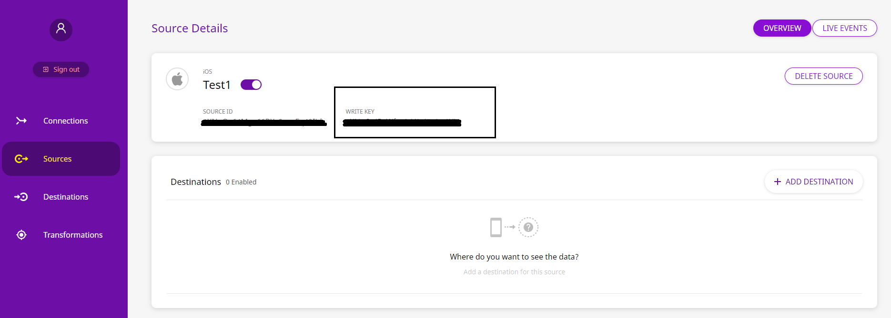

# iOS

## What is the RudderStack iOS SDK?

The RudderStack iOS SDK allows you to integrate RudderStack to your iOS application in order to track event data from your app. After integrating this SDK, you will also be able to send this data to your preferred analytics destination/s such as Google Analytics, Amplitude, and more.

<div class="successBlock">

  You can check the <a href="https://github.com/rudderlabs/rudder-sdk-ios">codebase on
  GitHub</a> if you want to get more
  hands-on information or are keen to know the SDK architecture.
</div>

<div class="successBlock">

  Starting from version <strong>1.1.0</strong>, the iOS SDK supports the <b>tvOS</b> platform.  You can now integrate the SDK with your tvOS apps and seamlessly track the user events without the need for any additional configuration.
</div>


## SDK Setup Requirements

To set up the RudderStack iOS SDK, there are a few prerequisites as mentioned below:

- You will need to set up a [RudderStack Account](https://app.rudderstack.com).
- Once signed up, your `iOS` source `writeKey` will appear in the dashboard, as shown:


<span class="imageTitle">iOS source writeKey on the RudderStack Dashboard</span>

- You will also need your Data Plane URL. Simply put, the Data Plane URL is used to connect to the RudderStack backend for processing and routing your events.

<div class="infoBlock">

To get the **Data Plane URL**:

<ul>
  <li>
    
    If you're using the <strong>open-source</strong> version of RudderStack, you
    are required to set up your own data plane by <a href="https://rudderstack.com/docs/get-started/installing-and-setting-up-rudderstack/">
      installing and setting up RudderStack
    </a>
    in your preferred dev environment.
  </li>
  <li>
    
    If you're using the <strong>enterprise</strong> version of RudderStack, please
    contact us for the data plane URL with the email ID used to sign up for RudderStack.
  </li>
</ul>

  </div>

- You will also need a Mac with the latest version of [Xcode](https://developer.apple.com/xcode/).

## Installing the RudderStack iOS SDK

We distribute our iOS SDK through [Cocoapods](https://cocoapods.org) and [Carthage](https://github.com/Carthage/Carthage). The recommended and easiest way to add the SDK to your project is through `Podfile`. Follow these steps:

<Tabs>
  <TabList>
    <Tab>CocoaPods</Tab>
    <Tab>Carthage</Tab>
  </TabList>
  <TabPanels>
    <TabPanel>
      <ul>
      <li>Add the RudderStack SDK to your <code class="inline-code">Podfile</code>, as shown:
<span>

```ruby
pod 'Rudder'
```
</span>
      </li>
      <li>Then, run the following command:
<span>

```bash
pod install
```
</span>
      </li>
      </ul>
    </TabPanel>
    <TabPanel>
      <ul>
      <li>Add the RudderStack SDK to your <code class="inline-code">Cartfile</code>, as shown:
<span>

```ruby
github "rudderlabs/rudder-sdk-ios"
```
</span>
      </li>
      <li>Then, run the following command:
<span>

```bash
carthage update
```
</span>
      </li>
      </ul>
    </TabPanel>
  </TabPanels>
</Tabs>

<div class="warningBlock">

**Important**: Remember to include the following code in all <code class="inline-code">.m</code> and <code class="inline-code">.h</code> files or your <code class="inline-code">.swift</code> files where you want to refer to or use RudderStack SDK classes.

</div>

<Tabs>
  <TabList>
    <Tab>Objective-C</Tab>
    <Tab>Swift</Tab>
  </TabList>
    <TabPanels>
      <TabPanel>
<span>

```objectivec
#import <Rudder/Rudder.h>
```
</span>
      </TabPanel>
      <TabPanel>
<span>

```swift
import Rudder
```
</span>
      </TabPanel>
    </TabPanels>
</Tabs>

<div class="dangerBlock">

We use SQLite to save the events to local database before sending it to RudderStack data-plane. Making calls like <code class="inline-code">SQLite.shutdown()</code> which is not thread-safe might lead to unexpected crash.

</div>

## Initializing the RudderStack Client

Put this code in your `AppDelegate.m` file under the method `didFinishLaunchingWithOptions`:

<Tabs>
  <TabList>
    <Tab>Objective-C</Tab>
    <Tab>Swift</Tab>
  </TabList>
    <TabPanels>
      <TabPanel>
<span>

```objectivec
RSConfigBuilder *builder = [[RSConfigBuilder alloc] init];
[builder withDataPlaneUrl:DATA_PLANE_URL];
[RSClient getInstance:WRITE_KEY config:[builder build]];
```
</span>
A shared instance of <code class="inline-code">RSClient</code> is accessible after the initialization by <code class="inline-code">[RSClient sharedInstance]</code>.
      </TabPanel>
      <TabPanel>
<span>

```swift
let builder: RSConfigBuilder = RSConfigBuilder()
    .withDataPlaneUrl(DATA_PLANE_URL)
RSClient.getInstance(WRITE_KEY, config: builder.build())
```
</span>
A shared instance of <code class="inline-code">RSClient</code> is accesible after the initialization by <code class="inline-code">RSClient.sharedInstance()</code>
      </TabPanel>
    </TabPanels>
</Tabs>


<div class="infoBlock">

We automatically track the following optional events:
<ol>
<li><code class="inline-code">Application Installed</code></li>
<li><code class="inline-code">Application Updated</code></li>
<li><code class="inline-code">Application Opened</code></li>
<li><code class="inline-code">Application Backgrounded</code></li>
</ol>
You can disable these events using the <code class="inline-code">withTrackLifecycleEvents</code> method of <code class="inline-code">RSConfigBuilder</code> and passing <code class="inline-code">false</code>. However, it is highly recommended to keep them enabled.

</div>

RudderStack supports all the major API calls across all iOS devices via the SDK. These include the `track`, `identify`, and `screen` calls.

## Enabling/Disabling User Tracking via the optOut API \(GDPR Support\)

RudderStack gives the users \(e.g., an EU user\) the ability to opt out of tracking any user activity until the user gives their consent. You can do this by leveraging RudderStack's `optOut` API.

The `optOut` API takes `YES` or `NO` as a Boolean value to enable or disable tracking user activities. This flag persists across device reboots.

The following snippet highlights the use of the `optOut` API to disable user tracking::

<!--

```objectivec
[[RSClient sharedInstance] optOut:YES];
```



```swift
RSClient.sharedInstance()?.optOut(true)
```

 -->

<Tabs>
  <TabList>
    <Tab>Objective-C</Tab>
    <Tab>Swift</Tab>
  </TabList>
    <TabPanels>
      <TabPanel>
<span>

```objectivec
[[RSClient sharedInstance] optOut:YES];
```
</span>
      </TabPanel>
      <TabPanel>
<span>

```swift
RSClient.sharedInstance()?.optOut(true)
```
</span>
      </TabPanel>
    </TabPanels>
</Tabs>

Once the user grants their consent, you can enable user tracking once again by using the `optOut` API with `NO` or `false` as a parameter sent to it, as shown:

<!--

```objectivec
[[RSClient sharedInstance] optOut:NO];
```



```swift
RSClient.sharedInstance()?.optOut(false)
```

 -->

<Tabs>
  <TabList>
    <Tab>Objective-C</Tab>
    <Tab>Swift</Tab>
  </TabList>
    <TabPanels>
      <TabPanel>
<span>

```objectivec
[[RSClient sharedInstance] optOut:NO];
```
</span>
      </TabPanel>
      <TabPanel>
<span>

```swift
RSClient.sharedInstance()?.optOut(false)
```
</span>
      </TabPanel>
    </TabPanels>
</Tabs>

<div class="infoBlock">

The `optOut` API is available in the RudderStack iOS SDK starting from version `1.0.24`.
</div>

## Track

You can record the users' activity through the `track` method. Every action performed by the user is called an `event`.

An example `track` event is as shown:

<Tabs>
  <TabList>
    <Tab>Objective-C</Tab>
    <Tab>Swift</Tab>
  </TabList>
    <TabPanels>
      <TabPanel>
<span>

```objectivec
[[RSClient sharedInstance] track:@"simple_track_with_props" properties:@{
    @"key_1" : @"value_1",
    @"key_2" : @"value_2"
}];
```
</span>
      </TabPanel>
      <TabPanel>
<span>

```swift
RSClient.sharedInstance()?.track("test_user_id", properties: [
    "key_1": "value_1",
    "key_2": "value_2"
])
```
</span>
      </TabPanel>
    </TabPanels>
</Tabs>


The `track` method accepts the following parameters:

| Name         | Data Type      | Required | Description                                                 |
| :----------- | :------------- | :------- | :---------------------------------------------------------- |
| `eventName`  | `NSString`     | Yes      | Name of the event you want to track                         |
| `properties` | `NSDictionary` | No       | Extra data properties you want to send along with the event |
| `options`    | `RudderOption` | No       | Extra event options                                         |

## Identify

We capture `deviceId` and use that as `anonymousId` for identifying the user. To attach more information to the user, you can use the `identify` method. Once you set the `identify` information to the user, those will be passed to the successive `track` or `screen` calls. To reset the user identification, you can use the `reset` method.

<div class="infoBlock">

According to the Apple <a href="https://developer.apple.com/documentation/uikit/uidevice/1620059-identifierforvendor">documentation</a>, if the device has multiple apps from the same vendors, all those apps will be assigned the same <code class="inline-code">deviceId</code>. If all the applications from a vendor are uninstalled, then on next install the app will be assigned a new <code class="inline-code">deviceId</code>.

</div>

An example `identify` event is as shown:

<Tabs>
  <TabList>
    <Tab>Objective-C</Tab>
    <Tab>Swift</Tab>
  </TabList>
    <TabPanels>
      <TabPanel>
<span>

```objectivec
[[RSClient sharedInstance] identify:@"test_user_id"
traits:@&#123;@"foo": @"bar",
        @"foo1": @"bar1",
        @"email": @"test@gmail.com",
        @"key_1" : @"value_1",
        @"key_2" : @"value_2"
&#125;
];
```
</span>
      </TabPanel>
      <TabPanel>
<span>

```swift
RSClient.sharedInstance()?.identify("test_user_id", traits: [
    "key_1": "value_1",
    "key_2": "value_2",
    "email": "test@gmail.com"
])
```
</span>
      </TabPanel>
    </TabPanels>
</Tabs>

The `identify` method accepts the following parameters:

| Name      | Data Type      | Required | Description                                                                                          |
| :-------- | :------------- | :------- | :--------------------------------------------------------------------------------------------------- |
| `userId`  | `NSString`     | Yes      | Developer identity for the user.                                                                     |
| `traits`  | `NSDictionary` | No       | Traits information for user. Use `dict` method of `RudderTraits` to convert to `NSDictionary` easily |
| `options` | `RudderOption` | No       | Extra options for the `identify` event.                                                              |

## Screen

You can use the `screen` call to record whenever the user sees a screen on the mobile device. You can also send some extra properties along with this event.

An example of the `screen` event is as shown:

<!--


```objectivec
[[RSClient sharedInstance] screen:@"ViewController"];
```





```swift
RSClient.sharedInstance()?.screen("ViewController")
```


 

<Tabs>
  <TabList>
    <Tab>Objective-C</Tab>
    <Tab>Swift</Tab>
  </TabList>
    <TabPanels>
      <TabPanel>
<span>

```objectivec
[[RSClient sharedInstance] screen:@"ViewController"];
```
</span>
      </TabPanel>
      <TabPanel>
<span>

```swift
RSClient.sharedInstance()?.screen("ViewController")
```
</span>
      </TabPanel>
    </TabPanels>
</Tabs>-->

The `screen` method accepts the following parameters:

| Name         | Data Type      | Required | Description                                                              |
| :----------- | :------------- | :------- | :----------------------------------------------------------------------- |
| `screenName` | `NSString`     | Yes      | Name of the viewed screen                                                |
| `properties` | `NSDictionary` | No       | Extra property object that you want to pass along with the `screen` call |
| `options`    | `RudderOption` | No       | Extra options to be passed along with the `screen` event                 |

## Group

The `group` call associates a user to a specific organization. A sample `group` call for the API is below:

<!--


```kotlin
[[RSClient sharedInstance] group:@"sample_group_id"
                              traits:@{@"foo": @"bar",
                                       @"foo1": @"bar1",
                                       @"email": @"ruchira@gmail.com"}
];
```





```java
RSClient.sharedInstance()?.group("test_group_id", traits: [
    "key_1": "value_1",
    "key_2": "value_2"
])
```


-->

<Tabs>
  <TabList>
    <Tab>Objective-C</Tab>
    <Tab>Swift</Tab>
  </TabList>
    <TabPanels>
      <TabPanel>
<span>

```objectivec
[[RSClient sharedInstance] group:@"sample_group_id"
  traits:@{@"foo": @"bar",
            @"foo1": @"bar1",
            @"email": @"ruchira@gmail.com"}
];
```
</span>
      </TabPanel>
      <TabPanel>
<span>

```swift
RSClient.sharedInstance()?.group("test_group_id", traits: [
    "key_1": "value_1",
    "key_2": "value_2"
])
```
</span>
      </TabPanel>
    </TabPanels>
</Tabs>

Alternatively, you can use the following method signature

| Name      | Data Type      | Required | Description                                                                 |
| :-------- | :------------- | :------- | :-------------------------------------------------------------------------- |
| `groupId` | `String`       | Yes      | An ID of the organization with which you want to associate your user        |
| `traits`  | `NSDictionary` | No       | Any other property of the organization you want to pass along with the call |
| `options` | `RudderOption` | No       | Event level options                                                         |

We don't persist the traits for the group across the sessions.

## Alias

The `alias` call associates the user with a new identification. A sample `alias` call for the API is below:

<!--


```kotlin
[[RSClient sharedInstance] alias:@"new_user_id"];
```





```java
RSClient.sharedInstance()?.alias("new_user_id")
```


-->

<Tabs>
  <TabList>
    <Tab>Objective-C</Tab>
    <Tab>Swift</Tab>
  </TabList>
    <TabPanels>
      <TabPanel>
<span>

```objectivec
[[RSClient sharedInstance] alias:@"new_user_id"];
```
</span>
      </TabPanel>
      <TabPanel>
<span>

```swift
RSClient.sharedInstance()?.alias("new_user_id")
```
</span>
      </TabPanel>
    </TabPanels>
</Tabs>

Alternatively, you can use the following method signature

| Name      | Data Type      | Required | Description                                     |
| :-------- | :------------- | :------- | :---------------------------------------------- |
| `newId`   | `String`       | Yes      | The new `userId` you want to assign to the user |
| `options` | `RudderOption` | No       | Event level option                              |

We replace the old `userId` with the `newUserId` and we persist that identification across the sessions.

## Reset

You can use the `reset` method to clear the persisted `traits` for the `identify` call. This is required for the `Logout` operations.

<!--


```objectivec
[[RSClient sharedInstance] reset];
```





```swift
RSClient.sharedInstance()?.reset()
```


 -->

<Tabs>
  <TabList>
    <Tab>Objective-C</Tab>
    <Tab>Swift</Tab>
  </TabList>
    <TabPanels>
      <TabPanel>
<span>

```objectivec
[[RSClient sharedInstance] reset];
```
</span>
      </TabPanel>
      <TabPanel>
<span>

```swift
RSClient.sharedInstance()?.reset()
```
</span>
      </TabPanel>
    </TabPanels>
</Tabs>

## Configuring the RudderStack Client

You can configure your client based on the following parameters using `RudderConfigBuilder`:

| Parameter               | Type      | Description                                                                                                                                                                                                                                                    | Default Value                                                              |
| :---------------------- | :-------- | :------------------------------------------------------------------------------------------------------------------------------------------------------------------------------------------------------------------------------------------------------------- | :------------------------------------------------------------------------- |
| `logLevel`              | `int`     | Controls how much of the log you want to see from the SDK.                                                                                                                                                                                                     | `RSLogLevelNone`                                                           |
| `dataPlaneUrl`          | `string`  | Your Data Plane URL.                                                                                                                                                                                                                                           | `https://hosted.rudderlabs.com` |
| `flushQueueSize`        | `int`     | Number of events in a batch request sent to the server.                                                                                                                                                                                                        | `30`                                                                       |
| `dbThresholdCount`      | `int`     | Number of events to be saved in the `SQLite` database. Once the limit is reached, older events are deleted from the DB.                                                                                                                                        | `10000`                                                                    |
| `sleepTimeout`          | `int`     | Minimum waiting time to flush the events to the server .                                                                                                                                                                                                       | `10 seconds`                                                               |
| `configRefreshInterval` | `int`     | Fetches the config from `dashboard` after the specified time \(in hours\).                                                                                                                                                                                     | `2`                                                                        |
| `trackLifecycleEvents`  | `boolean` | Specify whether the SDK will capture application life cycle events automatically.                                                                                                                                                                              | `true`                                                                     |
| `recordScreenViews`     | `boolean` | Specify whether the SDK will capture screen view events automatically.                                                                                                                                                                                         | `false`                                                                    |
| `controlPlaneUrl`       | `string`  | This parameter should be changed **only if** you are self-hosting the Control Plane. Check the section **Self-Hosted Control Plane** below for more information. The iOS SDK will add `/sourceConfig` along with this URL to fetch the required configuration. | `https://api.rudderlabs.com`       |

### Self-Hosted Control Plane

If you are using a device mode destination like Adjust, Firebase, etc., the iOS SDK needs to fetch the required configuration from the Control Plane. If you are using the [**Control Plane Lite**](https://rudderstack.com/docs/get-started/control-plane-lite/) utility to host your own Control Plane, then follow [this guide](https://rudderstack.com/docs/user-guides/how-to-guides/rudderstack-control-plane-lite/#what-is-the-control-plane-url) and specify `controlPlaneUrl` in `RudderConfigBuilder` that points to your hosted source configuration file.

<div class="warningBlock">

You shouldn't pass the <code class="inline-code">controlPlaneUrl</code> parameter during SDK initialization if you are using <a href="https://app.rudderstack.com">RudderStack Cloud</a>. This parameter is supported only if you are using our open-source <a href="https://rudderstack.com/docs/user-guides/how-to-guides/rudderstack-control-plane-lite/">Control Plane Lite</a> utility to self-host your Control Plane.

</div>

## Setting Device Token

You can pass your `device-token` for Push Notifications to be passed to the destinations which support Push Notification. We set the `token` under `context.device.token`.

Follow the instructions below:

```objectivec
[[[RSClient sharedInstance] getContext] putDeviceToken:@"your_device_token"];
```

## Advertisement ID

We have kept IDFA collection completely separate from the Core library so that the developer has better control over the same. You can pass the IDFA to `putAdvertisementId` method to set it under `context.device.advertisingId`

Follow the instructions below:

```objectivec
#import <AdSupport/ASIdentifierManager.h>

- (BOOL)application:(UIApplication *)application didFinishLaunchingWithOptions:(NSDictionary *)launchOptions
{
    // Override point for customization after application launch.
    RSConfigBuilder *builder = [[RSConfigBuilder alloc] init];
    [builder withDataPlaneURL:[[NSURL alloc] initWithString:DATA_PLANE_URL]];
    [RSClient getInstance:WRITE_KEY config:[builder build]];

    [[[RSClient sharedInstance] getContext] putAdvertisementId:[self getIDFA]];

    return YES;
}

- (NSString*) getIDFA {
    return [[[ASIdentifierManager sharedManager] advertisingIdentifier] UUIDString];
}
```

## ATTrackingManager Authorization Consent

You can pass the [ATTrackingManager.trackingAuthorizationStatus](https://developer.apple.com/documentation/apptrackingtransparency/attrackingmanager/3547038-trackingauthorizationstatus) to RudderStack and we'll pass it along to the relevant destinations wherever needed. For example AppsFlyer accepts this parameter for the attribution to work in their [S2S mode](https://support.appsflyer.com/hc/en-us/articles/207034486-Server-to-server-events-API-for-mobile-S2S-mobile-#att-3).

Follow the instructions below:

```objectivec
- (BOOL)application:(UIApplication *)application didFinishLaunchingWithOptions:(NSDictionary *)launchOptions
{
    // Override point for customization after application launch.
    RSConfigBuilder *builder = [[RSConfigBuilder alloc] init];
    [builder withDataPlaneURL:[[NSURL alloc] initWithString:DATA_PLANE_URL]];
    [RSClient getInstance:WRITE_KEY config:[builder build]];

    [[[RSClient sharedInstance] getContext] putAppTrackingConsent:RSATTAuthorize];

    return YES;
}
```

Following are the available options you can pass to the `putAppTrackingConsent` method.

- `RSATTNotDetermined`
- `RSATTRestricted`
- `RSATTDenied`
- `RSATTAuthorize`

## Anonymous ID

We use the `deviceId` as `anonymousId` by default. You can use the following method to override and use your own `anonymousId` with the SDK.

<div class="warningBlock">

You need to call <code class="inline-code">setAnonymousId</code> method before calling <code class="inline-code">getInstance</code>

</div>

An example of setting the `anonymousId` is as below

```java
[RSClient setAnonymousId:<ANONYMOUS_ID>];
```

## Enabling / Disabling Events for Specific Destinations

The RudderStack iOS SDK allows you to enable or disable event flow to a specific destination or all the destinations to which the source is connected. You can specify these destinations by creating a `RSOption` object as shown:

<Tabs>
  <TabList>
    <Tab>Objective-C</Tab>
    <Tab>Swift</Tab>
  </TabList>
    <TabPanels>
      <TabPanel>
<span>

```objectivec
RSOption *option = [[RSOption alloc]init];
//default value for `All` is true
[option putIntegration:@"All" isEnabled:YES];
// specifying destination by its display name
[option putIntegration:@"Amplitude" isEnabled:YES];
[option putIntegration:@"&lt;destination display name&gt;" isEnabled:&lt;BOOL&gt;];
// specifying destination by its Factory instance
[option putIntegrationWithFactory:[RudderMoengageFactory instance] isEnabled:NO];
[option putIntegrationWithFactory:[&lt;RudderIntegrationFactory&gt; instance] isEnabled:&lt;BOOL&gt;];
```
</span>
      </TabPanel>
      <TabPanel>
<span>

```swift
let option:RSOption = RSOption();
//default value for `All` is true
option.putIntegration("All", isEnabled:true)
// specifying destination by its display name
option.putIntegration("Amplitude", isEnabled:true)
option.putIntegration(&lt;DESTINATION DISPLAY NAME&gt;, isEnabled:&lt;BOOL&gt;)
// specifying destination by its Factory instance
option.putIntegration(with: RudderMoengageFactory.instance(), isEnabled: true);
option.putIntegration(with: &lt;RudderIntegrationFactory&gt;.instance(), isEnabled:&lt;BOOL&gt;);
```
</span>
      </TabPanel>
    </TabPanels>
</Tabs>

<div class="infoBlock">

The keyword <code class="inline-code">All</code> in the above snippet represents all the destinations the source is connected to. Its value is set to <code class="inline-code">true</code> by default.
</div>

<div class="infoBlock">

Make sure the <code class="inline-code">destination display name</code> you pass while specifying the custom destinations should exactly match the destination name as shown <a href="https://app.rudderstack.com/directory">here</a>.
</div>

You can pass the destination\(s\) specified in the above snippet to the SDK in two ways:

### 1. Passing the destinations while initializing the SDK:

This is helpful when you want to enable/disable sending the events across all the event calls made using the SDK to the specified destination\(s\).

<!--


```objectivec
RSConfigBuilder *builder = [[RSConfigBuilder alloc] init];
[builder withDataPlaneURL:[[NSURL alloc] initWithString:DATA_PLANE_URL]];
[builder withLoglevel:RSLogLevelDebug];
[builder withTrackLifecycleEvens:YES];
[builder withRecordScreenViews:YES;
[RSClient getInstance:WRITE_KEY config:[builder build] options:option]; // passing the rudderoption object containing the list of destination(s) you specified
```





```swift
let builder: RSConfigBuilder = RSConfigBuilder()
            .withLoglevel(RSLogLevelDebug)
            .withDataPlaneUrl(DATA_PLANE_URL)
            .withTrackLifecycleEvens(true)
            .withRecordScreenViews(true)
RSClient.getInstance(WRITE_KEY, config: builder.build(),options: option)// passing the rudderoption object containing the list of destination(s) you specified
```


 -->

<Tabs>
  <TabList>
    <Tab>Objective-C</Tab>
    <Tab>Swift</Tab>
  </TabList>
    <TabPanels>
      <TabPanel>
<span>

```objectivec
RSConfigBuilder *builder = [[RSConfigBuilder alloc] init];
[builder withDataPlaneURL:[[NSURL alloc] initWithString:DATA_PLANE_URL]];
[builder withLoglevel:RSLogLevelDebug];
[builder withTrackLifecycleEvens:YES];
[builder withRecordScreenViews:YES;
[RSClient getInstance:WRITE_KEY config:[builder build] options:option]; // passing the rudderoption object containing the list of destination(s) you specified
```
</span>
      </TabPanel>
      <TabPanel>
<span>

```swift
let builder: RSConfigBuilder = RSConfigBuilder()
            .withLoglevel(RSLogLevelDebug)
            .withDataPlaneUrl(DATA_PLANE_URL)
            .withTrackLifecycleEvens(true)
            .withRecordScreenViews(true)
RSClient.getInstance(WRITE_KEY, config: builder.build(),options: option)// passing the rudderoption object containing the list of destination(s) you specified
```
</span>
      </TabPanel>
    </TabPanels>
</Tabs>

### 2. Passing the destinations while making any event call:

This approach is helpful when you want to enable/disable sending only a particular event to the specified destination\(s\) or if you want to override the specified destinations passed with the SDK initialization for a particular event.

<!--


```objectivec
[[RSClient sharedInstance] track:@"simple_track_with_props" properties:@{
        @"key_1" : @"value_1",
        @"key_2" : @"value_2"
    } options:option]; // passing the rudderoption object containing the list of destination(s) you specified
```





```swift
let rudder: RSClient? = RSClient.sharedInstance()
rudder?.track("track_with_props", properties: [
            "key_1": "value_1",
            "key_2": "value_2",
        ],options:option) // passing the rudderoption object containing the list of destination(s) you specified
```


-->

<Tabs>
  <TabList>
    <Tab>Objective-C</Tab>
    <Tab>Swift</Tab>
  </TabList>
    <TabPanels>
      <TabPanel>
<span>

```objectivec
[[RSClient sharedInstance] track:@"simple_track_with_props" properties:@&#123;
        @"key_1" : @"value_1",
        @"key_2" : @"value_2"
    &#125; options:option]; // passing the rudderoption object containing the list of destination(s) you specified
```
</span>
      </TabPanel>
      <TabPanel>
<span>

```swift
let rudder: RSClient? = RSClient.sharedInstance()
rudder?.track("track_with_props", properties: [
            "key_1": "value_1",
            "key_2": "value_2",
        ],options:option) // passing the rudderoption object containing the list of destination(s) you specified
```
</span>
      </TabPanel>
    </TabPanels>
</Tabs>

<div class="infoBlock">

If you specify the destinations both while initializing the SDK as well as making an event call, then the destinations specified at the event level only will be considered.

</div>

## External ID

You can pass your custom `userId` along with standard `userId` in your `identify` calls. We add those values under `context.externalId`. The following code snippet shows a way to add `externalId` to your `identify` request.

```objectivec
RSOption *identifyOptions = [[RSOption alloc] init];
[identifyOptions putExternalId:@"brazeExternalId" withId:@"some_external_id_1"];
[[RSClient sharedInstance] identify:@"testUserId"
                             traits:@{@"firstname": @"First Name"}
                            options:identifyOptions];
```

## Debugging

If you run into any issues regarding the RudderStack iOS SDK, you can turn on the `VERBOSE` or `DEBUG` logging to find out what the issue is. To turn on the logging, change your `RudderClient` initialization to the following:

<!--


```objectivec
RSConfigBuilder *builder = [[RSConfigBuilder alloc] init];
[builder withDataPlaneUrl:DATA_PLANE_URL];
[builder withLoglevel:RudderLogLevelDebug];
[RSClient getInstance:WRITE_KEY config:[builder build]];
```





```swift
let builder: RSConfigBuilder = RSConfigBuilder()
builder.withDataPlaneUrl(<DATA_PLANE_URL>)
builder.withLoglevel(RudderLogLevelDebug)
RSClient.getInstance(<WRITE_KEY>, config: builder.build())
```


 -->

<Tabs>
  <TabList>
    <Tab>Objective-C</Tab>
    <Tab>Swift</Tab>
  </TabList>
    <TabPanels>
      <TabPanel>
<span>

```objectivec
RSConfigBuilder *builder = [[RSConfigBuilder alloc] init];
[builder withDataPlaneUrl:DATA_PLANE_URL];
[builder withLoglevel:RudderLogLevelDebug];
[RSClient getInstance:WRITE_KEY config:[builder build]];
```
</span>
      </TabPanel>
      <TabPanel>
<span>

```swift
let builder: RSConfigBuilder = RSConfigBuilder()
builder.withDataPlaneUrl(&lt;DATA_PLANE_URL&gt;)
builder.withLoglevel(RudderLogLevelDebug)
RSClient.getInstance(&lt;WRITE_KEY&gt;, config: builder.build())
```
</span>
      </TabPanel>
    </TabPanels>
</Tabs>

## Can I develop a Device Mode destination if RudderStack doesn't support it already?

<div class="infoBlock">

More information on the RudderStack Device Mode can be found in the <a href="https://rudderstack.com/docs/connections/rudderstack-connection-modes//">RudderStack Connection Modes</a> guide.
</div>

Yes, you can develop a Device Mode destination by following these steps:

- Create a `CustomFactory.h` file by extending [`RSIntegrationFactory`](https://github.com/rudderlabs/rudder-sdk-ios/blob/master/Rudder/RSIntegrationFactory.h), as shown:

```objectivec
#import <Foundation/Foundation.h>
#import <Rudder/Rudder.h>

NS_ASSUME_NONNULL_BEGIN

@interface CustomFactory : NSObject<RSIntegrationFactory>

+ (instancetype) instance;

@end

NS_ASSUME_NONNULL_END
```

- Then, create a `CustomFactory.m` file, as shown:

```objectivec
#import <Foundation/Foundation.h>
#import <Rudder/Rudder.h>
#import "CustomFactory.h"
#import "CustomIntegration.h"


@implementation CustomFactory

+ (instancetype)instance {
    static CustomFactory *sharedInstance;
    static dispatch_once_t onceToken;
    dispatch_once(&onceToken, ^{
        sharedInstance = [[self alloc] init];
    });
    return sharedInstance;
}

- (instancetype)init
{
    self = [super init];
    return self;
}

- (nonnull NSString *)key {
    return @"Custom Factory";
}

- (nonnull id<RSIntegration>)initiate:(NSDictionary *)config client:(nonnull RSClient *)client rudderConfig:(nonnull RSConfig *)rudderConfig {
    return [[CustomIntegration alloc] initWithConfig:config withAnalytics:client];
}


@end
```

- Next, create a `CustomIntegration.h` file by extending [`RSIntegration`](https://github.com/rudderlabs/rudder-sdk-ios/blob/master/Rudder/RSIntegration.h).

```objectivec
#import <Foundation/Foundation.h>
#import <Rudder/Rudder.h>

NS_ASSUME_NONNULL_BEGIN

@interface CustomIntegration : NSObject<RSIntegration>

@property (nonatomic, strong) NSDictionary *config;
@property (nonatomic, strong) RSClient *client;

- (instancetype)initWithConfig:(NSDictionary *)config withAnalytics:(RSClient *)client;

@end

NS_ASSUME_NONNULL_END
```

- Next, create a `CustomIntegration.m` file.

```objectivec
#import <Foundation/Foundation.h>
#import <Rudder/Rudder.h>
#import "CustomIntegration.h"

@implementation CustomIntegration

- (instancetype) initWithConfig:(NSDictionary *)config withAnalytics:(RSClient *)client {
    if (self == [super init]) {
    }
    return self;
}

- (void) processRuderEvent:(nonnull RSMessage *)message {
    NSString *type = message.type;
    if ([type isEqualToString:@"identify"]) {
//        Do something
    } else if ([type isEqualToString:@"track"]) {
//        Do something
    } else if ([type isEqualToString:@"screen"]) {
//        Do something
    } else {
        [RSLogger logWarn:@"MessageType is not supported"];
    }
}

- (void) dump:(nonnull RSMessage *)message {
    [self processRuderEvent:message];
}

- (void) reset {
}

- (void) flush {
}

@end
```

- Register the `CustomFactory` with the RudderStack iOS SDK during its initialization, as shown:

```objectivec
    RSConfigBuilder *builder = [[RSConfigBuilder alloc] init];
    [builder withDataPlaneURL:[[NSURL alloc] initWithString:DATA_PLANE_URL]];
    [builder withLoglevel:RSLogLevelDebug];
    [builder withTrackLifecycleEvens:NO];
    [builder withRecordScreenViews:NO];
    [builder withCustomFactory:[CustomFactory instance]];
    [RSClient getInstance:WRITE_KEY config:[builder build]];
```

Some pointers to keep in mind:

- RudderStack's iOS SDK dumps every event it receives to the `dump()` method of the `CustomFIntegration` class. From here, you can process the event and hand it over to the native SDK of the Device Mode destination.
- The SDK also triggers the `reset()` method of the `CustomFactory` class on every `reset()` call made via the SDK. You can use this to handle the destination-specific reset logic.
- Make sure you do not duplicate the value of `KEY` present inside `CustomFactory`, across multiple `CustomFactory` that you develop.
- RudderStack's iOS SDK also triggers the `flush()` method of the `CustomFactory` class on every `flush()` call made via the SDK, which you can use to handle the destination-specific reset logic. You can make a `flush` call using the SDK as shown:

```objectivec
[[RSClient sharedInstance] flush];
```

## FAQ

### I'm facing issues building with Carthage on XCode 12. What should I do?

If you're facing an issue with Carthage and XCode 12, you can follow [**this workaround**](https://github.com/Carthage/Carthage/blob/master/Documentation/Xcode12Workaround.md) suggested by the Carthage team.

### Does the SDK support tvOS ?

As of version `1.1.0`, the iOS SDK supports the [**tvOS**](https://developer.apple.com/tvos/) platform.

### How do I migrate from v1.0.2?

Update the usage of the following classes as per the table below:

<table>
  <thead>
    <tr>
      <th style="text-align:left">
        <b>Previous Name</b>
      </th>
      <th style="text-align:left">
        <b>Updated Name</b>
      </th>
    </tr>
  </thead>
  <tbody>
    <tr>
      <td style="text-align:left">
        <code class="inline-code">RudderClient</code>
      </td>
      <td style="text-align:left">
        <code class="inline-code">RSClient</code>
      </td>
    </tr>
    <tr>
      <td style="text-align:left">
        <code class="inline-code">RudderConfig</code>
      </td>
      <td style="text-align:left">
        <code class="inline-code">RSConfig</code>
      </td>
    </tr>
    <tr>
      <td style="text-align:left">
        <code class="inline-code">RudderConfigBuilder</code>
      </td>
      <td style="text-align:left">
        <code class="inline-code">RSConfigBuilder</code>
      </td>
    </tr>
    <tr>
      <td style="text-align:left">
        <code class="inline-code">RudderLogLevelDebug</code>
      </td>
      <td style="text-align:left">
        <p>
          <code class="inline-code">RSLogLevelDebug</code>
        </p>
        <p></p>
        <p>
          Other <code class="inline-code">LogLevel</code> follows the same nomenclature.
        </p>
      </td>
    </tr>
  </tbody>
</table>

### How can I get the user `traits` after making the `identify` call?

You can get the user traits after making an `identify` call in the following way:

<!--


```swift
 let traits = RSClient.sharedInstance()?.getContext().traits
```





```
 NSDictionary* traits = [[RSClient sharedInstance] getContext].traits;
```


 -->

<Tabs>
  <TabList>
    <Tab>Swift</Tab>
    <Tab>Objective-C</Tab>
  </TabList>
    <TabPanels>
      <TabPanel>
<span>

```swift
let traits = RSClient.sharedInstance()?.getContext().traits
```
</span>
      </TabPanel>
      <TabPanel>
<span>

```
NSDictionary* traits = [[RSClient sharedInstance] getContext].traits;
```
</span>
      </TabPanel>
    </TabPanels>
</Tabs>

### How does the SDK handle different client/server errors?

In case of client-side errors, e.g. if the source write key passed to the SDK is incorrect, RudderStack gives you a **400 Bad Request** response and aborts the operation immediately. For other types of network errors \(e.g. Invalid Data Plane URL\), the SDK tries to flush the events to RudderStack in an incremental manner \(every 1 second, 2 seconds, 3 seconds, and so on\).

### **Why is there a larger difference between `timestamp` and `received_at` for iOS events vs. Android events?**

This scenario is most likely caused by the default behavior of iOS apps staying open in the background for a shorter period of time after a user closes them.

When a user closes an iOS or Android app, events will still continue to be sent from the queue until the app closes in the background as well. Any events still in the queue will remain there until the user reopens the app. Due to this lag, there are some scenarios where there can be significant differences between `timestamp` \(when the event was created\) and `received_at` \(when RudderStack actually receives the events\).

For Android apps, events can be sent from the background after apps close for a longer period of time than iOS apps, therefore, more of the events coming from the Android SDK have closer `timestamp` and `received_at` times.

### Does RudderStack integrate with SKAdNetwork?

RudderStack does not integrate with SKAdNetwork. However, SKAdNetwork can be directly integrated into an iOS application alongside RudderStack.

### Can I disable event tracking until the user gives their consent?

Yes, you can.

RudderStack gives you the ability to disable tracking any user activity until the user gives their consent, by leveraging the `optOut` API. This is required in cases where your app is audience-dependent \(e.g. minors\) or where you're using the app to track the user events \(e.g. EU users\) to meet the data protection and privacy regulations.

The `optOut` API takes `true` / `false` \(in case of Swift\) or `YES` / `NO` \(in case of Objective-C\) as a value to enable or disable tracking user activities. So, to disable user tracking, you can use the `optOut` API as shown:

<Tabs>
  <TabList>
    <Tab>Objective-C</Tab>
    <Tab>Swift</Tab>
  </TabList>
    <TabPanels>
      <TabPanel>
<span>

```objectivec
[[RSClient sharedInstance] optOut:YES];
```
</span>
      </TabPanel>
      <TabPanel>
<span>

```swift
RSClient.sharedInstance()?.optOut(true)
```
</span>
      </TabPanel>
    </TabPanels>
</Tabs>

Once the user gives their consent, you can enable user tracking again, as shown:

<Tabs>
  <TabList>
    <Tab>Objective-C</Tab>
    <Tab>Swift</Tab>
  </TabList>
    <TabPanels>
      <TabPanel>
<span>

```objectivec
[[RSClient sharedInstance] optOut:NO];
```
</span>
      </TabPanel>
           <TabPanel>
<span>

```swift
RSClient.sharedInstance()?.optOut(false)
```
</span>
      </TabPanel>
   </TabPanels>
</Tabs>

<div class="infoBlock">

For more information on the `optOut` API, refer to the [**Enabling/Disabling User Tracking via optOut API \(GDPR Support\)**](https://rudderstack.com/docs/stream-sources/rudderstack-sdk-integration-guides/rudderstack-ios-sdk#enabling-disabling-user-tracking-via-the-optout-api-gdpr-support) section above.
</div>

<div class="successBlock">

You only need to call the `optOut` API with the required parameter only once, as the information persists within the device even if you reboot it.
</div>

## Contact Us

If you come across any issues while using the RudderStack iOS SDK, you can [**contact us**](mailto:%20docs@rudderstack.com) or start a conversation on our [**Slack**](https://rudderstack.com/join-rudderstack-slack-community) channel.
