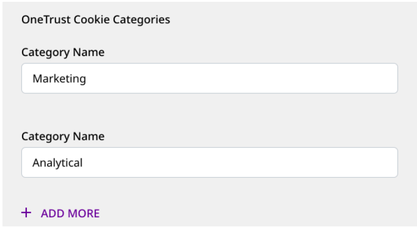

# OneTrust

[**OneTrust**](https://www.onetrust.com/) is a popular platform that provides data governance, privacy management, and security solutions to thousands of businesses around the world. Its consent management solutions are used by many digital marketing and engineering teams for implementing cookie compliance and consent management on various martech systems.

The JavaScript SDK integrates seamlessly with the OneTrust SDK and lets you map OneTrust cookie/consent groups to RudderStack's consent purposes. RudderStack, in turn, uses this consent information to enable/disable tracking and sending the data.

## How the integration works

Whenever a user starts browsing a website, OneTrust pops up a modal to take consent from that user. This modal contains a list of cookie groups representing the GDPR consent purposes that the user has declined or consented to.

The JavaScript SDK fetches these consented groups as well as the destination - OneTrust category mappings specified in the RudderStack dashboard. Depending on these settings, the SDK will filter the destinations.

## Setting up the integration

The following sections highlight the steps required to set up the JavaScript SDK integration with OneTrust.

### Step 1: Configuring OneTrust

Follow these steps to configure OneTrust for your web app:

- Create a OneTrust account. Make sure it has access to the **Cookie Compliance** app.

- Then, add your website and scan it.

- Next, go to the **Categorizations** section. Here, define the new categories or modify the existing ones, as per your requirement.

<div class="infoBlock">
 
The categories should associated with/attached to at least one cookie. You can use one of the RudderStack cookies as a workaround.
</div>

- Finally, go to the **Scripts** section and publish this script.

### Step 2: Specifying the OneTrust Cookie Categories in RudderStack

This step involves enabling OneTrust for a given JavaScript source. To do so, specify the consent category name as defined in OneTrust (**Step 1**) for each destination that is connected to **that** JavaScript source.



### Step 3: Setting up your website/web app

Before following the steps in this section, load the OneTrust script that you published in your web app in [**Step 1**](). A sample script is shown below:

```javascript
<!-- OneTrust Cookies Consent Notice start for samplewebsite.com -->
<script
        src="https://cdn.cookielaw.org/scripttemplates/otSDKStub.js"
        type="text/javascript"
        charset="UTF-8"
        data-domain-script="xxxxxxxx-xxxx-xxxx-xxxx-xxxxxxxxxxxx" >
</script>
<script type="text/javascript">
        // Required OneTrust callback
        function OptanonWrapper() { }
</script>
<!-- OneTrust Cookies Consent Notice end for samplewebsite.com -->
```

- Load the JavaScript SDK after the user provides the consent.

- Then, add the `cookieConsentManager` option in the `load()` call as shown in the following snippet:

```javascript
rudderanalytics.load(
  <WRITE_KEY>,
  <DATA_PLANE_URL>, {
    configUrl: "https://api.dev.rudderlabs.com",
    cookieConsentManager: {
      oneTrust: {
        enabled: true
      }
    }
  }
);
```

Once you complete these steps, RudderStack reads the consented categories and filters the destinations accordingly.

## Contact us

For queries on any of the sections covered in this guide, you can [**contact us**](mailto:%20docs@rudderstack.com) or start a conversation on our [**Slack**](https://rudderstack.com/join-rudderstack-slack-community) channel.
