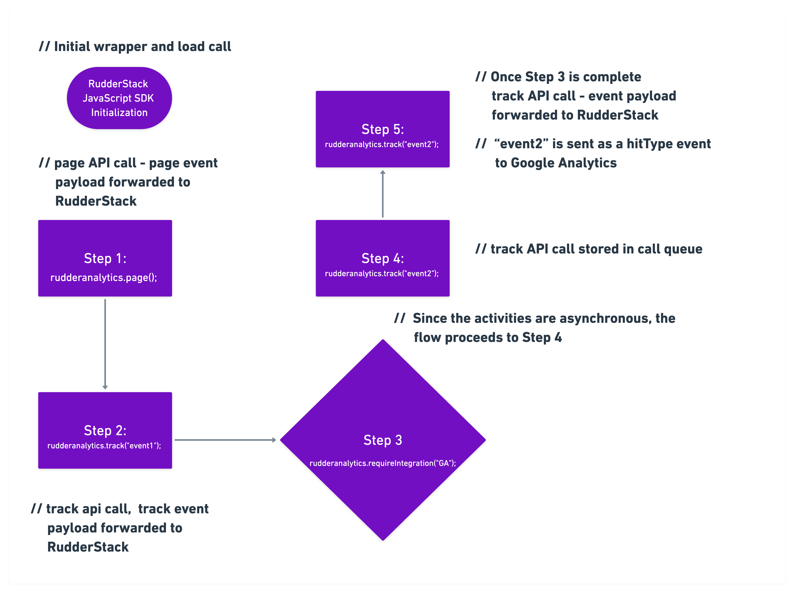

# JavaScript SDK Enhancements

In this document, we cover some of the finer technical details of the improvements that make our RudderStack JavaScript SDK more efficient and easier to use. These enhancements include:

* **`sendBeacon` interface support for sending event payloads**
* **Reducing the core SDK size by using explicit `requireIntegration` calls**

## **Added `sendBeacon` as a Transport Mechanism**

Our present JavaScript SDK hosted at [https://cdn.rudderlabs.com/v1/rudder-analytics.min.js](https://cdn.rudderlabs.com/v1/rudder-analytics.min.js) sends event payload using the **XHR** \(XMLHttpRequest\) API. We have now added support for sending the event payload using **`navigator.sendBeacon`** browser utility, which asynchronously sends a small amount of data over HTTP to the RudderStack server.

### Why Use sendBeacon to Send Your Event Payload?

There are 2 key advantages of using the navigator.sendBeacon utility to send your event payload:

* Since pushing events to the Beacon queue is faster compared to the XHR instrumentation, you may see some performance improvements in the JavaScript SDK. 
* The Beacon requests are optimized in the sense that browser waits until the CPU load is lower, or until the network is free before making the actual requests. This can lead to better website performance.


You can find the `sendBeacon` version of the RudderStack JavaScript SDK located at [https://cdn.rudderlabs.com/v2/rudder-analytics.min.js?transport=beacon](https://cdn.rudderlabs.com/v2/rudder-analytics.min.js?transport=beacon). For using its XMLHTTP version, please use [https://cdn.rudderlabs.com/v2/rudder-analytics.min.js](https://cdn.rudderlabs.com/v2/rudder-analytics.min.js?transport=beacon). 


### Important Notes

A couple of important pointers to note before you opt to use `sendBeacon` for sending your event payload:

* The Beacon requests sent from the SDK using `Navigator.sendBeacon()` only push the events to browser’s Beacon queue. As it depends on the browser's engine to send these events from the queue, RudderStack **cannot guarantee** the events getting discarded due to 5xx errors and other network-related errors \(request timed out, end resource unavailable, etc.\). 


If this is indeed a requirement for your site, we suggest you use the XHR version of the JavaScript SDK, where RudderStack retries event delivery based on status codes and other errors. 


* The Beacon queue maintained by browsers also has the limitation on the total size of elements present in the beacon queue at any snapshot, and peaks out at 64k. Thus, inherently sending very high frequency hits at one go from main thread is not supported, as the Beacon queue cannot take up cycles to dequeue itself.   The RudderStack JavaScript SDK handles this by maintaining a separate queue, which retries pushing events to the Beacon queue in case they fail to be pushed the first time. Our current queue handles approximately 500 hits per 30 ms and ensures eventual successful delivery of events after retries to Beacon. A similar comparison on Google Analytics’ `analytics.js` shows a hit rate of 2 hits/sec.

## Reduced **core SDK size by using explicit `requireIntegration`**

As we support more native destinations through our SDK, more instrumentation code gets added to it. This leads to an increase in the SDK size, and requires the browser to evaluate and parse more unused JavaScript.  

Therefore, we decided not to bundle these instrumentation codes for the end destinations in the core JavaScript SDK. Instead, the SDK will now only fetch the destination configuration settings from the RudderStack dashboard, such as track ID, API key, secret, etc. using the **`requireIntegration`** method.

### How It Works

Once the JavaScript SDK receives a call such as `rudderanalytics.requireIntegration("GA")`,  it automatically fetches the Google Analytics instrumentation code \(for e.g. `GAPlugin.js`\) that handles the transformation and mapping logic for the RudderStack event payload and the call type \(`track`, `page`, etc.\) to Google Analytics' corresponding payload and API calls \(for e.g. `send`, `set`, etc.\) 

The core SDK maintains a call queue, and the API calls to it are processed one after the other. The processing of this call queue will be blocked, once it encounters a call to the `requireIntegration` method. 

For instance, in the above call `rudderanalytics.requireIntegration("GA")`, the subsequent calls to the SDK \(such as `page`, `track`, `alias`, `group`, etc.\) will get enqueued until the `GAPlugin.js` and Google Analytics' `analytics.js` is loaded on the web page. Once the plugin and the end destination snippet is loaded, the subsequent calls in the call queue will be processed, and the corresponding calls to `analytics.js` will start flowing.


For this example, Google Analytics' `trackingId` and other configuration settings are fetched from the RudderStack dashboard as noted earlier and `analytics.js` is configured using these settings.


### Sample Call Flow for the RudderStack JavaScript SDK

The following workflow sums up the flow of the event payload while using the JavaScript SDK:



### `requireIntegration` Call Definition

* The first parameter is a **string** or an **array of strings** containing the destination names. You can also pass `rudderanalytics.requireIntegration(“All”)`. This will fetch all the plugins for the native destinations that are connected to the source in your RudderStack dashboard.
* The second parameter is a **callback** that accepts an object containing the names of the destinations that were successfully or unsuccessfully loaded on the page.

  
  An example is as shown:

```javascript
rudderanalytics.requireIntegration(["GoogleAnalytics", "Hotjar", "Hubspot"], function(object){console.log(JSON.stringify(object))})
```


We support a few canonical names for destinations. You can find more information regarding these canonical names in the [common destination names](https://docs.rudderstack.com/rudderstack-sdk-integration-guides/rudderstack-javascript-sdk#4-2-common-destination-names) section of our JavaScript SDK guide.



Currently, we only support plugins for **Google Analytics**, **Hotjar** and **Hubspot**. We are working on adding support for more destinations very soon, so stay tuned!


## **Contact Us**

To know more about the RudderStack JavaScript SDK, you can [contact us](mailto:%20docs@rudderstack.com) or see the SDK [in action](https://rudderstack.com/request-a-demo). You can also talk to us on our [Slack](https://resources.rudderstack.com/join-rudderstack-slack) channel, and we will be happy to help you!

In case you come across any issues while using this SDK, please feel free to submit them on our [GitHub issues page](https://github.com/rudderlabs/rudder-sdk-js/issues).

