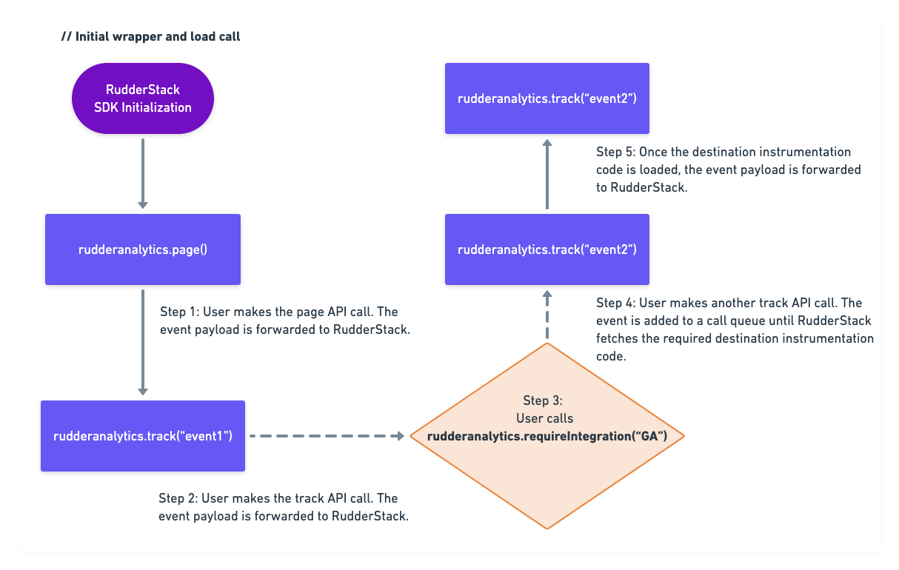

# JavaScript SDK Enhancements

This guide covers the finer technical details of the improvements that make the RudderStack JavaScript SDK more efficient and easier to use. 

These enhancements are:

- Support for the `sendBeacon` interface support to send event payloads.
- Reducing the core SDK size by using explicit `requireIntegration` calls.

## `sendBeacon` as a transport mechanism

The JavaScript SDK hosted at [**https://cdn.rudderlabs.com/v1/rudder-analytics.min.js**](https://cdn.rudderlabs.com/v1/rudder-analytics.min.js) sends event payload using the **XHR** \(XMLHttpRequest\) API. We have added support for sending the event payload using the **`navigator.sendBeacon`** browser utility, which asynchronously sends a small amount of data over HTTP to the RudderStack server.

### Why use sendBeacon to send your event payload?

There are 2 key advantages of using the [**`navigator.sendBeacon`**](https://developer.mozilla.org/en-US/docs/Web/API/Navigator/sendBeacon) utility to send your event payload:

- Since pushing events to the Beacon queue is faster compared to the XHR instrumentation, you may see some performance improvements in the JavaScript SDK.
- The Beacon requests are optimized so that the browser waits until the CPU load is lower, or until the network is free before making the actual requests. This can lead to better website performance.

<div class="infoBlock">
  
  You can find the <code class="inline-code">sendBeacon</code> version of the RudderStack JavaScript SDK located at <a href="https://cdn.rudderlabs.com/v2/rudder-analytics.min.js?transport=beacon">https://cdn.rudderlabs.com/v2/rudder-analytics.min.js?transport=beacon</a>. For using its XMLHTTP version, use <a href="https://cdn.rudderlabs.com/v2/rudder-analytics.min.js">https://cdn.rudderlabs.com/v2/rudder-analytics.min.js?transport=beacon</a>.
</div>

### Event delivery guarantees and retry mechanism

This section highlights some important considerations before you opt to use `sendBeacon` for sending your event payload:

- The Beacon requests sent from the SDK using `navigator.sendBeacon()` only push the events to browser’s Beacon queue. As it depends on the browser's engine to send these events from the queue, RudderStack **cannot guarantee** the events getting discarded due to 5xx errors and other network-related errors \(request timed out, end resource unavailable, etc.\).

<div class="warningBlock">

  If event delivery and retry is an important requirement for your website, we highly recommend using the XHR version of the JavaScript SDK, where RudderStack retries event delivery based on status codes and other errors.
</div>

- The Beacon queue maintained by the browsers also has a limitation on the total size of the elements present in the queue at any point, and peaks out at 64KB. Therefore, you cannot send high frequency hits from the main thread in one go, as the Beacon queue cannot take up cycles to dequeue itself. The JavaScript SDK handles this by maintaining a separate queue which retries pushing events to the Beacon queue in case they are not successfully pushed in the first attempt. 

<div class="successBlock">

Currently, the RudderStack queue handles approximately 500 hits per 30ms and ensures eventual successful delivery of events after retries to Beacon. A similar comparison on Google Analytics’ <code class="inline-code">analytics.js</code> shows a hit rate of 2 hits/sec.
</div>

## Reduced core SDK size by calling `requireIntegration`

As RudderStack supports more native destinations through the JavaScript SDK, more instrumentation code gets added to it. This leads to an increase in the SDK size and requires the browser to evaluate and parse more unused JavaScript.

Therefore, we have decided to not bundle these instrumentation codes for the end destinations in the core JavaScript SDK. Instead, the SDK will now only fetch the destination configuration settings from the RudderStack dashboard such as track ID, API key, secret, etc. using the `requireIntegration` method.

### `requireIntegration` call definition

The `requireIntegration` method contains the following two parameters:

- The first parameter is a **string** or an **array of strings** containing the destination names.

<div class="infoBlock">

  You can also pass <code class="inline-code">rudderanalytics.requireIntegration(“All”)</code>. This will fetch all the plugins for the native destinations that are connected to the source in your RudderStack dashboard.
</div>

- The second parameter is a **callback** that accepts an object containing the names of the destinations that were successfully or unsuccessfully loaded on the page.

An example is shown below:

```javascript
rudderanalytics.requireIntegration(
  ["GoogleAnalytics", "Hotjar", "Hubspot"],
  function(object) {
    console.log(JSON.stringify(object));
  }
);
```
<div class="infoBlock">

RudderStack supports a few canonical names for destinations. You can find more information regarding these canonical names in the <a href="https://docs.rudderstack.com/rudderstack-sdk-integration-guides/rudderstack-javascript-sdk/#common-destination-names">common destination names</a> section of the SDK documentation.
</div>

<div class="warningBlock">

Currently, RudderStack support plugins only for Google Analytics, Hotjar, and HubSpot. We are working on adding support for more destinations very soon, so stay tuned!
</div>

### How it works

Once the JavaScript SDK receives a call, e.g. `rudderanalytics.requireIntegration("GA")`, it automatically fetches the Google Analytics instrumentation code \(e.g. `GAPlugin.js`\). This code handles the transformation and mapping logic for the RudderStack event payload and the call type \(`track`, `page`, etc.\) to Google Analytics' corresponding payload and API calls \(for e.g. `send`, `set`, etc.\)

The SDK maintains a call queue and the API calls to it are processed one after the other. The processing of this call queue will be blocked once the `requireIntegration` method is called.

### Use-case

Suppose the user makes a call `rudderanalytics.requireIntegration("GA")`. All the subsequent calls made to the SDK \(such as `page`, `track`, `alias`, `group`, etc.\) will get enqueued until the `GAPlugin.js` and Google Analytics' `analytics.js` is loaded on the web page. Once the plugin and the end destination snippet is loaded, the calls in the call queue will be processed, and the corresponding calls to `analytics.js` will start flowing.

<div class="infoBlock">

  For this example, Google Analytics' <code class="inline-code">trackingId</code> and other configuration settings are fetched from the RudderStack dashboard as noted earlier, and <code class="inline-code">analytics.js</code> is configured using these settings.
</div>

### Sample call flow

The following workflow sums up the flow of the event payload when the user calls `requireIntegration()`:



## Contact us

For more information or queries on any of the sections covered in this guide, you can [**contact us**](mailto:%20docs@rudderstack.com) or start a conversation on our [**Slack**](https://rudderstack.com/join-rudderstack-slack-community) channel.

If you come across any issues while using the JavaScript SDK, feel free to submit them on our [**GitHub issues page**](https://github.com/rudderlabs/rudder-sdk-js/issues).
