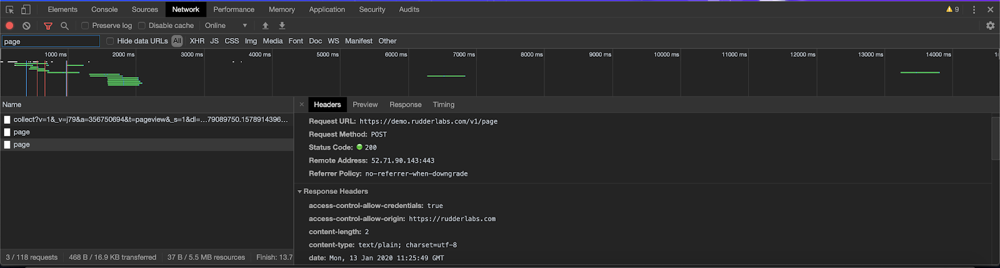
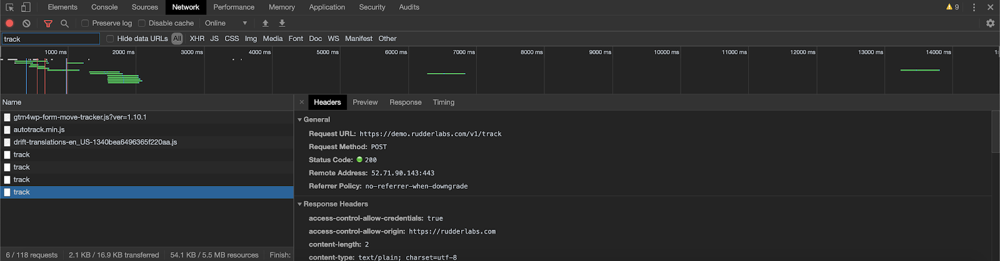

# JavaScript SDK FAQs

This guide contains the answers to some of the commonly-asked questions around setting up, using, and troubleshooting the RudderStack JavaScript SDK.

<div class="successBlock">
  
For queries or issues not listed in this guide, you can always start a conversation on our <a href="https://rudderstack.com/join-rudderstack-slack-community">Slack</a> channel.
</div>

## Where do I get the data plane URL?

For routing and processing the events to the RudderStack backend, a **data plane URL** is required. Refer to [**this section**](https://docs.rudderstack.com/rudderstack-open-source/installing-and-setting-up-rudderstack/#what-is-a-data-plane-url-where-do-i-get-it) to get the data plane URL depending on your choice of setup.

## How do I load the SDK (`rudder-analytics.js`) correctly?

To load `rudder-analytics.js`, follow the instructions in the [**Install RudderStack JavaScript SDK**](https://docs.rudderstack.com/stream-sources/rudderstack-sdk-integration-guides/rudderstack-javascript-sdk/quick-start-guide) section.

To check if the library has loaded correctly, open the JavaScript console in your browser:

- **Safari**: `Ctrl+Alt+I` \(Windows\) or `Command+Option+I` \(Mac\) and go to the `Console` tab.
- **Chrome**: `Ctrl+Shift+J` \(Windows\) or `Command+Option+J` \(Mac\).
- **Firefox**: `Ctrl+Shift+K` \(Windows\) or `Command+Option+K` \(Mac\) and select the `Console` tab.
- **Internet Explorer**: Press `F12` and go to the `Console` tab.

In the console, run `rudderanalytics`. If it returns an object as shown in the following code snippet, it means that the `rudder-analytics.js` file has loaded successfully:

```javascript
{Integrations: Object, _integrations: Object, _readied: true, _timeout: 300, _user: n_}
```

If it gives you an `undefined` error, verify if the installation is done correctly. Our [**quick start guide**](https://docs.rudderstack.com/stream-sources/rudderstack-sdk-integration-guides/rudderstack-javascript-sdk/quick-start-guide) may be able to help you get up and running.

## Should I disable ad-blockers on my browser?

Yes, it is important that you ensure no ad blockers are running on your browser, as they restrict the`rudder-analytics.js` script from executing and storing user information in the browser.

## Can I load multiple instances of `rudder-analytics.js`?

No, it is not possible to load multiple instances of `rudder-analytics.js`, as it is bound to exceed the maximum stack call size and give you an error.

## How to check if the data is being transmitted to the desired destinations?

To check if data is being transmitted to the specified destinations, go to the **Network** tab of your JavaScript console in your browser.





<div class="infoBlock">
  
  If the outbound request is not shown, check if you have installed and set up the RudderStack JavaScript SDK correctly. Also, check if any ad blockers are enabled in your browser.
</div>

## What is the size limit on the requests?

The size limit on requests is 32KB per message and 4MB per batch request.

## Can I send the event data to specific destinations only?

Yes, you can follow any one of the following methods to send your event data to specific destinations:

- [Sending events to selective destinations](https://www.rudderstack.com/docs/stream-sources/rudderstack-sdk-integration-guides/rudderstack-javascript-sdk/#loading-selective-destinations): You can send your events only to the selective destinations by stopping the SDK from loading the other [device mode](https://www.rudderstack.com/docs/rudderstack-cloud/rudderstack-connection-modes/#device-mode)integrations.
- [Filter out selective destinations](https://www.rudderstack.com/docs/user-guides/how-to-guides/how-to-filter-selective-destinations/): Filter out selective destinations by stopping certain events from being sent to these destinations.

## What is an anonymous ID? How do I retrieve it?

An anonymous ID is an auto-generated **UUID** \(Universally Unique Identifier\) that gets assigned to each unique, unidentified visitor to your website.

To retrieve the anonymous ID of any visitor, call the following:

```javascript
rudderanalytics.getAnonymousId();
```

<div class="infoBlock">
  
If the <code class="inline-code">anonymousId</code> value is null in the SDK, calling the above function will lead to RudderStack automatically setting a new <code class="inline-code">anonymousId</code>.
</div>

## What is the `Reserved Keyword` error?

When using the JavaScript SDK, you may run into the following error: **Warning! : Reserved keyword used in traits --> id with track call**. This is because one or more of the keys in your `traits` and/or `properties` object is the same value as a reserved keyword.

RudderStack has reserved the following keywords as keys for a standard event payload:

```javascript
"anonymous_id";
"id";
"sent_at";
"received_at";
"timestamp";
"original_timestamp";
"event_text";
"event";
```

<div class="warningBlock">
  
The above-mentioned keywords should be avoided when naming your event traits and properties.
</div>

## Contact us

For more information on the RudderStack JavaScript SDK, you can [**contact us**](mailto:%20docs@rudderstack.com) or start a conversation in our [**Slack**](https://rudderstack.com/join-rudderstack-slack-community) community.

If you come across any issues while using this SDK, feel free to submit them on our [**GitHub issues page**](https://github.com/rudderlabs/rudder-sdk-js/issues).
