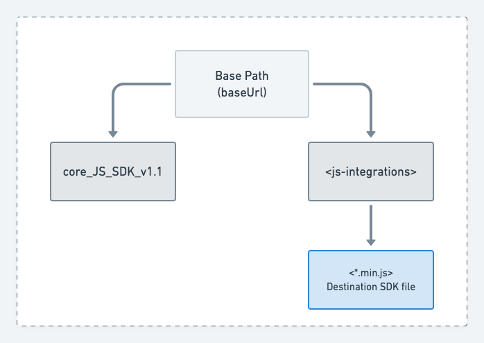

# Version Migration Guide

The **JavaScript SDK  v1.1** is a lightweight, more efficient, and optimized version of the [**RudderStack JavaScript SDK**](https://rudderstack.com/docs/stream-sources/rudderstack-sdk-integration-guides/rudderstack-javascript-sdk/).

The JavaScript SDK v1.1 offers the following features:

* The size of the SDK is reduced by approximately **70%**, considerably reducing its loading time.
* The destination SDKs are separated from the core JavaScript SDK. They are now published as individual plugins.
* The [**device mode**](https://rudderstack.com/docs/connections/rudderstack-connection-modes/#device-mode) destinations will be loaded dynamically as per your specified dashboard configurations.

## JavaScript SDK v1 vs. v1.1

|Parameter|v1|v1.1|
|---------|--|----|
|**Size**|114 KB<sup>*</sup>|34 KB<sup>*</sup>|
|**Device mode destination SDKs**|All the device mode destination SDKs are bundled with the core SDK.|The device mode destination SDKs are dynamically loaded as per the source configuration in the dashboard.|

<div class="infoBlock">

The SDK sizes may vary in the future as we add more functionalities.  
</div>

## Migrating to v1.1

This section covers the steps to migrate to v1.1 of the JavaScript SDK, depending on your previous installation of the JavaScript SDK (v1).

### Case 1: Loading the SDK from the RudderStack CDN

If you are loading the JavaScript SDK from RudderStack's CDN, update the script tag in your website.

For **v1**:

```html
<script src="https://cdn.rudderlabs.com/v1/rudder-analytics.min.js" />
```

For **v1.1**:

```html
<script src="https://cdn.rudderlabs.com/v1.1/rudder-analytics.min.js" />
```

### Case 2: Forwarding/proxying the RudderStack CDN

If you are forwarding or proxying RudderStack's CDN, follow these steps:

* Log into your CDN provider account.
* Go to the distribution whose origin is set to RudderStack's CDN. Ensure that the entire domain (`https://cdn.rudderlabs.com`) is set as the origin.

<div class="infoBlock">

We highly recommend forwarding the entire CDN path <code class="inline-code">https://cdn.rudderlabs.com</code> so that you don't miss any files/directories that might be added in the future.
</div>

<div class="successBlock">

  Refer to our guide on <a href="https://rudderstack.com/docs/user-guides/how-to-guides/custom-domains/">using custom domains</a> for more information CDN forwarding/proxying.
</div>

* Then, go to **Behaviors**, and check that the sub-path `/v1.1/*` is **not configured to be blocked** in any way.

<div class="warningBlock">

This step is required to ensure that both the core SDK and destination SDKs are forwarded properly.
</div>

* Finally, update the script tag in your website as shown:

For **v1**:

```html
<script src="https://<subdomain>.<yourdomain>.com/v1/rudder-analytics.min.js" />
```

For **v1.1**:

```html
<script src="https://<subdomain>.<yourdomain>.com/v1.1/rudder-analytics.min.js" />
```

### Case 3: Self-hosting RudderStack's CDN

If you have cloned RudderStack's JavaScript SDK and are self-hosting it via your own CDN, follow the steps below:

* Download the core JavaScript SDK v1.1: [**https://cdn.rudderlabs.com/v1.1/rudder-analytics.min.js**](https://cdn.rudderlabs.com/v1.1/rudder-analytics.min.js).
* Download all the destination SDKs as listed [**here**](#rudderstack-destination-sdks).
* Move all the downloaded files in your preferred location.

We recommend maintaining the following structure:



* Next, check if the core SDK filename is different than `rudder-analytics.min.js`. If **yes**, update the script tag in your website as shown below:

```html
<script>
// rudderanalytics object initialization
// ...
// ...
// provide the location of the destination SDKs in the load options
rudderanalytics.load(<WRITE_KEY>, <DATA_PLANE_URL>, {
    destSDKBaseURL: "https://cdn.<yourdomain>.com/js-integrations"
});
// ...
// ...
</script>

<script src="https://cdn.<yourdomain>.com/your-custom-analytics-file.js"></script>
```

* If the core SDK filename **is** `rudder-analytics.min.js`, verify if the destination SDKs are located next to the core SDK file under the `js-integrations` directory (as highlighted in the tip above). If **yes**, update the script tag in your website as shown:

```html
<script src="https://cdn.<yourdomain>.com/rudder-analytics.min.js"></script>
```

* If the destination SDKs are **not** located next to the core SDK file under the `js-integrations` directory, then update the script tag as shown:

```html
<script>
// rudderanalytics object initialization
// ...
// ...
// provide the location of the destination SDKs in the load options
rudderanalytics.load(<WRITE_KEY>, <DATA_PLANE_URL>, {
    destSDKBaseURL: "https://cdn.<yourdomain>.com/custom-js-integrations"
});
// ...
// ...
</script>

<script src="https://cdn.<yourdomain>.com/rudder-analytics.min.js"></script>
```

## RudderStack destination SDKs

| Destination name     | Download path                                                             |
|:---------------------|:--------------------------------------------------------------------------|
| HubSpot              | https://cdn.rudderlabs.com/v1.1/js-integrations/HubSpot.min.js            |
| Google Analytics     | https://cdn.rudderlabs.com/v1.1/js-integrations/GA.min.js                 |
| Hotjar               | https://cdn.rudderlabs.com/v1.1/js-integrations/Hotjar.min.js             |
| Google Ads           | https://cdn.rudderlabs.com/v1.1/js-integrations/GoogleAds.min.js          |
| VWO                  | https://cdn.rudderlabs.com/v1.1/js-integrations/VWO.min.js                |
| Google Tag Manager   | https://cdn.rudderlabs.com/v1.1/js-integrations/GoogleTagManager.min.js   |
| Braze                | https://cdn.rudderlabs.com/v1.1/js-integrations/Braze.min.js                |
| Intercom             | https://cdn.rudderlabs.com/v1.1/js-integrations/INTERCOM.min.js           |
| Keen.io              | https://cdn.rudderlabs.com/v1.1/js-integrations/Keen.min.js               |
| Kissmetrics          | https://cdn.rudderlabs.com/v1.1/js-integrations/Kissmetrics.min.js        |
| Customer.io          | https://cdn.rudderlabs.com/v1.1/js-integrations/CustomerIO.min.js         |
| Chartbeat            | https://cdn.rudderlabs.com/v1.1/js-integrations/Chartbeat.min.js          |
| Comscore             | https://cdn.rudderlabs.com/v1.1/js-integrations/Comscore.min.js           |
| Facebook Pixel       | https://cdn.rudderlabs.com/v1.1/js-integrations/FacebookPixel.min.js      |
| Lotame               | https://cdn.rudderlabs.com/v1.1/js-integrations/Lotame.min.js             |
| Optimizely           | https://cdn.rudderlabs.com/v1.1/js-integrations/Optimizely.min.js         |
| BugSnag              | https://cdn.rudderlabs.com/v1.1/js-integrations/Bugsnag.min.js            |
| FullStory            | https://cdn.rudderlabs.com/v1.1/js-integrations/Fullstory.min.js          |
| TVSquared            | https://cdn.rudderlabs.com/v1.1/js-integrations/TVSquared.min.js          |
| Google Analytics 4   | https://cdn.rudderlabs.com/v1.1/js-integrations/GA4.min.js                |
| MoEngage             | https://cdn.rudderlabs.com/v1.1/js-integrations/MoEngage.min.js           |
| Amplitude            | https://cdn.rudderlabs.com/v1.1/js-integrations/Amplitude.min.js          |
| Pendo                | https://cdn.rudderlabs.com/v1.1/js-integrations/Pendo.min.js              |
| Lytics               | https://cdn.rudderlabs.com/v1.1/js-integrations/Lytics.min.js             |
| Appcues              | https://cdn.rudderlabs.com/v1.1/js-integrations/Appcues.min.js            |
| PostHog              | https://cdn.rudderlabs.com/v1.1/js-integrations/Posthog.min.js            |
| Klaviyo              | https://cdn.rudderlabs.com/v1.1/js-integrations/Klaviyo.min.js            |
| CleverTap            | https://cdn.rudderlabs.com/v1.1/js-integrations/Clevertap.min.js          |
| Bing Ads             | https://cdn.rudderlabs.com/v1.1/js-integrations/BingAds.min.js            |
| Pinterest Tag        | https://cdn.rudderlabs.com/v1.1/js-integrations/PinterestTag.min.js       |
| Adobe Analytics      | https://cdn.rudderlabs.com/v1.1/js-integrations/AdobeAnalytics.min.js     |
| LinkedIn Insight Tag | https://cdn.rudderlabs.com/v1.1/js-integrations/LinkedInInsightTag.min.js |
| Reddit Pixel         | https://cdn.rudderlabs.com/v1.1/js-integrations/RedditPixel.min.js        |
| Drip                 | https://cdn.rudderlabs.com/v1.1/js-integrations/Drip.min.js               |
| Heap                 | https://cdn.rudderlabs.com/v1.1/js-integrations/Heap.min.js               |
| Criteo               | https://cdn.rudderlabs.com/v1.1/js-integrations/Criteo.min.js             |
| Mixpanel             | https://cdn.rudderlabs.com/v1.1/js-integrations/Mixpanel.min.js           |
| Qualtrics            | https://cdn.rudderlabs.com/v1.1/js-integrations/Qualtrics.min.js          |

## FAQs

### How are the destination SDKs loaded in v1.1?

In v1.1, the core JavaScript SDK does not contain any destination-specific SDKs by default. Depending on the device mode destinations configured in your dashboard (control plane), the necessary SDKs are dynamically fetched from the hosted location.

The hosted location can be either of:

* RudderStack's CDN
* Your CDN that proxies the RudderStack CDN, or
* A self-hosted domain

Refer to the **Migrating to v1.1** section above for more details.

### How does RudderStack determine the destination SDKs' root location?

RudderStack follows the below precedence order while determining the root location of the destination SDKs:

1. RudderStack refers to the `destSDKBaseURL` value in the `options` parameter of the `load` API call.
2. If absent, RudderStack then checks the `src` attribute of the `<script>` tag that adds the core JavaScript SDK to your website. `/js-integrations` is automatically appended to the root location.
3. If none of the two options above are applicable, RudderStack uses the default CDN URL ([**https://cdn.rudderlabs.com/v1.1/js-integrations/**](https://cdn.rudderlabs.com/v1.1/js-integrations/)).

The above approach ensures that minimal changes are required from your end.

## Contact us

In case of any issues or questions on any of the sections covered in this guide, you can [**contact us**](mailto:%20docs@rudderstack.com) or start a conversation on our [**Slack**](https://rudderstack.com/join-rudderstack-slack-community) channel.
