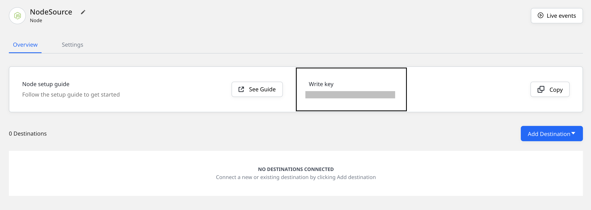

# Node.js

The **RudderStack Node.js SDK** lets you track your customer event data from your Node.js applications and send it to your specified destinations via RudderStack.

Check out the [**GitHub codebase**](https://github.com/rudderlabs/rudder-sdk-node) to get a more hands-on understanding of the SDK.

## SDK setup requirements

To set up the RudderStack Node.js SDK, the following prerequisites must be met:

- You will need to set up a [**RudderStack account**](https://app.rudderstack.com).
- Once signed up, set up a Node.js source in the dashboard. For more information, follow [**this guide**](https://rudderstack.com/docs/rudderstack-cloud/connections/). You should then see a **Write Key** for this source, as shown below:



- You will also need a data plane URL. Follow [**this section**](https://rudderstack.com/docs/get-started/installing-and-setting-up-rudderstack/#what-is-a-data-plane-url-where-do-i-get-it) for more information on the data plane URL and where to get it.

## Installing the Node.js SDK

To install the RudderStack Node.js SDK using [**npm**](https://www.npmjs.com/), run the following command:

```bash
npm install @rudderstack/rudder-sdk-node
```

## Using the SDK

To use the Node.js SDK, run the following code snippet:

```javascript
const Analytics = require("@rudderstack/rudder-sdk-node")

// RudderStack requires the batch endpoint of the server you are running
const client = new Analytics(WRITE_KEY, DATA_PLANE_URL / v1 / batch)
```

Running the above snippet creates a global RudderStack client object that can be used for all the subsequent event requests.

## Identify

The `identify` call lets you identify a visiting user and capture any related information such as their name, email address, etc.

<div class="warningBlock">

RudderStack does not store the user state in any of the server-side SDKs. Unlike the client-side SDKs that deal with only a single user at a given time, the server-side SDKs deal with multiple users at the same time. Therefore, for any of the calls supported by the Node.js SDK, you need to specify either `userId` or `anonymousId` every time.
</div>

A sample `identify` call is as shown:

```javascript
client.identify({
  userId: "123456",
  traits: {
    name: "Name Username",
    email: "name@website.com",
    plan: "Free",
    friends: 21,
  },
})
```

The `identify` parameters are as described below:

| **Field**                                                                                                  | **Type** | **Presence**                              | **Description**                                                                                                            |
| :--------------------------------------------------------------------------------------------------------- | :------- | :---------------------------------------- | :------------------------------------------------------------------------------------------------------------------------- |
| `anonymousId`                                                                                              | String   | Optional                                  | A user identifier for cases where there is no `userId` set for the user. Either `userId` or `anonymousId` is required.     |
| `userId`                                                                                                   | String   | Optional, if `anonymousId` is already set | The unique identifier for a user in your database.                                                                         |
| `context`                                                                                                  | Object   | Optional                                  | The dictionary of information that provides context about a message. Note that it is not directly related to the API call. |
| `integrations`                                                                                             | Object   | Optional                                  | The dictionary of destinations to be either enabled or disabled.                                                           |
| `timestamp`                                                                                                | Date     | Optional                                  | The timestamp of the message's arrival.                                                                                    |
| [`traits`](https://rudderstack.com/docs/rudderstack-api/api-specification/rudderstack-spec/identify/#identify-traits) | Object   | Optional                                  | The dictionary of the traits associated with the user, such as `name`or `email.`                                           |

## Track

The `track` call lets you record the user actions along with their associated properties. Each user action is called an **event**.

A sample `track` call is shown below:

```javascript
client.track({
  userId: "123456",
  event: "Item Viewed",
  properties: {
    revenue: 19.95,
    shippingMethod: "Premium",
  },
})
```

The `track` method parameters are as described below:

| Name           | Type   | Presence | Description                                                                                                                |
| :------------- | :----- | :------- | :------------------------------------------------------------------------------------------------------------------------- |
| `userId`       | String | Required | The unique identifier for a user in your database.                                                                         |
| `event`        | String | Required | Name of the user event.                                                                                                    |
| `properties`   | Object | Optional | The dictionary of the properties associated with the particular event.                                                     |
| `context`      | Object | Optional | The dictionary of information that provides context about a message. Note that it is not directly related to the API call. |
| `timestamp`    | Date   | Optional | The timestamp of the message's arrival.                                                                                    |
| `anonymousId`  | String | Optional | A user identifier for cases where there is no `userId` set for the user. Either `userId` or `anonymousId` is required.     |
| `integrations` | Object | Optional | A dictionary of destinations to be either enabled or disabled.                                                             |

## Page

The `page` call allows you to record the page views on your website along with the other relevant information about the viewed page.

A sample `page` call is as shown:

```javascript
client.page({
  userId: "12345",
  category: "Food",
  name: "Pizza",
  properties: {
    url: "https://dominos.com",
    title: "Pizza",
    referrer: "https://google.com",
  },
})
```

The `page` method parameters are as described below:

| **Field**      | **Type** | **Presence**                              | **Description**                                                                                                            |
| :------------- | :------- | :---------------------------------------- | :------------------------------------------------------------------------------------------------------------------------- |
| `anonymousId`  | String   | Optional                                  | A user identifier for cases where there is no `userId` set for the user. Either `userId` or `anonymousId` is required.     |
| `userId`       | String   | Optional, if `anonymousId` is already set | The unique identifier for a user in your database.                                                                         |
| `context`      | Object   | Optional                                  | The dictionary of information that provides context about a message. Note that it is not directly related to the API call. |
| `integrations` | Object   | Optional                                  | A dictionary of destinations to be either enabled or disabled.                                                             |
| `name`         | String   | Required                                  | Name of the viewed page.                                                                                                   |
| `properties`   | Object   | Optional                                  | A dictionary of the properties associated with the viewed page, like `url` and `referrer`.                                 |
| `timestamp`    | Date     | Optional                                  | The timestamp of the message's arrival.                                                                                    |

## Screen

The `screen` call is the mobile equivalent of the `page` call. It allows you to record the screen views on your mobile app along with the other relevant information about the app screen.

A sample `screen` call is as shown:

```javascript
client.screen({
  userId: "12345",
  category: "Food",
  name: "Pizza",
  properties: {
    screenSize: 10,
    title: "Pizza",
    referrer: "https://google.com",
  },
})
```

The `screen` method parameters are as described below:

| **Field**      | **Type** | **Presence**                              | **Description**                                                                                                            |
| :------------- | :------- | :---------------------------------------- | :------------------------------------------------------------------------------------------------------------------------- |
| `anonymousId`  | String   | Optional                                  | Sets the user ID for cases where there is no unique identifier for the user. Either `userId` or `anonymousId` is required. |
| `userId`       | String   | Optional, if `anonymousId` is already set | Unique identifier for a particular user in your database.                                                                  |
| `context`      | Object   | Optional                                  | Dictionary of information that provides context about a message. However, it is not directly related to the API call.      |
| `integrations` | Object   | Optional                                  | A dictionary containing the destinations to be either enabled or disabled.                                                 |
| `name`         | String   | Required                                  | Name of the screen being viewed.                                                                                           |
| `properties`   | Object   | Optional                                  | Dictionary of the properties associated with the page being viewed, such as `url` and `referrer`                           |
| `timestamp`    | Date     | Optional                                  | The timestamp of the message's arrival.                                                                                    |

## Group

The `group` call lets you associate an identified user to a group - either a company, project or a team and record any custom traits or properties associated with that group.

A sample `group` call is as shown:

```javascript
client.group({
  userId: "12345",
  groupId: "1",
  traits: {
    name: "Company",
    description: "Google",
  },
})
```

The `group` method parameters are as follows:

| **Field**      | **Type** | **Presence**                              | **Description**                                                                                                          |
| :------------- | :------- | :---------------------------------------- | :----------------------------------------------------------------------------------------------------------------------- |
| `anonymousId`  | String   | Optional                                  | A user identifier for cases where there is no `userId` set for the user. Either `userId` or `anonymousId` is required.   |
| `userId`       | String   | Optional, if `anonymousId` is already set | The unique identifier for a user in your database.                                                                       |
| `context`      | Object   | Optional                                  | A dictionary of information that provides context about a message. Note that it is not directly related to the API call. |
| `integrations` | Object   | Optional                                  | A dictionary of the destinations to be either enabled or disabled.                                                       |
| `groupId`      | String   | Required                                  | Unique identifier for the group present in your database.                                                                |
| `traits`       | Object   | Optional                                  | A dictionary of the group's properties or traits, like `email` or `name`.                                                |
| `timestamp`    | Date     | Optional                                  | The timestamp of the message's arrival.                                                                                  |

## Alias

The `alias` call lets you merge different identities of a known user.

<div class="infoBlock">

<code class="inline-code">alias</code> is an advanced method that lets you change the tracked user's ID explicitly. This method is useful when managing identities for some of the downstream destinations.
</div>

A sample `alias` call is as shown:

```javascript
client.alias({
  previousId: "old_id",
  userId: "new_id",
})
```

The `alias` method parameters are as mentioned below:

| **Field**      | **Type** | **Presence**                              | **Description**                                                                                                          |
| :------------- | :------- | :---------------------------------------- | :----------------------------------------------------------------------------------------------------------------------- |
| `userId`       | String   | Optional, if `anonymousId` is already set | The unique identifier for a user in your database.                                                                       |
| `context`      | Object   | Optional                                  | A dictionary of information that provides context about a message. Note that it is not directly related to the API call. |
| `integrations` | Object   | Optional                                  | A dictionary of the destinations to be either enabled or disabled.                                                       |
| `previousId`   | String   | Required                                  | The previous unique identifier of the user.                                                                              |
| `traits`       | Object   | Optional                                  | The dictionary of the traits associated with the user, like `name`or `email.`                                            |
| `timestamp`    | Date     | Optional                                  | The timestamp of the message's arrival.                                                                                  |

<div class="infoBlock">

For a detailed explanation of the <code class="inline-code">alias</code> call, refer to our <a href="https://rudderstack.com/docs/rudderstack-api/api-specification/rudderstack-spec/alias/">RudderStack API Specification</a> guide.
</div>

## Node.js SDK data persistence

<div class="warningBlock">

This feature is still in beta. Contact us on our <a href="https://rudderstack.com/join-rudderstack-slack-community">Community Slack</a> if you face any issues.
</div>

If the Node.js SDK fails to successfully deliver the event data to RudderStack at the first attempt, it retries the event delivery. However, if, for some reason, RudderStack is unavailable for a longer duration, there is a possibility of data loss. To prevent this scenario, RudderStack has a data persistence feature to persist the events in **Redis**, leading to better event delivery guarantees. Also, the SDK can retry multiple times as the queue is maintained in a different process space (in this case, Redis).

<div class="infoBlock">
To use this feature, you will need to host a Redis server and use it as the intermediary data storage queue.
</div>

<div class="infoBlock">

RudderStack uses <a href="https://github.com/OptimalBits/bull">Bull</a> as the interface layer between the Node.js SDK and Redis.

</div>

A sample SDK initialization is shown below:

```jsx
const client = new Analytics("write_key","server_url/v1/batch",{
    flushAt: <number> = 20,
    flushInterval: <ms> = 20000
    // the max number of elements that the SDK can hold in memory,
    // this is different than the Redis list created when persistence is enabled.
    // This restricts the data in-memory when Redis is down, unreachable etc.
    maxInternalQueueSize: <number> = 20000
});

client.createPersistenceQueue({ redisOpts: { host: "localhost" } }, err => {})
```

To achieve the data persistence, you need to call the `createPersistenceQueue` method which takes two parameters as input - `queueOpts` and a `callback`. This will initialize the persistent queue.

<div class="warningBlock">

If the createPersistenceQueue method is not called after initializing the SDK, the SDK will work without any persistence.
</div>

### Configurable parameters

| **Parameter** | **Description** | **Default Value** |
| :--- | :--- | :--- |
| `flushAt` | The maximum number of events to batch and send to the server | `20` |
| `flushInterval` | The maximum timespan \(in milliseconds\) after which the events from the in-memory queue is flushed to Redis' persistence queue | `20000` |
| `maxInternalQueueSize` | The maximum size of the in-memory queue | `20000` |
| `JobOpts.maxAttempts` | The maximum number of retry attempts | `10` |
| `isMultiProcessor` | Determines whether to handle previously active jobs. If set to `false`, the previously active job will be picked up first by the processor. Otherwise, Bull moves this job to the back of the Redis queue to be picked up after the already pushed event. | `false` |

<div class="warningBlock">

If the same queue \(RudderStack SDK initialized with the same queue name\) is used in case of multiple servers \(server-side SDKs\), set the value of `isMultiProcessor` to `true` as event ordering is not applicable in this case.
</div>

#### How to ensure that all my events in the queue are processed?

You can use the `flush()` method to ensure that all the events in the queue are processed. The following example highlights the use of `flush()` with a callback:

```jsx
client.flush(function(err, batch){
  console.log('Flushing done');
}
)
```

### `queueOpts`

As mentioned in the previous section, you need to call the `createPersistenceQueue` method which takes two parameters as input - `queueOpts` and a `callback`- to achieve data persistence. This method will initialize the persistent queue.

`client.createPersistenceQueue(QueueOpts, callback)`

Calling the `createPersistenceQueue` method will initialize a Redis list by calling [**Bull's**](https://github.com/OptimalBits/bull) utility methods. It will also add a **single** job processor for the processing \(making requests to RudderStack\) jobs that are pushed into the list. Any error encountered while doing this leads to a callback with the error.

A sample `queueOpts` initialization is shown below:

```javascript
queueOpts {
    queueName ?: string = rudderEventsQueue,
    isMultiProcessor ? : boolean = false
    // pass a value without the {}, this will used as prefix to Redis keys,
    // needed to support Redis cluster slots.
    prefix ? : string = {rudder},
    redisOpts : RedisOpts,
    jobOpts ?: JobOpts
}
```

The specification of the different `queueOpts` parameters is listed in the following table:

| **Parameter** | **Description** | **Default Value** |
| :--- | :--- | :--- |
| `queueName` | Name of the queue. | `20` |
| `isMultiProcessor` | Determines whether to handle previously active jobs. If set to `false`, the previously active job will be picked up first by the processor. Otherwise, Bull moves this job to the back of the Redis queue to be picked up after the already pushed event. | `false` |
| `prefix` | Used as the prefix to the Redis keys needed to support the Redis cluster slots. | `20000` |
| `redisOpts` | Refer to the `RedisOpts` section below | `RedisOpts` |
| `jobOpts` | Refer to the `JobOpts` section below | `JobOpts` |

<div class="infoBlock">

More information on this parameter can be found in the [**Bull docs**](https://github.com/OptimalBits/bull/blob/develop/REFERENCE.md#queue).
</div>

#### `RedisOpts`

```jsx
RedisOpts {
    port?: number = 6379;
    host?: string = localhost;
    db?: number = 0;
    password?: string;
}
```

<div class="infoBlock">

More information on this parameter can be found in the [**Bull docs**](https://github.com/OptimalBits/bull/blob/develop/REFERENCE.md#queue).
</div>

#### `JobOpts`

```javascript
JobOpts {
    maxAttempts ? : number = 10
}
```

### `callback`

In case of an error, the `createPersistenceQueue` method returns a callback. You should retry sending the events in this scenario.

```jsx
// createPersistenceQueue calls this with error or nothing(in case of success), // user should retry in case of error
callback: function(error) || function()
```

Calling the `createPersistenceQueue` method will initialize a Redis list by calling [**Bull's**](https://github.com/OptimalBits/bull) utility methods. It will also add a **single** job processor for the processing \(making requests to RudderStack\) jobs that are pushed into the list. Any error encountered while doing this leads to calling `callback` with the error.

<div class="infoBlock">

If the callback returns with an error, we recommend retrying calling `createPersistenceQueue` with a backoff.

</div>

###  Event flow

- Calling the SDK methods like `track`, `page`, `identify`, etc. pushes the events to an in-memory array.
- The events from the array are flushed as a `batch` to the Redis persistence based on the `flushAt` and `flushInterval` settings. The in-memory array has a maximum size of `maxInternalQueueSize`. **Once this size limit is reached,** __**the events won't be accepted if not drained to the other side \(cases where Redis connection is slow or the Redis server is not reachable\).**
- The processor will take the batch from the Redis list and make a request to RudderStack. In case of an error, the processor will retry sending the data again if the error can be retried \(errors with status code `5xx and 429`\). **The retry will go up to `JobOpts.maxAttempts` with an** **exponential backoff of power 2 with max backoff of 30 seconds**.
- If the job fails even after `JobOpts.maxAttempts`, it will not be retried again and pushed to a `failed queue`. **You can retry them later manually using Bull’s utility methods** [**listed here**](https://github.com/OptimalBits/bull/blob/develop/REFERENCE.md#queuegetfailed) **or get them from Redis directly**.
- There might be a scenario where the node process dies with the jobs still in active state \(not completed nor failed but in the process of sending/retrying\). Since the RudderStack SDK has only **1 processor for sending events** \(this count should always be **1**\), the next time the SDK is initialized and `createPersistenceQueue` is called, **the jobs will be picked up first by the processor to get processed to maintain event ordering based on the value of `QueueOpts.isMultiProcessor`**.
- For multiple servers \(SDK\) connecting to the same queue \(`QueueOpts.queueName`\), there will be multiple processors fetching events from the same queue and event ordering won’t be implemented. Hence, `QueueOpts.isMultiProcessor` should be set to **`true`.**

## Contact us

For queries on any of the sections covered in this guide, you can [**contact us**](mailto:%20docs@rudderstack.com) or start a conversation in our [**Slack**](https://rudderstack.com/join-rudderstack-slack-community) community.

If you come across any issues while using the Node.js SDK, you can open a new issue on our [**GitHub Issues page**](https://github.com/rudderlabs/rudder-sdk-node/issues/new).
