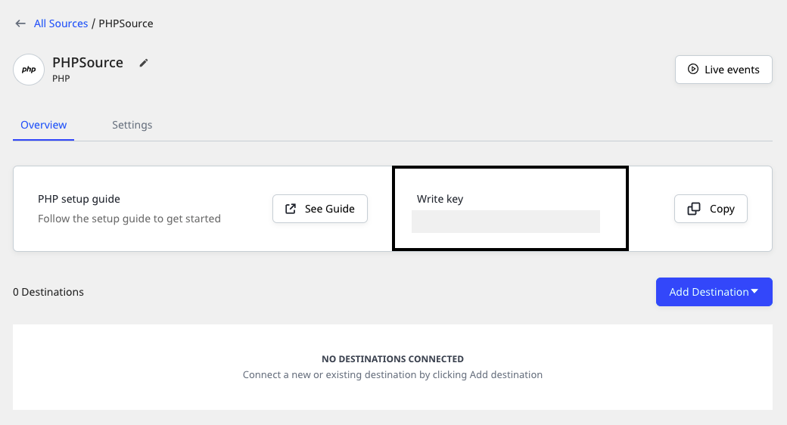

# PHP

RudderStack’s PHP SDK allows you to track your event data from your PHP applications and send it to your specified destinations via RudderStack.

Check out the [**GitHub codebase**](https://github.com/rudderlabs/rudder-php-sdk) to get a more hands-on understanding of the SDK.

<a href="https://packagist.org/packages/rudderstack/rudder-php-sdk" target="_blank" align="left">

</a>

## SDK setup requirements

To set up the RudderStack PHP SDK, the following prerequisites must be met:

- You will need to set up a [**RudderStack account**](https://app.rudderstack.com).
- Once signed up, set up a PHP source in the dashboard. For more information, follow [**this guide**](https://www.rudderstack.com/docs/rudderstack-cloud/sources/#adding-a-source).  You should then see a **Write Key** for this source, as shown below:



- You will also need a data plane URL. Follow [**this section**](https://rudderstack.com/docs/rudderstack-open-source/installing-and-setting-up-rudderstack/#what-is-a-data-plane-url-where-do-i-get-it) for more information on the data plane URL and where to get it.

## Installing the PHP SDK

Install the RudderStack PHP SDK using the [**composer**](https://packagist.org/packages/rudderstack/rudder-php-sdk). You can also do so by running the following command:

```bash
git clone https://github.com/rudderlabs/rudder-php-sdk /my/app/folders/
```

Then, use the composer to install the PHP SDK by running the following command:

```bash
composer require rudderstack/rudder-php-sdk
```

## Initializing the RudderStack client

To initialize the RudderStack client, run the following code snippet:

```php
require_once("/path/to/lib/Rudder.php");

Rudder::init(WRITE_KEY, array(
  "data_plane_url" => DATA_PLANE_URL,
  "consumer"       => "lib_curl", // fork_curl
  "debug"          => true,
  "max_queue_size" => 10000,
  "batch_size"     => 100,
  "ssl"            => true // defaults to true
));
```

<div class="infoBlock">

RudderStack accepts the <code class="inline-code">DATA_PLANE_URL</code> with or without the protocol. If the protocol is missing, RudderStack automatically prepends it to the URL based on whether the <code class="inline-code">ssl</code> option is set to  <code class="inline-code">true</code> or  <code class="inline-code">false</code>.
</div>

RudderStack accepts the following data plane URL formats:

| **SSL** | **Data Plane URL**              |
| :------ | :------------------------------ |
| `true`  | `https://example.dataplane.com` |
| `true`  | `example.dataplane.com`         |
| `false` | `http://example.dataplane.com`  |
| `false` | `example.dataplane.com`         |

<div class="warningBlock">

While initializing the RudderStack client, the <code class="inline-code">ssl</code> field is optional if you are using the HTTPS protocol. If included, its value must be set to <code class="inline-code">true</code>. 

In case of the HTTP protocol, <code class="inline-code">ssl</code> is a required field and must always be set to <code class="inline-code">false</code>.
</div>

## Sending events from the RudderStack client

Once the RudderStack client is initialized, you can use it to send relevant customer events. 

<div class="warningBlock">

RudderStack does not store the user state in any of the server-side SDKs. Unlike the client-side SDKs that deal with only a single user at a given time, the server-side SDKs deal with multiple users at the same time. Therefore, for any of the calls supported by the PHP SDK, you need to specify either `userId` or `anonymousId` every time.
</div>

A sample `track` call is shown in the following code snippet:

```php
Rudder::track(array(
  "userId" => "f4ca124298",
  "event" => "Signed Up",
  "properties" => array(
    "plan" => "Enterprise"
  )
));
```

## Identify

The `identify` call lets you identify a visiting user and capture any related information such as their name, email address, etc.

A sample `identify` call is as shown:

```php
Rudder::identify(array(
  "userId" => "2sfjej334",
  "traits" => array(
    "email" => "test@test.com",
    "name" => "test name",
    "friends" => 25
  )
));
```

The `identify` method parameters are as described below:

| **Field**      | **Type** | **Presence**                              | **Description**                                                                                                            |
| :------------- | :------- | :---------------------------------------- | :------------------------------------------------------------------------------------------------------------------------- |
| `anonymousId`  | String   | Optional                                  | Sets the user ID for cases where there is no unique identifier for the user. Either `userId` or `anonymousId` is required. |
| `userId`       | String   | Optional, if `anonymousId` is already set | Unique identifier for a particular user in your database.                                                                  |
| `context`      | Object   | Optional                                  | Dictionary of information that provides context about a message. However, it is not directly related to the API call.      |
| `integrations` | Object   | Optional                                  | A dictionary containing the destinations to be either enabled or disabled.                                                 |
| `timestamp`    | Date     | Optional                                  | The timestamp of the message's arrival.                                                                                    |
| `traits`       | Object   | Optional                                  | Dictionary of the traits associated with the user, such as `name`or `email`                                                |

## Track

The `track` call lets you record the user actions along with their associated properties. Each user action is called an **event**.

A sample `track` call is shown below:

```php
Rudder::track(array(
  "userId" => "f4ca124298",
  "event" => "Article Bookmarked",
  "properties" => array(
    "title" => "Snow Fall",
    "subtitle" => "The Avalanche at Tunnel Creek",
    "author" => "John Branch"
  )
));
```

The `track` method parameters are as described below:

| Name           | Type   | Presence | Description                                                                                                                |
| :------------- | :----- | :------- | :------------------------------------------------------------------------------------------------------------------------- |
| `user_id`      | String | Required | The developer identification for your user                                                                                 |
| `event`        | String | Required | Name of the event being performed by the user                                                                              |
| `properties`   | Object | Optional | Dictionary of the properties associated with a particular event.                                                           |
| `context`      | Object | Optional | Dictionary of information that provides context about a message. However, it is not directly related to the API call.      |
| `timestamp`    | Date   | Optional | The timestamp of the message's arrival.                                                                                    |
| `anonymous_id` | String | Optional | Sets the user ID for cases where there is no unique identifier for the user. Either `userId` or `anonymousId` is required. |
| `integrations` | Object | Optional | A dictionary containing the destinations to be either enabled or disabled.                                                 |

## Page

The `page` call allows you to record the page views on your website along with the other relevant information about the viewed page.

A sample `page` call is as shown:

```php
Rudder::page(array(
  "userId" => "f4ca124298",
  "category" => "Docs",
  "name" => "PHP library",
  "properties" => array(
    "url" => "https://segment.com/libraries/php/"
  )
));
```

The `page` method parameters are as described below:

| **Field**      | **Type** | **Presence**                              | **Description**                                                                                                            |
| :------------- | :------- | :---------------------------------------- | :------------------------------------------------------------------------------------------------------------------------- |
| `anonymousId`  | String   | Optional                                  | Sets the user ID for cases where there is no unique identifier for the user. Either `userId` or `anonymousId` is required. |
| `userId`       | String   | Optional, if `anonymousId` is already set | Unique identifier for a particular user in your database.                                                                  |
| `context`      | Object   | Optional                                  | Dictionary of information that provides context about a message. However, it is not directly related to the API call.      |
| `integrations` | Object   | Optional                                  | A dictionary containing the destinations to be either enabled or disabled.                                                 |
| `name`         | String   | Required                                  | Name of the page being viewed.                                                                                             |
| `properties`   | Object   | Optional                                  | Dictionary of the properties associated with the page being viewed, such as `url` and `referrer`                           |
| `timestamp`    | Date     | Optional                                  | The timestamp of the message's arrival.                                                                                    |

## Screen

The `screen` call is the mobile equivalent of the `page` call. It allows you to record the screen views on your mobile app along with the other relevant information about the app screen.

A sample `screen` call is as shown:

```php
Rudder::screen(array(
  "userId" => "f4ca124298",
  "category" => "Docs",
  "name" => "PHP library",
  "properties" => array(
    "name" => "HomeScreen"
  )
));
```

The `screen` method parameters are as described below:

| **Field**      | **Type** | **Presence**                              | **Description**                                                                                                            |
| :------------- | :------- | :---------------------------------------- | :------------------------------------------------------------------------------------------------------------------------- |
| `anonymousId`  | String   | Optional                                  | Sets the user ID for cases where there is no unique identifier for the user. Either `userId` or `anonymousId` is required. |
| `userId`       | String   | Optional, if `anonymousId` is already set | Unique identifier for a particular user in your database.                                                                  |
| `context`      | Object   | Optional                                  | Dictionary of information that provides context about a message. However, it is not directly related to the API call.      |
| `integrations` | Object   | Optional                                  | A dictionary containing the destinations to be either enabled or disabled.                                                 |
| `name`         | String   | Required                                  | Name of the screen being viewed.                                                                                           |
| `properties`   | Object   | Optional                                  | Dictionary of the properties associated with the page being viewed, such as `url` and `referrer`                           |
| `timestamp`    | Date     | Optional                                  | The timestamp of the message's arrival.                                                                                    |

## Group

The `group` call lets you associate an identified user to a group - either a company, project or a team and record any custom traits or properties associated with that group.

A sample `group` call is as shown:

```php
Rudder::group(array(
  "userId" => "2sfjej334",
  "groupId" => "2sfjej334erresd",
  "traits" => array(
    "email" => "test@test.com",
    "name" => "test name",
    "friends" => 25
  )
));
```

The `group` method parameters are as follows:

| **Field**      | **Type** | **Presence**                              | **Description**                                                                                                            |
| :------------- | :------- | :---------------------------------------- | :------------------------------------------------------------------------------------------------------------------------- |
| `anonymousId`  | String   | Optional                                  | Sets the user ID for cases where there is no unique identifier for the user. Either `userId` or `anonymousId` is required. |
| `userId`       | String   | Optional, if `anonymousId` is already set | Unique identifier for a particular user in your database.                                                                  |
| `context`      | Object   | Optional                                  | Dictionary of information that provides context about a message. However, it is not directly related to the API call.      |
| `integrations` | Object   | Optional                                  | A dictionary containing the destinations to be either enabled or disabled.                                                 |
| `groupId`      | String   | Required                                  | Unique identifier of the group, as present in your database.                                                               |
| `traits`       | Object   | Optional                                  | Dictionary of the properties or traits associated with the group, such as `email` or `name`.                               |
| `timestamp`    | Date     | Optional                                  | The timestamp of the message's arrival.                                                                                    |

## Alias

The `alias` call allows you to associate one identity with another.

<div class="infoBlock">

<code class="inline-code">alias</code> is an advanced method that lets you change the tracked user's ID explicitly. This method is useful when managing user identities for some of the downstream destinations.
</div>

A sample `alias` call is as shown:

```php
Rudder::alias(array(
  "previousId" => "previousId",
  "userId" => "2sfjej334",
));
```

The `alias` method parameters are as mentioned below:

| **Field**      | **Type** | **Presence**                              | **Description**                                                                                                       |
| :------------- | :------- | :---------------------------------------- | :-------------------------------------------------------------------------------------------------------------------- |
| `userId`       | String   | Optional, if `anonymousId` is already set | Unique identifier for a particular user in your database.                                                             |
| `context`      | Object   | Optional                                  | Dictionary of information that provides context about a message. However, it is not directly related to the API call. |
| `integrations` | Object   | Optional                                  | A dictionary containing the destinations to be either enabled or disabled.                                            |
| `previousId`   | String   | Required                                  | The previous unique identifier of the user.                                                                           |
| `traits`       | Object   | Optional                                  | Dictionary of the properties or traits associated with the group, such as `email` or `name`.                          |
| `timestamp`    | Date     | Optional                                  | The timestamp of the message's arrival.                                                                               |

<div class="infoBlock">

For a detailed explanation of the <code class="inline-code">alias</code> call, refer to our <a href="https://rudderstack.com/docs/rudderstack-api/api-specification/rudderstack-spec/alias">RudderStack API Specification</a> guide.
</div>

## Contact us

For any queries on any of the sections covered in this guide, you can [**contact us**](mailto:%20docs@rudderstack.com), or start a conversation on our [**Slack**](https://rudderstack.com/join-rudderstack-slack-community/) channel.

If you come across any issues while using the PHP SDK, you can open a new issue on our [**GitHub Issues page**](https://github.com/rudderlabs/rudder-php-sdk/issues/new).
