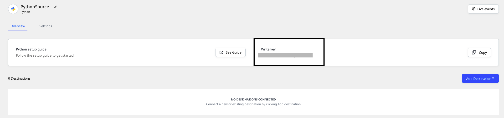

# Python

The **RudderStack Python SDK** lets you track your customer event data from your Python applications and send it to your specified destinations via RudderStack.

Check out the [**GitHub codebase**](https://github.com/rudderlabs/rudder-sdk-python) to get a more hands-on understanding of the SDK.

<a href="https://pypi.org/project/rudder-sdk-python/" target="_blank" align="left">

</a>

## SDK setup requirements

To set up the RudderStack Python SDK, the following prerequisites must be met:

- You will need to set up a [**RudderStack account**](https://app.rudderstack.com).
- Once signed up, set up a Python source in the dashboard. For more information, follow [**this guide**](https://rudderstack.com/docs/connections/adding-source-and-destination-rudderstack/). You should then see a **Write Key** for this source, as shown below:



- You will also need a data plane URL. Follow [**this section**](https://rudderstack.com/docs/get-started/installing-and-setting-up-rudderstack/#what-is-a-data-plane-url-where-do-i-get-it) for more information on the data plane URL and where to get it.

## Installing the Python SDK

To install the RudderStack Python SDK using [**pip**](https://pip.pypa.io/en/stable/), run the following command:

```bash
pip install rudder-sdk-python
```

## Initializing the RudderStack client

To initialize the RudderStack client, run the following code snippet:

```python
import rudder_analytics

rudder_analytics.write_key = WRITE_KEY
rudder_analytics.data_plane_url = DATA_PLANE_URL
```

## Sending events from the RudderStack client

Once the RudderStack client is initialized, you can use it to send your customer events. 

A sample `track` call is as shown :

```python
rudder_analytics.track('developer_user_id', 'Simple Track Event', {
  'key1': 'val1'
})
```

## Identify

The `identify` call lets you identify a visiting user and capture any related information such as their name, email address, etc.

<div class="warningBlock">

RudderStack does not store the user state in any of the server-side SDKs. Unlike the client-side SDKs that deal with only a single user at a given time, the server-side SDKs deal with multiple users at the same time. Therefore, for any of the calls supported by the Node.js SDK, you need to specify either `userId` or `anonymousId` every time.
</div>

A sample `identify` call is as shown:

```python
rudder_analytics.identify('123456', {
    'email': 'name@surname.com',
    'name': 'John Doe',
    'friends': 16
})
```

The `identify` method parameters are as described below:

| **Field**      | **Type** | **Presence**                              | **Description**                                                                                                            |
| :------------- | :------- | :---------------------------------------- | :------------------------------------------------------------------------------------------------------------------------- |
| `anonymousId`  | String   | Optional                                  | Sets the user ID for cases where there is no unique identifier for the user. Either `userId` or `anonymousId` is required. |
| `userId`       | String   | Optional, if `anonymousId` is already set | Unique identifier for a particular user in your database.                                                                  |
| `context`      | Object   | Optional                                  | Dictionary of information that provides context about a message. However, it is not directly related to the API call.      |
| `integrations` | Object   | Optional                                  | A dictionary containing the destinations to be either enabled or disabled.                                                 |
| `timestamp`    | Date     | Optional                                  | The timestamp of the message's arrival.                                                                                    |
| `traits`       | Object   | Optional                                  | Dictionary of the traits associated with the user, such as `name`or `email` .                                               |

## Track

The `track` call lets you record the user actions along with their associated properties. Each user action is called an **event**.

A sample `track` call is shown below:

```python
rudder_analytics.track('123456', 'Article Read', {
    'title': 'The Independence',
    'subtitle': 'Story of the Weak',
    'author': 'John Doe'
})
```

The `track` method parameters are as described below:

| Name           | Type   | Presence | Description                                                                                                                |
| :------------- | :----- | :------- | :------------------------------------------------------------------------------------------------------------------------- |
| `user_id`      | String | Required | The developer identification for your user                                                                                 |
| `event`        | String | Required | Name of the event being performed by the user                                                                              |
| `properties`   | Object | Optional | Dictionary of the properties associated with a particular event.                                                           |
| `context`      | Object | Optional | Dictionary of information that provides context about a message. However, it is not directly related to the API call.      |
| `timestamp`    | Date   | Optional | The timestamp of the message's arrival.                                                                                    |
| `anonymous_id` | String | Optional | Sets the user ID for cases where there is no unique identifier for the user. Either `userId` or `anonymousId` is required. |
| `integrations` | Object | Optional | A dictionary containing the destinations to be either enabled or disabled.                                                 |

## Page

The `page` call allows you to record the page views on your website along with the other relevant information about the viewed page.

A sample `page` call is as shown:

```python
rudder_analytics.page('userid', 'Documentation', 'Sample Doc', {
    'url': 'http://rudderstack.com'
})
```

The `page` method parameters are as described below:

| **Field**      | **Type** | **Presence**                              | **Description**                                                                                                            |
| :------------- | :------- | :---------------------------------------- | :------------------------------------------------------------------------------------------------------------------------- |
| `anonymousId`  | String   | Optional                                  | Sets the user ID for cases where there is no unique identifier for the user. Either `userId` or `anonymousId` is required. |
| `userId`       | String   | Optional, if `anonymousId` is already set | Unique identifier for a particular user in your database.                                                                  |
| `context`      | Object   | Optional                                  | Dictionary of information that provides context about a message. However, it is not directly related to the API call.      |
| `integrations` | Object   | Optional                                  | A dictionary containing the destinations to be either enabled or disabled.                                                 |
| `name`         | String   | Required                                  | Name of the page being viewed.                                                                                             |
| `properties`   | Object   | Optional                                  | Dictionary of the properties associated with the page being viewed, such as `url` and `referrer`                           |
| `timestamp`    | Date     | Optional                                  | The timestamp of the message's arrival.                                                                                    |

## Screen

The `screen` call lets you record whenever your user views their mobile screen with any additional relevant information about the viewed screen.

A sample `screen` call is shown below:

```python
rudder_analytics.screen('userid', 'Settings', 'Brightness', {
    'from': 'Settings Screen'
})
```

The `screen` method parameters are as described below:

| **Field**      | **Type** | **Presence**                              | **Description**                                                                                                            |
| :------------- | :------- | :---------------------------------------- | :------------------------------------------------------------------------------------------------------------------------- |
| `anonymousId`  | String   | Optional                                  | Sets the user ID for cases where there is no unique identifier for the user. Either `userId` or `anonymousId` is required. |
| `userId`       | String   | Optional, if `anonymousId` is already set | Unique identifier for a particular user in your database.                                                                  |
| `context`      | Object   | Optional                                  | Dictionary of information that provides context about a message. However, it is not directly related to the API call.      |
| `integrations` | Object   | Optional                                  | A dictionary containing the destinations to be either enabled or disabled.                                                 |
| `name`         | String   | Required                                  | Name of the screen being viewed.                                                                                           |
| `properties`   | Object   | Optional                                  | Dictionary of the properties associated with the page being viewed, such as `url` and `referrer`                           |
| `timestamp`    | Date     | Optional                                  | The timestamp of the message's arrival.                                                                                    |

## Group

The `group` call lets you associate an identified user to a group - either a company, project or a team and record any custom traits or properties associated with that group.

A sample `group` call is as shown:

```python
rudder_analytics.group('userid', 'groupid', {
    'name': 'Company',
    'domain': 'IT'
})
```

The `group` method parameters are as follows:

| **Field**      | **Type** | **Presence**                              | **Description**                                                                                                            |
| :------------- | :------- | :---------------------------------------- | :------------------------------------------------------------------------------------------------------------------------- |
| `anonymousId`  | String   | Optional                                  | Sets the user ID for cases where there is no unique identifier for the user. Either `userId` or `anonymousId` is required. |
| `userId`       | String   | Optional, if `anonymousId` is already set | Unique identifier for a particular user in your database.                                                                  |
| `context`      | Object   | Optional                                  | Dictionary of information that provides context about a message. However, it is not directly related to the API call.      |
| `integrations` | Object   | Optional                                  | A dictionary containing the destinations to be either enabled or disabled.                                                 |
| `groupId`      | String   | Required                                  | Unique identifier of the group, as present in your database.                                                               |
| `traits`       | Object   | Optional                                  | Dictionary of the properties or traits associated with the group, such as `email` or `name`.                               |
| `timestamp`    | Date     | Optional                                  | The timestamp of the message's arrival.                                                                                    |

## Alias

The `alias` call lets you merge different identities of a known user.

<div class="infoBlock">

<code class="inline-code">alias</code> is an advanced method that lets you change the tracked user's ID explicitly. This method is useful when managing identities for some of the downstream destinations.
</div>

A sample `alias` call is as shown:

```python
rudder_analytics.alias('previousid', 'userid')
```

The `alias` method parameters are as mentioned below:

| **Field**      | **Type** | **Presence**                              | **Description**                                                                                                       |
| :------------- | :------- | :---------------------------------------- | :-------------------------------------------------------------------------------------------------------------------- |
| `userId`       | String   | Optional, if `anonymousId` is already set | Unique identifier for a particular user in your database.                                                             |
| `context`      | Object   | Optional                                  | Dictionary of information that provides context about a message. However, it is not directly related to the API call. |
| `integrations` | Object   | Optional                                  | A dictionary containing the destinations to be either enabled or disabled.                                            |
| `previousId`   | String   | Required                                  | The previous unique identifier of the user.                                                                           |
| `traits`       | Object   | Optional                                  | Dictionary of the properties or traits associated with the group, such as `email` or `name`.                          |
| `timestamp`    | Date     | Optional                                  | The timestamp of the message's arrival.                                                                               |

<div class="infoBlock">

For a detailed explanation of the <code class="inline-code">alias</code> call, refer to our <a href="https://rudderstack.com/docs/rudderstack-api/api-specification/rudderstack-spec/alias/">RudderStack API Specification</a> guide.
</div>

## Flushing events

The Python SDK batches the events and flushes them in the background, for faster and more efficient operation. By default, the SDK flushes a batch of 100 events every 0.5 seconds since the last flush.

You can control the event flushing by tweaking the following parameters:

| Parameter        | Description                                | Default value |
| :----------------| :------------------------------------------| :-------------|
| `max_queue_size` | Defines the maximum queue size             | 100           |
| `flush_interval` | Time interval between two flush activities | 0.5s          |

You can also flush the events explicitly by using the SDK's `flush()` method to make sure no events are left in the queue.

A sample flush call is shown below:

```python
rudder_analytics.flush()
```

<div class="warningBlock">

The SDK blocks the calling thread until all the messages are flushed from the queue. Hence, you should avoid using it as a part of your request lifecycle.
</div>

## Error handling

To handle errors that may occur when sending these events via `rudder_analytics` you can declare a callback called `on_error`.

```
def on_error(error, events):
    print("Error response:", error)

rudder_analytics.on_error = on_error
```

<div class="infoBlock">

Note that this callback will only return the errors that may occur with the HTTP request to the gateway. It will not return any errors that occur downstream.
</div>

Some of the common request responses are listed in the following table:

| Status                                     | Code |
| :----------------------------------------- | :--- |
| OK                                          | 200  |
| Request neither has `anonymousId` nor `userId` | 400  |
| Invalid write key                          | 401  |
| Invalid JSON                               | 400  |

## Contact us

For any queries on any of the sections covered in this guide, you can [**contact us**](mailto:%20docs@rudderstack.com), or start a conversation in our [**Slack**](https://rudderstack.com/join-rudderstack-slack-community/) community.
