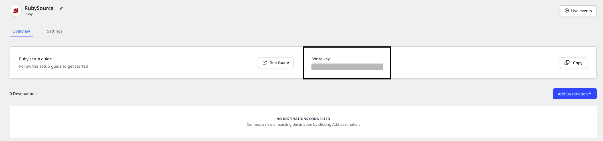

# Ruby

The **RudderStack Ruby SDK** lets you track your customer event data from your Ruby code and send it to your specified destinations via RudderStack.

Check out the [**GitHub codebase**](https://github.com/rudderlabs/rudder-sdk-ruby-sync) to get a more hands-on understanding of the SDK.

## SDK setup requirements

To set up the RudderStack Ruby SDK, the following prerequisites must be met:

- You will need to set up a [**RudderStack account**](https://app.rudderstack.com).
- Once signed up, set up a Ruby source in the dashboard. For more information, follow [**this guide**](https://rudderstack.com/docs/rudderstack-cloud/connections/). You should then see a **Write Key** for this source, as shown below:



- You will also need a data plane URL. Follow [**this section**](https://rudderstack.com/docs/get-started/installing-and-setting-up-rudderstack/#what-is-a-data-plane-url-where-do-i-get-it) for more information on the data plane URL and where to get it.

## Installing the Ruby SDK

To install the RudderStack Ruby SDK, add this line to your application's Gem file:

```ruby
gem 'rudder_analytics_sync'
```

You can also install it yourself, as shown:

```bash
gem install rudder_analytics_sync
```

## Using the SDK

To use the SDK, create a client instance as shown in the following snippet:

```ruby
require 'rudder_analytics_sync'

Analytics = RudderAnalyticsSync::Client.new(
  write_key: WRITE_KEY, # required
  data_plane_url: DATA_PLANE_URL
  on_error: proc { |error_code, error_body, exception, response|
    # defaults to an empty proc
  }
)
```

You can then use this client to send event requests, as shown:

```ruby
Analytics.track(
  user_id: user.id,
  event: 'Created Account'
)
```

### Manually batching events

You can manually batch events with `Analytics.batch` as shown:

```ruby
Analytics.batch do |batch|
  batch.context = {...}       # shared context for all events
  batch.integrations = {...}  # shared integrations hash for all events
  batch.identify(...)
  batch.track(...)
  batch.track(...)
  ...
end
```

## Identify

The `identify` call lets you identify a visiting user and capture any related information such as their name, email address, etc.

<div class="warningBlock">

RudderStack does not store the user state in any of the server-side SDKs. Unlike the client-side SDKs that deal with only a single user at a given time, the server-side SDKs deal with multiple users at the same time. Therefore, for any of the calls supported by the Node.js SDK, you need to specify either `userId` or `anonymousId` every time.
</div>

A sample `identify` call is as shown:

```ruby
Analytics.identify(
  user_id: '12345',
  traits: { email: "#{ username.email }", friends: 1 },
  context: {ip: '10.81.20.10'}
)
```

The `identify` method parameters are as shown:

| **Field**      | **Type** | **Presence**                              | **Description**                                                                                                            |
| :------------- | :------- | :---------------------------------------- | :------------------------------------------------------------------------------------------------------------------------- |
| `anonymousId`  | String   | Optional                                  | Sets the user ID for cases where there is no unique identifier for the user. Either `userId` or `anonymousId` is required. |
| `userId`       | String   | Optional, if `anonymousId` is already set | Unique identifier for a particular user in your database.                                                                  |
| `context`      | Object   | Optional                                  | Dictionary of information that provides context about a message. However, it is not directly related to the API call.      |
| `integrations` | Object   | Optional                                  | A dictionary containing the destinations to be either enabled or disabled.                                                 |
| `timestamp`    | Date     | Optional                                  | The timestamp of the message's arrival.                                                                                    |
| `traits`       | Object   | Optional                                  | Dictionary of the traits associated with the user, such as `name`or `email`.                                               |

## Track

The `track` call lets you record the user actions along with their associated properties. Each user action is called an **event**.

A sample `track` call is shown below:

```ruby
Analytics.track(
  user_id: '12345',
  event: 'Item Sold',
  properties: { revenue: 9.95, shipping: 'Free' }
)
```

The `track` method parameters are as described below:

| Name           | Type   | Presence | Description                                                                                                                |
| :------------- | :----- | :------- | :------------------------------------------------------------------------------------------------------------------------- |
| `user_id`      | String | Required | The developer identification for your user                                                                                 |
| `event`        | String | Required | Name of the event being performed by the user                                                                              |
| `properties`   | Object | Optional | Dictionary of the properties associated with a particular event.                                                           |
| `context`      | Object | Optional | Dictionary of information that provides context about a message. However, it is not directly related to the API call.      |
| `timestamp`    | Date   | Optional | The timestamp of the message's arrival.                                                                                    |
| `anonymous_id` | String | Optional | Sets the user ID for cases where there is no unique identifier for the user. Either `userId` or `anonymousId` is required. |
| `integrations` | Object | Optional | A dictionary containing the destinations to be either enabled or disabled.                                                 |

## Page

The `page` call allows you to record the page views on your website along with the other relevant information about the viewed page.

A sample `page` call is as shown:

```ruby
Analytics.page(
  user_id: userid,
  category: 'Food',
  name: 'Pizza',
  properties: { url: 'https://dominos.com' }
)
```

The `page` method parameters are as described below:

| **Field**      | **Type** | **Presence**                              | **Description**                                                                                                            |
| :------------- | :------- | :---------------------------------------- | :------------------------------------------------------------------------------------------------------------------------- |
| `anonymousId`  | String   | Optional                                  | Sets the user ID for cases where there is no unique identifier for the user. Either `userId` or `anonymousId` is required. |
| `userId`       | String   | Optional, if `anonymousId` is already set | Unique identifier for a particular user in your database.                                                                  |
| `context`      | Object   | Optional                                  | Dictionary of information that provides context about a message. However, it is not directly related to the API call.      |
| `integrations` | Object   | Optional                                  | A dictionary containing the destinations to be either enabled or disabled.                                                 |
| `name`         | String   | Required                                  | Name of the page being viewed.                                                                                             |
| `properties`   | Object   | Optional                                  | Dictionary of the properties associated with the page being viewed, such as `url` and `referrer`                           |
| `timestamp`    | Date     | Optional                                  | The timestamp of the message's arrival.                                                                                    |

## Group

The `group` call lets you associate an identified user to a group - either a company, project or a team and record any custom traits or properties associated with that group.

A sample `group` call is as shown:

```ruby
Analytics.group(
  user_id: '12345',
  group_id: '12',
  traits: { name: 'Company', description: 'Software'}
)
```

The `group` method parameters are as follows:

| **Field**      | **Type** | **Presence**                              | **Description**                                                                                                            |
| :------------- | :------- | :---------------------------------------- | :------------------------------------------------------------------------------------------------------------------------- |
| `anonymousId`  | String   | Optional                                  | Sets the user ID for cases where there is no unique identifier for the user. Either `userId` or `anonymousId` is required. |
| `userId`       | String   | Optional, if `anonymousId` is already set | Unique identifier for a particular user in your database.                                                                  |
| `context`      | Object   | Optional                                  | Dictionary of information that provides context about a message. However, it is not directly related to the API call.      |
| `integrations` | Object   | Optional                                  | A dictionary containing the destinations to be either enabled or disabled.                                                 |
| `groupId`      | String   | Required                                  | Unique identifier of the group, as present in your database.                                                               |
| `traits`       | Object   | Optional                                  | Dictionary of the properties or traits associated with the group, such as `email` or `name`.                               |
| `timestamp`    | Date     | Optional                                  | The timestamp of the message's arrival.                                                                                    |

## Alias

The `alias` call lets you merge different identities of a known user.

<div class="infoBlock">

<code class="inline-code">alias</code> is an advanced method that lets you change the tracked user's ID explicitly. This method is useful when managing identities for some of the downstream destinations.
</div>

A sample `alias` call is as shown:

```ruby
Analytics.alias(previous_id: '12345', user_id: '123')
```

The `alias` method parameters are as mentioned below:

| **Field**      | **Type** | **Presence**                              | **Description**                                                                                                       |
| :------------- | :------- | :---------------------------------------- | :-------------------------------------------------------------------------------------------------------------------- |
| `userId`       | String   | Optional, if `anonymousId` is already set | Unique identifier for a particular user in your database.                                                             |
| `context`      | Object   | Optional                                  | Dictionary of information that provides context about a message. However, it is not directly related to the API call. |
| `integrations` | Object   | Optional                                  | A dictionary containing the destinations to be either enabled or disabled.                                            |
| `previousId`   | String   | Required                                  | The previous unique identifier of the user.                                                                           |
| `traits`       | Object   | Optional                                  | Dictionary of the properties or traits associated with the group, such as `email` or `name`.                          |
| `timestamp`    | Date     | Optional                                  | The timestamp of the message's arrival.                                                                               |

<div class="infoBlock">

For a detailed explanation of the <code class="inline-code">alias</code> call, refer to our <a href="https://rudderstack.com/docs/rudderstack-api/api-specification/rudderstack-spec/alias/">RudderStack API Specification</a> guide.
</div>

## Contact us

For any queries on any of the sections covered in this guide, you can [**contact us**](mailto:%20docs@rudderstack.com), or start a conversation on our [**Slack**](https://rudderstack.com/join-rudderstack-slack-community/) channel.
