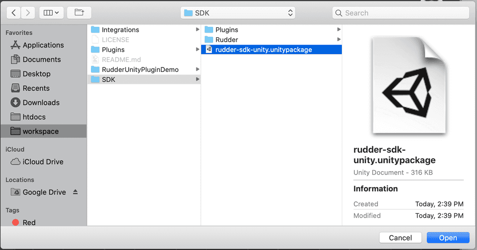

# Unity

The **RudderStack Unity SDK** is a wrapper for the RudderStack [**Android SDK**](https://rudderstack.com/docs/stream-sources/rudderstack-sdk-integration-guides/rudderstack-android-sdk/) and [**iOS SDK**](https://rudderstack.com/docs/stream-sources/rudderstack-sdk-integration-guides/rudderstack-ios-sdk/) and is used for tracking game event data. After integrating this SDK with your game, you will be able to track your game event data and send it to your specified destinations via RudderStack.

Check the [**GitHub codebase**](https://github.com/rudderlabs/rudder-sdk-unity) to get a more hands-on understanding of the SDK.

## SDK setup requirements

To configure the Unity SDK, you will need the following:

- You will need to set up a [**RudderStack account**](https://app.rudderstack.com).
- Once signed up, set up a Unity source in the dashboard. For more information, follow [**this guide**](https://rudderstack.com/docs/connections/adding-source-and-destination-rudderstack/).  You should then see a **Write Key** for this source, as shown below:


- You will also need a data plane URL. Follow [**this section**](https://rudderstack.com/docs/get-started/installing-and-setting-up-rudderstack/#what-is-a-data-plane-url-where-do-i-get-it) for more information on the data plane URL and where to get it.

- Finally, you will need the [**Unity development kit**](https://store.unity.com/download).

## Installing the Unity SDK

Follow these steps to integrate the RudderStack Unity SDK with your project:

- Download `rudder-sdk-unity.unitypackage` from our [**GitHub repository**](https://github.com/rudderlabs/rudder-sdk-unity/raw/master/SDK/rudder-sdk-unity.unitypackage).
- Import the downloaded package to your project. From the **Assets** menu, go to **Import Package** - **Custom Package...** as shown:


- Select `rudder-sdk-unity.unitypackage` from the downloaded location and click on **Open**, as shown:



- Click on `Import` in the import popup as shown:


## Initializing the RudderStack client

To initialize the RudderStack client, follow these steps:

- Add the `import` to all the files where you wish to use `RudderClient` .

```csharp
using RudderStack;
```

- Then, add the following code in the `Awake` method of your main `GameObject` Script:

```csharp
// Critical for iOS Applications where multiple components are using SQLite
// This has no effect for Android, but can be added as a safety check
RudderClient.SerializeSqlite();

// Build your config
RudderConfigBuilder configBuilder = new RudderConfigBuilder()
    .WithDataPlaneUrl(DATA_PLANE_URL);

// get instance for RudderClient
RudderClient rudderClient = RudderClient.GetInstance(
    WRITE_KEY,
    configBuilder.Build()
);
```

<div class="warningBlock">

If you are building an iOS project, <code class="inline-code">RudderClient.SerializeSqlite()</code> is important to handle races with SQLite.
</div>

## Identify

The Unity SDK captures the `deviceId` and uses that as the `anonymousId` for identifying the user. This helps in tracking the users across the application installation. To attach more information to the user, you can use the `identify` method. Once the SDK identifies the user, it persists and passes the user information to the subsequent calls. 

To reset the user identification, you can use the `reset` method.

A sample `identify` event is as shown:

```csharp
RudderMessage identifyMessage = new RudderMessageBuilder().Build();
RudderTraits traits = new RudderTraits().PutEmail("some@example.com");
rudderClient.Identify("some_user_id", traits, identifyMessage);
```

### Overriding the anonymousId using setAnonymousId

 You can explicitly set the `anonymousId` for all the future events using the `setAnonymousId()` method, as shown:
 
 ```csharp
rudderClient.setAnonymousId("anonymousID1");
 ```

## Track

You can record the users' in-game activity through the `track` method. Every user action is called an **event**.

A sample `track` event is as shown:

```csharp
// create event properties
Dictionary<string, object> eventProperties = new Dictionary<string, object>();
eventProperties.Add("test_key_1", "test_value_1");
eventProperties.Add("test_key_2", "test_value_2");

// create user properties
Dictionary<string, object> userProperties = new Dictionary<string, object>();
userProperties.Add("test_u_key_1", "test_u_value_1");
userProperties.Add("test_u_key_2", "test_u_value_2");

// create message to track
RudderMessageBuilder builder = new RudderMessageBuilder();
builder.WithEventName("test_event_name");
builder.WithUserId("test_user_id");
builder.WithEventProperties(eventProperties);
builder.WithUserProperties(userProperties);

rudderClient.Track(builder.Build());
```

```csharp
// create message to track
RudderMessageBuilder builder = new RudderMessageBuilder();
builder.WithEventName("test_event_name");
builder.WithUserId("test_user_id");
builder.WithEventProperty("foo", "bar");
builder.WithUserProperty("foo1", "bar1");

rudderClient.Track(builder.Build());
```

## Screen

The `screen` call lets you record the user activities on their mobile screen with any additional relevant information about the viewed screen.

A sample `screen` event is as shown:

```csharp
// create screen properties
Dictionary < string, object > screenProperties = new Dictionary < string, object > ();
screenProperties.Add("key_1", "value_1");
screenProperties.Add("key_2", "value_2");

RudderMessageBuilder screenBuilder = new RudderMessageBuilder();
screenBuilder.WithEventName("Home Screen");
screenBuilder.WithEventProperties(screenProperties);
rudderClient.Screen(screenBuilder.Build());
```

## Reset

The `reset` method clears all the persisted traits of the previously identified user.

```csharp
rudderClient.Reset();
```

## Upgrading the SDK

To upgrade the SDK, remove all the files related to the SDK from the `Plugins` folder. Also, remove the `Rudder` folder completely before importing a newer version of the SDK.

You can find the following files in the **Plugins** folder for the SDK:

- `Plugins/Android/unity-plugin-release.aar`
- `Plugins/iOS/RudderSDKUnity`

## Contact us

For queries on any of the sections covered in this guide, you can [**contact us**](mailto:%20docs@rudderstack.com) or start a conversation in our [**Slack**](https://rudderstack.com/join-rudderstack-slack-community) community.

If you come across any issues while using the Unity SDK, you can also open a new issue on our [**GitHub Issues page**](https://github.com/rudderlabs/rudder-sdk-unity/issues/new).
