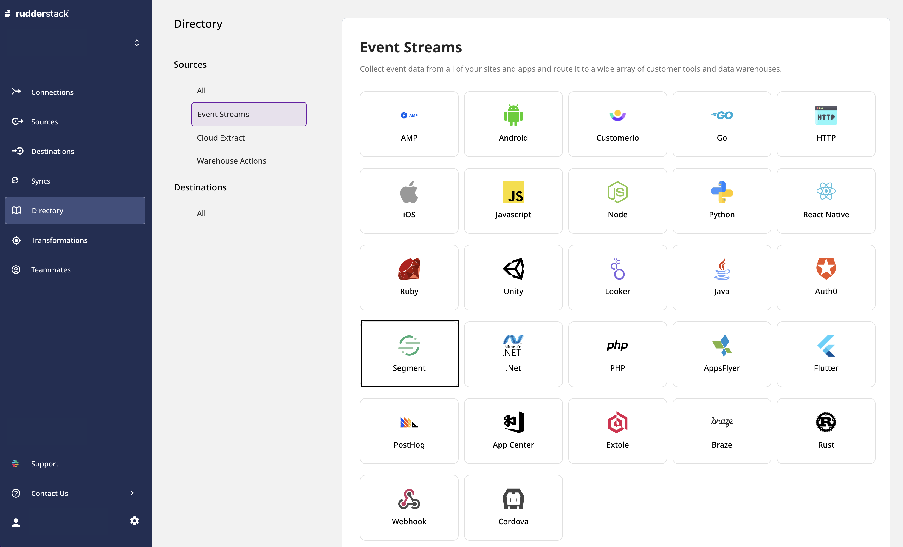
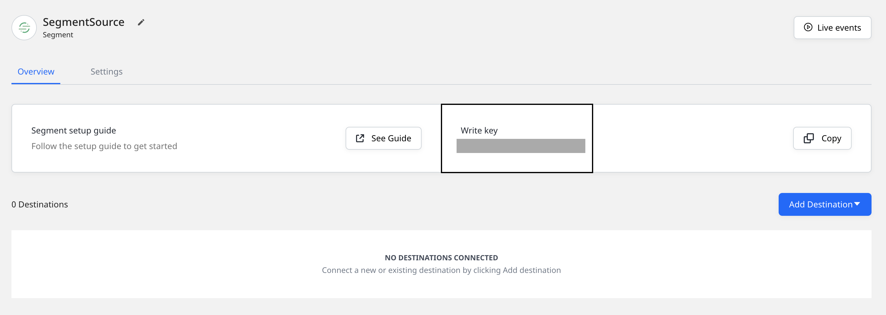
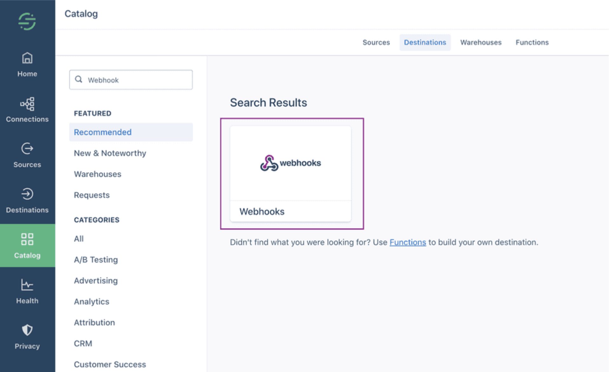
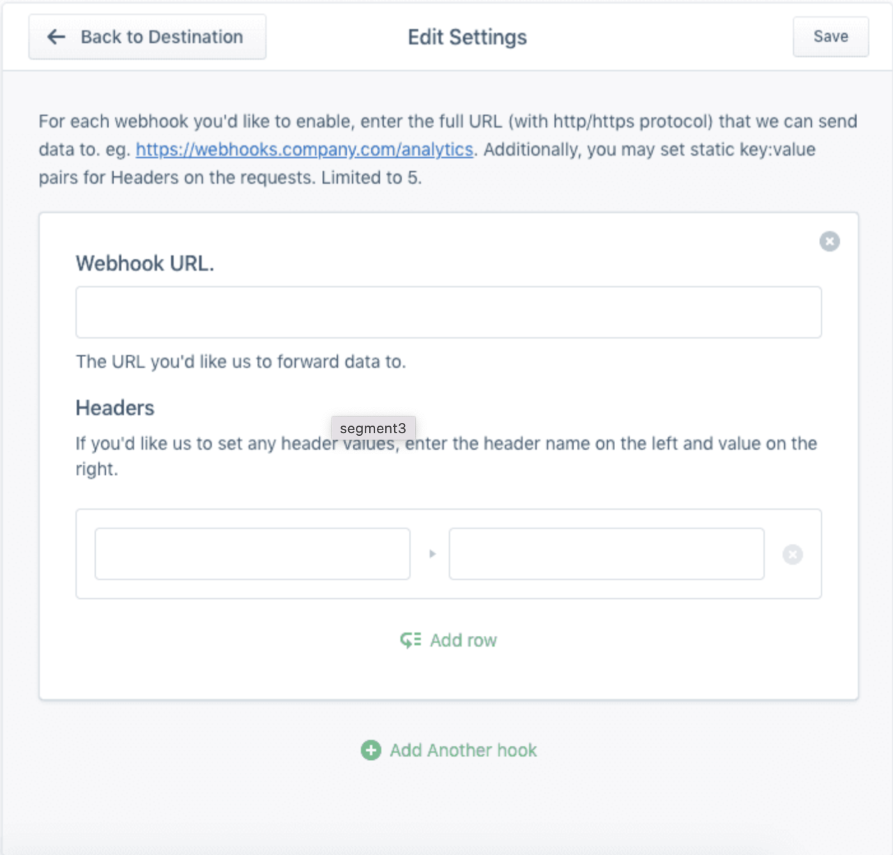

# Segment

[**Segment**](https://segment.com) is a Customer Data Platform that lets you collect your customer data while giving you complete control over how you use it.

You can now send your Segment event data to RudderStack by adding a webhook endpoint that points to RudderStack. This way, you can forward any event received by Segment to RudderStack.

This guide will help you set up Segment as a source in RudderStack.

## Getting started

To add Segment as a source in RudderStack, follow these steps:

- Go to your [**RudderStack dashboard**](https://app.rudderstack.com/) and click on **Add Source**. Then, select **Segment** from the list of **Event Stream** sources, as shown:



- Assign a name to your source and click on **Next**.

- Your Segment source is now configured. Note the source **Write key** - this will be required to configure the endpoint URL in the later steps.



- Next, head over to your [**Segment dashboard**](https://app.segment.com/workspaces) and navigate to the **Destinations** page from the sidebar. Then, click on **Add Destination**. In the destinations catalog page, search for **Webhooks**.



- In the configuration screen, enter the RudderStack webhook URL as shown:



The webhook URL is of the following format:

`<DATA_PLANE_URL>/v1/webhook?writeKey=<WRITE_KEY>`

<div class="infoBlock">

For more information on the data plane URL and how to get it, refer to <a href="https://rudderstack.com/docs/get-started/installing-and-setting-up-rudderstack/#what-is-a-data-plane-url-where-do-i-get-it">this</a> section.
</div>

<div class="warningBlock">

Make sure you add the source write key as query parameter to the URL. This is required to prevent the webhook from failing because of an invalid write key.
</div>

A sample webhook URL is shown below:

```http
https://hosted.rudderlabs.com/v1/webhook?writeKey=1bCenS7ynqHh8ETX8s5Crjh22J
```

## Event transformation

As RudderStack is fully Segment-compatible, it does not perform any modifications on the event data received from Segment.

## Contact us

For queries on any of the sections covered in this guide, you can [**contact us**](mailto:%20docs@rudderstack.com) or start a conversation on our [**Slack**](https://rudderstack.com/join-rudderstack-slack-community) channel.
