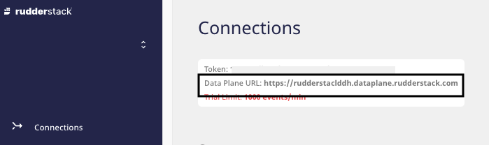

# Shopify

[Shopify](https://www.shopify.in/) is a popular all-in-one E-commerce platform that gives you all the tools to start, run, and grow your business effectively. It offers online retailers a variety of services around digital payments, marketing, product shipping, customer engagement and retention, and more.

This guide will help you set up Shopify as a source in RudderStack.


<div class="infoBlock">
  
  Setting up the Shopify source involves two steps:

<ul>
  <li><a href="#configuring-the-shopify-source-in-rudderstack">Configuring the Shopify source in RudderStack</a></li>
  <li><a href="#configuring-the-rudderstack-app-in-your-shopify-store">Configuring the RudderStack app in your Shopify store</a></li>
</ul>
</div>

## Configuring the Shopify source in RudderStack

Follow these steps to set up your Shopify source in the RudderStack dashboard:

1. Go to your [RudderStack dashboard](https://app.rudderstack.com/) and click on **Add Source**. From the list of **Event Stream** sources, select **Shopify**, as shown:


2. Assign a name to your source and click on **Next**.

3. Your Shopify source is now configured. Note the source **Write key**. This will be required later while configuring the RudderStack app on your Shopify store.


4. Finally, connect the source to your desired destinations.

## Configuring the RudderStack app in your Shopify store

To complete the configuration, you will need to add and configure the RudderStack app in your Shopify store. Follow these steps:

1. Go to your Shopify store's [admin dashboard](https://accounts.shopify.com/store-login).
2. In the left sidebar, click on **Apps**. Then, click on **Customize your store**, as shown:


3. Search for RudderStack, as shown:


4. In the search results, click on the RudderStack app. Then, click on **Add app**. 
5. After installation, you should be able to see the app in the **Installed apps** section, as shown:


6. Select the RudderStack app.
7. Enter your **RudderStack Data Plane URL** and the **Source Write Key** that you copied [**above**](#setting-up-the-shopify-source-in-rudderstack), as shown:


<div class="infoBlock">

Follow <a href="https://rudderstack.com/docs/get-started/installing-and-setting-up-rudderstack/#what-is-a-data-plane-url-where-do-i-get-it">this section</a> for more information on the data plane URL and where to get it.
</div>

8. Finally, click on **Submit**.

<div class="infoBlock">

  You can also update these fields later with a different write key and data plane URL.
</div>

## Event transformation

The Shopify source supports both [**cloud mode**](https://www.rudderstack.com/docs/connections/rudderstack-connection-modes/#cloud-mode) and [**device mode**](https://www.rudderstack.com/docs/connections/rudderstack-connection-modes/#device-mode) tracking. RudderStack enables simultaneous tracking of user events via these modes.

### Supported cloud mode events

<div class="infoBlock">

RudderStack uses the Shopify-provided webhooks for tracking events in cloud mode. 
</div>

The following table details the supported Shopify events and their corresponding [topic](https://shopify.dev/api/admin-rest/2022-01/resources/webhook#:~:text=a%20custom%20storefront.-,Mandatory%20webhooks,-You%20don%27t%20create) mapping:

| Shopify event name            | Description                 | Subscribed topic              | RudderStack event type |
| :-----------------------------| :---------------------------| :-----------------------------| :----------------------|
| `customers_disabled`          | Customer is disabled.       | `customers/disable`           | `identify`             |
| `customers_enable`            | Customer is enabled.        | `customers/enable`            | `identify`             |
| `checkout_delete`             | Checkout was deleted.       | `checkouts/delete`            | `track`                |
| `checkout_update`             | Checkout was updated.       | `checkouts/update`            | `track`                |
| `carts_create`                | Cart was created.           | `cart/create`                 | `track`                |
| `carts_update`                | Cart was updated.           | `cart/update`                 | `track`                |
| `fulfillments_create`         | Fulfillment was created.    | `fulfillments/create`         | `track`                |
| `fulfillments_update`         | Fulfillment was updated.    | `fulfillments/update`         | `track`                |
| `orders_create`               | Order was created.          | `orders/create`               | `track`                |
| `orders_delete`               | Order was delted.           | `orders/delete`               | `track`                |
| `orders_cancelled`            | Order was cancelled.        | `orders/cancelled`            | `track`                |
| `orders_fulfilled`            | Order was fulfilled.        | `orders/fulfilled`            | `track`                |
| `orders_paid`                 | Order was paid.             | `orders/paid`                 | `track`                |
| `orders_partially_fullfilled` | Order was partly fulfilled. | `orders/partially_fulfilled`  | `track`                |

RudderStack also supports the following [E-commerce events](https://rudderstack.com/docs/rudderstack-api/api-specification/rudderstack-ecommerce-events-specification/):

| Shopify event name            | Description                 | Subscribed topic              |
| :-----------------------------| :---------------------------| :-----------------------------|
| `checkout_created`            | A new checkout was created. | `checkouts/create`            |
| `order_update`                | Order was updated.          | `orders/updated`              |

<div class="warningBlock">

Any other events flowing through RudderStack except the <code class="inline-code">track</code>, <code class="inline-code">identify</code>, and the E-commerce events mentioned above will be <strong>discarded</strong>.
</div>

#### Required scopes

The RudderStack app requires the following [scopes](https://shopify.dev/api/usage/access-scopes) for tracking user events in the Shopify store:

```text
"write_products",
"write_customers",
"write_draft_orders",
"read_checkouts",
"write_checkouts",
"read_orders",
"write_orders",
"read_fulfillments",
"write_fulfillments",
"read_script_tags",
"write_script_tags"
```

### Supported device mode events

<div class="infoBlock">

For device mode tracking, RudderStack inserts a JavaScript tracking code into every page of the respective Shopify store.
</div>

- RudderStack supports the [`page`](https://www.rudderstack.com/docs/rudderstack-api/api-specification/rudderstack-spec/page/) event for every page visited on the Shopify store.
- It also supports the `Registration Viewed` as a generic [`track`](https://www.rudderstack.com/docs/rudderstack-api/api-specification/rudderstack-spec/track/) event whenever the user views their account or registration page.
- The following [E-commerce events](https://www.rudderstack.com/docs/rudderstack-api/api-specification/rudderstack-ecommerce-events-specification/) are also supported in device mode:

| Event name             | Description                                |
| :----------------------| :------------------------------------------|
| `Cart Viewed`          | User viewed the cart page.                 |
| `Checkout Started`     | User clicked on the buy button.            |
| `Product Added`        | User added the product to the cart.        |
| `Product Clicked`      | User clicked on a product.                 |
| `Product List Viewed`  | User viewed the product collections page.  |
| `Product Viewed`       | User viewed a product page.                |

## FAQ

### I'm getting a Registration Failed/Updated Failed error when I enter the data plane URL and the write key. What should I do?

When [configuring the RudderStack app in your Shopify store](#configuring-the-rudderstack-app-in-your-shopify-store), you need to enter your RudderStack data plane URL and the source write key obtained while [setting up the Shopify source in RudderStack](#configuring-the-shopify-source-in-rudderstack).


If you get a **Registrated Failed** or **Update Failed** error after entering the credentials, uninstall and reinstall the RudderStack app in your Shopify store and try again.

### Where can I find the RudderStack data plane URL?

You can find the data plane URL in the home page of your [RudderStack dashboard](https://app.rudderstack.com), as shown:



## Contact us

For queries on any of the sections covered in this guide, you can [**contact us**](mailto:%20docs@rudderstack.com) or start a conversation on our [**Slack**](https://rudderstack.com/join-rudderstack-slack-community) channel.
