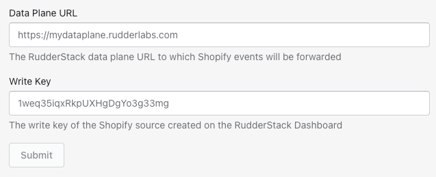

# Shopify

[**Shopify**](https://www.shopify.in/) is a popular all-in-one E-commerce platform that gives you all the tools to start, run, and grow your business effectively. It offers online retailers a variety of services around digital payments, marketing, product shipping, customer engagement and retention, and more.

This guide will help you set up Shopify as a source in RudderStack.


<div class="infoBlock">
  
  Setting up the Shopify source involves two steps:

<ul>
  <li><a href="#configuring-the-shopify-source-in-rudderstack">Configuring the Shopify source in RudderStack</a></li>
  <li><a href="#configuring-the-rudderstack-app-in-your-shopify-store">Configuring the RudderStack app in your Shopify store</a></li>
</ul>
</div>

## Configuring the Shopify source in RudderStack

Follow these steps to set up your Shopify source in the RudderStack dashboard:

- Go to your [**RudderStack dashboard**](https://app.rudderstack.com/) and click on **Add Source**. From the list of **Event Stream** sources, select **Shopify**, as shown:


- Assign a name to your source and click on **Next**.

- Your Shopify source is now configured. Note the source **Write key**. This will be required later while configuring the RudderStack app on your Shopify store.


- Finally, connect the source to your desired destinations.

## Configuring the RudderStack app in your Shopify store

To complete the configuration, you will need to add the webhook URL copied above in the RudderStack app installed in your Shopify store. Follow these steps to do so:

- Go to the [**admin dashboard**](https://accounts.shopify.com/store-login) of your Shopify store.

- In the left sidebar, click on **Apps**. Then, click on **Customize your store**, as shown:


- Then, search for RudderStack, as shown:


- In the search results, click on the RudderStack app. Then click on **Add app**. 

- After installation, you should see the app in the **Installed apps** section, as shown:


- Select the RudderStack app.

- Finally, enter your **RudderStack Data Plane URL** and the **Source Write Key** that you copied [**above**](#setting-up-the-shopify-source-in-rudderstack), as shown:



<div class="infoBlock">

Follow <a href="https://rudderstack.com/docs/get-started/installing-and-setting-up-rudderstack/#what-is-a-data-plane-url-where-do-i-get-it">this section</a> for more information on the data plane URL and where to get it.
</div>

## Event transformation

The Shopify source supports both [**cloud mode**](https://www.rudderstack.com/docs/connections/rudderstack-connection-modes/#cloud-mode) and [**device mode**](https://www.rudderstack.com/docs/connections/rudderstack-connection-modes/#device-mode) tracking.

<div class="infoBlock">

For cloud mode tracking, RudderStack uses the Shopify-provided webhooks, whereas for device mode tracking, RudderStack inserts a JavaScript tracking code into every page of the respective Shopify store.
</div>

### Supported cloud mode events

- RudderStack supports and maps Shopify's `customer_create` and `customer_update` events as `identify` events.
- RudderStack also supports the `checkout_created` and `order_update` events as the [E-commerce events](https://rudderstack.com/docs/rudderstack-api/api-specification/rudderstack-ecommerce-events-specification/).
- The following Shopify events are mapped to RudderStack's generic `track` events:

```javascript
[
  "checkout_delete",
  "checkout_update",
  "customers_disabled",
  "customers_enable",
  "carts_create",
  "carts_update",
  "fulfillments_create",
  "fulfillments_update",
  "orders_create",
  "orders_delete",
  "orders_cancelled",
  "orders_fulfilled",
  "orders_paid",
  "orders_partially_fullfilled",
]
```

<div class="warningBlock">

Any other events flowing through RudderStack except the <code class="inline-code">track</code>, <code class="inline-code">identify</code>, and the E-commerce events mentioned above will be <strong>discarded</strong>.
</div>

### Supported device mode events

- RudderStack supports the `Page Viewed` event for every page visited on the Shopify store.
- It also supports the `Registration Viewed` as a generic `track` event whenever the user visits their account or the registration page.
- RudderStack supports the following E-commerce events in device mode:

| Event name |
| :------------|
| Cart Viewed |
| Checkout Started |
| Product Added |
| Product Clicked |
| Product List Viewed |
| Product Viewed |

## Contact us

For queries on any of the sections covered in this guide, you can [**contact us**](mailto:%20docs@rudderstack.com) or start a conversation on our [**Slack**](https://rudderstack.com/join-rudderstack-slack-community) channel.
