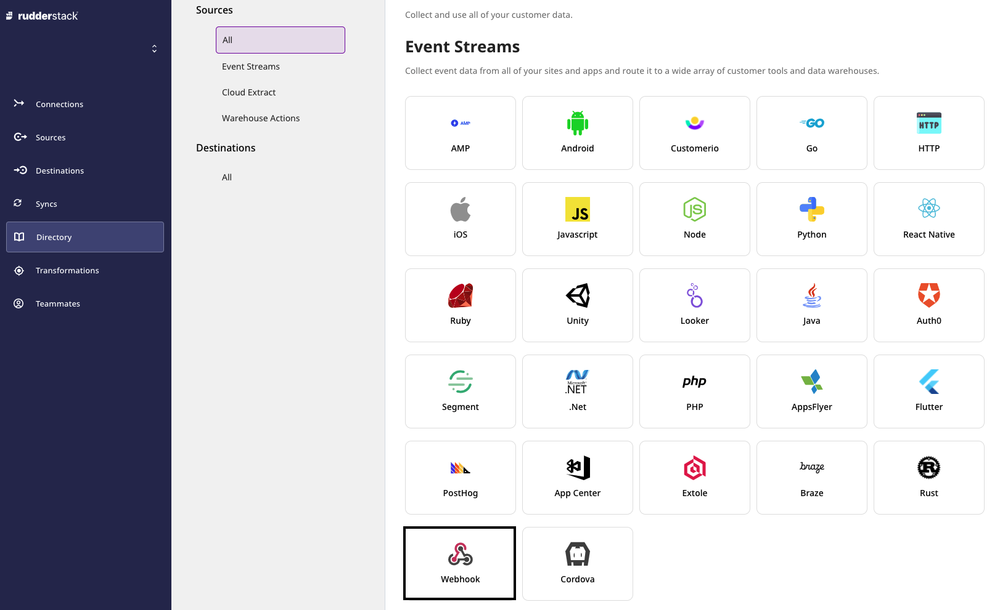
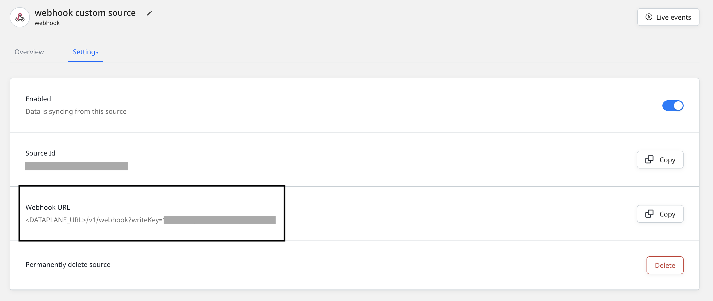
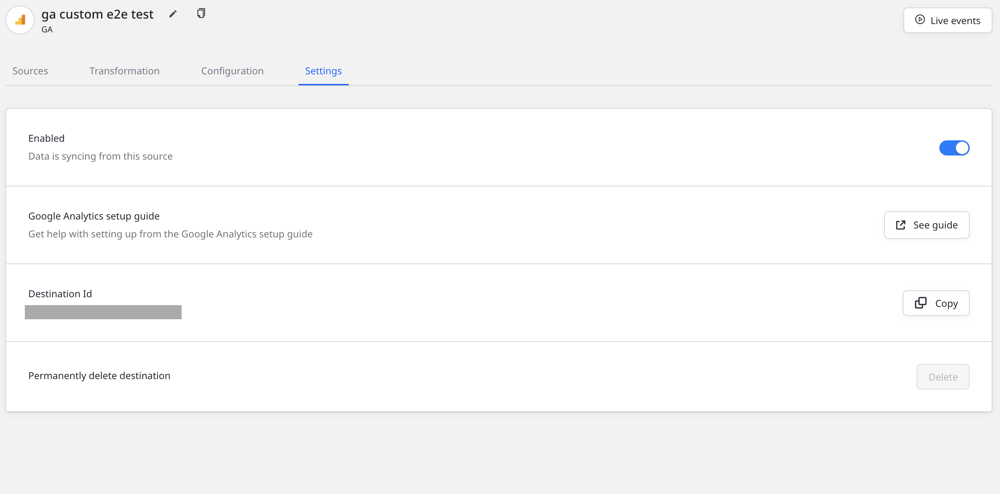

# Webhook Source

RudderStack lets you add any source that supports a webhook and use it to send events to your preferred destination.

This guide will help you set up a webhook source in RudderStack.

<div class="warningBlock">

You must also add <a href="https://rudderstack.com/docs/transformations/">User Transformations</a> to transform the event data into a destination-specific format.
</div>

## Getting started

This section details the steps involved in setting up a webhook source in the RudderStack dashboard. 

As an example, we will ingest events from [**Mailchimp**](https://mailchimp.com) into RudderStack by configuring a webhook.

- Go to your [**RudderStack dashboard**](https://app.rudderstack.com/) and click on **Add Source**. From the list of **Event Stream** sources, click on **Webhook**.



- Assign a name to your source and click on **Next**.

- Your webhook source is now created, as shown below. Note the **Webhook URL** containing the **Write key** as a query parameter, as shown:



The webhook URL is of the following format:

`http://<DATA_PLANE_URL>/v1/webhook?writeKey=<WRITE_KEY>`

<div class="infoBlock">

For more information on the data plane URL, refer to <a href="https://rudderstack.com/docs/get-started/installing-and-setting-up-rudderstack/#what-is-a-data-plane-url-where-do-i-get-it">this</a> section.
</div>

A sample webhook URL is shown below:

```http
https://hosted.rudderlabs.com/v1/webhook?writeKey=1bCenS7ynqHh8ETX8s5Crjh22J
```

- Then, add a destination in RudderStack and connect it to this webhook source. For this example, we will configure [**Google Analytics**](https://rudderstack.com/docs/destinations/analytics/google-analytics-ga/) as a destination, as shown:



<div class="infoBlock">

Follow our guide on <a href="https://rudderstack.com/docs/connections/adding-source-and-destination-rudderstack/">Adding a Source and Destination in RudderStack</a> for more details.
</div>

- Next, add the webhook URL to your desired source platform. **Remember that you can configure webhook sources only for the source platforms that support webhooks**. The following image shows the webhook URL added in Mailchimp:


<div class="warningBlock">

Remember to add and test your webhook URL.
</div>

- When your users perform any action that is configured in the source, the source platform will automatically send the generated events to the webhook URL.

In this example, Mailchimp sends the updates under **What type of updates should we send?** \(seen in the image above\) as user events to the webhook URL with the content type `application/x-www-form-urlencoded`.

<div class="infoBlock">

The content type can vary in case of other webhook sources.
</div>

- RudderStack then takes the data, creates the payload and sends it to Google Analytics.

<div class="warningBlock">

You must also add the appropriate <a href="https://rudderstack.com/docs/transformations/">User Transformation</a> to transform the payload into a destination-specific format before sending it to the destination. Refer to the <a href="#payload-creation-and-transformation">Payload creation and transformation</a> section for more details.
</div>

## Payload creation and transformation

This section details how RudderStack receives the data from the webhook source platform and creates the resulting payload.

Continuing with our Mailchimp example, suppose a customer subscribes to Mailchimp. Mailchimp then sends the following data to RudderStack:

```
type=subscribe&fired_at=2021-07-28+08%3A06%3A59&data%5Bid%5D=e2ff089583&data%5Bemail%5D=ruchira%40rudderlabs.com&data%5Bemail_type%5D=html&data%5Bip_opt%5D=115.187.35.152&data%5Bweb_id%5D=161912900&data%5Bmerges%5D%5BEMAIL%5D=name%40rudderlabs.com&data%5Bmerges%5D%5BFNAME%5D=Name&data%5Bmerges%5D%5BLNAME%5D=Surname&data%5Bmerges%5D%5BADDRESS%5D=&data%5Bmerges%5D%5BPHONE%5D=&data%5Bmerges%5D%5BBIRTHDAY%5D=&data%5Blist_id%5D=ec4689c266
```

RudderStack receives this data and creates the following payload:

```javascript
  {
  type: "track",
  event: "webhook_source_event",
  rudderId: "044448e2-a674-426c-ba61-8341262babcc",
  messageId: "4379907d-689a-4e3a-a2f7-477e29a02299",
  properties: {
    type: ["subscribe"],
    "data[id]": ["e2ff089583"],
    fired_at: ["2021-07-28 08:06:59"],
    "data[email]": ["[name@rudderlabs.com](mailto:name@rudderlabs.com)"],
    "data[ip_opt]": ["115.187.35.152"],
    "data[web_id]": ["161912900"],
    "data[list_id]": ["ec4689c266"],
    "data[email_type]": ["html"],
    "data[merges][EMAIL]": [
      "[name@rudderlabs.com](mailto:name@rudderlabs.com)",
    ],
    "data[merges][FNAME]": ["Name"],
    "data[merges][LNAME]": ["Surname"],
    "data[merges][PHONE]": [""],
    "data[merges][ADDRESS]": [""],
    "data[merges][BIRTHDAY]": [""],
  },
  anonymousId: "d6597ba2-54db-4bd7-8769-86ac067b4178",
}
```

You can then transform this payload according to the desired destination with the help of RudderStack's [**Transformations**](https://rudderstack.com/docs/transformations) feature.

A sample transformation is as shown below:

```javascript
export function transformEvent(event) {
  const updatedEvent = event
  const { properties } = event

  if (properties) {
    updatedEvent.event = properties.type
    updatedEvent.userId = properties["data[email]"]
    updatedEvent.properties.name = `${properties["data[merges][FNAME]"]} ${properties["data[merges][LNAME]"]}`
    updatedEvent.properties.phone = properties["data[merges][PHONE]"]

    delete updatedEvent.properties["data[merges][PHONE]"]
    delete updatedEvent.properties["data[merges][FNAME]"]
    delete updatedEvent.properties["data[merges][LNAME]"]
  }

  return updatedEvent
}
```

The transformed payload is shown below:

```javascript
{
  type: 'track',
  event: [
    'subscribe'
  ],
  rudderId: '044448e2-a674-426c-ba61-8341262babcc',
  messageId: '4379907d-689a-4e3a-a2f7-477e29a02299',
  properties: {
    type: [
      'subscribe'
    ],
    'data[id]': [
      'e2ff089583'
    ],
    fired_at: [
      '2021-07-28 08:06:59'
    ],
    'data[email]': [
      'name@rudderlabs.com'
    ],
    'data[ip_opt]': [
      '115.187.35.152'
    ],
    'data[web_id]': [
      '161912900'
    ],
    'data[list_id]': [
      'ec4689c266'
    ],
    'data[email_type]': [
      'html'
    ],
    'data[merges][EMAIL]': [
      'name@rudderlabs.com'
    ],
    'data[merges][ADDRESS]': [
      ''
    ],
    'data[merges][BIRTHDAY]': [
      ''
    ],
    name: 'Name Surname',
    phone: [
      ''
    ]
  },
  anonymousId: 'd6597ba2-54db-4bd7-8769-86ac067b4178',
  userId: [
    'name@rudderlabs.com'
  ]
}
```

RudderStack then sends this payload to your destination - Google Analytics, in this case.

## Contact us

For queries on any of the sections covered in this guide, you can [**contact us**](mailto:%20docs@rudderstack.com) or start a conversation in our [**Slack**](https://rudderstack.com/join-rudderstack-slack-community) community.
