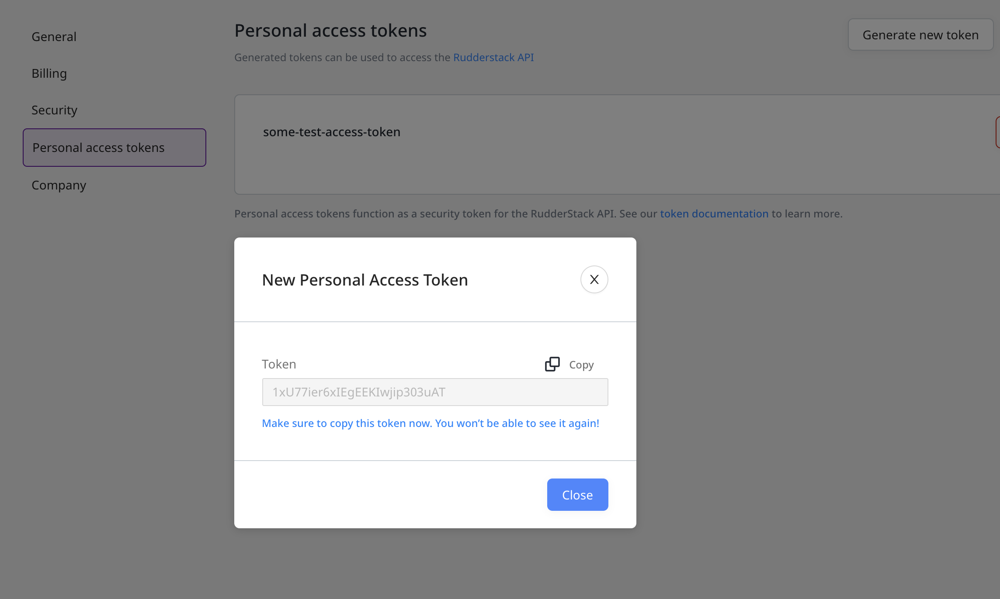
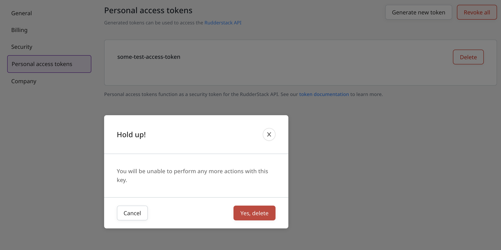

# Access Token

To consume all the public RudderStack APIs, you will need access to them. This guide details the steps required to generate an access token and the operations associated with it.

## Operations on the Access Token

To use all the public RudderStack APIs, you will need an Access Token associated with your account. You can create your own Access Token by following the steps below:

* Log into your [**RudderStack dashboard**](https://app.rudderstack.com/). 
* Click on the [**profile**](https://app.rudderstack.com/profile) tab from the left panel in the dashboard and choose[ **Personal Access Tokens**](https://app.rudderstack.com/profile/tokens) tab, as shown:

<!---->

* Click on **Generate new token** option. Enter the token **name** in the popup and click on **Generate**, as shown:

<!---->

* You will then be able to see and copy the access token, as shown: 

<!---->

Make sure you copy the generated token. You won't be able to see it again.

* To delete an existing token, click on the corresponding **Delete** option next to that token, and confirm by clicking on the **Yes, delete** button. 
* To delete all the existing tokens, click on the **Revoke all** button on the top right and confirm, as shown:

<!---->

## Permissions

The invited members who have the **Read-Write** or **Admin** role access can create their own access tokens and use them.

## Contact Us

For more information or any help on generating or using the access tokens, you can [**contact us**](mailto:%20docs@rudderstack.com) or start a conversation in our [**Slack**](https://rudderstack.com/join-rudderstack-slack-community) community.
