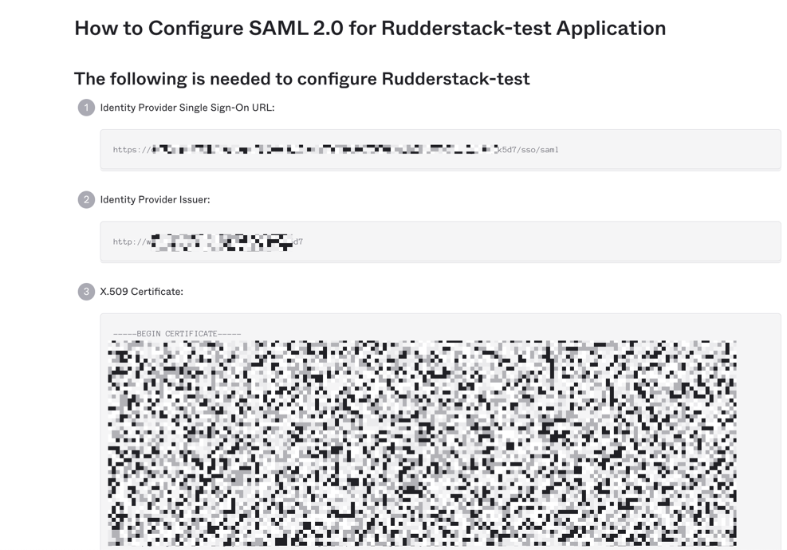

# Okta SSO Setup

This document lists the steps to follow in order to configure and enable Okta SSO for your organization.

## Configuring the RudderStack SSO App

- Log into your Okta application as an Administrator. Then, navigate to the **Applications** page in the dashboard.
- Click on the **Create App Integration** button to integrate Okta with RudderStack, as shown:

<!--.png)-->

- Select **SAML 2.0** as the sign-in method, as shown:

<!--.png)-->

- Enter **RudderStack** as the **App name**.

<!--.png)-->

In the next page, enter the following settings:

<!--.png)-->

- The settings are as follows:

  - **Single sign on URL**: Set this to**`https://auth.rudderstack.com/v1/saml_callback`**.
  - **Audience URI \(SP Entity ID\)**: Set this to

    **`https://auth.rudderstack.com/v1/saml_callback`**.

  - **Default RelayState**: This field should be kept empty.
  - **Name ID format**: From the dropdown, select **Unspecified**.
  - **Application username**: From the dropdown, select **Okta username**.

- Then, scroll down to the **Attribute Statements \(optional\)** section and fill the the three shown fields as shown. Click on the **Next** button after you fill these details.

| Name              | Name format \(optional\) | Value            |
| :---------------- | :----------------------- | :--------------- |
| FirstName         | Unspecified              | `user.firstName` |
| LastName          | Unspecified              | `user.lastName`  |
| PersonImmutableID | Unspecified              | `user.id`        |

- In the next page, select the **I'm an Okta customer adding an internal app** option and click on the **Finish** button.

The RudderStack Single Sign On app is now created and you will be taken to the app's page.

The next section covers how to enable SSO for your organization.

## Enabling SSO

To enable SSO for your organization, follow these steps:

- Under the **Sign-On** section of the app, click on the **View Setup Instructions** button. It should redirect you to the page called **How to Configure SAML 2.0 for RudderStack Application**.

<!--.png)-->

- Then, copy the following three fields and share them with the RudderStack team:
  - **Identity Provider Single Sign-On URL**
  - **Identity Provider Issuer**
  - **X.509 Certificate**

<!---->

  Once you share the above fields with the RudderStack team, they will enable
  SSO for your organization.

## Contact Us

For more information on any of the steps covered in this guide, you can [**contact us**](mailto: docs@rudderstack.com) or start a conversation on our [**Slack**](https://rudderstack.com/join-rudderstack-slack-community) channel.
