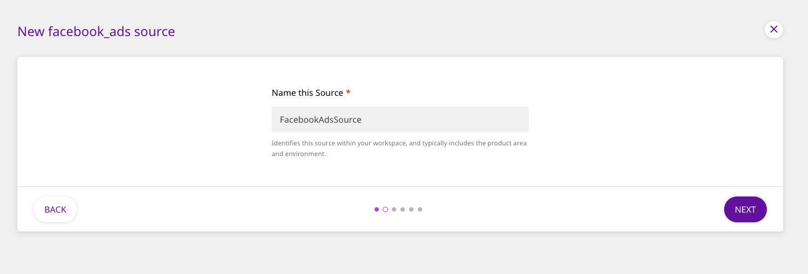

# Understanding the RudderStack Dashboard

The RudderStack dashboard is powered by Grafana. It gives you detailed insights into your RudderStack server's performance. You get a real-time view of the events sent and received by  RudderStack, along with various other metrics such as RudderStack's performance under load, errors encountered while processing events, statistics about event delivery, etc.

All the performance metrics are stored in InfluxDB, where Grafana queries them and gives you their visual overview.

This guide is aimed at explaining these performance metrics and the various dashboard panels in detail.

## Terminology

The following are some of the commonly used terms that you are likely to encounter in this guide:

### Warehouse

Refers to the data warehouses like Amazon Redshift, Google BigQuery, Snowflake, ClickHouse, and PostgreSQL - which are currently supported by RudderStack.

### Batch Router

Refers to the object storage destinations like Amazon S3, Google Cloud Storage, Azure Blob Storage, MinIO, and DigitalOcean Spaces - which are currently supported by RudderStack.

### Router 

All the connected destinations other than the two mentioned above are referred to as router destinations.

### User Transformation 

Refers to RudderStack's internal service which lets you enrich the events real-time using your custom JavaScript function.

### Destination Transformation 

Refers to RudderStack's internal service which allows you to transform your event payload into a destination-specific payload.

### Gateway 

Refers to RudderStack's internal service which is responsible for ingesting the incoming events.

### Processor 

Refers to RudderStack's internal service which is responsible for processing new events, applying user transformations, and destination transformations.

## Overview

The RudderStack dashboard is powered by Grafana, and gives you a complete picture of the total number of requests, as well as the events received and delivered via RudderStack.

.png>)

### **Received Requests**

Corresponds to the number of HTTP requests RudderStack has received in the selected time period.

### **Received Events**

This section refers to the number of events RudderStack has received in the selected time period. The RudderStack API allows multiple events to be [batched inside a single HTTP request](https://docs.rudderstack.com/rudderstack-api-spec/http-api-specification#12-batch).

### **Delivered Events **

Refers to the number of events RudderStack has delivered across all destinations in a selected time period. If you have set up a warehouse destination in RudderStack, every event will be delivered into two different tables in warehouse and counted as two delivered events.

## Gateway

.png>)

### Gateway Requests

This section highlights the number of requests HTTP requests RudderStack has received across all sources in the selected time period. The details of an individual source can be found in **Gateway Detailed** section of the dashboard.

### Proxy Responses

RudderStack has a reverse proxy in front of the RudderStack nodes. This panel lists all the HTTP responses codes. You can find the `4xx` status if the requests are invalid, and `5xx` status if the service is down or has encountered an internal error.

### Request Latency

In this section, the events are stored to the gateway (PostgreSQL) and acknowledged. The time to acknowledge HTTP requests is listed with 99 percentile, 95 percentile, and mean times.

### Gateway Throughput

The RudderStack Processor module picks events from gateway for further processing. If `Input Requests `> `Output Requests` then the inflow is higher than what the processor can handle. 


This usually happens during a sudden surge in the traffic, but syncs over a period of time. If this is consistently high, **consider adding an extra RudderStack node**.


## Event Delivery

### Events Delivered - Batch Router

This section corresponds to the number of events delivered to the object storage destinations like Amazon S3, Google Cloud Storage, Azure Blob storage, MinIO, Digital Ocean Spaces, etc.

### Events Delivered - Warehouse

Indicates the number of events delivered to the data warehouse destinations like Amazon Redshift, Google BigQuery, Snowflake, ClickHouse, PostgreSQL, etc.

### Events Delivered - Router

Indicates the number of events delivered to all the other destinations except the ones highlighted in the above two sections.

### Event Delivery Time - Batch Router

Corresponds to the average time taken for delivering the events to the object storage destinations. RudderStack batches events every 30 seconds (default value), so RudderStack takes at least this much time to batch the events and deliver them.

### Events Sync Lag Time - Warehouse

Highlights the longest sync delay for delivering the events to the warehouse destination. RudderStack batches events every 30 minutes (default value) before uploading to the data warehouse, so the delivery takes at least this much batching period. 

This section reports the lag for the oldest event in a batch. For example, if the batching period is 30 minutes and the reported lag time is 50 minutes, then the average lag time would be **50 - (30/2) = 35 min**

### Event Delivery Time - Router

Corresponds to the average time taken to deliver the events to all other destinations.

## Processor

.png>)

### Active Processed Destinations

This includes the list of all active destinations within the selected time window. The destination includes first 15 characters of the destination name and last 6 characters of RudderStack's internal destination ID.

### Processor Events

This dashboard gives you the big picture of how the input events are multiplexed into the destination specific events.

.png>)

### Destination Processing Events

This corresponds to the number of events generated by the processor per destination.

### Destination Processing Times

Indicates the time taken to generate the destination events. Note that these events are not yet sent to the destinations at this stage.

### Errors

This dashboard indicates the number of errors incurred during the transformations. Some possible reasons include missing mandatory fields for a specific destination, invalid event types, erroneously high number of properties in the event for warehouse destinations, etc.

## Router Throughput

.png>)

### Router Throughput - \<destination_type>

The router picks the transformed events that are ready to be sent to the destinations, and then forwards them to the destinations. If a destination is down for sometime, it retries up to a configured time window (default value being 3 hours). If **IN > OUT **(refer to the second graph in the image above), then there would be a delay in delivering the events. Some possible reasons include a sudden surge of events, or that the destination is slow in accepting new event requests.

### Router Responses

This indicates all the destination HTTP responses grouped by the status code.

### Router Failures

Corresponds to the metrics on any failures and retries before the event is delivered. If the event keeps failing event after a configured window, then it is marked aborted. The aborted events are also shown in this panel.

## Warehouse

The warehouse uploads are run as scheduled in the configuration. If there is no schedule defined, uploads are run every 30 minutes and the batched data is loaded into the data warehouse.

.png>)

### Uploads

The upload status of every batch is shown in the dashboard panel. If an upload keeps failing, it will be marked as **aborted** after 3 hours. Some possible failure reasons could be insufficient permissions to create and write to tables, reaching column limit on a specific table, warehouse brought down for maintenance, etc.

### Events Delivered - Warehouse

This graph corresponds to the number of events delivered to the warehouse destinations plotted against the time when the upload was completed.

.png>)


A `user_logged_in` event of `track` type will be synced to `tracks` and `user_logged_in` tables. Check out our [RudderStack Warehouse Schema](https://docs.rudderstack.com/data-warehouse-integrations/warehouse-schemas) for more details. Similarly, the `identify` events are synced to the `identifies` and `users` tables. Since each event is being synced to two tables, number of synced rows is generally twice the number of events.



If an event property does not match the data type in the corresponding table of warehouse, that column is not synced into the actual table but moved into `rudder_discards` table. Check [this guide](https://docs.rudderstack.com/data-warehouse-integrations/warehouse-schemas#data-type-mismatch-handling) on how RudderStack handles data type mismatch, for more details.


### Synced Rows

Corresponds to the number of new rows created in the `grouped by` table during warehouse uploads. In the example above, if there are different event names (eg. `user_logged_in`, `user_signed_up` ) they all are grouped under **`others`** in the metrics.


If there are a lot of synced rows in `rudder_discards`, this implies that the data types are not consistent from your sources. It is recommended to check such entries and fix the issue.


### Events Sync Lag Time - Warehouse

This panel corresponds to the longest sync delay for delivering events to your warehouse destination. RudderStack batches events every 30 minutes (default value) before uploading to your data warehouse, so the delivery takes at least that much batching time. This panel reports the lag for the oldest event in a batch. For example, if the batching period is 30 min and the reported lag time is 50 min, then the average lag time would be **50 - (30/2) = 35 min**.

## JobsDB

.png>)

### JobsDB Tables Count

This is the size of internal queue that RudderStack maintains for routing the events. There are 3 such queues named **gateway** (`gw`), **router** (`rt`) and **batch router** (`batch_rt`).

RudderStack processes events from these queues. If the size of the queue keeps increasing, it implies that the event outflow is less than inflow.


For real-time deliveries, it is important to maintain queue size at 1 or 2.


## Contact Us

To get more information on any of the above metrics related to the RudderStack dashboards, feel free to [contact us](mailto:%20docs@rudderstack.com). You can also talk to us on our [Slack](https://resources.rudderstack.com/join-rudderstack-slack) channel - we will be happy to help you!

