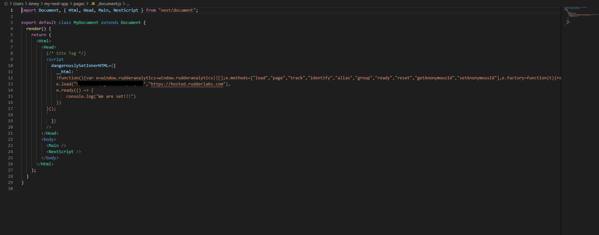
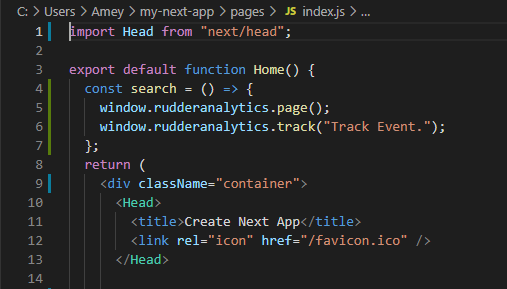

# How to Integrate Rudderstack with Your Next.js App

This guide will help you easily integrate RudderStack with your Next.js app using the [**JavaScript SDK**](https://rudderstack.com/docs/stream-sources/rudderstack-sdk-integration-guides/rudderstack-javascript-sdk/). On successful integration, you can track real-time user events and send them to your preferred destinations via RudderStack.

To set up the event streams on your Next.js app, you need to perform the following steps:

- Integrate the RudderStack JavaScript SDK with your Next.js app and set up the tracking code

- Configure a destination in RudderStack to route the tracked events

- Deploy your Next.js app and verify the events

## Prerequisites

You must have installed and set up your Next.js app already. You can also refer to the official [**Next.js documentation**](https://nextjs.org/docs/getting-started) for more information on setting up the app.

## Integrating the JavaScript SDK with your Next.js app

Integrating the JavaScript SDK with your Next.js app involves the following steps:

- Creating a JavaScript source in RudderStack - This source will be used to track the events from your Next.js app
- Installing and configuring the JavaScript SDK in your app

### Creating a JavaScript source

Follow these steps to set up a JavaScript source in your [**RudderStack dashboard**](https://app.rudderstack.com/):

1. Log into [**RudderStack dashboard**](https://app.rudderstack.com/) to see the following:

Note the <strong>Data Plane URL</strong>. This is required to set up the SDK in your Next.js app.

2. To create a source, click on the **Sources** button in the left navigation bar and select **New Source**. Further, select **Event Streams** under **Sources**, and select **JavaScript**. Alternatively, you can select **Directory** button in the left navigation bar, select **Event Streams** under **Sources**, and select **JavaScript**.

3. Assign a name to your source and click on **Next**.

4. Your JavaScript source is now configured. **Note the write key for the source**.

### Installing the JavaScript SDK in your Next.js app

To integrate RudderStack with your Next.js app and set up the tracking code, follow the steps below:

1. Create a new _document.js file in your app’s pages folder:

2. Add the following lines in your index.js file (present in app’s pages folder):

Refer to the sample Next.js app in the <a href="https://github.com/rudderlabs/rudder-analytics-next">RudderStack Next.js Repository</a> for more information.

## Configuring a destination tool in RudderStack

This section details the steps required to set up a destination platform in RudderStack where you can send all the events tracked by the JavaScript SDK integrated with your Next.js app.

As an example for this guide, Google Analytics is added as a destination.

1. Click on **Add Destination** in RudderStack dashboard's home page.

2. Choose **Google Analytics** from the list of destinations.

3. Assign a name to your destination and click on **Next**.

4. Select the JavaScript source configured in the above section and integrated with your Nuxt.js app.

5. Configure your Google Analytics destination with your Google Analytics **Tracking ID** in the **Connection Settings** page. For details on the other settings, refer to the [**Google Analytics documentation**]().

6. Optionally, you can add a [**user transformation**](https://rudderstack.com/docs/transformations/) to this destination to transform your events before sending them to Google Analytics.

7. Google Analytics is now configured as a destination. You should be able to see the following source-destination connection in your RudderStack dashboard:

## Deploying your Next.js app and verifying the event stream

To verify if your event stream is working correctly, deploy your Next.js app and test if the events are tracked and delivered correctly. To do so, follow these steps:

1. Deploy your Next.js app. Then, open the local URL on your browser to view the app.

2. Click on various links on the app to track different events.

3. To verify if the RudderStack JavaScript SDK (`rudder-analytics.js`) is loaded correctly, go to your browser's developer tools and check the **Network** tab. The following image highlights this option for the Google Chrome browser:

4. To check if the events are tracked, go to the **Live Events** tab of your JavaScript source in the RudderStack dashboard:

Sometimes, you may encounter a lag while the events start showing up in your dashboard and destination but they will show up eventually.

5. Upon successful tracking, you will see the events in your RudderStack dashboard:

6. To check if the events are delivered to the destination (Google Analytics in this example), go to the Google Analytics dashboard and navigate to **Realtime** > **Events** option.

Your tracked events will be shown in this window along with other metrics such as number of active users, source platform, etc.

## Contact us

For queries on any of the sections covered in this guide, you can [**contact us**](mailto:%20docs@rudderstack.com) or start a conversation in our [**Slack**](https://rudderstack.com/join-rudderstack-slack-community) community.