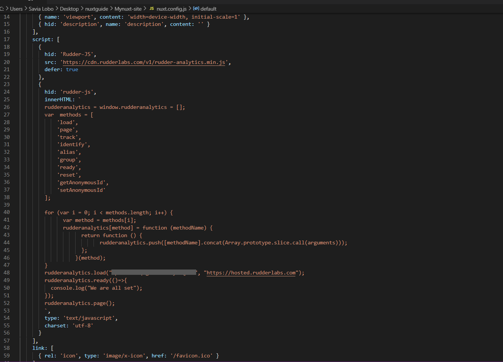

# How to Integrate Rudderstack with Your Nuxt.js App

This guide that will help you easily integrate RudderStack with your Nuxt.js app using the [**JavaScript SDK**](https://rudderstack.com/docs/stream-sources/rudderstack-sdk-integration-guides/rudderstack-javascript-sdk/). On successful integration, you can track real-time user events and send them to your preferred destinations via RudderStack.

To set up the event streams on your Nuxt.js app, you need to perform the following three steps need to be performed:

- Integrating the RudderStack JavaScript SDK with your Nuxt.js app and set up the tracking.

- Configuring a destination in RudderStack to route the tracked events

- Deploying your Nuxt.js app and verifying the events

## Prerequisites

You must have already installed and set up your Nuxt.js app. You can refer to the official [**Nuxt.js documentation**](https://nuxtjs.org/docs/2.x/get-started/installation/) for more information on setting up the app.

## Integrating the JavaScript SDK with your Nuxt.js app

Integrating the JavaScript SDK with your Nuxt.js app involves the following steps:

- Creating a JavaScript source in RudderStack - you will use this source to track the events from your Nuxt.js app
- Installing and configuring the JavaScript SDK in your app

### Creating a JavaScript source

Follow these steps to set up a JavaScript source in your [**RudderStack dashboard**](https://app.rudderstack.com/):

- Log into your [**RudderStack dashboard**](https://app.rudderstack.com/). You should then see the following dashboard:


<div class="infoBlock">

Note the <strong>Data Plane URL</strong>. This is required to set up the SDK in your Nuxt.js app.
</div>

- To create a source, click on the **Add Source** button. Alternatively, you can also go to the **Directory** option in the left navigation bar, and select **Event Streams** under **Sources**, as shown. Then, select **JavaScript**.


- Assign a name to your source and click on **Next**.

- Your JavaScript source is now configured. **Note the write key for the source**.


### Installing the JavaScript SDK in your Nuxt.js app

To integrate RudderStack with your Nuxt.js app and set up the tracking, follow the steps below:

- Include the following snippet in the `nuxt.config.js` file in your app's folder:

```javascript
script: [{
    hid: 'Rudder-JS',
    src: 'http://cdn.rudderlabs.com/v1.1/rudder-analytics.min.js',
    defer: true
  },
  {
    hid: 'rudder-js',
    innerHTML: `
        rudderanalytics = window.rudderanalytics = [];
        var  methods = [
            'load',
            'page',
            'track',
            'identify',
            'alias',
            'group',
            'ready',
            'reset',
            'getAnonymousId',
            'setAnonymousId'
        ];
        for (var i = 0; i < methods.length; i++) {
              var method = methods[i];
              rudderanalytics[method] = function (methodName) {
                    return function () {
                                       rudderanalytics.push([methodName].concat(Array.prototype.slice.call(arguments)));
                    };
                  }(method);
        }
        rudderanalytics.load("WRITE_KEY", "DATA_PLANE_URL");
        rudderanalytics.ready(()=>{
          console.log("We are all set");
        });
        //rudderanalytics.page();
        `,
    type: 'text/javascript',
    charset: 'utf-8'
  }
],
```

- Include the write key and data plane URL you copied in the above section in the `load` method, as shown:



<div class="infoBlock">

Refer to the sample Nuxt.js app in the <a href="https://github.com/rudderlabs/rudder-analytics-nuxt">RudderStack Nuxt.js Repository</a> for more information.
</div>

## Configuring a destination tool in RudderStack

This section details the steps required to set up a destination platform in RudderStack - where you can send all the events tracked by the JavaScript SDK integrated with your Nuxt.js app.

As an example for this guide, Google Analytics is added as a destination.

- In your RudderStack dashboard's home page, click on **Add Destination**.

- From the list of destinations, choose **Google Analytics**.

- Assign a name to your destination and click on **Next**.

- Select the JavaScript source configured in the above section and integrated with your Nuxt.js app.

- In the **Connection Settings** page, configure your Google Analytics destination with your Google Analytics **Tracking ID**. For details on the other settings, refer to the [**Google Analytics documentation**]().


- Optionally, you can add a [**user transformation**](https://rudderstack.com/docs/transformations/) to this destination to transform your events before sending them to Google Analytics.

- Google Analytics is now configured as a destination. You should now see the following source-destination connection in your RudderStack dashboard:


## Deploying your Nuxt.js app and verifying the event stream

To verify if your event stream is working correctly, deploy your Nuxt.js app and test if the events are tracked and delivered correctly. To do so, follow these steps:

- Deploy your Nuxt.js app. Then, open the local URL on your browser to view the app.

- Click on various links on the app to track different events.

- To verify if the RudderStack JavaScript SDK (`rudder-analytics.js`) is loaded correctly, go to your browser's developer tools and check the **Network** tab. The following image highlights this option for the Google Chrome browser:


- To check if the events are tracked, go to the **Live Events** tab of your JavaScript source in the RudderStack dashboard:


<div class="infoBlock">

There can sometimes be a lag before events start showing up in your dashboard and destination and they can take a few minutes to show up.
</div>

- Upon successful tracking, you will see the events in your RudderStack dashboard:


- To check if the events are delivered to the destination (Google Analytics in this example), to go the Google Analytics dashboard and navigate to **Realtime** - **Events** option.

- Your tracked events will be shown in this window along with other metrics such as number of active users, source platform, etc.


## Contact us

For queries on any of the sections covered in this guide, you can [**contact us**](mailto:%20docs@rudderstack.com) or start a conversation in our [**Slack**](https://rudderstack.com/join-rudderstack-slack-community) community.