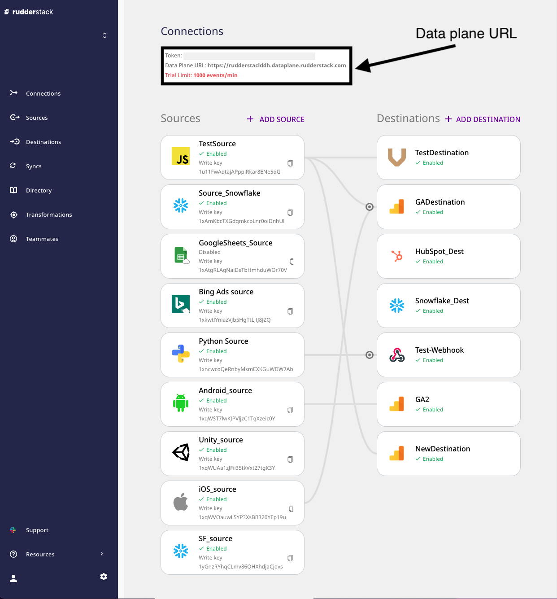
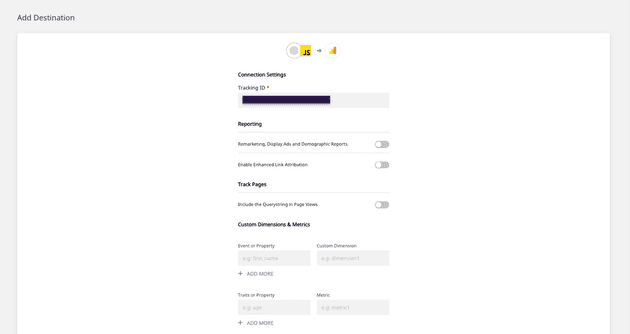
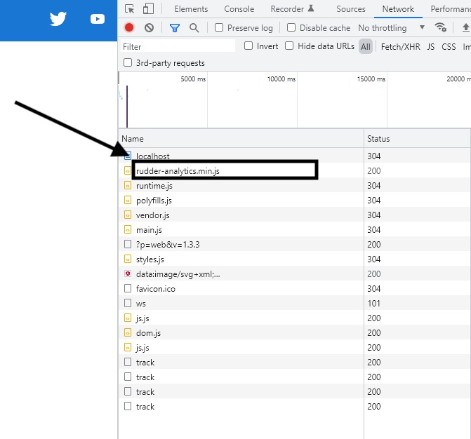
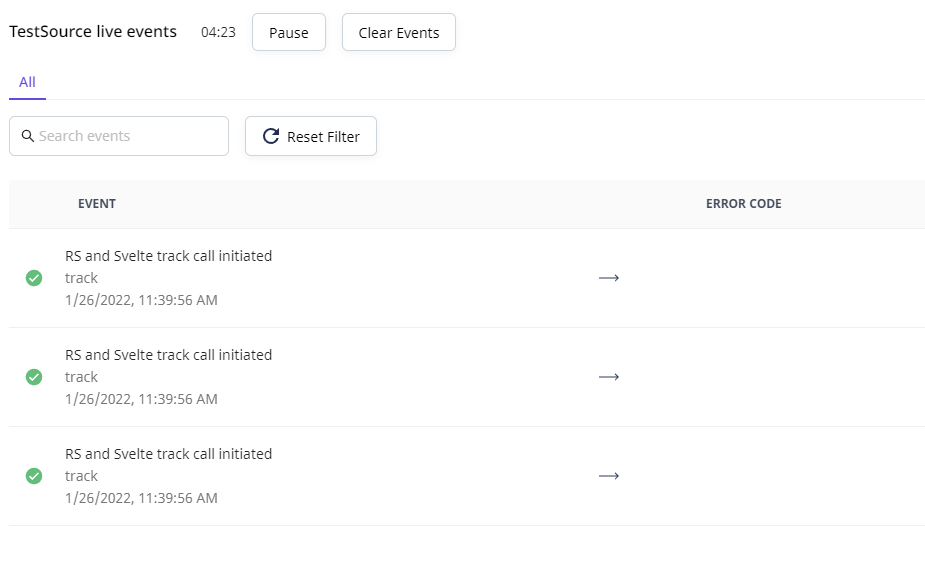
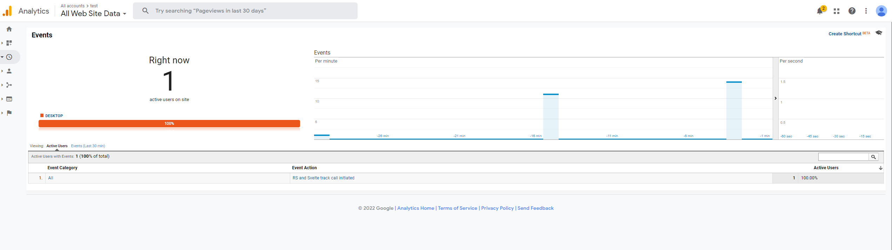

# How to Integrate Rudderstack with Your Svelte App

This guide will help you integrate RudderStack with your Svelte app using the [JavaScript SDK](https://rudderstack.com/docs/stream-sources/rudderstack-sdk-integration-guides/rudderstack-javascript-sdk/). On successful integration, you can track and send real-time user events to your preferred destinations via RudderStack.

To set up the event stream on your Svelte app, you need to perform the following steps:

1. [Integrate the JavaScript SDK with your Svelte app and set up the tracking code](#integrating-the-javascript-sdk-with-your-svelte-app)
2. [Configure a destination in RudderStack](#configuring-a-destination-in-rudderstack)
3. [Deploy your Svelte app and verify the events](#deploying-your-svelte-app-and-verifying-the-event-stream)

## Prerequisites

This guide assumes you have installed and set up your Svelte app. Refer to the [Svelte documentation]() for more information.

## Integrating the JavaScript SDK with your Svelte app

Integrating the JavaScript SDK with your Svelte app involves the following steps:

1. [Creating a JavaScript source in RudderStack](#creating-a-javascript-source-in-rudderstack) 
2. [Installing and configuring the JavaScript SDK in your Svelte app](#installing-and-configuring-the-javascript-sdk-in-your-svelte-app)

### Creating a JavaScript source in RudderStack

The RudderStack JavaScript source is required track the events from your Svelte app. Follow these steps to set it up in your [RudderStack dashboard](https://app.rudderstack.com/):

1. Note the data plane URL in your RudderStack dashboard. This is required to set up the JavaScript SDK in your Svelte app.



2. Click on the **Sources** button in the left navigation bar and select **New Source** to create a source. Then, select **Event Streams** under **Sources**, and select **JavaScript**.


3. Assign a name to your source and click **Next**.
4. Your JavaScript source is now configured. Note down the write key for this source, as shown:


### Installing and configuring the JavaScript SDK in your Svelte app

To integrate RudderStack with your Svelte app and set up the tracking code, follow the steps below:

1. In your Svelte project folder, navigate to the `public` folder and open `index.html`.
2. Place the following script within the `<head>` section of the page:

```html
<script>
                rudderanalytics = window.rudderanalytics = [];
                var methods = [
                  "load",
                  "page",
                  "track",
                  "identify",
                  "alias",
                  "group",
                  "ready",
                  "reset",
                  "getAnonymousId",
                  "setAnonymousId",
                ];
                for (var i = 0; i < methods.length; i++) {
                  var method = methods[i];
                  rudderanalytics[method] = (function (methodName) {
                        return function () {
                          rudderanalytics.push(
                                [methodName].concat(Array.prototype.slice.call(arguments))
                          );
                        };
                  })(method);
                }
          
                rudderanalytics.load("WRITE_KEY","DATA_PLANE_URL");
                //rudderanalytics.page();
  </script>
  <script src="https://cdn.rudderlabs.com/v1.1/rudder-analytics.min.js"></script>
```

3. Replace `WRITE_KEY` and `DATA_PLANE_URL` with your JavaScript source write key and the data plane URL obtained in the [Creating a JavaScript source in RudderStack](#creating-a-javascript-source-in-rudderstack) section above.

<div class="infoBlock">

Refer to the sample Svelte app in the <a href="https://github.com/rudderlabs/rudder-samples">RudderStack Sample Applications</a> repository for more information.
</div>

## Configuring a destination in RudderStack

This section details the steps required to set up a destination platform in RudderStack, where you can send all the events tracked by the JavaScript SDK.

<div class="infoBlock">

For this guide, Google Analytics is added as a destination.
</div>

1. Click on **Add Destination** in RudderStack dashboard's home page.
2. Choose **Google Analytics** from the list of destinations.
3. Assign a name to your destination and click **Next**.
4. Select the JavaScript source configured in the above section and click **Next**.
5. Configure your Google Analytics destination with your Google Analytics **Tracking ID** in the **Connection Settings** page. For details on the other settings, refer to the [Google Analytics documentation](https://www.rudderstack.com/docs/destinations/analytics/google-analytics-ga/).



<div class="infoBlock">

Optionally, you can add a <a href="https://rudderstack.com/docs/transformations/">user transformation</a> to this destination to transform your events before sending them to Google Analytics. 
</div>

Google Analytics is now configured as a destination. You should be able to see the connection in your RudderStack dashboard, as seen below:


<div class="successBlock">

You can also set up a warehouse destination in RudderStack and send your tracked events to it.
</div>

## Deploying your Svelte app and verifying the event stream

To verify if your event stream is working correctly, deploy your Svelte app and test if the events are tracked and delivered correctly. To do so, follow these steps:

1. From your terminal, navigate to your Svelte app's root folder and run the following command:

```bash
npm run dev
```

2. Open the local server URL(generally `http://localhost:8080/`) in your browser to view the app.
3. Go to your browser's developer tools and check the **Network** tab to verify if the RudderStack JavaScript SDK (`rudder-analytics.js`) is loaded correctly. The following image highlights this option for the Google Chrome browser:



4. Click on the various links or pages in your app for RudderStack to track these actions.
5. Go to the **Live Events** tab of your JavaScript source in the RudderStack dashboard to check if the events are tracked:


<div class="infoBlock">

You may face a minor delay before the events start showing up in your dashboard and the destination.
</div>

6. Upon successful tracking, you will see the events in your RudderStack dashboard:



7. In your Google Analytics dashboard, go to **Realtime** > **Events** to check if the events are delivered. Your tracked events will be shown in this window along with other metrics such as number of active users, source platform, etc.



## Contact us

For queries on any of the sections covered in this guide, you can [contact us](mailto:%20docs@rudderstack.com) or start a conversation in our [Slack](https://rudderstack.com/join-rudderstack-slack-community) community.