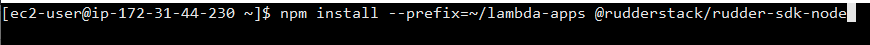
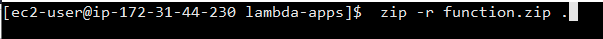
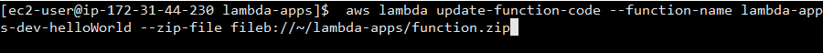

# How to Use AWS Lambda Functions with RudderStack

AWS Lambda helps you leverage the full potential of **AWS Serverless Compute**, allowing you to run your code without having to manage or provision servers.

## Key Features of AWS Lambda

- Run any kind of application or web service without requiring any server administration
- Pay only for computing resources that you use for your code or application
- Scale your code and make your applications highly available without requiring any additional configuration or cost
- AWS Lambda offers high performance, regardless of the scale or complexity of your code

RudderStack integrates seamlessly with AWS Lambda, allowing you to use any lambda function to transform your event streams and route them to the [destinations](https://rudderstack.com/docs/destinations#popular-destinations) of your choice.

## Integrating AWS Lambda with RudderStack's Node SDK

The AWS Lambda functions can be coded in Node.js. This makes integration with RudderStack easier, since RudderStack provides a **Node.js SDK** that can be seamlessly used in the AWS Lambda code. The RudderStack SDK is called by the lambda function to perform the necessary data mappings. The data is then routed to the specified analytics destinations by RudderStack.

The following steps are required for integrating the RudderStack Node SDK with the AWS Lambda function:

- Before getting started, make sure you have a Docker version of RudderStack server in an EC2 instance. More instructions on the setup can be found on our [GitHub page](https://github.com/rudderlabs/rudder-server#setup-instructions-docker)

<div class="infoBlock">

You also need to have <a href="https://docs.aws.amazon.com/cli/latest/userguide/cli-chap-install.html">AWS CLI</a> installed in your development environment

</div>

- Install the RudderStack Node SDK at the location where the lambda function artifacts are maintained in the development environment, as shown:



- Archive all the contents of the lambda function development directory in a ZIP file, as shown below:



- Update the lambda function deployment, as shown:



## Testing the integration

To ensure that the integration is successful, you can test the availability of the function at the **AWS-designated web endpoint**. This endpoint is created at the time of deployment of the function for the first time.

```
'use strict';
const Analytics = require("@rudderstack/rudder-sdk-node");

//
//
module.exports.helloWorld = (event, context, callback) => {
    const response = {
   	 statusCode: 200,
   	 headers: {
   		 'Access-Control-Allow-Origin': '*', // Required for CORS support to work
   	 },
   	 body: JSON.stringify({
   		 message: 'Go Serverless v1.0! Your function executed successfully!',
   		 input: event,
   	 }),
    };
```

## Contact Us

To know more about how to use AWS lambda functions with RudderStack, feel free to [contact us](mailto:%20docs@rudderstack.com). You can also start a conversation on our [Slack](https://rudderstack.com/join-rudderstack-slack-community) channel. We will be happy to help you.
