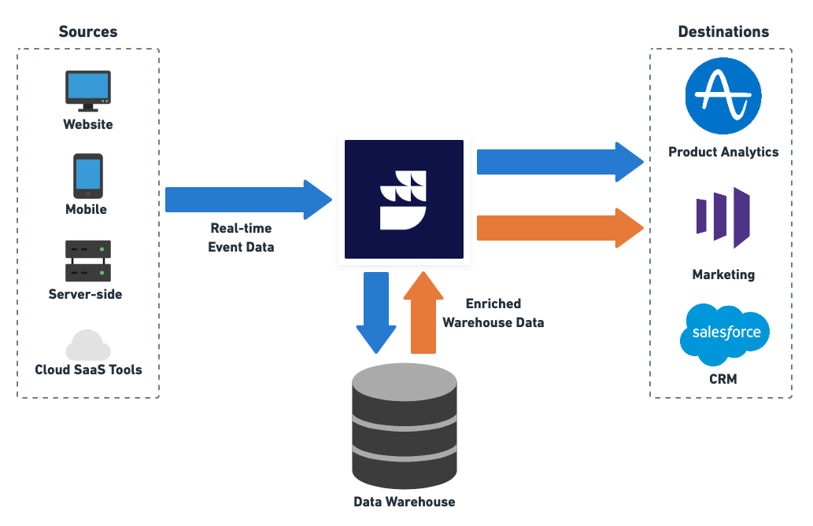

# Home

[RudderStack](https://rudderstack.com/) is a customer data platform for developers. It lets you build and deploy efficient pipelines that collect customer data from every app, website, and SaaS platform, then activate it in your warehouse and business tools.

Start building a better, warehouse-first CDP that delivers complete, unified data to every part of your customer data stack. Sign up for <a href="https://app.rudderstack.com/signup?type=freetrial" target="_blank">RudderStack Cloud</a>.

## Product onboarding

    <a href="https://www.rudderstack.com/docs/rudderstack-cloud/">
        

            <h3>RudderStack Cloud</h3>
            
Familiarize yourself with RudderStack Cloud and the different dashboard options once you sign up.

        

    </a>
    <a href="https://www.rudderstack.com/docs/rudderstack-open-source/">
        

            <h3>RudderStack Open Source</h3>
            
Follow the guides listed in this section to set up RudderStack in your own environment.

        

    </a>
    <a href="https://www.rudderstack.com/docs/get-started/glossary/">
        

            <h3>Glossary</h3>
            
Familiarize yourself with RudderStack and the commonly associated terms with it.

        

    </a>

## Quick start guides

    <a href="https://www.rudderstack.com/docs/stream-sources/rudderstack-sdk-integration-guides/">
        

            <h3>SDK Guides</h3>
            
Integrate RudderStack with your web, mobile, and server-side apps and start tracking the event data in no time.

        

    </a>
    <a href="https://www.rudderstack.com/docs/destinations/">
        

            <h3>Event Stream Destinations</h3>
            
Integrate RudderStack to send your events to over 150 third-party tools and platforms.

        

    </a>
    <a href="https://www.rudderstack.com/docs/data-warehouse-integrations/">
        

            <h3>Warehouse Destinations</h3>
            
Integrate RudderStack with your preferred data warehouse and make it the single source of truth for all your customer data.

        

    </a>
    <a href="https://www.rudderstack.com/docs/cloud-extract-sources/">
        

            <h3>Cloud Extract</h3>
            
Build efficient ETL pipelines by ingesting data from your cloud apps and sending them to your data warehouse.

        

    </a>
    <a href="https://www.rudderstack.com/docs/reverse-etl/">
        

            <h3>Reverse ETL</h3>
            
Leverage the customer data residing in your data warehouse and route it to your preferred downstream destinations.

        

    </a>

## Feature guides

    <a href="https://www.rudderstack.com/docs/transformations/">
        

            <h3>Transformations</h3>
            
Code custom JavaScript functions to transform your event data before sending it to your destinations.

        

    </a>
    <a href="https://www.rudderstack.com/docs/data-governance/">
        

            <h3>Data Governance</h3>
            
Programmatically access your events and their metadata to investigate and fix any inconsistencies.

        

    </a>
    <a href="https://www.rudderstack.com/docs/rudderstack-api/">
        

            <h3>RudderStack API</h3>
            
Get detailed instructions on using various RudderStack API based on your use-cases.

        

    </a>

## Need help?

    <a href="https://www.rudderstack.com/docs/user-guides/migration-guides/">
        

            <h3>Migration Guides</h3>
            
Migrating from Segment or Blendo? Refer to these guides for help.

        

    </a>
    <a href="https://www.rudderstack.com/docs/user-guides/how-to-guides/">
        

            <h3>Support Guides</h3>
            
This section includes some common RudderStack use-cases as well as some quick solutions to the common problems you might encounter while working with your event data.

        

    </a>

## Sample section

<b><a href="https://www.rudderstack.com/docs/rudderstack-cloud/">RudderStack Cloud</a></b>

 
Familiarize yourself with RudderStack Cloud and the different dashboard options once you sign up.

<b><a href="https://www.rudderstack.com/docs/rudderstack-open-source/">RudderStack Open Source</a></b>

 
Follow the guides listed in this section to set up RudderStack in your own environment.

## Contribute

We would love to see you contribute to RudderStack. Read the [Contributing Guidelines](https://github.com/rudderlabs/rudder-server/blob/master/CONTRIBUTING.md) for more information.

## License

The [RudderStack Server](https://github.com/rudderlabs/rudder-server) is released under the [AGPLv3 License](https://www.gnu.org/licenses/agpl-3.0-standalone.html).

Refer to the <a href="https://rudderstack.com/blog/rudderstacks-licensing-explained" target="_blank">RudderStack's Licensing Explained</a> blog post for more information.

## Contact us

For any information on RudderStack, you can [contact us](mailto:%20docs@rudderstack.com) or start a conversation in our [Slack](https://rudderstack.com/join-rudderstack-slack-community) community.
