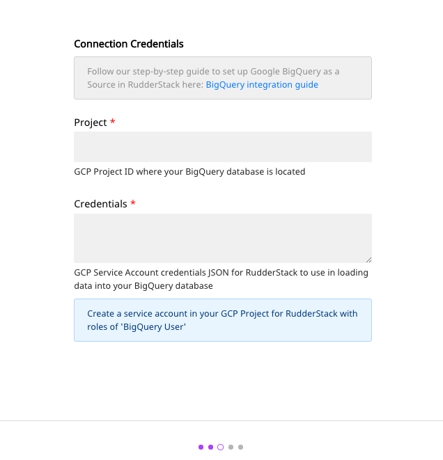
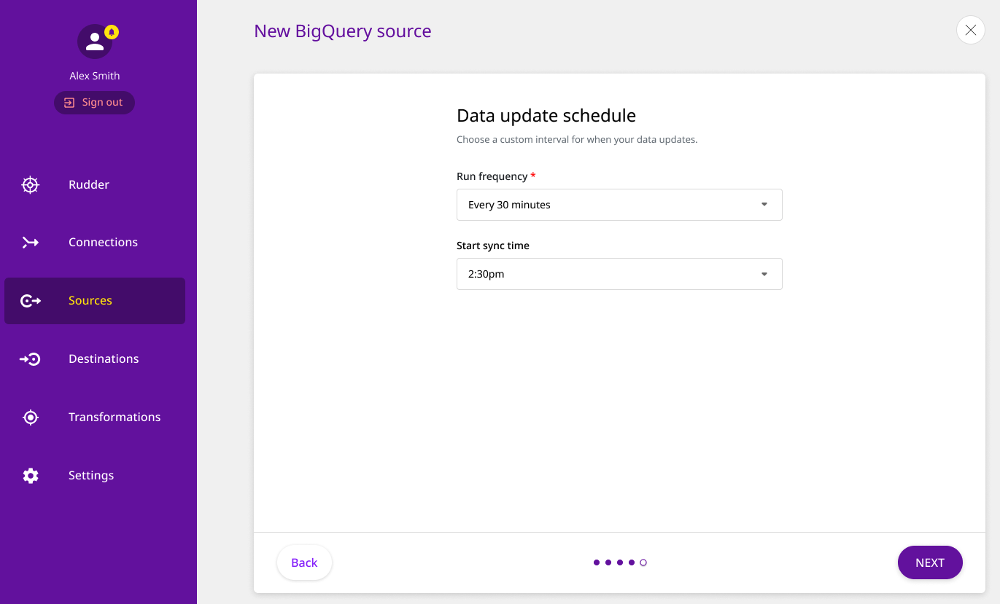
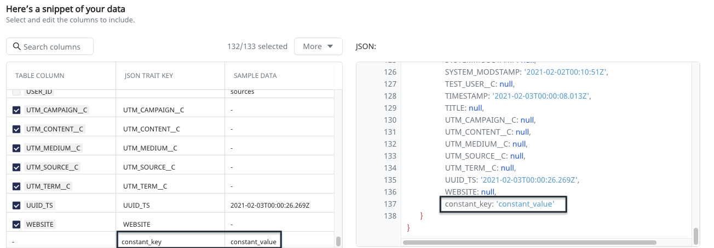

# Warehouse Actions Sources

RudderStack provides an infrastructure to track, capture, transform, and route your customer event data to your preferred destinations. However, this data can be quite raw in nature - comprising mainly of customer interactions with your website, mobile apps, or other digital assets. 

While the customer event data is important to reconstruct your customers' behavior, there is scope to further enrich customer profiles by processing the other customer-related data residing in every company's main data infrastructure - the **Data Warehouse**.

With RudderStack's **Warehouse Actions** feature, you can leverage the already processed customer data residing in your data warehouse and route this enriched information to your desired destinations.


**With this feature, you can configure your data warehouse as a source on the** [**RudderStack dashboard**](https://app.rudderlabs.com/signup?type=freetrial)**, select the right data and then sync this data to all the destinations that are supported by RudderStack.**



**RudderStack currently supports Google BigQuery, Amazon Redshift, PostgreSQL, ClickHouse, and Snowflake as warehouse sources.**


## Configuring Warehouse Actions on RudderStack


Configuring warehouse actions on the RudderStack dashboard involves the following steps:

1. Setting a name for the source and providing connection credentials for RudderStack to access the data warehouse.
2. Defining the data that should be pulled out of the data warehouse and subsequently sent to the specified destinations through RudderStack.
3. Choosing a data update schedule and defining how often the data synchronization should happen between the data warehouse and RudderStack.


To configure your data warehouse as a source on the RudderStack dashboard, follow these steps:

* Log into your [RudderStack dashboard](https://app.rudderlabs.com/signup?type=freetrial).
* Navigate to **Sources**, present in the left panel of the dashboard.
* Choose your preferred data warehouse which you want to configure as a source, as shown. Then, click on **Next**.

### Specifying Connection Credentials

* Assign a name to your source. Then, click on the **Create credentials from scratch** button, if you are configuring your data warehouse in the RudderStack dashboard for the first time.


If you have previously configured your data warehouse as a source on the RudderStack dashboard, you can simply use the existing credentials and proceed. 


* Next, enter the connection credentials to configure your data warehouse connection with RudderStack, as shown:


RudderStack currently supports **Google BigQuery**, **PostgreSQL**, **ClickHouse**, **Amazon Redshift**, and **Snowflake** as sources. The connection settings will vary according to each warehouse.


### Specifying Warehouse Schema and Table

* Next, enter the data warehouse schema and the table name. RudderStack will collect the data from this table.


Please note that your source table must include at least one of the following columns for it to be considered a valid source:

* **`email`**
* **`user_id`**
* **`anonymous_id`**


* If the table is valid, you can then preview a snippet of the data, as shown:

* You can also filter, select and edit the column names of the table to be included as the data source, as shown:

* Once you've selected all the the required table columns, click on **Next**.

### Setting the Data Update Schedule

* RudderStack also allows you to specify the data update frequency and set a data synchronization time as per your requirement.

That's it! Your data warehouse is now configured and added as a RudderStack source.


Currently all events sent to RudderStack via warehouse as a source will be `identify()` events


Now you can connect this source to any RudderStack destination of your choice. RudderStack will collect the enriched customer data from the specified table columns in your warehouse source and send it to the destination for your activation use-cases.

## Warehouse Actions Constants

Constants give you the ability to add new fields to each event with a pre-defined value. The **key** of a Warehouse Actions constant has the same functionality as modifying an existing column, and is in the format \(**test.value, test.value\[0\]**\).

### How to add a Warehouse Actions constant

Adding a new constant when configuring a Warehouse Actions source is very easy: 

* Click on the **Add Constant** button as shown below, while [mapping your table](https://docs.rudderstack.com/warehouse-actions#specifying-warehouse-schema-and-table):

* Add your preferred key and value for the constant, select **Ok** and then click on **Confirm**, as shown:

* The new constant appears in the table and also in the JSON preview inside the traits, as shown:

* You can also use dot notation to define a Warehouse Actions constant, as shown below:

* The result would look something like:

## FAQs

### What type of events are supported by the RudderStack Warehouse Actions?

Currently all events from the RudderStack warehouse actions are `identify()` events.

## Popular Sources









## Contact Us

To know more about RudderStack's Warehouse Actions feature, feel free to [contact us](mailto:%20docs@rudderstack.com) or start a conversation on our [Slack](https://resources.rudderstack.com/join-rudderstack-slack) channel. You can also see this feature in action by [requesting a demo](https://resources.rudderstack.com/request-a-demo?_ga=2.47794151.1545771517.1607313913-1655106949.1598281099).

