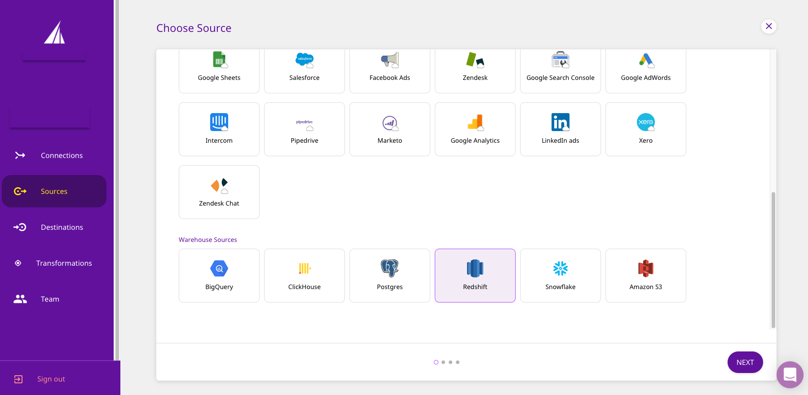
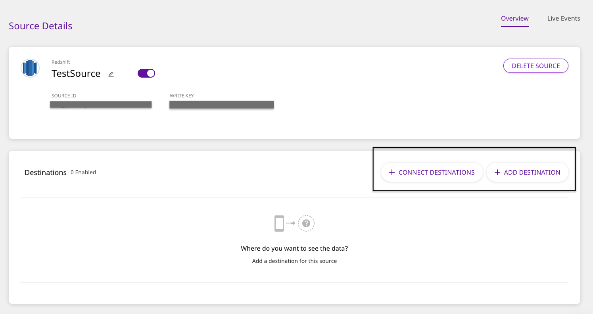
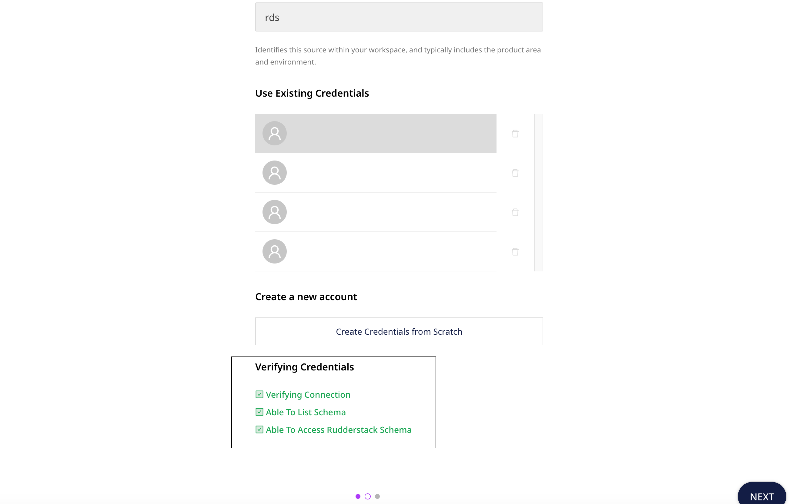

# Amazon Redshift

[Amazon Redshift](https://aws.amazon.com/redshift/) is the world's fastest cloud data warehouse. It allows you to handle large analytical workloads with best-in-class performance, speed, and efficiency. With Redshift, you don't have to worry about the scale of your data or the cost of running queries on them.

This guide will help you configure Redshift as a source from which you can route event data to your desired destinations through RudderStack.

## Granting Permissions

Run the SQL queries below in the **exact** order to grant the necessary permissions for the Warehouse Actions source:

### Creating the user

* The following command creates a new user `rudder` with password `<strong_unique_password>` in Redshift.

```text
CREATE USER rudder WITH PASSWORD '<strong_unique_password>';
```

#### Password considerations for Redshift

The password you set in the above command must meet the following conditions:

* It should be **8-64** characters in length
* It must contain atleast one upper case, one lower case, and one number
* It can contain any ASCII characters with the ASCII codes 33-126, with the exception of `'` \(single quotation mark\), `"` \(double quotation mark\), `\`, `/`, and `@`.


For more information on the password rules, refer to the [**Amazon Redshift documentation**](https://docs.aws.amazon.com/redshift/latest/dg/r_CREATE_USER.html#r_CREATE_USER-parameters).


### Creating the RudderStack schema and granting permissions

* The following command creates a dedicated schema `_rudderstack` used by RudderStack for storing the state of each data sync.

```text
CREATE SCHEMA "_rudderstack";
```


The `_rudderstack` schema is used by RudderStack. Its name **should not** be changed.


* The following command allows the user `rudder` to have full access to the schema `_rudderstack`.

```text
GRANT ALL ON SCHEMA "_rudderstack" TO rudder;
```

* The following command allows the user `rudder` to have full access to all the objects that exist in the schema `_rudderstack`.

```text
GRANT ALL PRIVILEGES ON ALL TABLES IN SCHEMA "_rudderstack" TO rudder;
```

### Granting permissions on your schema and table

* The following command allows the user `rudder` to look up objects within the schema `<YOUR_SCHEMA>`. Replace `<YOUR_SCHEMA>` with the exact name of your Redshift schema.

```text
GRANT USAGE ON SCHEMA "<YOUR_SCHEMA>" TO rudder;
```

* The following command allows the user `rudder` to read the data from specified table `<YOUR_TABLE>`. Replace `<YOUR_SCHEMA>` and `<YOUR_TABLE>` with the exact names of your Redshift schema and table.

```text
GRANT SELECT ON TABLE "<YOUR_SCHEMA>"."<YOUR_TABLE>" TO rudder;
```

* The following **optional** command allows the user `rudder` to view and read the data from all the tables present in the schema `<YOUR_SCHEMA>`:

```text
GRANT SELECT ON ALL TABLES IN SCHEMA "<YOUR_SCHEMA>" TO rudder;
```


Run the above command only if you're okay with RudderStack being able to access the data in all the tables residing within your specified schema.


* The following **optional** command allows the user `rudder` to read the data from all the future tables in the schema `<YOUR_SCHEMA>`:

```text
ALTER DEFAULT PRIVILEGES IN SCHEMA "<YOUR_SCHEMA>" GRANT SELECT ON TABLES TO rudder;
```


Run the above command only if you're okay with RudderStack being able to access the data in all the future tables residing within your specified schema.


## Setting Up the Source

To set up Amazon Redshift as a source in RudderStack, follow these steps:

* Log into your [RudderStack dashboard](https://app.rudderlabs.com/signup?type=freetrial).
* From the left panel, select **Sources**. Then, click on **Add Source**, as shown:


* Scroll down to the **Warehouse Sources** and select **Redshift**. Then, click on **Next**.



### Setting Up the Connection

* Assign a name to your source, and click on **Create Credentials from Scratch**. Then, click on **Next**.



If you've already configured Redshift as a source before, your existing credentials will automatically appear under **Use Existing Credentials**.


* Next, enter the relevant connection details in the **Connection Credentials** as shown below:


* The required settings are:
  * **Host -** The host name of your Redshift service.
  * **Database -** The database name in your Redshift instance where the data is loaded.
  * **User** - The username which has the required read/write access to the above database.
  * **Password** - The password for the above user should be specified here.
  * **Port** - The port number of your Redshift service should be specified here.

### Specifying the Data to Import

* Next, select the **Schema** and the **Table** from which you want RudderStack to import the data.



Your table must include one of the following columns - `email`, `user_id`, or `anonymous_id`.


* Once you specify the table containing the required columns, you will be able to preview a snippet of your data, as shown below:


* Here, you can select all or only a few specific columns of your choice, search the columns by a keyword, and also edit the **JSON Trait Key**, as shown below. You can also preview the resultant JSON on the right. Once you've select the required table columns to import the data from, click on **Next**.


### Setting the Data Update Schedule

* Next, you will be required to set the **Run Frequency** to schedule the data import from your Redshift instance to RudderStack. You can also specify the time when you want this synchronization to start, by choosing the time under the **Sync Starting At** option. Then, click on **Next**.


That's it! Redshift is now successfully configured as a source on your RudderStack dashboard.

RudderStack will start importing data from your Redshift instance as per the specified frequency. You can further connect this source to your preferred destination by clicking on **Connect Destinations** or **Add Destinations**, as shown:




If you have already configured a destination on the RudderStack platform, choose the **Connect Destinations** option. To add a new destination from scratch, you can select the **Add Destination** option.


## FAQ

### What do the three validations under Verifying Credentials imply?

When setting up a Warehouse Actions source, once you proceed after entering the connection credentials, you will see the following three validations under the **Verifying Credentials** option:



These options are explained below:

* **Verifying Connection**: This option indicates that RudderStack is trying to connect to the warehouse with the information specified in the connection credentials. 


If this option gives an error, it means that one or more fields specified in the connection credentials are incorrect. Verify your credentials in this case.


* **Able to List Schema**: This option checks if RudderStack is able to fetch all the schema details using the provided credentials. 
* **Able to Access RudderStack Schema**: This option implies that RudderStack is able to access the `_rudderstack` schema that you have created by successfully running all the commands in the [**User Permissions**](https://docs.rudderstack.com/warehouse-actions/amazon-redshift#creating-the-rudderstack-schema-and-granting-permissions) section. 


If this option gives an error, verify if you have successfully created the `_rudderstack` schema and given RudderStack the required permissions to access it. For more information, refer to [**this section**](https://docs.rudderstack.com/warehouse-actions/amazon-redshift#creating-the-rudderstack-schema-and-granting-permissions).


## Contact Us

If you come across any issues while configuring Amazon Redshift as a source on the RudderStack dashboard, please feel free to [contact us](mailto:%20docs@rudderstack.com). You can also start a conversation on our [Slack](https://resources.rudderstack.com/join-rudderstack-slack) channel; we will be happy to talk to you!

