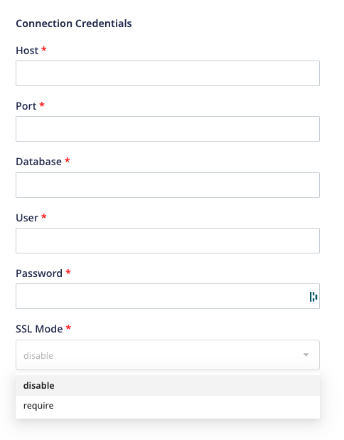
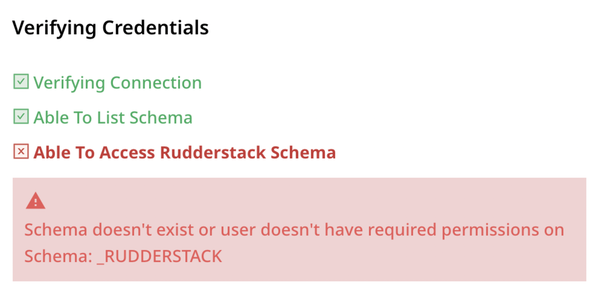

# Amazon Redshift

[Amazon Redshift](https://aws.amazon.com/redshift/) is one of the fastest cloud data warehouse services. It allows you to handle large analytical workloads with best-in-class performance, speed, and efficiency.

RudderStack supports Amazon Redshift as a source from which you can ingest enriched user information and route it to your desired downstream destinations.

## Granting Permissions

RudderStack requires certain permissions on your warehouse to access data from it successfully. 

The below-mentioned SQL queries can be executed on the **Amazon Redshift Console** in the **exact** order to grant these necessary permissions:

### Step 1: Creating a new user

1. Create a new user `rudder` and specify the actual password in `<strong_unique_password>`:

```sql
CREATE USER rudder WITH PASSWORD '<strong_unique_password>';
```

#### Password considerations for Redshift

The password set in the above command must meet the following conditions:

* It should be **8-64** characters in length.
* It must contain atleast one upper case, one lower case, and one number.
* It can contain any ASCII characters with the ASCII codes 33-126, with the exception of `'` \(single quotation mark\), `"` \(double quotation mark\), `\`, `/`, and `@`.

<div class="infoBlock">

For more information on the password rules, refer to [**Amazon Redshift documentation**](https://docs.aws.amazon.com/redshift/latest/dg/r_CREATE_USER.html#r_CREATE_USER-parameters).
</div>

### Step 2: Creating the RudderStack schema and granting permissions

1. Create a dedicated schema `_rudderstack` for storing the state of each data sync.

```sql
CREATE SCHEMA "_rudderstack";
```

<div class="warningBlock">

The `_rudderstack` schema is meant to be used by RudderStack. Hence,  its name **should not** be changed.
</div>

2. Grant full access to the `rudder` user over the `_rudderstack` schema.

```sql
GRANT ALL ON SCHEMA "_rudderstack" TO rudder;
```

3. Grant full access to the `rudder` user over all the `_rudderstack` schema objects.

```sql
GRANT ALL PRIVILEGES ON ALL TABLES IN SCHEMA "_rudderstack" TO rudder;
```

### Step 3: Granting permissions on your schema and table

1. Grant access to the `rudder` user to look up the objects within your schema `<YOUR_SCHEMA>`. **Replace `<YOUR_SCHEMA>` with the exact name of your Redshift schema**. 

```sql
GRANT USAGE ON SCHEMA "<YOUR_SCHEMA>" TO rudder;
```

2. Grant access to the `rudder` user to read data from required table `<YOUR_TABLE>`. **Replace `<YOUR_SCHEMA>` and `<YOUR_TABLE>` with the exact names of your Redshift schema and table**.

```sql
GRANT SELECT ON TABLE "<YOUR_SCHEMA>"."<YOUR_TABLE>" TO rudder;
```

#### Optional commands

* The following command grants access to the `rudder` user to view and read data from all the tables present in the schema `<YOUR_SCHEMA>`. **Replace `<YOUR_SCHEMA>` with the exact name of your Redshift schema**:

```sql
GRANT SELECT ON ALL TABLES IN SCHEMA "<YOUR_SCHEMA>" TO rudder;
```

<div class="warningBlock">

Run the above command only if you're okay with RudderStack being able to access the data in all the tables residing within your specified schema.
</div>

* The following command grants access to the `rudder` user to read data from all the future tables in the schema `<YOUR_SCHEMA>`. **Replace `<YOUR_SCHEMA>` with the exact name of your Redshift schema**:

```sql
ALTER DEFAULT PRIVILEGES IN SCHEMA "<YOUR_SCHEMA>" GRANT SELECT ON TABLES TO rudder;
```

<div class="warningBlock">

Run the above command only if you're okay with RudderStack being able to access the data in all the future tables residing within your specified schema.
</div>

## Setting up Redshift as source

The below section explains the detailed steps to set up Redshift as a source in RudderStack.

### Step 1: Naming the source

1. Log into your [RudderStack dashboard](https://app.rudderlabs.com/signup?type=freetrial).

2. Select **Sources** from the left panel. Then, click on **New source**, as shown:


3. Click on the **Warehouse Actions** and select **Redshift**.


4. Assign a name to the source and click on **Continue**.


### Step 2: Configuring the source credentials

1. Choose the relevant option from **Table** or **Model** to use the source to sync either a table or a model.

<div class="infoBlock">

For more information on the difference between the <strong>Table</strong> and <strong>Model</strong> options when creating a Warehouse Actions source, refer to the <a href="#faq">FAQ</a> section below.
</div>

2. Click on **Create Credentials from Scratch** and enter the relevant details in the **Connection Credentials**:



- **Host** - Host name of your Redshift service.
- **Port** - Port number of your Redshift service.
- **Database -** Database name in your Redshift instance where the data is loaded.
- **User** - Username which has the required read/write access to the above database.
- **Password** - Password for the above user.

<div class="successBlock">

  If you've configured Redshift as a source before, you can select the existing
  credentials from <strong>Use existing credentials</strong>, as shown:


</div>

2. Click on **Continue** to verify your credentials. For more information, refer to [FAQ section](https://www.rudderstack.com/docs/warehouse-actions/clickhouse/#faq). Once verified, click on **Continue** again.

### Step 3: Setting the data update schedule

1. Specify the **Schedule Settings** to schedule the data import from your ClickHouse instance to RudderStack. 

<div class="infoBlock">

For more information on these settings, refer to <a href = "https://www.rudderstack.com/docs/warehouse-actions/common-settings/sync-schedule-settings/">Sync Schedule Settings</a>.
</div>


2. Click on **Continue** to configure the source successfully.

<div class="infoBlock">

 You can further connect the source to your preferred destination by clicking on <strong>Add Destination</strong>, as shown:


</div>

## FAQ

### What do the three validations under Verifying Credentials imply?

When setting up a Warehouse Actions source, once you proceed after entering the connection credentials, you will see the following three validations under the **Verifying Credentials** option:


These options are explained below:

* **Verifying Connection**: This option indicates that RudderStack is trying to connect to the warehouse with the information specified in the connection credentials. 

<div class="warningBlock">

If this option gives an error, it means that one or more fields specified in the connection credentials are incorrect. Verify your credentials in this case.
</div>

* **Able to List Schema**: This option checks if RudderStack is able to fetch all the schema details using the provided credentials. 
* **Able to Access RudderStack Schema**: This option implies that RudderStack is able to access the `_RUDDERSTACK` schema you have created by successfully running all the commands in the [**User Permissions**](https://rudderstack.com/docs/warehouse-actions/snowflake#granting-permissions) section. 

<div class="warningBlock">

If this option gives an error, verify if you have successfully created the <code class="inline-code">_RUDDERSTACK</code> schema and given RudderStack the required permissions to access it. For more information, refer to [this section](https://rudderstack.com/docs/warehouse-actions/snowflake#creating-the-rudderstack-schema-and-granting-permissions).
</div>

<div class="infoBlock">

If you are trying to reuse the credentials for Warehouse Actions sources from before September 2021, you may run into the following permissions error:



As mentioned above, you will need to update your Snowflake account permissions by following the commands in [this section](https://rudderstack.com/docs/warehouse-actions/snowflake#creating-the-rudderstack-schema-and-granting-permissions).
</div>

### What is the difference between the Table and Model options when creating a Warehouse Actions source?

When creating a new Warehouse Actions source, you are presented with the following two options from which RudderStack will sync the data:


- When you choose **Table**, RudderStack imports all the data associated with the specified table during the sync.
- When you choose **Model**, RudderStack imports the data by running the query specified in the connected model, during the sync.

## Contact us

For queries on any of the sections covered in this guide, you can [**contact us**](mailto:%20docs@rudderstack.com) or start a conversation in our [**Slack**](https://rudderstack.com/join-rudderstack-slack-community) community.
