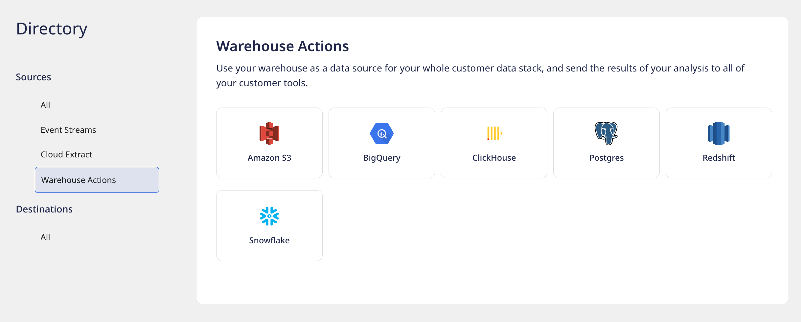

# Amazon Redshift

[Amazon Redshift](https://aws.amazon.com/redshift/) is one of the fastest cloud data warehouse services. It allows you to handle large analytical workloads with best-in-class performance, speed, and efficiency.

RudderStack supports Amazon Redshift as a source from which you can ingest data and route it to your desired downstream destinations.

## Granting Permissions

RudderStack requires you to grant certain user permissions on your Amazon Redshift warehouse to successfully access data from it.

Run the below-mentioned SQL queries on the **Amazon Redshift Console** in the **exact** order to grant these necessary permissions:

### Step 1: Creating a new user in Redshift

1. Create a new user `rudder` with a password `<strong_unique_password>`.

```sql
CREATE USER rudder WITH PASSWORD '<strong_unique_password>'
```

#### Password considerations for Redshift

The password set in the above command must meet the following conditions:

* It should be **8-64** characters in length.
* It must contain atleast one upper case, one lower case, and one number.
* It can contain any ASCII characters with the ASCII codes 33-126, with the exception of `'` \(single quotation mark\), `"` \(double quotation mark\), `\`, `/`, and `@`.

<div class="infoBlock">

For more information on the password rules, refer to [**Amazon Redshift documentation**](https://docs.aws.amazon.com/redshift/latest/dg/r_CREATE_USER.html#r_CREATE_USER-parameters).
</div>

### Step 2: Creating the RudderStack schema and granting permissions

1. Create a dedicated schema `_rudderstack` for storing the state of each data sync.

```sql
CREATE SCHEMA "_rudderstack";
```

<div class="warningBlock">

The `_rudderstack` schema is meant to be used by RudderStack. Hence,  its name **should not** be changed.
</div>

2. Grant full access to the `rudder` user over the `_rudderstack` schema.

```sql
GRANT ALL ON SCHEMA "_rudderstack" TO rudder;
```

3. Grant full access to the `rudder` user over all the `_rudderstack` schema objects.

```sql
GRANT ALL PRIVILEGES ON ALL TABLES IN SCHEMA "_rudderstack" TO rudder;
```

### Step 3: Granting permissions on your schema and table

1. Grant access to the `rudder` user to look up the objects within your schema `<YOUR_SCHEMA>`.

```sql
GRANT USAGE ON SCHEMA "<YOUR_SCHEMA>" TO rudder;
```

2. Grant access to the `rudder` user to read data from required table `<YOUR_TABLE>`.

```sql
GRANT SELECT ON TABLE "<YOUR_SCHEMA>"."<YOUR_TABLE>" TO rudder;
```

**Replace `<YOUR_SCHEMA>` and `<YOUR_TABLE>` with the exact names of your Redshift schema and table respectively**.

#### Optional commands

* The following command grants access to the `rudder` user to view and read data from all the tables present in the schema `<YOUR_SCHEMA>`.

```sql
GRANT SELECT ON ALL TABLES IN SCHEMA "<YOUR_SCHEMA>" TO rudder;
```

<div class="warningBlock">

Run the above command only if you're okay with RudderStack being able to access the data in all the tables residing within your specified schema.
</div>

* The following command grants access to the `rudder` user to read data from all the future tables in the schema `<YOUR_SCHEMA>`. 
```sql
ALTER DEFAULT PRIVILEGES IN SCHEMA "<YOUR_SCHEMA>" GRANT SELECT ON TABLES TO rudder;
```

<div class="warningBlock">

Run the above command only if you're okay with RudderStack being able to access the data in all the future tables residing within your specified schema.
</div>

**Replace `<YOUR_SCHEMA>` with the exact name of your Redshift schema.**

## Setting up Redshift as source in RudderStack

To set up Redshift as a source in RudderStack, follow these steps:

### Naming the source

1. Log into your [RudderStack dashboard](https://app.rudderlabs.com/signup?type=freetrial).

2. From the left navigation bar, go to **Source** > **New Source** > **Warehouse Actions**. Then, select **Redshift**, as shown:



### Step 2: Configuring the connection credentials

1. Choose the relevant option from **Table** or **Model** to use the source to sync either a table or a model.

<div class="infoBlock">

For more information on the difference between the <strong>Table</strong> and <strong>Model</strong> options when creating a Warehouse Actions source, refer to the <a href="#faq">FAQ</a> section below.
</div>

2. Enter the relevant settings in the **Connection Credentials** section as listed below:


- **Host** - Host name of your Redshift service.
- **Port** - Port number of your Redshift service.
- **Database -** Database name in your Redshift instance where the data is loaded.
- **User** - Username which has the required read/write access to the above database.
- **Password** - Password for the above user.

<div class="successBlock">

If you've configured Redshift as a source before, you can select the existing credentials from <strong>Use existing credentials</strong> option.

</div>

3. Click on **Continue** to verify your credentials. RudderStack will then verify and validate your credentials. 

<div class="infoBlock">

For more information on these validation steps, refer to the <a href="#faq">FAQ</a> section. 
</div>

4. Once verified, click on **Continue** to proceed.

### Schedule settings

1. Specify the **Schedule Settings** to schedule the data syncs from your Redsift instance.

<div class="infoBlock">

RudderStack lets you schedule data syncs for your Warehouse Actions sources and specify how and when the syncs will run. For more information on the <strong>Basic</strong>, <strong>CRON</strong>, and <strong>Manual</strong> schedule types, refer to the <a href="https://www.rudderstack.com/docs/warehouse-actions/common-settings/sync-schedule-settings/">Sync Schedule Settings</a> guide.
</div>

2. After specifying the schedule type and run settings, click on **Continue** to finish the setup.

Redshift is now successfully configured as a source in your RudderStack dashboard. You can further connect this source to your preferred destination by clicking on **Add Destination** button, as shown:


<div class="infoBlock">

If you have already configured a destination in RudderStack, choose the <strong>Use Existing Destination</strong> option which will take you to the `Schema` tab within the source settings. To add a new destination from scratch, select the <strong>Create New Destination</strong> option which will take you to the configuration settings of the destination.
</div>

## Specifying the data to import

While connecting a destination to your Warehouse Actions source, you can use the default JSON mapping or the [Visual Data Mapping](https://www.rudderstack.com/docs/warehouse-actions/features/visual-data-mapper/) feature to map the warehouse columns to your destination fields.

<div class="infoBlock">

Based on the option (Table/Model) you chose while setting up the Warehouse Actions source, follow the relevant guide for detailed steps:

<ul>
<li><a href="https://www.rudderstack.com/docs/warehouse-actions/common-settings/importing-data-using-tables/">Importing Data using Tables</a></li>
<li><a href="https://www.rudderstack.com/docs/warehouse-actions/common-settings/importing-data-using-models/">Importing Data using Models</a></li>
</ul>
</div>

## FAQ

### What do the three validations under Verifying Credentials imply?

When setting up a Warehouse Actions source, once you proceed after entering the connection credentials, you will see the following three validations under the **Verifying Credentials** option:


These options are explained below:

* **Verifying Connection**: This option indicates that RudderStack is trying to connect to the warehouse with the information specified in the connection credentials. 

<div class="warningBlock">

If this option gives an error, it means that one or more fields specified in the connection credentials are incorrect. Verify your credentials in this case.
</div>

* **Able to List Schema**: This option checks if RudderStack is able to fetch all the schema details using the provided credentials. 
* **Able to Access RudderStack Schema**: This option implies that RudderStack is able to access the `_RUDDERSTACK` schema you have created by successfully running all the commands in the [**User Permissions**](https://www.rudderstack.com/docs/warehouse-actions/amazon-redshift/#creating-the-rudderstack-schema-and-granting-permissionss) section. 

<div class="warningBlock">

If this option gives an error, verify if you have successfully created the <code class="inline-code">_RUDDERSTACK</code> schema and given RudderStack the required permissions to access it. For more information, refer to [this section](https://www.rudderstack.com/docs/warehouse-actions/amazon-redshift/#creating-the-rudderstack-schema-and-granting-permissions).
</div>

### What is the difference between the Table and Model options when creating a Warehouse Actions source?

When creating a new Warehouse Actions source, you are presented with the following two options from which RudderStack will sync the data:


- When you choose **Table**, RudderStack imports all the data associated with the specified table during the sync.
- When you choose **Model**, RudderStack imports the data by running the query specified in the connected model, during the sync.

## Contact us

For queries on any of the sections covered in this guide, you can [**contact us**](mailto:%20docs@rudderstack.com) or start a conversation in our [**Slack**](https://rudderstack.com/join-rudderstack-slack-community) community.
