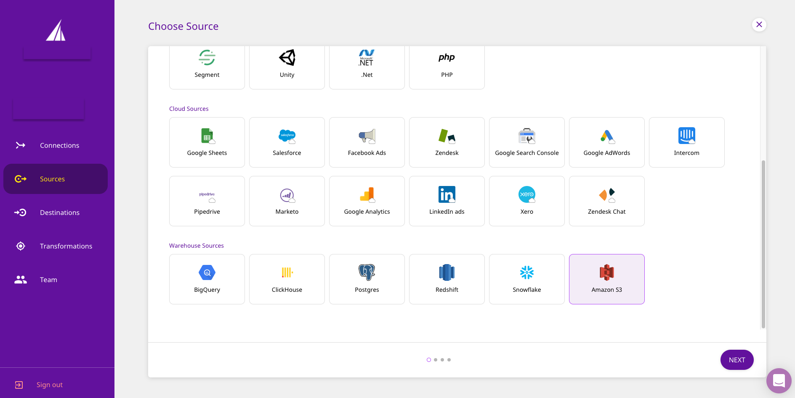
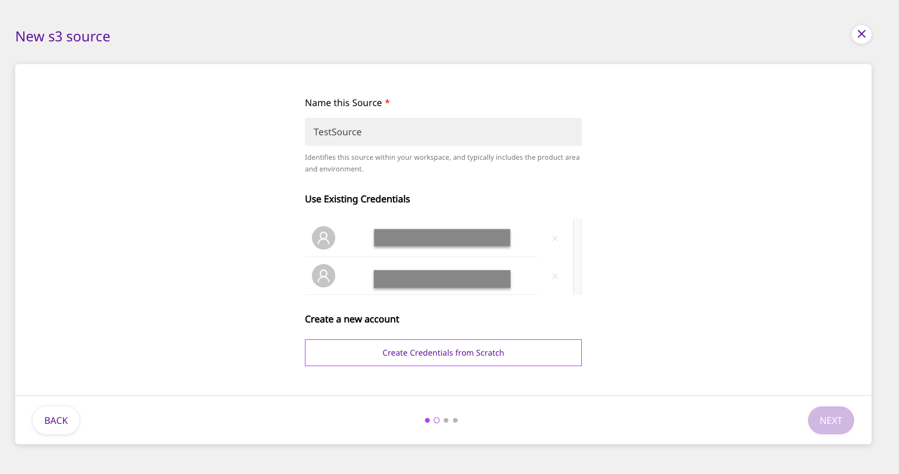
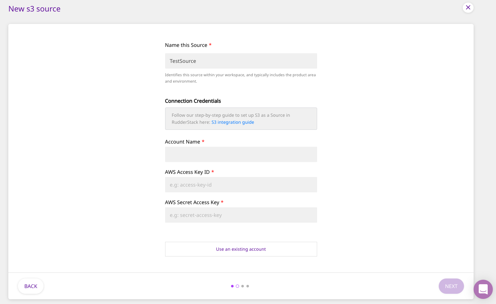
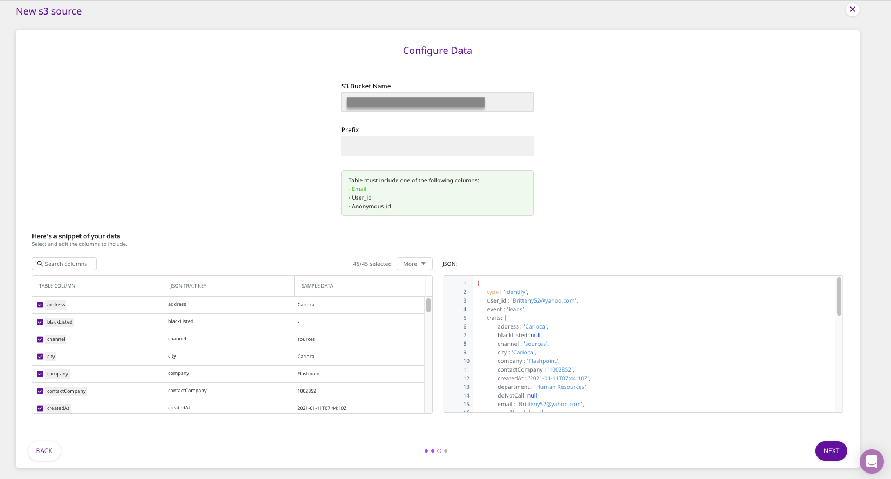
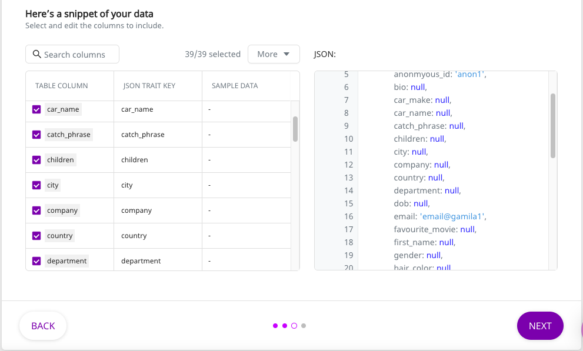
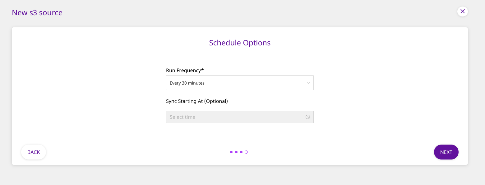

# Amazon S3

[Amazon S3](https://aws.amazon.com/s3/) \(Simple Storage Service\) is a cloud-based object storage service that allows customers and businesses to store their data securely, and at scale. With an easy to use interface and management features, S3 allows for effortless organizing of data to meet the business-specific requirements.

This guide will help you configure Amazon S3 as a source from which you can route event data to your desired destinations through RudderStack.

## Getting Started

To set up Amazon S3 as a source in RudderStack, follow these steps:

* Log into your [RudderStack dashboard](https://app.rudderlabs.com/signup?type=freetrial).
* From the left panel, select **Sources**. Then, click on **Add Source**, as shown:


* Scroll down to the **Warehouse Sources** and select **Amazon S3**. Then, click on **Next**.



### Setting Up the Connection

* Assign a name to your source, and click on **Create Credentials from Scratch**. Then, click on **Next**.




If you've already configured S3 as a source before, your existing credentials will automatically appear under **Use Existing Credentials**.


* Next, enter the relevant connection details in the **Connection Credentials** as shown below:



* The required settings are:
  * **Account Name** - Enter the name you wish to assign to this connection account.
  * **AWS Access Key ID** - Your AWS Access Key ID goes here.
  * **AWS Secret Access Key** - Your AWS secret access key should be entered here.

* List of minimal s3 actions that needs to be attached to the above access keys
```.json
"Action": [
                "s3:GetObject",
                "s3:ListBucket"
            ],

```



To get the **AWS Access Key ID** and the **Secret Access Key**, you can sign into your AWS Management Console as [the root user](https://docs.aws.amazon.com/IAM/latest/UserGuide/console.html#root-user-sign-in-page). Then, in the navigation bar on the upper right corner, choose your account name and select **My Security Credentials**.

For more information on understanding and getting these AWS credentials, refer to their [guide](https://docs.aws.amazon.com/general/latest/gr/aws-sec-cred-types.html).


### Specifying the Data to Import

* Next, enter the name of the S3 bucket from which you want RudderStack to import the data. Any **Prefix** associated with that bucket should be mentioned as well, as shown:




The files in your bucket should consists of parquet files only. Rudderstack, for now can only extract parquet files 



Your table must include one of the following columns - `email`, `user_id`, or `anonymous_id`.


* Once you specify the table containing the required columns, you will be able to preview a snippet of your data, as shown below:



* Here, you can select all or only a few specific columns of your choice, search the columns by a keyword, and also edit the **JSON Trait Key**, as shown below. You can also preview the resultant JSON on the right. Once you've select the required table columns to import the data from, click on **Next**.


### Setting the Data Update Schedule

* Next, you will be required to set the **Run Frequency** to schedule the data import from your S3 bucket to RudderStack. You can also specify the time when you want this synchronization to start, by choosing the time under the **Sync Starting At** option. Then, click on **Next**.



That's it! Amazon S3 is now successfully configured as a source on your RudderStack dashboard. 

RudderStack will start importing data from your S3 bucket as per the specified frequency. You can further connect this source to your preferred destination by clicking on **Connect Destinations** or **Add Destinations**, as shown:



If you have already configured a destination on the RudderStack platform, choose the **Connect Destinations** option. To add a new destination from scratch, you can select the **Add Destination** option.


## FAQs

### Where do I get the AWS Access Key ID and the AWS Secret Access Key?

To get the **AWS Access Key ID** and the **Secret Access Key**,  sign into your AWS Management Console as [the root user](https://docs.aws.amazon.com/IAM/latest/UserGuide/console.html#root-user-sign-in-page). Then, in the navigation bar on the upper right corner, choose your account name and select **My Security Credentials**.

For more information on understanding and getting these AWS credentials, refer to their [guide](https://docs.aws.amazon.com/general/latest/gr/aws-sec-cred-types.html).

## Contact Us

If you come across any issues while configuring Amazon S3 as a source on the RudderStack dashboard, please feel free to [contact us](mailto:%20docs@rudderstack.com). You can also start a conversation on our [Slack](https://resources.rudderstack.com/join-rudderstack-slack) channel; we will be happy to talk to you!

